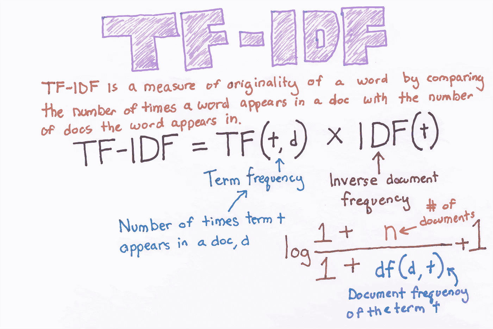
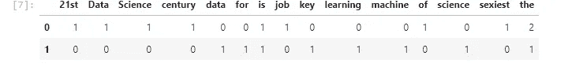
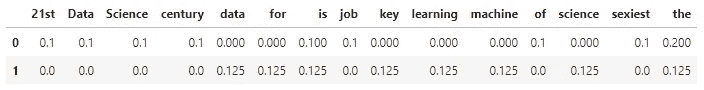
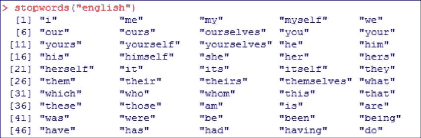
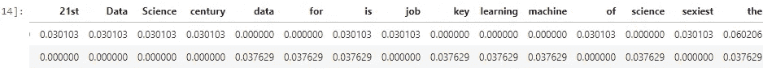
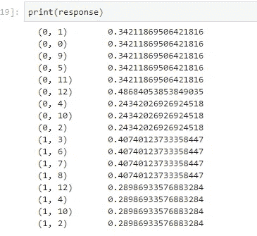

# python 中从头开始的 TF(词频)-IDF(逆文档频)。

> 原文：<https://towardsdatascience.com/tf-term-frequency-idf-inverse-document-frequency-from-scratch-in-python-6c2b61b78558?source=collection_archive---------1----------------------->



# 从头开始创建 TF-IDF 模型

在这篇文章中，我将解释如何用 python 从头开始实现 tf-idf 技术，这种技术用于寻找由单词组成的句子的含义，并抵消单词袋技术的无能，这种技术有利于文本分类或帮助机器阅读数字中的单词。

# 目录:

*   术语。
*   词频(TF)。
*   文档频率。
*   逆文档频率。
*   用 Python 实现。

# 1 -术语:

*   t —术语(单词)
*   d-文档(一组单词)
*   N —语料库的计数
*   语料库—整个文档集

# **2 项频率(TF):**

假设我们有一组英文文本文档，并希望对哪个文档与查询最相关进行排序，“数据科学太棒了！”一种简单的开始方式是通过消除不包含所有三个词“数据”、“是”、“科学”和“棒极了”的文档，但是这仍然留下许多文档。为了进一步区分它们，我们可以计算每个术语在每个文档中出现的次数；一个术语在文档中出现的次数称为其*词频*。

T ***文档中出现的术语的权重简单地与术语频率成比例。***

# 公式:

> *tf(t，d)= d 中 t 的计数/d 中的字数*

# 3-文档频率:

这个衡量的是文档在整套语料库中的重要性，这和 TF 非常相似。唯一的区别是 TF 是文档 d 中术语 t 的频率计数器，其中 DF 是术语 t 在文档集 n 中出现**次**的计数。换句话说，DF 是该单词出现在其中的文档的数量。如果该术语在文档中至少出现一次，我们认为出现一次，我们不需要知道该术语出现的次数。

> *df(t)= t 在文档中的出现次数*

# 4-反向文档频率(IDF):

在计算 TF 时，所有项都被认为是同等重要的。然而，众所周知，某些术语，如“是”、“的”和“那个”，可能会出现很多次，但并不重要。因此，我们需要降低频繁项的权重，同时增加罕见项的权重，通过计算 IDF，结合了一个*逆文档频率*因子，该因子减少了文档集中出现频率非常高的项的权重，并增加了出现频率很低的项的权重。

IDF 是测量术语 t 的信息量的文档频率的倒数。当我们计算 IDF 时，对于最常出现的词(例如停用词)来说，IDF 将非常低(因为停用词(例如“is ”)出现在几乎所有的文档中，并且 N/df 将给予该词非常低的值)。这最终给出了我们想要的相对权重。

> *idf(t) = N/df*

现在，idf 很少有其他问题，在大型语料库的情况下，比如说 100，000，000，IDF 值会爆炸，为了避免这种影响，我们采用 IDF 的日志。

在查询期间，当出现不在 vocab 中的单词时，df 将为 0。因为我们不能被 0 整除，所以我们通过在分母上加 1 来平滑这个值。

这是最终的公式:

# 公式:

> *idf(t) = log(N/(df + 1))*

tf-idf 现在是评估一个单词对一个集合或语料库中的文档有多重要的正确度量。

# 公式:

> *tf-idf(t，d) = tf(t，d) * log(N/(df + 1))*

# 5-从头开始用 Python 实现 TF-IDF:

为了用 python 从头开始制作 TF-IDF，让我们想象不同文档中的两句话:

第一句话:“数据科学是 21 世纪最性感的工作”。

第二句话:“机器学习是数据科学的关键”。

第一步，我们必须创建 TF 函数来计算所有文档的总词频。以下是代码:

首先，像往常一样，我们应该导入必要的库:

```
import pandas as pd
import sklearn as sk
import math 
```

因此，让我们加载我们的句子，并将它们组合在一个集合中:

```
first_sentence = "Data Science is the sexiest job of the 21st century"
second_sentence = "machine learning is the key for data science"#split so each word have their own stringfirst_sentence = first_sentence.split(" ")
second_sentence = second_sentence.split(" ")#join them to remove common duplicate words
total= set(first_sentence).union(set(second_sentence))print(total)
```

输出:

```
{'data', 'Science', 'job', 'sexiest', 'the', 'for', 'science', 'machine', 'of', 'is', 'learning', '21st', 'key', 'Data', 'century'}
```

现在让我们添加一种方法，对两个句子使用字典键值对来计算单词:

```
wordDictA = dict.fromkeys(total, 0) 
wordDictB = dict.fromkeys(total, 0)for word in first_sentence:
    wordDictA[word]+=1

for word in second_sentence:
    wordDictB[word]+=1
```

现在，我们将它们放入数据帧，然后查看结果:

```
pd.DataFrame([wordDictA, wordDictB])
```



不，让我们写 TF 函数:

```
def computeTF(wordDict, doc):
    tfDict = {}
    corpusCount = len(doc)
    for word, count in wordDict.items():
        tfDict[word] = count/float(corpusCount)
    return(tfDict)#running our sentences through the tf function:tfFirst = computeTF(wordDictA, first_sentence)
tfSecond = computeTF(wordDictB, second_sentence)#Converting to dataframe for visualizationtf = pd.DataFrame([tfFirst, tfSecond])
```

这是预期的输出:



这就是 TF 公式的全部内容，我想谈谈停用词，我们应该删除它们，因为它们是最常见的词，不会给文档向量带来任何额外的价值。事实上，删除这些将增加计算和空间效率。

nltk 库有一个下载停用词的方法，所以我们可以直接使用 nltk 库，遍历所有的词并删除停用词，而不是自己显式地提到所有的停用词。有许多有效的方法可以做到这一点，但我只给出一个简单的方法。

这些是英语中停用词的例子:



这是一个简单的代码，可以下载停用词并删除它们。

```
import nltknltk.download('stopwords')from nltk.corpus import stopwordsstop_words = set(stopwords.words('english'))filtered_sentence = [w for w in wordDictA if not w in stop_words]print(filtered_sentence)
```

输出:

```
['data', 'Science', 'job', 'sexiest', 'science', 'machine', 'learning', '21st', 'key', 'Data', 'century']
```

现在我们已经完成了 TF 部分，接下来是 IDF 部分:

```
def computeIDF(docList):
    idfDict = {}
    N = len(docList)

    idfDict = dict.fromkeys(docList[0].keys(), 0)
    for word, val in idfDict.items():
        idfDict[word] = math.log10(N / (float(val) + 1))

    return(idfDict)#inputing our sentences in the log file
idfs = computeIDF([wordDictA, wordDictB])
```

现在我们实施 idf 公式，让我们以计算 TFIDF 结束

```
def computeTFIDF(tfBow, idfs):
    tfidf = {}
    for word, val in tfBow.items():
        tfidf[word] = val*idfs[word]
    return(tfidf)
#running our two sentences through the IDF:idfFirst = computeTFIDF(tfFirst, idfs)
idfSecond = computeTFIDF(tfSecond, idfs)
#putting it in a dataframe
idf= pd.DataFrame([idfFirst, idfSecond])
print(idf)
```

输出:



那是许多工作。但是，如果将来要求您从头开始编写 TF-IDF 代码，这是很方便的。然而，由于 sklearn 库，这可以简单得多。让我们看看下面的例子:

```
#first step is to import the libraryfrom sklearn.feature_extraction.text import TfidfVectorizer
#for the sentence, make sure all words are lowercase or you will run #into error. for simplicity, I just made the same sentence all #lowercasefirstV= "Data Science is the sexiest job of the 21st century"
secondV= "machine learning is the key for data science"#calling the TfidfVectorizer
vectorize= TfidfVectorizer()
#fitting the model and passing our sentences right away:response= vectorize.fit_transform([firstV, secondV])
```

这是预期的输出:



# 总结:

在这篇文章中，我们将解释如何使用 python 和一种称为词频的自然语言处理(NLP)技术—逆文档频率( **tf-idf** )来总结文档。

我们将使用 [sklearn](http://scikit-learn.org/) 和 [nltk](http://www.nltk.org/) 来完成这项任务。

记住你可以在我的 github 库[这里](https://github.com/Yassine-Hamdaoui/Tf-Idf)找到完整的工作代码。

**感谢**阅读，我很高兴讨论您可能有的任何问题或更正:)如果您想讨论机器学习或其他任何问题，请在 [LinkedIn](https://www.linkedin.com/in/yassine-hamdaoui/) 上找到我。