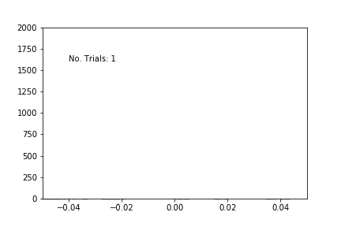
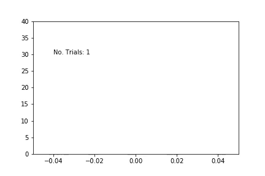
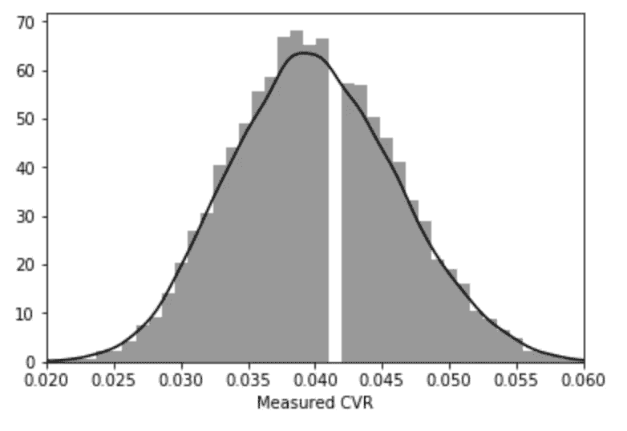
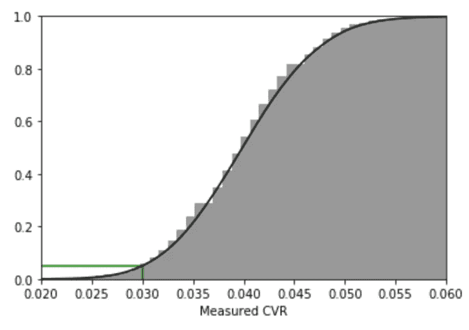
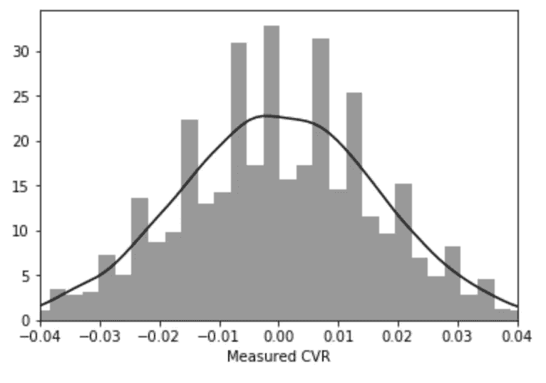
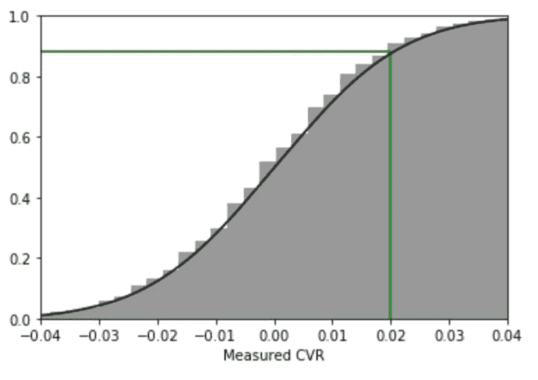

# p 值的真正含义

> 原文：<https://towardsdatascience.com/th-true-meaning-of-p-value-2225b04510c?source=collection_archive---------19----------------------->

## 以及它如何影响你的决策


p-values shouldn’t make us feel lost, but give us direction. Photo Credit: [Martin Reisch](https://unsplash.com/photos/UB8-yJNkvVc).

我们之前已经多次学习过 p 值。首先，在我们大学时死记硬背的统计书中；第二，当我们读到一些文章向我们保证它们是合法的；最后，现在我们决定如何经营我们的企业。在整个过程中，我们被告知定义，希望我们已经学到了足够多的东西，可以反刍一些关于零假设和概率的东西——但是我们真的理解了吗？

理解不仅仅是知道一个定义，为了有效地使用 p 值，有必要对它们的含义有一种“*感觉*”。为此，我们将采用可视化方法。

事实上，**当你通过视觉观察 p 值时，它们非常直截了当**，这就是我今天想与你分享的。

我们将遵循这个粗略的准则:

*   我怎么确定我的转化率是我想的那样？
*   测量概率
*   AB 测试场景

前几段将涵盖一些基础知识，所以请随意跳过这些，但不要忘记检查视觉效果！

让我们先来看一个简单的 p 值，然后再来看最重要的 AB 测试场景，它决定了全球所有你最喜欢的应用、服务和程序的产品决策。希望在读完这篇文章(或书签)后，你能理解 p 值的所有荣耀，就像我最终理解的那样。

请注意，以下内容将围绕电子商务产品，但请注意，这种理解可以应用于处理各种其他情况。

# 你的第一个 CVR

想象一下:你已经推出了一个新网站，你想知道你的转换率(CVR)是多少，所以你开始衡量会话和转换。使用这些，您可以计算简单的转换率比例，如下所示:

`CVR = Conversions / Sessions`

您测量了 1000 次会话和 50 次转换，得出 CVR 为 5%——太棒了！但是等等，那 5%有多准确？

如果你再测量 1000 次会话，你会再获得 50 次转换还是会有所不同？这就是我们的朋友*统计学*的用武之地——帮助我们理解如何从样本数据中解读绝对真理。

为了以最简单的形式理解 p 值，让我们提出一个不同的问题。如果我们网站的实际 CVR 是 5%，那么如果我像上面那样测量 1000 个会话，我测量到 6%或更大的 CVR 的概率是多少？如果你不喜欢用百分比来思考，这就等于说“从 1000 次会话中获得 60 次或更多转化的几率有多大？”。

## 开始实验

有了这样的问题陈述，我们现在可以通过计算进行实验。为此，我们将设置一个程序来模拟 1000 个会话，并对每个会话检查是否有转换。有了这些模拟的会议，我们可以计算那个实验的 CVR。然后我们将这样做 10，000 次，看看最常见的结果是什么。

```
cvrs = []
# Run the test 10,000 times.
for i in range(10000):
    # Simulate 1,000 sessions.
    conversions = 0
    for j in range(1000):
         # Get a random number between 0 and 1 
         # and check if it's above 5% (0.05).
         if random.random() > 0.05:
             # Count the conversion.
             conversions += 1
    # Calculate our CVR.
    cvr = conversions / 1000
    # Store the CVR for later.
    cvrs += [cvr]
```

运行完这个之后，我们剩下一长串可能的 CVR，如下所示:

```
# cvrs = [0.053, 0.049, 0.050, 0.051, ...]
```

然后，我们可以将所有这些值组合在一些波段中，并查看我们记录了多少个波段。绘制这个图给了我们下面的直方图。

> 简要回顾一下，直方图中的每一列都显示了有多少 CVR 在该波段内结束，例如，对于 0.05，该波段为 0.0495 至 0.0505，并且该图显示该波段具有最多数量的 CVR。



As we run more trials, the results approach the normal distribution. **Left**: Count of trials on y axis; as we run more trials the graph is filled up. ***Right****: y axis normalised to show the best visual. The line represents an approximation for the histogram.*

这张图表告诉我们什么？我们可以看到，最常见的值是 5%，这正是我们所期望的，因为这是实际的 CVR。我们还可以看到，有许多值不是 5%，这是由于用户的随机行为。

任何登陆网站的个人用户都有 5%的机会转化，但这并不意味着 100 个用户中有 5 个会转化。100 个用户中有 0 个会转化还是有可能的，只是偶然。

也就是说，平均而言，100 个用户中往往会有 5 个转化用户，这就是为什么当我们远离中心时，测得的 CVR 与 5%不同的实验数量会减少。这种分布被称为正态分布，由于它能够近似自然现象，因此在许多研究领域都得到了应用。

## 计算概率

现在你可能想知道这是什么意思，但是用我们新发现的知识，我们可以回答我们最初的问题，那就是:

> 如果我们网站的实际 CVR 是 5%，如果我测量 1000 个会话，我测量到 6%或更高的值的概率是多少

现在这很容易。我们只需计算所有 CVR 超过 6%的试验，然后除以试验总数。

```
P(CVR > 6%) = Count of trials with CVR > 6% / Total count of trials
            = 200 / 10000
            = 2%
```

我们找到了。我们的 CVR 达到 6%或更高的几率只有 2%。我们可以为不同的潜在 CVR 计算类似的数字，但我们会看到趋势。随着我们远离值 5%(我们在实验中假设的 CVR)，我们将看到测量值的概率向 0 下降。

让我们重述一下我们刚刚说过的话:

> 我们的 CVR 达到 6%或更高的几率只有 2%。

不管你有没有注意到:这是一个 p 值。


Much surprise. Photo Credit: [Ben White](https://unsplash.com/photos/qDY9ahp0Mto).

> p 值是假设零假设是正确的情况下，我们观察到某个事物为或更为极端的概率。

在我们的例子中，零假设是 CVR 是 5%,它是正确的意味着实际 CVR 是 5%。这就是你要说的——“我们的 CVR 达到 6%或更高的几率只有 2%。”—一个 p 值，甚至没有找到它的意思。

# 逆转它

在典型应用中，通常从目标 p 值开始，然后检查测得的 CVR 与该值相比是否显著。这与我们刚刚遵循的程序相反。让我们试一试。

我将广告添加到一个之前 CVR 为 4%表现良好的页面，但我想非常确定(95%)我的广告不会分散用户的购买注意力。让我们回到我们的图表。我们需要找到试验次数达到 5%的 CVR，而不是对超过某个值的所有试验进行计数。这将类似于:

```
CVR where No. Trials = 5% of Total Trials = 0.05 * 1000 = 50
```

如果我们把测得的 CVR 按升序排列，我们只需要选择第 50 个 CVR。一个简单的方法是使用累积分布，这是通过将左侧的所有 CVR 相加直到列表末尾而创建的。从左到右，你会得到小于某个 CVR 的总试验次数。在 CVR 为 4%的情况下，你预计会有 500 个会话，正好是一半。

> 通常，我们会将累积分布绘制成百分比，这样我们就不必跟踪试验的次数。

`Percentage of Measurements = Measurements So Far / Total Measurements`



**Left**: Histogram of ‘measured’ CVRs. **Right**: Cumulative Distribution of the same CVRs featured on the left.

现在我们有了累积分布，我们可以通过画一条线到分布上来找到我们的 CVR，然后下来找到我们的 CVR。这给出了 3%的结果。因此，我们可以得出结论，如果在 1000 次会话后，我们记录的值为 3%或更少，那么我们可以确信 CVR 小于 4%，我们应该重新考虑我们的页面设计。

# AB 测试

希望以上给出了我们如何可视化 p 值的基本理解。我们现在已经到达了这篇文章的顶点——AB 测试。

AB 测试在全球范围内影响你最喜爱的应用、服务和程序的产品决策，因此，理解它们至关重要。


Photo Credit: [Helloquence](https://unsplash.com/photos/5fNmWej4tAA).

当人们想要测试变异和原始之间的差异时，使用 AB 测试。一个例子是电子商务网站上的新购买流。原来的设计将被称为控制，新的设计将是变化。在这种情况下，我们想知道:“变异的 CVR 比对照的好吗？”。

在这样的测试中，您可能会测量 1000 个会话的结果，并发现变异的 CVR 是 9%，而控制的 CVR 是 7%。我们能得出变异更好的结论吗？我们再做一些统计。

我们将采取和以前一样的方法，首先重申这个问题

> 由于纯粹的偶然性，我们测量到 2%的差异的概率是多少？

有了这个，我们可以像以前一样模拟一堆实验。考虑到我们测量的 CVR 为 7%和 9%，最有可能的*平均值* CVR 为 8%，所以我们可以用 8%的 CVR 运行两个实验，看看有多少次差异大于 2%。



As before. **Left**: Histogram of ‘measured’ CVRs. **Right**: Cumulative Distribution of the same CVRs featured on the left.

我们可以在这里看到我们试验的结果。像以前一样，我们看到一个正态分布和我们的累积分布。为了计算出测量 2%差异的机会，我们可以找到 2%值所对应的试验次数。在这种情况下，如果我们画一条线，我们会看到它大约是 90%。这告诉我们，10%的时间我们会看到超过 2%的差异纯属偶然。换句话说:

> 由于纯粹的偶然性，我们有 10%的机会看到大于 2%的差异。

好了，又一个 p 值。通常对于业务测试，我们的目标是 p 值为 0.95，在这种情况下相当于 5%，因此我们可以看到，根据我们拥有的数据量，不可能得出变化更好的结论，相反，我们必须收集更多的数据。

# 为什么要考 AB？

细心的读者可能会好奇为什么我们还要进行 AB 测试。在上一节中，我们展示了当你做了一个改变，并且知道你的网站的潜在 CVR 时，如何找到 p 值。

我们进行 AB 测试的原因是为了控制可能影响结果的已知和未知因素。例如，如果用户更有可能在月末进行转换，而我们在月初开始测试，那么即使是一个更好的设计，这个变化也可能做得更差。或者，如果在测试期间，其中一个供应商停止生产一种产品，这将使变化处于亏损状态。

通过运行 AB 测试，将用户随机分配到一个组，我们可以确信两个样本将具有相似的特征，从而创建一个公平的测试。

# 结论

我们发现 p 值是假设零假设是正确的情况下，我们观察到一个或更多极端效应的概率。

我们看到 p 值的应用通过可视化和一些计算实验的力量非常容易理解。这种理解方法给了我很大的帮助，当其他人需要帮助理解 p 值为 0.96 的实际情况时，它可以作为一个书签。

知道另一种简化 p 值的方法吗？让我知道！