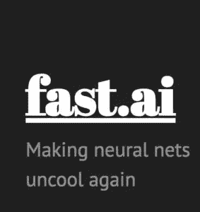
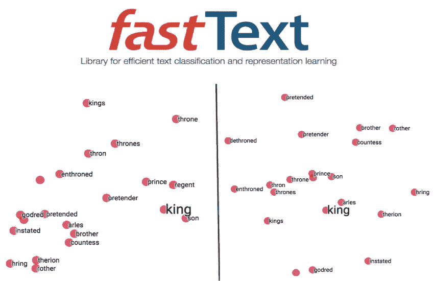
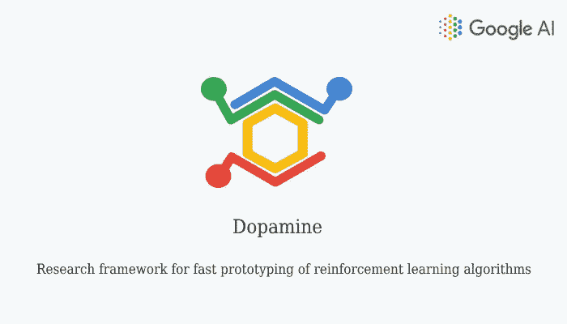
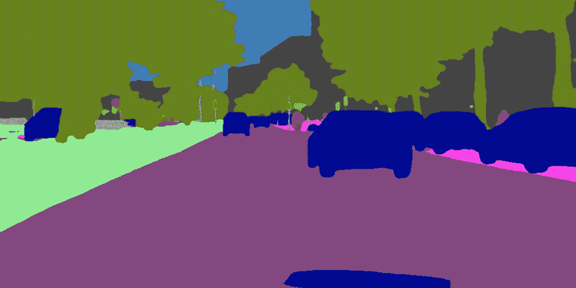

# 过去一年最有用的 6 个机器学习项目(2018)

> 原文：<https://towardsdatascience.com/the-10-most-useful-machine-learning-projects-of-the-past-year-2018-5378bbd4919f?source=collection_archive---------2----------------------->

> 想获得灵感？快来加入我的 [**超级行情快讯**](https://www.superquotes.co/?utm_source=mediumtech&utm_medium=web&utm_campaign=sharing) 。😎

对于人工智能和机器学习来说，过去的一年是伟大的一年。机器学习的许多新的高影响力应用被发现并公之于众，特别是在医疗保健、金融、语音识别、增强现实以及更复杂的 3D 和视频应用中。

我们已经看到了更多的应用驱动的研究，而不是理论上的推动。尽管这可能有其缺点，但它目前已经产生了一些巨大的积极影响，产生了可以迅速转化为业务和客户价值的新 R&D。这种趋势强烈地反映在许多 ML 开源工作中。

让我们来看看过去一年中最实用的 6 个 ML 项目。这些项目已经发布了代码和数据集，允许个人开发人员和较小的团队学习并立即创造价值。它们可能不是最具理论突破性的作品，但它们是适用和实用的。

# [Fast.ai](https://github.com/fastai/fastai?utm_source=mybridge&utm_medium=blog&utm_campaign=read_more)

Fast.ai 库旨在使用现代最佳实践简化快速准确的神经网络训练。它抽象了在实践中实现深度神经网络的所有细节工作。它非常易于使用，并且是按照从业者的应用程序构建思维来设计的。该库最初是为 Fast.ai 课程的学生创建的，是在易于使用的 Pytorch 库之上以干净简洁的方式编写的。他们的[文档](https://docs.fast.ai/)也是顶级的。

# [探测器](https://github.com/facebookresearch/Detectron?utm_source=mybridge&utm_medium=blog&utm_campaign=read_more)

Detectron 是脸书 AI 的研究平台，用于对象检测和实例分割研究，用 Caffe2 编写。它包含各种对象检测算法的实现，包括:

*   [屏蔽 R-CNN](https://arxiv.org/abs/1703.06870) :使用更快的 R-CNN 结构的对象检测和实例分割
*   [RetinaNet](https://arxiv.org/abs/1708.02002) :一个基于特征金字塔的网络，具有独特的焦点损失来处理困难的例子。
*   [更快的 R-CNN](https://arxiv.org/abs/1506.01497) :物体探测网络最常见的结构

所有网络都可以使用几个可选分类主干之一:

*   [ResNeXt{50，101，152}](https://arxiv.org/abs/1611.05431)
*   [ResNet{50，101，152}](https://arxiv.org/abs/1512.03385)
*   [特征金字塔网络](https://arxiv.org/abs/1612.03144)(带 ResNet/ResNeXt)
*   [VGG16](https://arxiv.org/abs/1409.1556)

更重要的是，所有这些都带有 COCO 数据集上预先训练的模型，因此您可以开箱即用！它们都已经在 [Detectron model zoo](https://github.com/facebookresearch/Detectron/blob/master/MODEL_ZOO.md) 中使用标准评估指标进行了测试。

Detectron

# 快速文本

另一个来自脸书研究中心的库是为文本表示和分类而设计的。它带有超过 150 种语言的预训练单词向量模型。这种词向量可以用于许多任务，包括文本分类、摘要和翻译

# [AutoKeras](https://github.com/jhfjhfj1/autokeras?utm_source=mybridge&utm_medium=blog&utm_campaign=read_more)

Auto-Keras 是用于自动机器学习(AutoML)的开源软件库。它是由德州农工大学的数据实验室和社区贡献者开发的。AutoML 的最终目标是向数据科学或机器学习背景有限的领域专家提供易于访问的深度学习工具。Auto-Keras 提供了自动搜索深度学习模型的最佳架构和超参数的功能。

# [多巴胺](https://github.com/google/dopamine?utm_source=mybridge&utm_medium=blog&utm_campaign=read_more)

多巴胺是强化学习算法快速原型的研究框架，由 Google 创建。它的目标是灵活且易于使用，实现标准的 RL 算法、指标和基准。

根据多巴胺的文档，他们的设计原则是:

*   *简易实验*:帮助新用户进行基准实验
*   *灵活开发*:促进新用户产生新的和创新的想法
*   *紧凑而可靠*:为一些更老、更流行的算法提供实现
*   *可重复*:确保结果可重复

# [vid2vid](https://github.com/NVIDIA/vid2vid?utm_source=mybridge&utm_medium=blog&utm_campaign=read_more)

vid2vid 项目是 Nvidia 最先进的视频到视频合成算法的公共 Pytorch 实现。视频到视频合成的目标是学习从输入源视频(例如，语义分段掩码序列)到精确描述源视频内容的输出照片级真实视频的映射函数。

这个库的伟大之处在于它的选项:它提供了几种不同的 vid2vid 应用程序，包括自驾车/城市场景、人脸和人类姿势。它还附带了广泛的指令和功能，包括数据集加载、任务评估、培训功能和多 gpu！

Converting a segmentation map to a real image

# 荣誉提名

*   [**ChatterBot:**](https://github.com/gunthercox/ChatterBot) 用于会话式对话引擎和创建聊天机器人的机器学习
*   [**kube flow:**](https://github.com/kubeflow/kubeflow)Kubernetes 的机器学习工具包
*   [**imgaug:**](https://github.com/aleju/imgaug) 用于深度学习的图像增强
*   [**不平衡学习:**](https://github.com/scikit-learn-contrib/imbalanced-learn)**scikit 下的一个 python 包，专门用于跟踪不平衡数据集**
*   **[**ML flow:**](https://github.com/mlflow/mlflow)**开源平台管理 ML 生命周期，包括实验、可复制性和部署。****
*   ****[**AirSim:**](https://github.com/Microsoft/AirSim) 基于虚幻引擎/ Unity 打造的自动驾驶汽车模拟器，来自微软 AI & Research****

# ****喜欢学习？****

****在推特上关注我，我会在这里发布所有最新最棒的人工智能、技术和科学！也在 LinkedIn 上与我联系！****