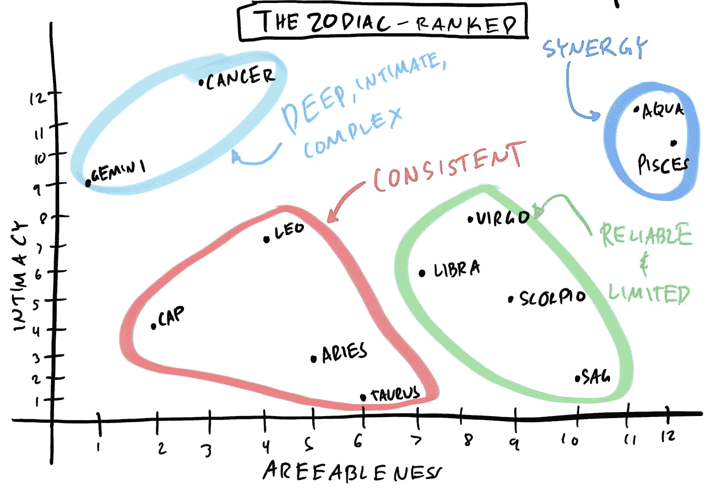

# 每个人都需要掌握的 10 种偏见和因果关系技巧

> 原文：<https://towardsdatascience.com/the-10bias-and-causality-techniques-of-that-everyone-needs-to-master-6d64dc3a8d68?source=collection_archive---------11----------------------->

## 第 1 部分—数据科学和机器学习中的偏差、因果关系、实验设计和辛普森悖论

到底因果关系和机器学习有什么关系？机器学习是关于预测和关于真实效果的因果关系，这两个主题有什么共同点吗？是的，有很多共同点，这一系列文章试图在数据科学的这两个子领域之间架起一座桥梁。

我喜欢认为机器学习只是一个数据研磨机，如果你放入高质量的数据，你会得到高质量的预测，但如果你放入垃圾，它会继续研磨，但不要指望会有好的预测出来，它只是研磨的垃圾，这就是我们在这篇文章中要讨论的。

**指标** :
基本定义；
数据科学中的因果关系；
1 —辛普生悖论；
2 —有效期、外部效度和格兰杰因果关系；
3 —生态谬误；
4 —省略可变偏差；
5 —反事实；
6 —实验的干预和设计；
7 —选择和生存偏倚；
结论和后续步骤。

# 基本定义

**什么是机器学习？**很简单，它是一套在数据中寻找模式的技术，以实现给定的目标，而不必显式地传递指令。例如，网飞的电影推荐系统。

**什么是数据科学？**汇集统计数据的多学科领域，
通过机器学习和计算来解决数据密集型问题、分析和见解。更详细的描述可以在下面找到:

 [## 毕竟，数据科学中有什么新东西？

### 数据科学家的工作范围和角色是什么。

medium.com](https://medium.com/swlh/data-science-and-the-data-scientist-db200aac4ea0) 

# 因果关系

在这里，它开始变得有点难以(和哲学)定义。过去的伟大思想家们取得了进步，如亚里士多德、德卡提斯、斯宾诺莎、康德、密尔、休谟和许多其他人，但没有什么明确的东西，我也不会给它下定义。对我们来说，现在，它将只是一个变量的真实影响，即
如果变量发生，它将对目标产生多大的影响。例如，吸烟(我们的变量)使你患肺癌(我们的目标)的可能性增加+ x%(我们的因果效应)。

这听起来很简单，但问题是，通过放置没有影响但只与引起影响的变量相关的变量，后者捕捉到了前者的影响，并且没有好的方法知道这是否正在发生。对于预测来说，这很好，因为我们通常没有因果变量，但通过放置一系列与因果变量相关的变量，模型可以更好地理解和预测。

如果你只关心预测，比如一个机器学习工程师，也许因果关系真的是一个次要的细节，但如果你的预测不是惰性的，而是对使用它们的人产生一些行动，也许你应该开始担心因果关系。如果你是一名数据科学家，不关心因果关系，你可能不是一名科学家，而是一名工程师。做科学就是发现(或者更常见的，试图反驳)因果关系。当然，在许多模型中，我们只关心做出简单的预测，我们可能不需要科学家来做这些。

Granger Causality Graph Example, which is not exactly causal, but which increases predictive power over time series. Available at URL: [https://arxiv.org/abs/1406.6651](https://arxiv.org/abs/1406.6651)

此外，机器学习领域越来越强烈的担忧是选择偏差。我们已经有几个国家(特别是在欧洲)允许用户知道一个可能的算法决策的原因(例如借款、保险或职位空缺)，所以仔细想想偏见、
歧视和因果关系不仅重要，而且可以让你免于犯罪。我们在解释 BlackBox 的算法时谈到了这一点:

 [## 解读机器学习——全指南

### 沙普利值和 SHAP 包

towardsdatascience.com](/the-ultimate-guide-using-game-theory-to-interpret-machine-learning-c384cbb6929) 

# 一旦概念被定义，我们将开始混合它们。

在数据科学中，我们经常训练机器学习模型来预测目标，例如预测客户是否会偿还贷款，我们有这样做的最佳实践，例如平衡模型的复杂性，以便它不会非常简单，不会理解问题的复杂性，也不会比必要的过度拟合更复杂。但事实上，我们想要的是它能够很好地概括，为此，它理解因果效应是理想的，即变量如何影响目标以及它们如何相互关联。

正如我们所说，机器学习模型的一个主要优势是，它不一定要捕捉真实的影响来改善其预测，任何副作用或这些真实事件的代理也是可行的，这使得创建这种模型的人的生活更加容易。但是并不是一切都是完美的，
这个设施也开始产生一些问题。让我们来看例子:

# 示例 1—性别偏见和辛普森悖论

辛普森悖论是，通过测量两个变量之间的相关性，他们显示了错误的值，这可以通过控制导致混淆的第三个变量来纠正。

> 当数据被分组时出现的一种趋势或结果，当数据被组合时，这种趋势或结果会反转或消失。爱德华·休·辛普森

辛普森悖论最初并不完全是效应信号的反转，而仅仅是在控制了使效应变得“混乱”的变量时，信号大小的变化，但是这在分析中变得如此正常，以至于最近我们只考虑了一个真正的效应悖论。辛普森当效果相反时，然而它比你想象的更普遍。一种思考方式是，这不是一个真正的悖论，而是一个我们不知道所有片段，但需要组合起来才能相信其效果的难题。

一个著名的例子发生在 1973 学年初，当时比较了加州大学伯克利分校研究生院的性别比例，注意到 44%的男性和 35%的女性。彼得·比克尔和他的团队检查了这些数据，并注意到一些非常奇怪的事情，存在歧视(这是该学院非常担心的)，但在 6 个部门中的 4 个部门有利于女性(而在另外 2 个部门无动于衷)。事实证明，女性倾向于申请的部门要小得多，这个在分析中被“忽略”的变量将歧视女性的结果逆转为歧视男性。

为了解决这个问题，我们需要了解我们的分析或预测是否没有经历辛普森悖论，也就是说，如果我们忘记了一些混淆变量，不幸的是，没有科学的方法来证明没有影响。跟踪，但有好的做法，我们会看到在未来的职位。

Each point is a department and the size of the circles is the size of the department. The “+” indicates small departments.

辛普森悖论一直在发生，但是如果对你正在处理的数据没有足够的直觉，就很难做出诊断。下面是一篇解释如何用线性回归控制影响的文章:

 [## 统计建模——实用指南

### 第 2 部分—解释机器学习模型

towardsdatascience.com](/statistical-modeling-the-full-pragmatic-guide-7aeb56e38b36) 

# 例 2——公鸡打鸣和模型有效性。

想象一下，我们有一个模型来预测未来 10 分钟内太阳升起的概率，我们在这个模型中添加了几个变量，如温度、一天中的小时和分钟、光度等。当我训练我的模型时，我注意到最重要的变量叫做“公鸡之歌”，当我使用这个变量时，模型会损失很多性能。在机器学习的标准中，我应该保留这个变量，因为公鸡打鸣后不久，太阳就会升起。

When we have a variable increasing predictive power and it comes *before* the target, we call it Granger Causality (the granger-cause variable). Do not confuse with actual Causality.

当我们用我们的因果透镜思考超越相关性时，我们知道公鸡不会导致日出，即使它有很高的相关性，因为这种影响不是因果的，使用它有风险。可能有一天公鸡会更早歌唱，而太阳显然不会更早升起，或者可能公鸡醒来时身体不适，没有歌唱，但太阳仍会升起(我希望如此)，在所有这些情况下，该模型都会出现悲惨的错误，因为它依赖于非因果相关性。

在这种情况下，我们的模型将有一个短的保质期，因为使用的变量不是因果变量，所以影响是不真实的。或者在计量经济学的措辞中，我们说这个模型没有外部有效性，因为如果我们把它用在某个地方，而不是一个凸起，它将不起作用。
如何解决？我们可以删除“公鸡打鸣”变量，我们的模型似乎会变得更糟(指标会减少)，但在中期内它会更稳定(外部有效性更普遍)，因为它不依赖于一个易变变量(方差高)。

当然这是一个不切实际的例子，但这在真实的机器学习项目中经常发生。想想你的变量是否有失效日期。如果它们是因果关系，它们会持续更长时间。

# 例子 3——财富、投票和生态谬误

生态谬误比我们的辛普森悖论更为普遍(就像我们的辛普森悖论是生态谬误的一个特例)。当分析* **总体** *变量并对分类数据做出假设时，即着眼于宏观并推断微观时，问题就出现了。让我们用在美国找到一个富人的可能性来说明这个例子。我们首先考虑的是每个州的平均财富，总结如下:

我想说在富裕的州遇到富裕的人的机会比在贫穷的州高，这似乎有道理，但这就是错误所在！这种假设不一定是正确的，因为当分析汇总数据(按州)时，我们指的是平均值，当我们谈论找到一个富人的概率时，我们指的是中位数，这种概率只有在对称分布(或在这种特定情况下，不对称向右)中才会更高，这在这些情况下是非常罕见的。

IMAGE SOURCE: U.S. CENSUS BUREAU.

第二个相关的例子是著名的富人(个人)更倾向于投票给共和党候选人，当我们分析(按州)总数据时，这种效应是相反的。举例来说，2004 年，老布什在 15 个最贫穷的州赢得了选举，而约翰·克里在 11 个最富裕的州赢得了选举。然而，布什在最富有人群中的投票(> 20 万/年)是克里的两倍，这也是因为分布非常不对称，超出了受外部因素严重影响的平均值。

# 例 4——海滩上冰淇淋和椰子的销售，遗漏变量的偏差。

理解辛普森悖论的另一种方式(也是经济学家更喜欢的方式)是偏置被省略的变量。现在想象一下，我们的模型应该预测海滩上的冰淇淋销售，当我们查看解释变量之间的相关性时，最正相关的是椰子水的销售，我们在模型中添加了这一项，并对我们的预测感到满意。但是卖更多的椰子汁真的会增加冰淇淋的销量吗？

Y is the sale of ice cream, and Z is the sale of coconut water. We note that X (the temperature) affects both Y and Z, in our case reversing the sign of the effect of Z on Y from positive to negative.

仔细观察，这两种产品是替代品，这意味着它们对那些购买(更新)产品的人来说起着类似的作用，并且在某种程度上，增加一种产品的销售实际上会减少另一种产品的销售。游泳者的钱是有限的。这是因为，同样，我们有第三个变量导致冰淇淋销售变化和椰子水销售变化，当我们控制这个变量(可能是游泳者的数量，平均温度或如果是假日)时，椰子水的销售开始减少冰淇淋销售。在我们的模型中，即使有正的相关性，其偏相关(通过控制温度)也变成负的。

这是又一个例子，说明对数据有良好的直觉而不只是盲目地运行机器学习是多么重要。

# 例子 5——黄道十二宫和反事实

> “我不相信占星术，但我真的不会。我是双子座，所以我持怀疑态度。”

当我们试图用统计测试来否认(或证明)一个变量的影响时，我们基本上想知道添加那个变量是否会导致任何变化。一个典型的例子是征兆。当你根据人们的生肖来衡量他们的表现时(在本例中为一般情况),我们拒绝他们会有所作为的假设，因为在《自然》杂志发表的 500 强公司首席执行官中，我们接受他们会有所作为(在众多研究中)。在这里，我想讨论一些声称黄道十二宫会影响你的个性和潜力的实验。

这里的困难不是有一个**反事实**，而是究竟什么是反事实？对我们来说，一个反事实将是一个在所有方面都完全相同的个体，它们之间只有一个变量不同，在我们的情况下，就是符号。当我们做化学或物理实验时，创造反事实相当容易，因为无生命的物体可以重复，就像两个完全相同的化学实验，我们将一种试剂与另一种试剂不同，差异归因于试剂。在社会科学或经济学中，这要困难得多，想象一下国家的反事实？硬右？所以我们期待像朝鲜一分为二这样的“自然”事件。但是我们如何为标志创造一个反事实呢？我们需要一个有或没有标志的人，不可能。在这种情况下，我们需要求助于统计建模作为综合控制或倾向分数匹配。

People are very good at thinking counterfactuals. How, what if I had tried harder, would I have? Or what if Spock was mean? Note that the counterfactual is its identical “twin brother” in everything except the parsed variable.

我们的例子来自一项调查美国超级运动员标志的研究。当我们观察可以进入这个高性能组的球员的分布时，我们看到他们的迹象没有随机分布。显然有些星座比其他星座占优势。一种可能的解释是，明星真的改变了他们的性格和他们成为体育明星的机会。另一个可能的解释是，信号捕捉到了另一个变量的一些影响，但会是什么呢？嗯，每个标志包括出生时的时间间隔，与学年结束相关的标志比开始时有优势，因为孩子们在整个童年和青春期都是班上最大的，这在整个教育过程中给予了额外的信心，使他们最自信，这反过来又是体育和商业中高表现的超级重要的属性。知道了这些，一个提示，变得更自信！

回到反事实，我们怎么会有一个符号不同的孪生“兄弟”呢？这里的想法是比较是为了寻找一个反事实，可能是第二个非常相似的国家，但学年在 6 个月后开始，或者甚至是寻找某年改变了规则的某个州。当我们这样做时，效果是相反的！抛弃标志会产生影响的假设。

# 示例 6——定价和干预。

这个例子非常重要，因为它可以推广到许多其他机器学习应用程序。当训练我们的模型时，我们不注意小字体，例如，数据必须以无偏见的方式产生，以用于训练模型。我不止一次看到定价案例(和其他干预案例)使用历史价格/折扣来训练一个预测未来价格/折扣的模型。但是我们要的不是预测什么价格，而是最优价格！而且谁说那些历史培训价格是最优价格？例如，如果在公司政策中，当实行折扣时，它一直是节俭的，所有算法将做的是重复这种节俭，这可能与理想的价格/折扣相差很远。

这个案例说明了对因果建模至关重要的干预效应。如果你的机器学习算法预测并且不影响现实(明天怎么下雨？)，干预不是一个问题，但如果你的算法为企业产生输入，以产生一个行动，如改变客户将有权获得的折扣，以最大化他们的购买概率，你必须在训练你的模型时考虑客户的反应。

围绕这个问题有许多例子和方法，从训练一个价格随机定价的模型，以产生一个良好的实验设计，从而产生一个可靠的训练数据集(如 Fischer 在 1936 年提出的),到更现代的方法，如 multi armed bandit，它能够在优化业务指标的同时进行 A/ B 测试(C/D/等)。

我们的下一篇文章将进一步探讨这个话题。

# 示例 7 —选择偏差

以下是最合法也最难解决的问题。选择偏差与设计好的实验有关，因为一旦你收集了有偏差的数据，就很难纠正，甚至很难知道它的存在。

我们来看第一个例子。想象一下，我们想要衡量数据科学培训在多大程度上提高了公司员工的生产力。我们的第一个方法是给每家公司发一封电子邮件，告诉他们有 50 个职位空缺，第一个注册的人将参加课程。我们进行培训，并在培训前后测量生产率。我们能说这种观察到的差异是训练的错吗？不幸的是，没有，因为第一批报名参加这个项目的人可能不是随机的，他们可能是最专心、最快、甚至更难参加额外课程的人，当测量实验结果时，我们不得不随机选择他们的参与者。

Bias resulting from Systematic error in ascertainment or participation of study subjects. People having different probabilities of being included in the study sample based on exposure and outcome. Diagram from: [https://thegradient.pub/ai-bias/](https://thegradient.pub/ai-bias/)

第二个例子是沃尔德博士在第二次世界大战中提供帮助的经典案例。这个故事是关于我们应该在哪里加强飞机装甲。如果我们加固所有的东西，它会很重，它的自主性会被破坏，如果它不保护任何东西，它会非常脆弱。

Statistics produced from aircraft returning from damaged fighting. Each red dot represents a bullet.

上图是从战争中返回的飞机弹孔位置的汇编。当时显而易见的策略是在拍摄最多的地方加强拍摄。当他到达沃尔德的办公室进行进一步分析时，他提出了相反的建议。不是加强机翼，而是加强引擎和机身。但是如果飞机上没有洞，他为什么要这么做呢？？

Statistics without Selection bias. Here is an example with white balls (true values ​​of the returning planes) plus the red balls that indicate shots that were not counted as the planes did not return from combat. Wald was able to see this lack of data and saved many lives.

选择偏差，或者说生存偏差。沃尔德说，这些地方没有洞，正是因为这些区域的飞机已经损坏。他们只是还没有返回到统计数据中，而那些被损坏并返回的区域是那些不需要太多增援的地方，因为他们可能会被击中，但仍然可以返回基地。简单而伟大，他们巩固了正确的位置，统计数据帮助拯救了成千上万的生命。

# 结论

这一系列的例子显然不是为了在这个问题上做到详尽无遗，而是试图开始挑衅，即在没有很好地理解数据和一些因果建模技术的情况下训练机器学习模型甚至会产生糟糕的结果。即使在简单的建模中，
即使度量在短期内是好的。

此外，这些例子表明，对业务数据的直觉和理解与机器学习技术本身的应用一样重要(甚至更重要)。

该文本是一个快速介绍，现在，评论摘录，你有疑问，使更完整和详细的职位。

# 后续步骤

在接下来的文章中，我们将更深入地回顾这些例子，并探索其中的一些技术，通过 python 中的例子和代码来尝试解决它们(或至少减轻它们)。等待下一个帖子:

*   因果计算和因果图(Judea Perl)；
*   强化学习和因果关系；
*   倾向得分匹配和工具变量；
*   具有不连续性(RDD)和分位数的回归；
*   相关性、因果性和反事实；
*   结构方程模型(SEM)；

# 如果你喜欢这篇文章，你可能会对其他文章感兴趣:

*   [为数据科学家推荐书籍、课程和电影。](/how-to-become-a-data-scientist-2a02ed565336)
*   深度潜入[混乱矩阵](/confusion-matrix-deep-dive-8a028b005a97)和 [AUC](/deep-dive-auc-e1e8555d51d0)
*   [数据科学的范围是什么？](https://medium.com/swlh/data-science-and-the-data-scientist-db200aac4ea0)
*   [用博弈论解释机器学习模型](/the-ultimate-guide-using-game-theory-to-interpret-machine-learning-c384cbb6929)