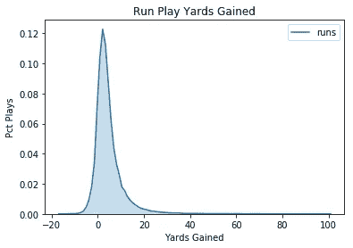
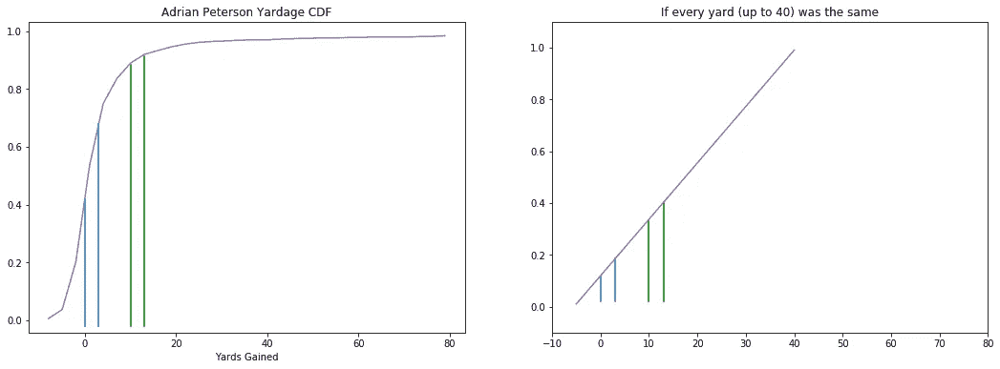
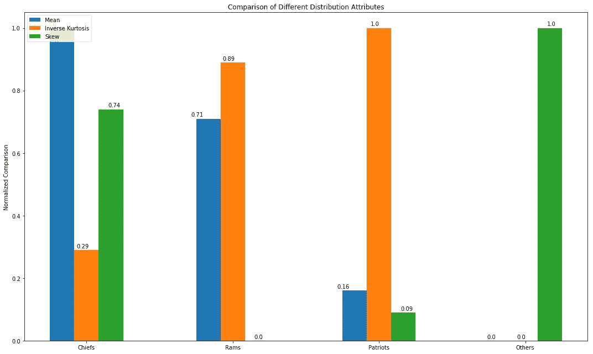
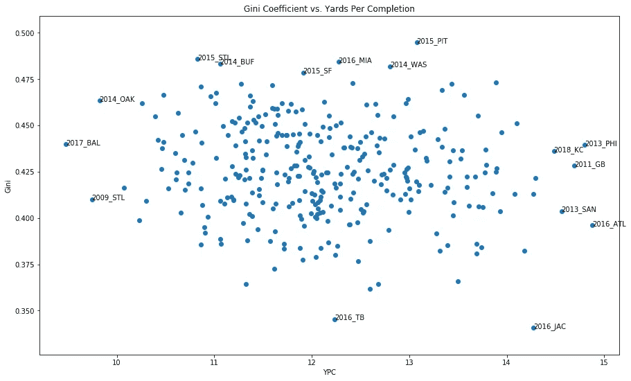
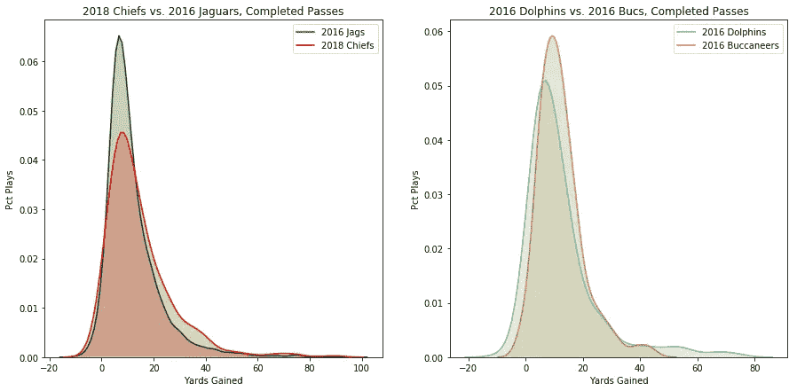

# 2018 年堪萨斯城酋长队和足球爆发力指标

> 原文：<https://towardsdatascience.com/the-2018-kansas-city-chiefs-and-an-explosiveness-metric-in-football-c3b3fd447d73?source=collection_archive---------16----------------------->

Photo by [Timothé Lejeune](https://unsplash.com/@timlontano?utm_source=unsplash&utm_medium=referral&utm_content=creditCopyText) on [Unsplash](https://unsplash.com/search/photos/american-football?utm_source=unsplash&utm_medium=referral&utm_content=creditCopyText)

## 我们如何量化爆发力？

# 介绍

如果你看过 2018 年的帕特·马霍斯秀，你就会知道堪萨斯城酋长队的进攻非常具有爆发力。作为一个数据迷，我想知道我们是否能提出一个衡量爆发力的单一数字。不幸的是，这并不简单。

一个简单的解决方法是计算超过 10 码的比赛。如果我们这样做，酋长队在新英格兰和公羊队之后排名第三。然而，在那些超过 10 码的比赛中，酋长队仍然有更高的总码数。酋长队也在 15 码以上的比赛和 20 码以上的比赛中领先。事实上，他们在 10 码以上的比赛中有 17 次达阵，而新英格兰和公羊队分别只有 15 次和 10 次达阵。所以我们知道酋长是爆炸性的，但我们如何量化呢？他们比公羊队和新英格兰队更强吗？

*注:我的数据来自*[*NFL scraper*](https://github.com/maksimhorowitz/nflscrapR)*包。我只使用红区外的策略，赢的概率在 10%-90%之间。*

## 让我们从码数开始

球场既是衡量足球产量的一个好方法，也是一个糟糕的方法。在一年的样本量中，我们可以依靠总传球码数和总跑动码数来准确地给出一个赛季中最佳四分卫和最佳跑卫。然而，足球赛季本质上是小样本的。每年都会有一些奇怪的统计数据在赛季中出现。足球分析家经常引用过去四场比赛、本月等的统计数据。这些数据本身就是戏剧性的和不可持续的。

总码数的一个问题是，它被大戏严重扭曲。阿德里安·彼得森，尤其是在他的全盛时期，展示了在一次跑步中落后多少码是相对无意义的。他已经 33 岁了，仍然对次要问题不屑一顾:

这一轮从哪里开始并不重要，它将是一个 TD。因为是从他自己的 10 码线开始，阿德里安得到了 90 码的成绩。如果同样的跑发生在对手 45 码处，他也只能得到同样出色的跑的一半码数。事实证明，酋长队在 2018 年有很多这样的比赛。

# 不是所有的码都一样

另一种表述方式是，有些码比其他码更难获得。一旦 AP 跑了 10 码，全速进入第二场，他再跑 3 码的机会就很高。然而，如果是 3 码和 3 码，他在 8 人对抗的情况下跑完全程 3 码的机会相对较低。话说得够多了，下面是一些实证的可视化。让我们从绘制跑垒得分的分布开始。

Note: I eliminated extreme win probabilities and redzone plays from the dataset

好吧，我们可以从中提取大量重要信息。如果你仔细观察的话，大约 90%的跑位在跑了 10 码之前就停止了。有一种更好的方式来展示这一点。累积分布函数将从左到右累加所有的概率。换句话说，我们将知道 0 码或更少，3 码或更少的比赛的百分比，等等。为了好玩，我用了艾德里安·彼得森全盛时期(从 2009–2015 年数据集开始)。这是他获得的码数的累积分布函数。

Blue bars mark the area from 0–3 yards gained. Green bars mark from 10–13 yards.

当你沿着 x 轴向右走，AP 被处理的概率增加。如果每一码都一样，那么 AP 在 0-3 码和 10-13 码之间被拦截的机会是一样的。在右边的图表中，在这两个范围内都有大约 6%的可能性。相反，我们看到 CDF 在左边。在图中，当我们到达 x=0 的混战线时，已经是 40%了！这意味着 40%的 AP 跑垒距离小于零码。当我们到达 3 码的时候，它一直跳到 65%。因此，在大约 25%的 AP 跑垒中(25%是因为我从 65%中减去 40%)，他被铲球 0-3 码！或者，当他在第二跑道超速行驶时，**他只有 3%的路程是在 10 到 13 码之间**。换句话说，如果他已经在同一场比赛中获得了 10 码，那么他就更容易获得 3 码。**所有的码不是平等创造的。**

# 这和爆发力有什么关系？

嗯，如果一个球员很有爆发力，我们应该会看到很多 20 码跑、45 码跑和 80 码跑。有时候唯一能阻止球员的就是端线。用足球男孩/女孩的话来说，他们需要能够“达到第二级水平”并“在开阔的领域表现良好”。从统计学的角度来说，这个分布应该有一个胖胖的右尾。

看看 2018 的酋长们有没有这条肥右尾巴。我将在下面绘制仅完成的分布图。尽管我很想包括残缺和麻袋，但这使分布变得复杂，从而也使数学变得复杂。

啊哈！那正是我们要找的尾巴。其他球队有一个更尖锐的高峰，因为他们完成了更多的 0-15 码传球。幸运的是，比我聪明的统计学家们想出了一种方法来衡量“峰值的锐度”。这就是峰度。但是峰度不是一切。酋长的分布也更加向右倾斜。当你把足够右偏斜和高峰度结合起来时，你会在分布的右尾下得到很多区域。换句话说，就是一堆 20 码以上的球。你可能还会注意到，高能量进攻的平均分布在 NFL 其他球队的右边。这只是每完成码数(YPC)。国家橄榄球联盟和爱国者队的场均得分约为 12 YPC，而酋长队和公羊队的场均得分分别为 14.5 和 13.7。让我们把它们放在一起(我使用了逆峰度，因为峰度在这个上下文中意味着更少的爆发力)。我归一化了均值、偏斜度和反峰度，得出了下面这张难看的图。我甚至有点不好意思把这张图包括进来，但它是一个更广泛观点的一部分:

这个图表需要一秒钟来解释，这使得它不能令人满意地比较这些球队的爆发力。对于一个强有力的进攻，我们需要一个高的每完成码数(蓝色条)，一个高的反峰度(橙色条)，和一个高的右斜(绿色条)。没有一个组合在这三个方面都是最好的，尽管酋长队在这三个方面的总平衡是最好的。

# 减少到一米

如果你想模拟一个游戏，均值、偏斜度和峰度都很好。人们甚至可以分离出触地得分的打法，以便更加准确。然而，我试图提出一个爆发力的单一指标。据我所知，没有数学上可靠的方法来线性组合峰度和偏斜度。

## 基尼系数

相反，我们将借用经济学家的一个术语。我们将使用[基尼系数](https://en.wikipedia.org/wiki/Gini_coefficient)。基尼系数衡量分配中的不平等。经济学家最常用它来衡量收入不平等。如果一个国家的每个人收入完全相同，基尼系数等于 0。如果国家的所有财富都被一个人占有，那么基尼系数就是 1。

## 应用到足球上？

我们可以用码数不平等来代替收入不平等。换句话说，一个球队的码数有百分之几属于大戏？如果一个队的所有比赛都用相同的码数，基尼系数将为零。然而，如果一个人走了 80 码，而其他人走了 0 码，那就是 1 码。在酋长队对公羊队对帕特队的例子中，我们得到 0.436，0.380 和 0.407。酋长有最高的！

基尼系数与获得的平均码数无关。因此，我们还需要一个术语来描述每场比赛的码数，或者在我一直使用的例子中，每场比赛的码数。下面是我的数据集中团队的图表。不幸的是，“[草皮上最棒的表演](https://en.wikipedia.org/wiki/The_Greatest_Show_on_Turf)不在数据集中。

所以理论上，最具爆发力的传球进攻会偏向右上角。2013 年的老鹰队是唯一一支看起来比 2018 年的酋长队更具爆发力的球队(场均码数相对相近)。这一年尼克·福尔斯投出了 27 个罚球和 2 次拦截，所以这有点道理。让我们绘制完工量的分布图，以确保基尼系数发挥作用。首先，我将匹配 2018 年的酋长和 2016 年的美洲虎。他们每场比赛的码数差不多，但是酋长队应该有更多的大手笔。2016 年的海豚队和 2016 年的海盗队应该也是如此。那一年海豚队的基尼系数非常高，而海盗队却没有。

Longer, fatter right tails = higher Gini.

好像起作用了！所以上面的两个比较涉及到平均每场完成码数差不多但进攻非常不同的球队。2016 年的海豚队和 2018 年的酋长队比每次完成类似码数的对手更具爆发力。2016 年的海盗队和美洲虎队仍然是很好的传球进攻，擅长“移动链条”，但他们不太可能打开一个大的游戏。

# 结论

总之，我们找到了一种通过进攻型打法的基尼系数来衡量爆发力的方法。我认为最好的使用方法是结合每次完成码数(YPC)。或者甚至是跑动进攻，就每次跑动的码数而言。那些平均拥有很多码数，并且非常倾向于大手笔的球队是最值得关注的球队。也许在未来，我们可以分解球员名单可能如何影响这种爆发力🤔。我们也可以打开潘多拉的盒子，看看防御措施。如果你真的用这个工作，请[发推特给我](https://twitter.com/BlakeTAtkinson)让我看看。如果你有兴趣的话，这次我想起来了[链接我的代码](https://github.com/btatkinson/yard_value)！

最后，我想提一下，我不是第一个尝试测量爆发力的人。大学橄榄球分析界的传奇人物比尔·康纳利对爆发力有自己的衡量标准。他用它为[做了很多伟大的工作，我尽我所能复制它。当我比较基尼和 IsoPPP 时，我有一个非常有趣的结果。IsoPPP 和每完井码数高度相关。然而，*基尼系数与 IsoPPP 相关，但与每完工码数无关。*同样，需要做更多的工作。敬请期待！](https://www.footballstudyhall.com/2017/8/22/16075050/college-football-big-plays-efficiency-five-factors)

The correlation matrix of Yards Per Completion, Gini Coefficient, and my attempt to calculate IsoPPP.