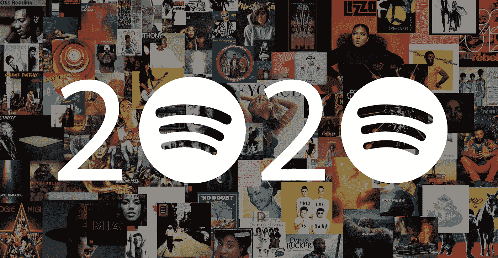
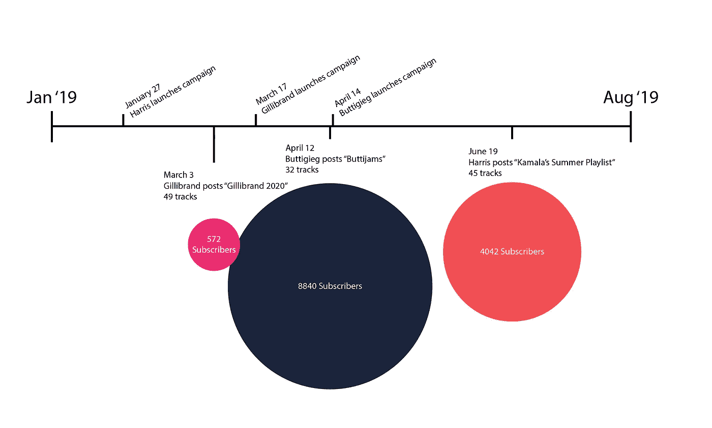
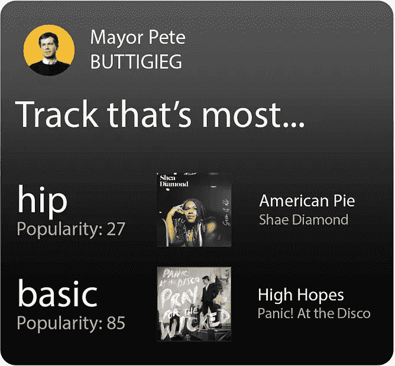
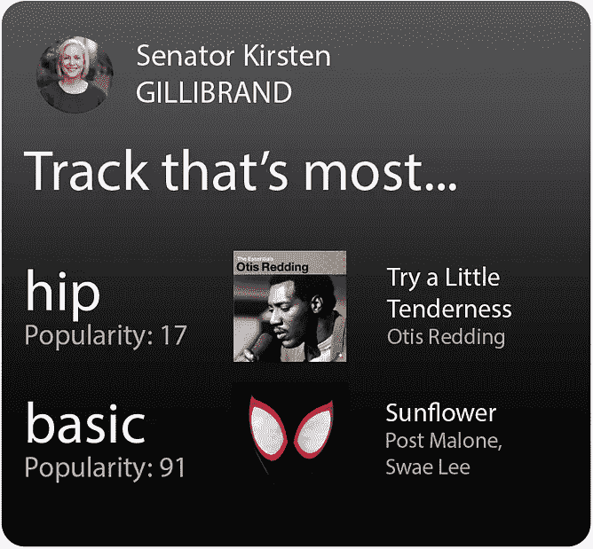
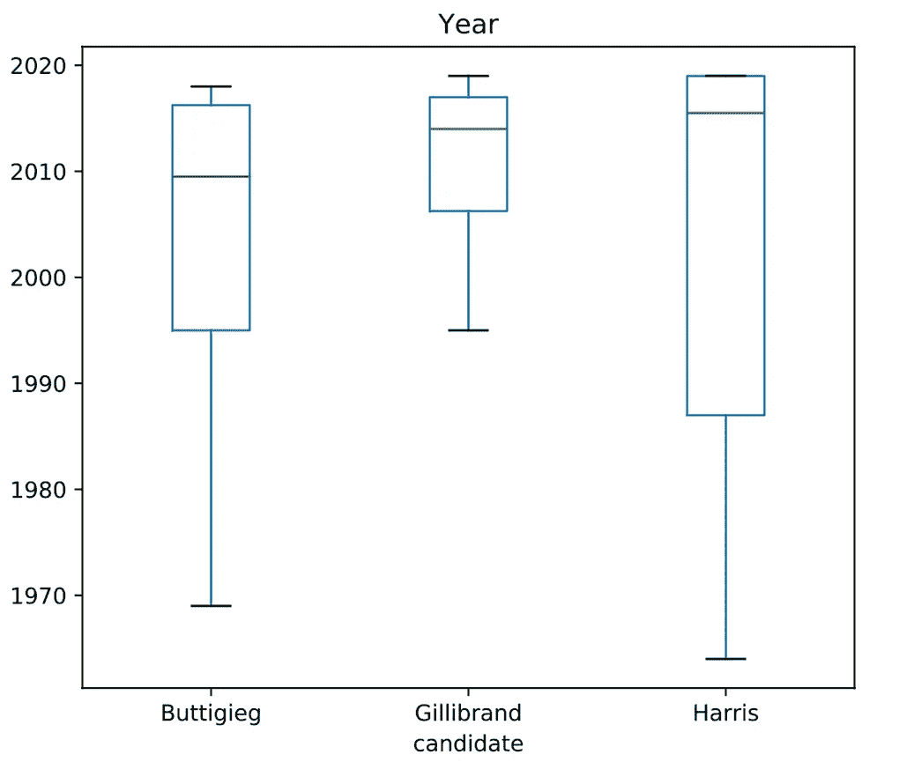
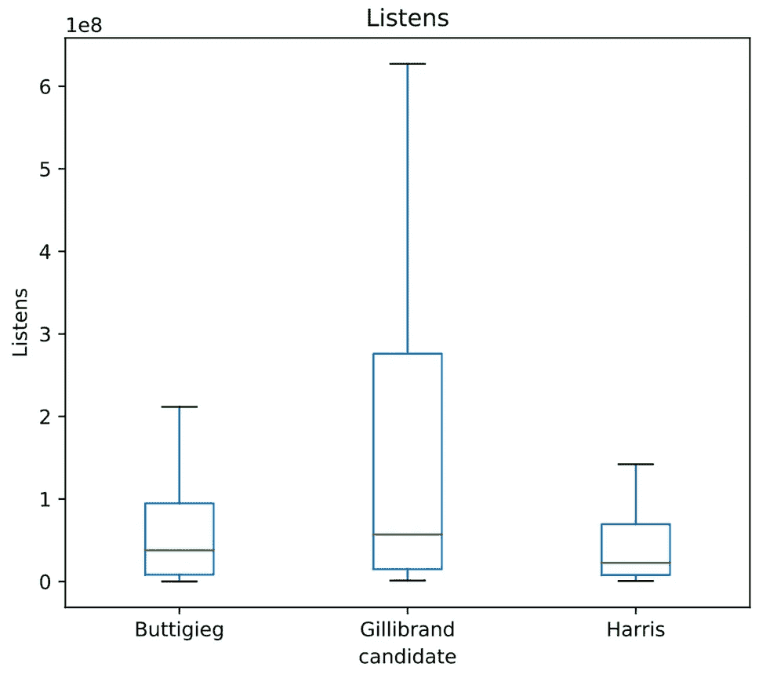
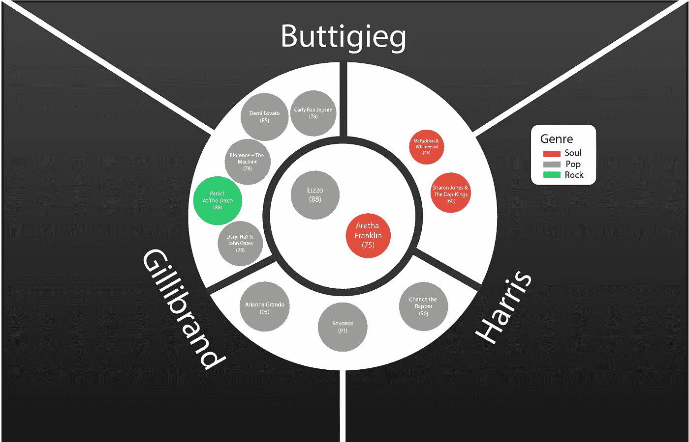
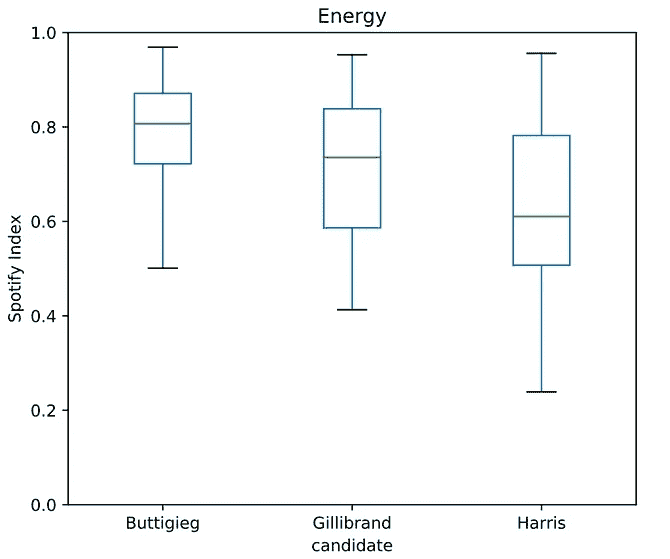

# Spotify 上的 2020 候选人

> 原文：<https://towardsdatascience.com/the-2020-candidates-on-spotify-7613c32701f2?source=collection_archive---------31----------------------->

Album art from 2020 candidates’ playlists.

## Spotify 的数据能告诉我们一些总统竞选是如何瞄准选民的？

利佐是民主党可以同意的一件事。三位 2020 年的候选人已经将 Spotify 整合到他们的竞选活动中:参议员卡玛拉·哈里斯、参议员柯尔斯顿·吉利布兰德和市长皮特·布蒂吉格。在他们的播放列表中，她出现的次数比任何其他艺人都多，只有她和阿撒·富兰克林出现在这三个列表中。

虽然很容易在每个播放列表中注意到 Lizzo，但我们可以使用 Spotify 的数据集来揭示不太明显的趋势。Spotify 公开了一首歌曲的受欢迎程度、风格信息和其他元数据——这些数据不仅有助于了解每位候选人的目标受众，还有助于了解候选人希望观众如何看待他。

该分析将考虑三个播放列表:来自 Buttigieg 竞选活动的“ [Buttijams](https://open.spotify.com/playlist/7yLXMBD3bSClJSVfLxFUQm?si=MlVsyMORRlu6s3GWMn6zyQ) ”、来自 Gillibrand 竞选活动的“ [Gillibrand 2020](https://open.spotify.com/playlist/79xcUMTjOly2Ezfv456zWr?si=Bcf3SqZaQBKD-yW9XF5dQw) ”以及来自 Harris 竞选活动的“[卡玛拉的夏季播放列表](https://open.spotify.com/playlist/5LBdQplc4UcClnFcIYxzCc?si=PMFz4neeS6ajgUo-pmQwyw)”，如下面的时间线所示。(完整的播放列表也嵌入在本文的底部。)还有其他存在的:拜登在 2016 年与奥巴马一起发布了[播放列表](https://open.spotify.com/playlist/54LGzREuEH42YvkyIBX30A?si=6FTw_yUPRVSO82e5dtCZCQ)，贝托·奥洛克在参议院竞选期间发布了[一个*非常*德克萨斯的播放列表](https://open.spotify.com/playlist/2jKnc676XmbmgcYiRTnZa6?si=Nl1381CRTrOoDvCvlDXnfw)。2017 年，哈里斯在她的官方参议员账户下发布了[一个播放列表](https://open.spotify.com/playlist/447DQxPqltGdQq5WqhzIZ5?si=QCl8bPAlR5WipCMEmoReIg)来庆祝非裔美国人音乐欣赏月，而 Buttigieg 最受欢迎的播放列表是“ [50 年，50 首颂歌:骄傲 2019](https://open.spotify.com/playlist/7rOk2un4emf4INl4AIiUUY?si=JbMuBFAfTfCw9aYHoWJU2A) ”然而，考虑到这一点，更直接的方法是专注于明确用于 2020 年总统竞选的播放列表。所有数据都是在 8 月 1 日收集的。

Timeline and data from the three Spotify playlists.

# 受欢迎程度和发布日期

虽然“听的次数”是衡量一首歌受欢迎程度的更直接的方法，但 Spotify 创造了一个从 0 到 100 的“受欢迎程度”指数，衡量播放次数和这些播放的最近时间。以下是每位候选人的播放列表中最受欢迎和最不受欢迎的歌曲。

LINKS — Buttigieg: [American Pie](https://open.spotify.com/track/3cMcGWGErlrAvTJD5ZEiyU?si=-GuM43O5QR6MUesAYZnLcg), [High Hopes](https://open.spotify.com/track/1rqqCSm0Qe4I9rUvWncaom?si=b4bYsFAGRbe5I8z-8x19BQ). Gillibrand: [Try a Little Tenderness](https://open.spotify.com/track/2zatXLEiD7hOJYe0ol6xCP?si=vSKMnovtSrSjmZcKFPcYIw), [Sunflower](https://open.spotify.com/track/3KkXRkHbMCARz0aVfEt68P?si=uhYFxKooRl6PpL9ikbI6bg). Harris: [One Nation Under a Groove](https://open.spotify.com/track/2nqpN3cSmL0tTlJ724fE2a?si=gramcXLPROOEnT4ICyeU0A), [Boy with Luv](https://open.spotify.com/track/5KawlOMHjWeUjQtnuRs22c?si=6WNAPlbfTC6j2OVR-9dQ3Q).

然而，看一下影响流行的两个因素的具体分类会更清楚:听众和发行日期。这些分布显示在下面的箱线图中。

Distribution of release year and number of listens for each candidate’s playlist. Outliers are dropped.

这里最引人注目的趋势是吉利布兰德几乎把所有的音乐都集中在了 21 世纪。这也体现在“倾听”的平均次数明显高于其他两位候选人。这可能表明她专注于更年轻的人群，或者只是选择“更安全”的歌曲(吉利布兰德有 1 首明确的歌曲，相比之下，Buttigieg 有 3 首，哈里斯有 8 首)。哈里斯似乎拥有分布最均匀的播放列表；她最早的歌曲是 1964 年的，但她的播放列表中至少有四分之一是 2019 年发布的歌曲。

# 流派分布

虽然 Spotify 没有明确定义曲目的流派，但它确实将流派与艺术家联系起来。通过结合这两个数据源，我们可以大致估计出候选人决定将哪种风格与他们的图像联系起来。

Genre percentage distribution by candidate.

也许最显著的区别是某些候选人的播放列表中没有的类型。哈里斯的播放列表中没有乡村音乐，Buttigieg 也没有说唱音乐。Buttigieg 最受欢迎的音乐类型是摇滚，占 40%，流行音乐占 31%，灵魂乐占 30%。

# 艺术家重叠

下图有助于显示候选人之间的艺术家重叠。艺术家的受欢迎程度在括号里。如前所述，利佐和阿撒·富兰克林是仅有的两位出现在所有三个播放列表中的艺术家。

Artist overlap between candidate’s playlists. Popularity in parentheses.

Buttigieg 和 Harris 分享了最不受欢迎的艺术家麦克法登& Whitehead 和 Sharen Jones & The Dap-Kings，而 Harris 和 Gillibrand 分享了最受欢迎的艺术家:碧昂斯、Arianna Grande 和说唱歌手 Chance。

# Spotify 功能

Spotify 还使用索引来帮助他们的算法进行推荐。然而，在这种分析中，以一种比体裁更详细的方式来区分三个候选人之间的文体差异是有帮助的。

Spotify 使用的三个有趣的功能是“能量”、“可跳舞性”和“效价”功能。按照 Spotify 的分类，一首充满活力的歌曲让人感觉又快又吵。正如人们所料，具有“可跳舞性”的轨道适合于跳舞。价高的轨道是积极的，价低的轨道是沮丧的或愤怒的。

Buttigieg 的竞选团队发布了三位候选人最有活力和“最快乐”的歌曲。吉利布兰德竞选团队贴出了该乐队最悲伤的歌曲，奥蒂斯·瑞丁的《尝试一点温柔》和艾丽西亚·凯斯的《T2》和《女超人》。哈里斯的播放列表最适合跳舞。

有更多的方式来探索 2020 年候选人如何使用音乐来传达他们的信息。如果你对自己进行分析感兴趣，[这里有一个链接](https://github.com/kmcelwee/2020-spotify)指向我收集的数据。Spotify 的数据集提供了另一种新颖的方式来分析竞选活动如何试图在更个人化的基础上与选民建立联系。

*疑问？失误？联系我，查看更多项目在* [*我的网站*](http://www.kmcelwee.com) *。*

# 播放列表

> 注意:嵌入的播放列表可能会更新，而上面的统计数据不会。例如，哈里斯最近从她的播放列表中删除了“One Nation Under Groove”，尽管该歌曲在统计中使用，但不会出现在下面的嵌入式播放列表中。