# 神经网络的三种最佳优化方法

> 原文：<https://towardsdatascience.com/the-3-best-optimization-methods-in-neural-networks-40879c887873?source=collection_archive---------3----------------------->

## 了解 Adam 优化器、momentum、小批量梯度下降和随机梯度下降

Photo by [rawpixel](https://unsplash.com/@rawpixel?utm_source=medium&utm_medium=referral) on [Unsplash](https://unsplash.com?utm_source=medium&utm_medium=referral)

深度学习是一个迭代的过程。有如此多的参数要调整或方法要尝试，为了快速完成迭代周期，能够快速训练模型是很重要的。这是提高机器学习团队速度和效率的关键。

因此，优化算法非常重要，例如随机梯度下降、最小批量梯度下降、动量梯度下降和 Adam 优化器。

这些方法让我们的神经网络*学习*成为可能。但是，就速度而言，有些方法比其他方法执行得更好。

在这里，您将了解随机梯度下降的最佳替代方案，我们将实现每种方法，看看神经网络使用每种方法可以多快地*学习*。

> 对于机器学习、深度学习和人工智能的实践视频教程，请查看我的 [YouTube 频道](https://www.youtube.com/channel/UC-0lpiwlftqwC7znCcF83qg?view_as=subscriber)。

Gradient…Gradient descent… Get it?

# 小批量梯度下降

传统的梯度下降需要在对参数进行第一次更新之前处理所有的训练样本。从现在起，更新参数将被称为*采取步骤*。

现在，我们知道深度学习在处理大量数据时效果最好。因此，梯度下降需要在数百万个训练点上进行训练，然后才能迈出一步。这显然是低效的。

相反，考虑将测试集分解成更小的集合。每一小组被称为**小批量**。假设每个小批量有 64 个训练点。然后，我们可以一次在一个小批量上训练算法，并在每个小批量的训练完成后采取一个步骤！

因此得名:**小批量梯度下降**。

## 成本图

[在之前的](/how-to-improve-a-neural-network-with-regularization-8a18ecda9fe3)中，我们已经看到了成本图，在每次迭代后成本都平稳下降，如下所示。

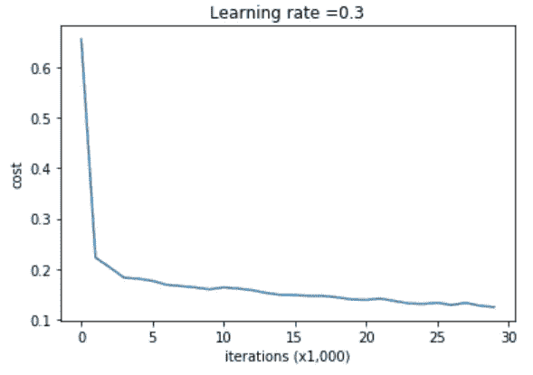

Example of a cost plot using gradient descent

在使用最小批量梯度下降的情况下，曲线将振荡更多，总体呈下降趋势。当我们编写这个方法时，我们将看到一个例子。这种波动是有意义的，因为一组新的数据被用来优化成本函数，这意味着在回落之前，成本函数有时可能会上升。

## 如何选择小批量

让我们考虑两个极端。一方面，你可以将你的小批量设置为所有训练集的大小。这将简单地导致传统的梯度下降方法(也称为批量梯度下降)。

另一方面，您可以将最小批量设置为 1。这意味着每一步仅在 1 个数据点上训练后进行。这叫做**随机梯度下降**。然而，这种方法不是很好，因为它经常在错误的方向上采取步骤，并且它不会收敛到全局最小值；相反，它会在全局最小值附近振荡。

因此，你的小批量应该在这两个极端之间。一般来说，可以遵循以下准则:

*   如果数据集很小(少于 2000 个样本),则使用批量梯度下降
*   对于较大的数据集，典型的小批量大小为 64、128、256 或 512。当然，你的小批量必须适合你的 CPU/GPU 内存

同样，小批量大小可以反复选择。你有时需要测试不同的尺寸，看看哪种训练速度最快。

# 动量梯度下降

具有动量的梯度下降包括对计算的梯度应用指数平滑。这将加速训练，因为算法将更少地向最小值振荡，并且它将向最小值采取更多的步骤。

如果你不知道指数平滑，你可能想读读[这篇](/almost-everything-you-need-to-know-about-time-series-860241bdc578)文章。

通常，使用简单的指数平滑，这意味着还有两个超参数需要调整:学习率*α*和平滑参数*β*。

通常，这种方法几乎总是比传统的梯度下降效果更好，并且它可以与小批量梯度下降相结合。

# 亚当优化算法

Adam 代表: **ada** 感受性**m**moment 估计。简而言之，这种方法结合了动量和 RMSprop(均方根 prop)。

RMSprop 平滑了梯度，就像动量一样，但它使用了一种不同的方法，这种方法在数学上可以得到最好的解释。

首先，梯度计算如下:

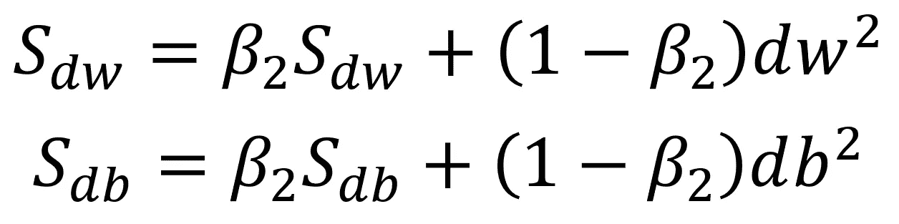

Gradient in RMSprop

然后，权重和偏差矩阵更新如下:

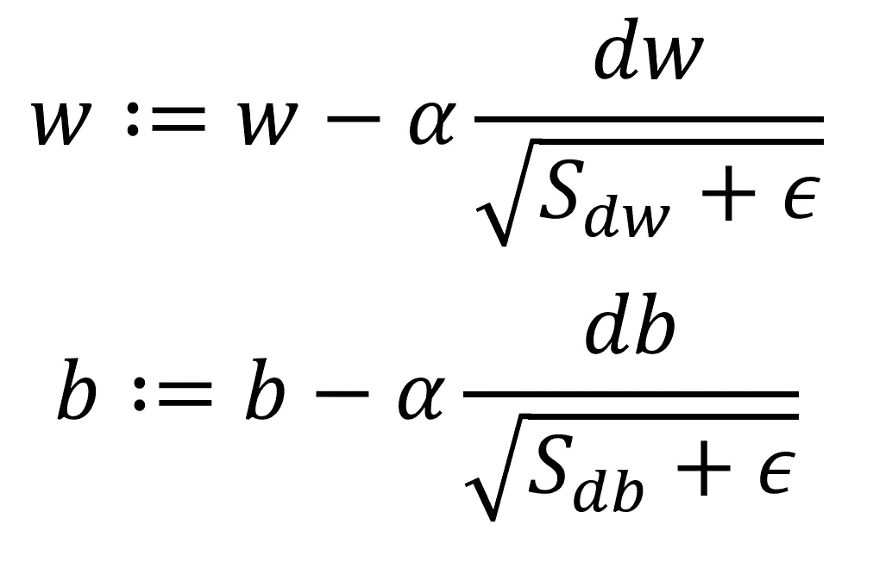

Weight and bias update in RMSprop

注意*β2*是一个新的超参数(不要与动量的*β*相混淆)。另外，*ε*是一个非常小的值，以防止被 0 除。

因此，结合动量和 RMSprop，Adam 引入了四个超参数:

*   学习率*α*
*   *β*来自动量(通常为 0.9)
*   来自 RMSprop 的 *beta2* (通常为 0.999)
*   *ε*(通常为 1e-8)

如上所述，您通常不需要调整 *beta* 、 *beta2* 和 *epsilon* ，因为上面列出的值通常会工作得很好。为了加速训练，只需要调整学习速率。

现在您已经了解了每种优化方法，让我们用 Python 实现它们，并看看它们之间的比较。

# 编码优化方法

我们将在样本数据集上运行每种方法，看看神经网络将如何执行。为了测试训练速度，我们将保持历元数恒定为 10 000。

当然，完整的代码可以在[笔记本](https://github.com/marcopeix/Deep_Learning_AI/blob/master/2.Improving%20Deep%20Neural%20Networks/2.Algorithm%20Optimization/Optimization%20Methods.ipynb)中找到。

## 随机梯度下降

让我们从编码随机梯度下降法开始:

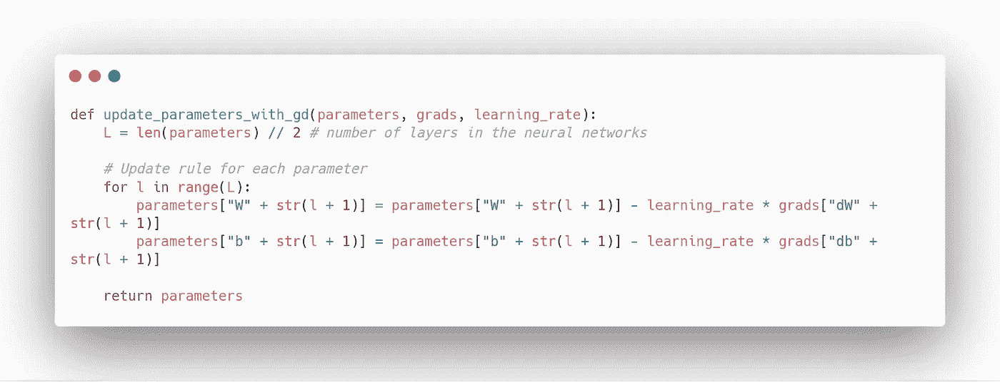

这是相当直接的，因为我们使用单个数据点来进行梯度下降。

## 小批量梯度下降

小批量梯度下降有点难以实现，因为训练规模可能无法被小批量规模整除。因此，我们需要处理最后一批，以适应这种情况:

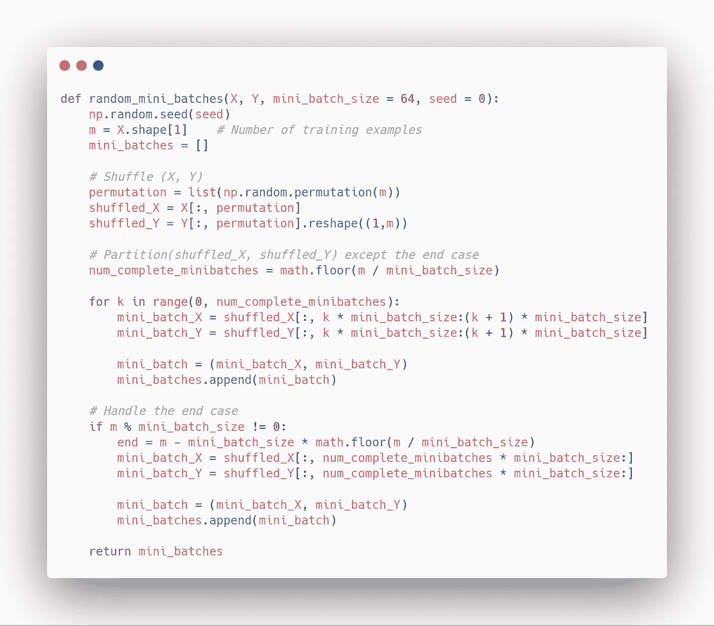

## 动力

要实现动量，我们首先需要初始化*速度*:

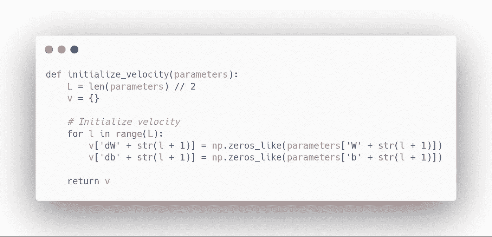

然后，我们可以更新我们的参数:

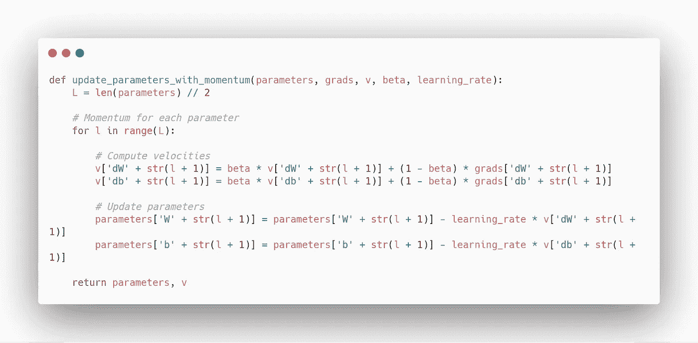

## Adam 优化器

现在，由于 Adam 结合了 momentum 和 RMSprop，我们需要初始化两个参数:

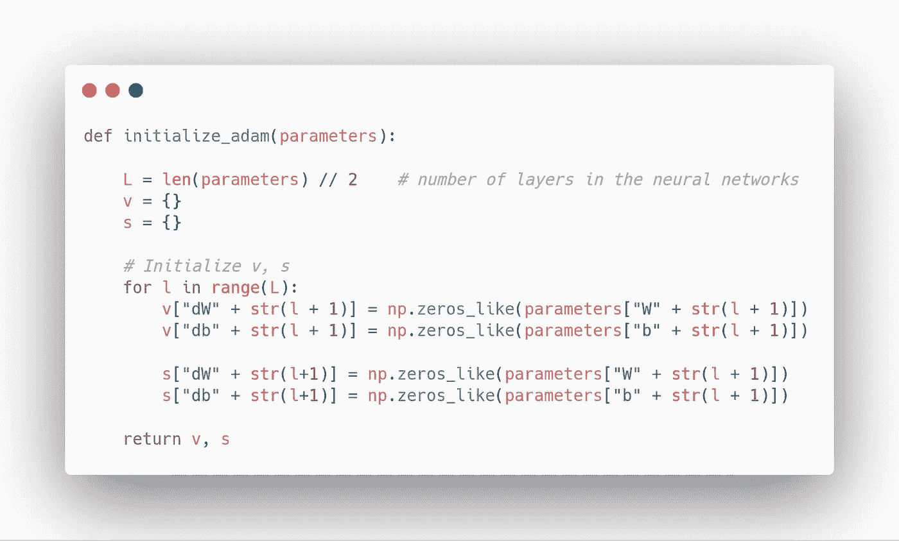

然后，我们可以这样更新参数:

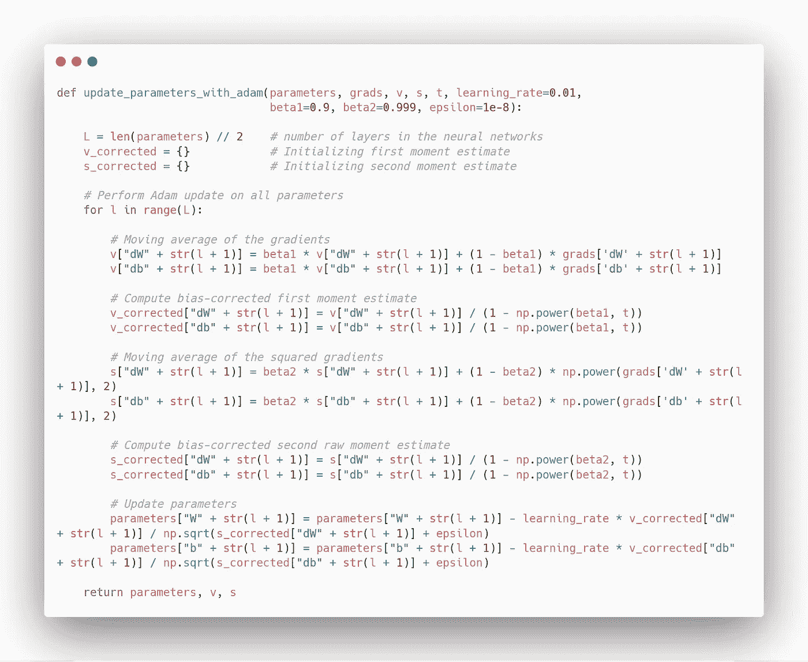

## 采用不同优化方法的模型

现在，我们将用不同的优化方法训练一个神经网络，看看它能学习多快。

让我们将我们的模型定义为:

然后，在对 10 000 个时期进行小批量梯度下降训练后，我们得到:

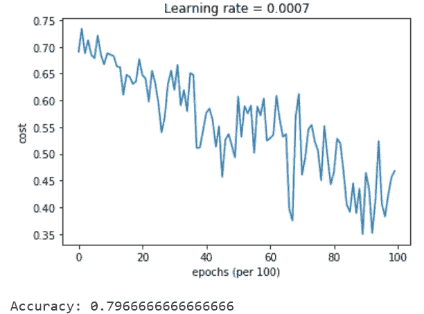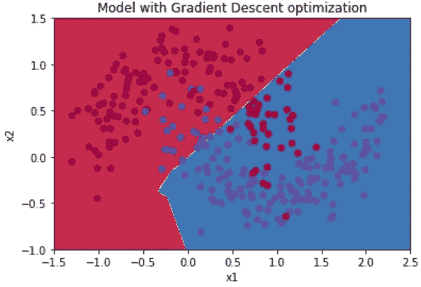

Results for mini-batch gradient descent

正如你所看到的，我们在 10 000 个时期后只达到了 80%的测试准确度，并且判定边界不是很好。

现在，经过动力训练后，我们得到:

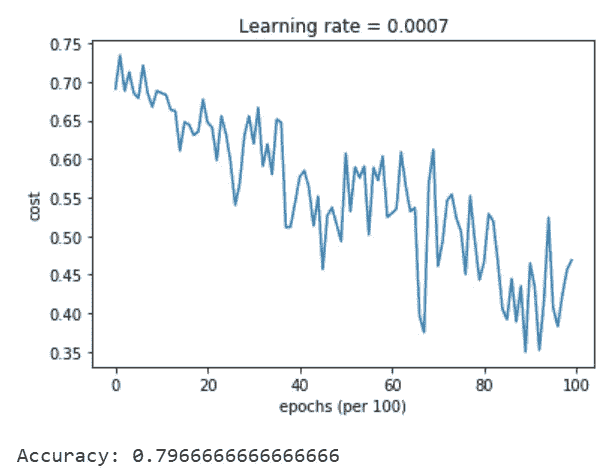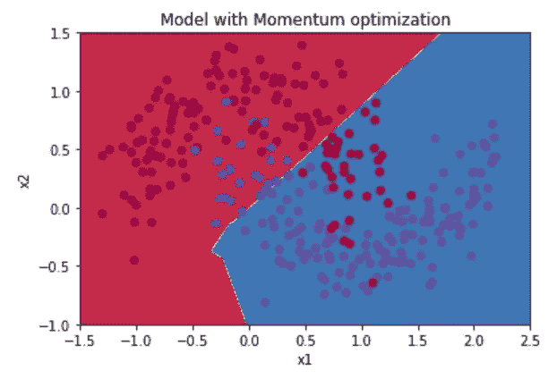

Results for momentum

有趣的是，势头并没有真正帮助。

现在，我们使用亚当，我们得到:

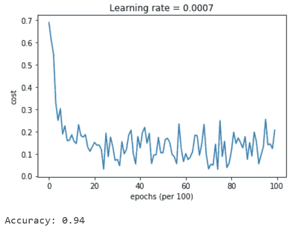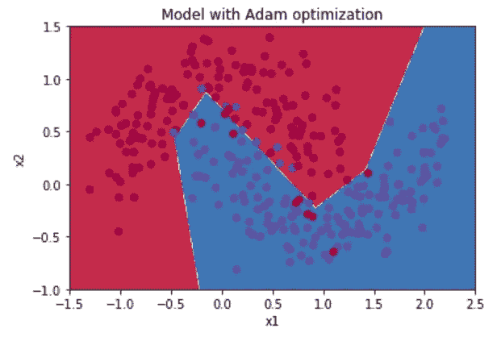

Results with Adam optimizer

太神奇了！使用 Adam，我们获得了 10 000 个历元的更高精度。

请注意，更好的*方法就是更快的*方法。给定更多的时期，其他方法可以给出更好的准确度分数。不过，这个练习的目的是评估每种方法的速度，亚当显然是赢家。**

就是这样！您学习了神经网络的不同优化方法，实现了这些方法，并且发现 Adam 的性能非常好。

通常，人工智能从业者使用小批量梯度下降或 Adam，因为它们在大多数时候表现良好。

幸运的是，深度学习框架内置了优化方法的功能。在下一篇文章中，我们将介绍 TensorFlow，看看编写更大、更复杂的神经网络有多容易。

下次见！