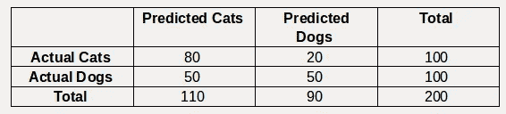
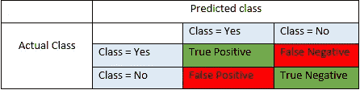
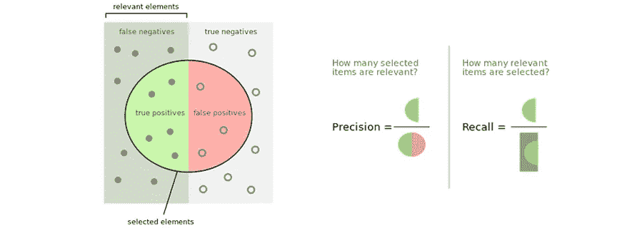

# 每个数据科学家都需要了解的 4 个最常见的分类指标

> 原文：<https://towardsdatascience.com/the-4-most-common-classification-metrics-every-data-scientist-needs-to-understand-1d52d8b8770c?source=collection_archive---------20----------------------->


Photo by [Clay Banks](https://unsplash.com/@claybanks?utm_source=medium&utm_medium=referral) on [Unsplash](https://unsplash.com?utm_source=medium&utm_medium=referral)

还要弄清楚，何时以及如何使用它们？

分类是将连续/离散输入分离成指定数量的离散输出的过程。虽然图像分类已经成为 21 世纪深度学习的最佳应用之一，但用于计算算法性能的指标总是令人质疑。所使用的度量通常是特定于应用的。有时，你试图解决一个股票预测问题，或者如果有一个病理 X 射线或没有或任何其他多类标签。我们将通过使用最普通的狗与猫分类器的例子来深入研究度量的细节。


[Source](https://www.indiatimes.com/lifestyle/15-performance-appraisal-memes-that-are-basically-all-of-us-341809.html)

所以，假设你已经建立了一个二元分类器来预测一个给定的图像是一只猫还是一只狗。让我们假设您的测试集中有 100 只猫和 100 只狗，下面是从模型预测中得到的混淆矩阵。



正如杰瑞米·霍华德所说，

> 在解决数据科学中的问题时，始终使用适当的术语或大词，否则每个人都会认为这是一件微不足道的事情

因此，让我们从使用真实世界的示例为上述混淆矩阵定义数据科学术语开始

# **真实世界示例**

想象一下，一项研究正在评估一种筛查疾病的新测试。每个参加测试的人要么有要么没有这种疾病。测试结果可以是阳性(将人分类为患有疾病)或阴性(将人分类为没有疾病)。每个受试者的测试结果可能与受试者的实际状况相符，也可能不相符。在这种情况下:

**真阳性**:患病人群被正确识别为患病
假阳性:健康人群被错误识别为患病
真阴性:健康人群被正确识别为健康
假阴性:患病人群被错误识别为健康

总的来说，

> 阳性=确定，阴性=拒绝。因此:
> 真阳性=正确识别
> 假阳性=错误识别
> 真阴性=正确剔除
> 假阴性=错误剔除

简而言之，



[Source](https://blog.exsilio.com/all/accuracy-precision-recall-f1-score-interpretation-of-performance-measures/)

现在我们已经熟悉了术语，让我们从指标开始:

# **1。精确度**

这是机器学习中最老套的指标之一。此指标根据样本总数评估所有正确分类的样本。

**公式:准确度= (TP+TN)/(TP+FP+FN+TN)**

在我们的示例中，将猫视为阳性类，我们得到
**TP: 80，TN:50，FP: 50，FN:20**

上面的猫和狗的例子给我们的精度是(80+50)/(80+50+50+20)=0.65(65%)

sklearn 库有如下的内置函数

```
**From sklearn.metrics import accuracy_score****Accuracy = accuracy_score(y_true, y_pred, *average=’weighted’*)**
```

# **2。精度**

《牛津词典》将精确度定义为“*精确和准确的品质、条件或事实*”。该指标主要计算预测类别的正确性或准确性，其方法是将较少数量的负样本预测为正类别。它基本上计算所有样本中预测样本的相关性，因此称为**正预测值(PPV)。**

这种度量主要应用于医学领域。当您构建一个二元分类器时，无论 X 射线是有病变还是健康的，您都需要准确地进行预测，这反过来有助于减少放射科医生的工作量。

**公式:TP/(TP+FP)**

考虑到我们的例子，猫类的精度是 80/(80+50)=0.615(61.5%)
类似地，狗类的精度将是 50/(50+20)=0.714(71.4%)

现在，为了计算模型的平均精度，可以取[加权平均](https://www.wikihow.com/Calculate-Weighted-Average) w.r.t 个样本数。

```
**From sklearn.metrics import precision_score****Precision= precision_score(y_true, y_pred, * average=’weighted’*)**
```

# **3。召回**

维基百科将召回定义为“*已被检索的相关实例占相关实例总数的比例*”。因此，它基本上是实际阳性样本中的预测阳性样本。这也被称为**灵敏度或真阳性率**。因此，当所有阳性样本都被正确预测时，召回率为 1。

**公式:TP/(TP+FN)**

在我们的猫和狗的分类中，猫类的召回率是:80/(80+20)=0.8(80%)

```
**From sklearn.metrics import recall_score****Recall = recall_score(y_true, y_pred, * average=’weighted’*)**
```



[Source](https://www.digital-mr.com/blog/view/precision-and-recall-in-social-listening)

# **4。特异性**

特异性是**真阴性率**。它测量被正确识别的实际否定的比例。使用具有病理或健康的患者的上述用例，高特异性意味着将实际健康的人称为健康的模型是高的。

**公式:TN/(TN+FP)**

模型的特异性为 50/(50+50)=0.5 (50%)。

一般来说，这些是评估类和整个模型性能的最常见的度量标准。现在，这些指标的使用已经被证明是特定于应用的。都是在解决一个问题的同时，你最关心什么。在我即将发布的博客中，我将更进一步，写一些不太常见但很重要的分类标准，这些标准在参加 Kaggle 和其他平台的比赛以及评估你的模型的总体性能时很有用。

# **参考文献**

1.  [https://www.wikihow.com/Calculate-Weighted-Average](https://www.wikihow.com/Calculate-Weighted-Average)
2.  [https://towards data science . com/the-5-classification-evaluation-metrics-you-must-know-aa 97784 ff 226](/the-5-classification-evaluation-metrics-you-must-know-aa97784ff226)
3.  https://en.wikipedia.org/wiki/Sensitivity_and_specificity
4.  【https://www.oxfordlearnersdictionaries.com/ 