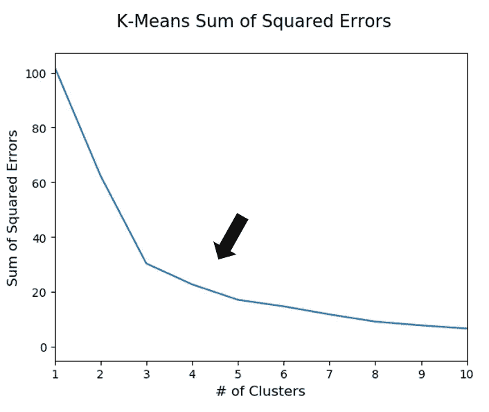

# 约翰尼·德普电影的四种类型

> 原文：<https://towardsdatascience.com/the-4-types-of-johnny-depp-movies-39c20f3f720f?source=collection_archive---------17----------------------->


538 的这篇文章详细描述了尼古拉斯·凯奇电影的五种不同类型，受到这篇文章的启发，我想自己尝试一下这个主题。这种类型的分析是将数据科学与娱乐行业等有趣主题结合起来的绝佳机会。为了成功地为某个男演员或女演员找到不同类型的电影，你需要一个在票房成功和评论界都有一定*知名度的人。经过一番思考和考察，约翰尼·德普似乎完全符合这一模式。德普已经出演了 80 多部电影，有一些高潮(加勒比海盗，查理和巧克力工厂)，也有一些低谷(莫特凯，私人度假村)。随着演员的关注，我开始收集约翰尼·德普在其演艺生涯中获得表演奖的每部国产电影的票房收入和元评论分数。一旦收集了所有必要的数据，我就用 Python 将电影分成不同的组，用 R 创建最终的视觉效果。我将首先深入约翰尼德普电影的四种类型，然后我将解释将电影分组的过程和推理。事不宜迟，这里是约翰尼德普电影的四种类型。*


# 电影类型分类

## **海盗/奇幻大片**

**电影** *:* 《加勒比海盗:黑珍珠的诅咒》(2003)、《查理和巧克力工厂》(2005)、《加勒比海盗:死人的箱子》(2006)、《加勒比海盗:在世界的尽头》(2007)、《爱丽丝梦游仙境》(2010)、《加勒比海盗:在陌生人的潮汐上》(2011)、《神奇动物在哪里》(2016)

这些电影都在票房上取得了巨大成功，典型的是约翰尼·德普扮演一个“有趣”的角色，如杰克·斯派洛船长或威利·旺卡。票房最成功的电影都是在 2000 年后发行的，约翰尼·德普在这个群体中取得的每一次重大成功都是在幻想类型中。

## **夏洛克地精的领地**

电影:《私人度假村》(1985)、《本尼&俊》(1993)、《时间的尼克》(1995)、《拉斯维加斯的恐惧与厌恶》(1998)、《第九扇门》(1999)、《宇航员的妻子》(1999)、《哭泣的男人》(2000)、《打击》(2001)、《来自地狱》(2001)、《墨西哥往事》(2003)、《秘密之窗》(2004)。 《加勒比海盗:死无对证》(2017)、《东方快车谋杀案》(2017)、《神探夏洛克·侏儒》(2018)、《神奇动物:格林德沃的罪行》(2018)

《神探夏洛克·地精》是约翰尼·德普最大的一个领域，并且在最近几年有了很大的增长。约翰尼·德普的最低谷到处都是。有些是过去电影的平庸延续，如《爱丽丝镜中奇遇记》或《加勒比海盗:死无对证》。其他的，像《私人度假村》和《神探夏洛克·侏儒》，让你想知道当初为什么要拍它们。在德普的职业生涯之初，并没有很多表现不佳的电影，但自 2010 年以来，他已经经历了相当长的时间。

## **独树一帜，广受好评**

**电影**:《榆树街的噩梦》(1984)，《哭泣的婴儿》(1990)，《剪刀手爱德华》(1990)，《亚利桑那之梦》(1993)，《什么在吃吉尔伯特葡萄》(1993)，《埃德·伍德》(1994)，《唐璜·德马科》(1994)，《死人》(1995)，《唐尼·布拉斯科》(1997)，《断头谷》(1999)，《夜幕降临之前》(2000)，《巧克力》(2000)

这群人构成了德普电影史上相当大的一部分。这组中的许多电影都是原创的，它们展示了德普在整个职业生涯中各种各样的表演。从经典恐怖片《榆树街的噩梦》到话剧《什么在吃吉尔伯特葡萄》，再到动画喜剧《兰戈》。虽然近年来它们已经不那么流行了，但德普在他 35 年多的职业生涯中一直在推出原创和广受欢迎的电影。

## **排**

电影:《排》(1986)

最后一个*组*简单来说就是“排”。《野战排》在德普电影史上是个异数。这是他参演的第三部电影，也是德普参演的唯一一部战争片。这是一个巨大的票房成功，在只有 600 万美元的预算下获得了 1.385 亿美元的收入。随着票房的成功，《野战排》还获得了第 59 届奥斯卡最佳影片奖。

# **电影聚类过程**

在从 IMDb 收集了电影数据、从 Box Office Mojo 收集了票房收入数据、从 Metacritic 收集了影评人评级数据之后，是时候准备一种算法来将电影适当地分成不同的组了。为了有效地将电影分成不同的组，我实现了一种叫做[高斯混合模型](https://brilliant.org/wiki/gaussian-mixture-model/)的聚类算法。

为什么我选择了高斯混合模型？当只有两个维度需要评估时(revenue & critic score ),该算法非常有效，并且与其他聚类算法相比，该算法的结果对于这种类型的分析可能更“令人兴奋”,因为高斯混合建模并不假设不同的组将与几何形状或结构对齐。


Example of a Gaussian Mixture Model

在实现混合模型之前，我们如何知道算法应该搜索多少个聚类？找到正确的集群数量可能很棘手，而且非常主观，所以我将使用所谓的肘图来确定适当的集群数量。在 Python Scikit-Learn 库的帮助下，我实现了一个类似高斯混合模型的算法，称为[“期望最大化”风格的 K 均值聚类](http://stanford.edu/~cpiech/cs221/handouts/kmeans.html)。同时瞄准 1 到 10 个集群的数据，以查看哪个数字可能工作得最好。要使用的“最佳”聚类数通常是误差平方和(SSE)停止快速下降的点。

```
from sklearn.cluster import KMeans
from sklearn.mixture import GaussianMixture
from sklearn.preprocessing import StandardScaler
import pandas as pd
import matplotlib.pyplot as plt# Reading in the data
movies = pd.read_csv('Johnny Depp Movies.csv')# Using the Sci-kit Learn Standard Scaler for z-score transformation of
# numerical variables.
scaler = StandardScaler()
movies['scores_scaled'] = scaler.fit_transform(movies[['Metacritic Score']])
movies['box_office_scaled'] = scaler.fit_transform(movies[['Box Office']])# Running an Expectation-Maximization K-Means algorithm at increasing
# amounts of clusters to find an appropriate target amount for 
# the Gaussian Mixture Model
SSE = []
i = 1
while i < 10:
    kmean = KMeans(n_clusters = i, max_iter = 1000, algorithm = 'full')
    kmean_fit = kmean.fit(movies[['scores_scaled', 'box_office_scaled']])
    SSE.append(kmean_fit.inertia_)
    i += 1# Plotting the results of the Expectation-Maximization K-Means
plt.style.use('default')
plt.suptitle('K-Means Sum of Squared Errors', fontsize = 15)
plt.xlabel('# of Clusters', fontsize = 12)
plt.ylabel('Sum of Squared Errors', fontsize = 12)
plt.plot(SSE)
```



虽然在这种情况下没有一个明确的点可供选择，但我决定选择 4 个集群，因为这似乎是上证指数停止高速下跌的第一个点。在选择 4 作为集群的集合数之后，我使用了高斯混合模型。

```
# Setting up a Gaussian Mixture Model with 4 clusters and 1000 iterations
gmm = GaussianMixture(n_components=4, covariance_type = 'full', max_iter=1000, n_init = 10)# Fitting the model to the data
gmm_fit = gmm.fit(movies[['scores_scaled', 'box_office_scaled']])# Finally assigning labels to the movies
movies['Cluster'] = gmm_fit.predict(movies[['scores_scaled', 'box_office_scaled']])
```

现在为每部电影分配了集群标签，我用 ggplot2 包在 R 中绘制了数据，并突出显示了一些更有趣的数据点。一些最后的润色是用微软 Word 完成的。

```
# Loading the ggplot2 package and reading in the data
library(ggplot2)# Plotting out the data
ggplot(df2, aes(x=Metacritic.Score, y=box.millions, color = Cluster)) +
  geom_point(size = 2.5, alpha = .5) +
# Highlighting some points of interest  
  geom_point(data=df2[3, ], colour="magenta4", size=2.5) +
  geom_point(data=df2[30, ], colour="red", size=2.5) +
  geom_point(data=df2[35, ], colour="red", size=2.5) +
  geom_point(data=df2[28, ], colour="red", size=2.5) +
  geom_point(data=df2[29, ], colour="green4", size=2.5) +
  geom_point(data=df2[5, ], colour="green4", size=2.5) +
  geom_point(data=df2[44, ], colour="blue", size=2.5) +
  geom_point(data=df2[50, ], colour="blue", size=2.5) +
# Finishing touches to the plot
  labs(title = "Types of Johnny Depp Movies") +
  xlab('Metacritic Score') +
  ylab('Domestic Box Office (Millions)') +
  scale_color_manual(values = c('magenta4','blue', 'red', 'green4')) +
  ylim(0, 600) +
  xlim(0, 100) +
  theme_classic() +
  theme(legend.position="none")  +
  theme(plot.title = element_text(face = 'bold', size = 20, hjust=0.5), 
        axis.title.x = element_text(face = 'bold', size = 15),
        axis.title.y = element_text(face = 'bold', size = 15))
```

这就结束了收集数据、实现聚类算法和可视化发现的过程。我希望你们都喜欢这篇关于约翰尼·德普从影记录的文章，同时了解高斯混合模型是如何被用来做出一些有趣的发现的。

票房收入通过票房 Mojo 换算成 2019 美元。

烂番茄平均评论家评分被用来替代 Metacritic 上没有列出的一些电影。

z 分数缩放用于票房收入和电影分数数据，以构建 K 均值聚类的数据。