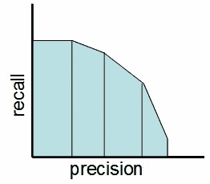
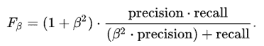
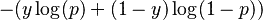
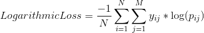
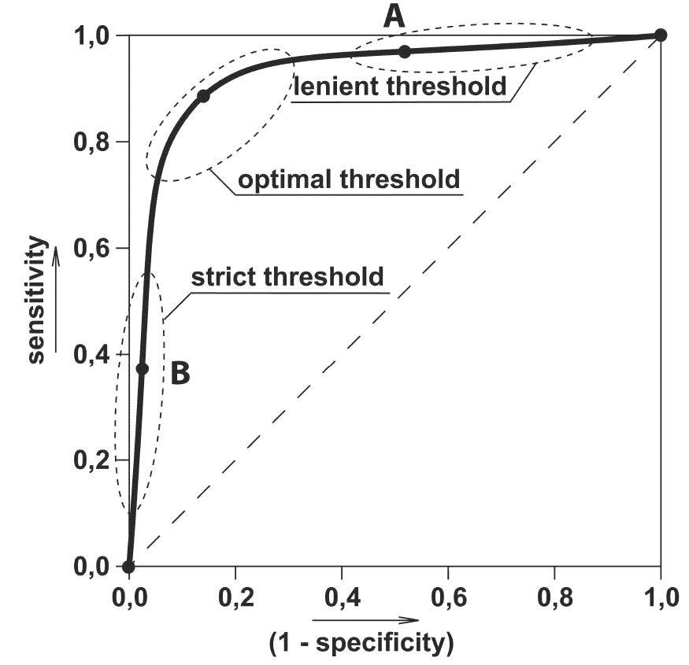

# 每个数据科学家都必须知道的 5 个分类评估指标

> 原文：<https://towardsdatascience.com/the-5-classification-evaluation-metrics-you-must-know-aa97784ff226?source=collection_archive---------0----------------------->


Photo by [K. Mitch Hodge](https://unsplash.com/@kmitchhodge?utm_source=medium&utm_medium=referral) on [Unsplash](https://unsplash.com?utm_source=medium&utm_medium=referral)

## 以及具体什么时候使用它们？

***我们要优化什么？大多数商家都没有回答这个简单的问题。***

***每一个业务问题都有一点不同，要有不同的优化。***

我们都创建了分类模型。很多时候，我们试图提高评估模型的准确性。 ***但是，我们真的想要准确性作为模型性能的度量标准吗？***

***如果我们在预测将要撞击地球的小行星数量会怎么样。***

一直说零就行了。你会有 99%的准确率。我的模型可能相当准确，但一点价值都没有。在这种情况下我们应该怎么做？

> *设计数据科学项目比建模本身重要得多。*

***这篇文章是关于各种评估指标以及如何和何时使用它们。***

# 1.准确度、精确度和召回率:


## A.准确(性)

准确性是最重要的分类标准。这很容易理解。并且容易适用于二元以及多类分类问题。

`Accuracy = (TP+TN)/(TP+FP+FN+TN)`

准确性是真实结果在检查的案例总数中所占的比例。

## ***什么时候使用？***

准确度是对分类问题进行评估的有效选择，这些问题是平衡的，没有偏斜或没有类别不平衡。

## ***告诫***

假设我们的目标类非常稀疏。我们需要准确性作为模型性能的度量吗？ ***如果我们在预测小行星会不会撞上地球呢？*** 一直只说`No`。你会有 99%的准确率。我的模型可能相当准确，但一点价值都没有。

## B.精确

先说*精度*，它回答了下面这个问题:**预测阳性**真正阳性的比例是多少？

`Precision = (TP)/(TP+FP)`

在小行星预测问题中，我们从来没有预测到一个真正的肯定。

因此精度=0

## ***什么时候使用？***

当我们想要非常确定我们的预测时，精度是评估度量的有效选择。例如:如果我们正在构建一个系统来预测我们是否应该降低特定帐户的信用限额，我们希望对我们的预测非常确定，否则它可能会导致客户不满。

## ***注意事项***

非常精确意味着我们的模型会让许多信用违约者毫发无损，从而蒙受损失。

## C.回忆

另一个非常有用的方法是*召回*，它回答了一个不同的问题:有多少比例的**实际阳性**被正确分类？

`Recall = (TP)/(TP+FN)`

在小行星预测问题中，我们从来没有预测到一个真正的肯定。

因此召回也等于 0。

## ***什么时候使用？***

当我们想要捕捉尽可能多的正面信息时，召回是评估指标的有效选择。例如:如果我们正在建立一个系统来预测一个人是否患有癌症，即使我们不是很确定，我们也希望捕捉到疾病。

## ***注意事项***

***如果我们对所有的例子都预测 1，那么召回就是 1。***

由此产生了利用精确度与召回率的折衷的想法— ***F1 分数*** 。

# 2.F1 分数:

这是我最喜欢的 ***评估指标*** ，我倾向于在我的分类项目中大量使用它。

F1 分数是一个介于 0 和 1 之间的数字，是精确度和召回率的调和平均值。


让我们从一个二元预测问题开始。我们正在预测一颗小行星是否会撞击地球。

所以如果我们对整个训练集说“不”。我们这里的精度是 0。我们正课的回忆是什么？它是零。准确度如何？是 99%以上。

因此 F1 分数也是 0。因此我们知道，准确率为 99%的分类器对我们的情况来说基本上是没有价值的。因此它解决了我们的问题。

## ***什么时候使用？***

我们希望有一个同时具有良好精度和召回率的模型。



Precision-Recall Tradeoff

简单来说， ***F1 分数在分类器*** 的精确度和召回率之间保持了平衡。如果你的准确率低，F1 就低，如果召回率又低，你的 F1 分数就低。

> 如果你是一名警督，你想抓罪犯，你想确定你抓的人是罪犯(精确)，你也想尽可能多地抓到罪犯(回忆)。F1 分数管理这种权衡。

## 怎么用？

您可以使用以下公式计算二元预测问题的 F1 分数:

```
**from** **sklearn.metrics** **import** f1_score
y_true = [0, 1, 1, 0, 1, 1]
y_pred = [0, 0, 1, 0, 0, 1]***f1_score(y_true, y_pred)*** 
```

这是我的一个函数，我用它来获得最佳阈值，使二元预测的 F1 值最大化。below 函数遍历可能的阈值，以找到给出最佳 F1 分数的阈值。

```
# y_pred is an array of predictions
def bestThresshold(y_true,y_pred):
    best_thresh = None
    best_score = 0
    for thresh **in** np.arange(0.1, 0.501, 0.01):
        score = f1_score(y_true, np.array(y_pred)>thresh)
        if score > best_score:
            best_thresh = thresh
            best_score = score
    return best_score , best_thresh
```

## 警告

F1 分数的主要问题在于它对精确度和召回率给予了同等的重视。我们有时可能需要在我们的评估中包括领域知识，我们希望有更多的回忆或更精确。

为了解决这个问题，我们可以通过创建一个加权 F1 指标来实现，如下所示，其中 beta 管理精确度和召回率之间的权衡。



这里我们给β倍于精度的重要性来回忆。

```
**from** **sklearn.metrics** **import** fbeta_scorey_true = [0, 1, 1, 0, 1, 1]
y_pred = [0, 0, 1, 0, 0, 1]fbeta_score***(y_true, y_pred,beta=0.5)***
```

F1 分数也可以用于多类问题。详情见[Boaz shmu Eli](/multi-class-metrics-made-simple-part-ii-the-f1-score-ebe8b2c2ca1)的这篇精彩博文。

# 3.对数损失/二元交叉熵

对数损失对于二元分类器来说是一个非常好的评估度量，并且在逻辑回归和神经网络的情况下，它有时也是优化目标。

一个例子的二进制对数损失由下面的公式给出，其中 p 是预测 1 的概率。



As you can see the log loss decreases as we are fairly certain in our prediction of 1 and the true label is 1.

## 什么时候用？

*当分类器的输出是预测概率时。* ***Log Loss 根据其与实际标签的差异程度，将您预测的不确定性考虑在内。*** 这让我们对模型的性能有了更细致的了解。一般来说，最小化日志损失为分类器提供了更高的准确性。

## 怎么用？

```
**from** **sklearn.metrics** **import** log_loss # where y_pred are probabilities and y_true are binary class labels
log_loss(y_true, y_pred, eps=1e-15)
```

## 警告

在[不平衡](/the-5-sampling-algorithms-every-data-scientist-need-to-know-43c7bc11d17c)数据集的情况下易受影响。您可能需要引入类权重来更多地惩罚少数错误，或者您可以在平衡数据集后使用它。

# 4.范畴交叉熵

日志丢失也适用于多类问题。多类设置中的分类器必须为所有示例的每个类分配一个概率。如果有 N 个样本属于 M 个类别，那么*分类交叉熵*是- `ylogp`值的总和:



如果样本`i`属于类别`j`则`y_ij`为 1，否则为 0

`p_ij`是我们的分类器预测样本`i`属于类别`j`的概率。

## 什么时候用？

*当一个分类器的输出是多类预测概率时。在神经网络的情况下，我们通常使用分类交叉熵。*一般来说，最小化分类交叉熵为分类器提供了更高的准确性。

## 怎么用？

```
**from** **sklearn.metrics** **import** log_loss # Where y_pred is a matrix of probabilities with shape ***= (n_samples, n_classes)*** and y_true is an array of class labelslog_loss(y_true, y_pred, eps=1e-15)
```

## 警告:

在[不平衡](/the-5-sampling-algorithms-every-data-scientist-need-to-know-43c7bc11d17c)数据集的情况下易受影响。

# 5.罗马纪元

AUC 是 ROC 曲线下的面积。

***AUC ROC 表示阳性类别的概率与阴性类别的概率的分离程度***

***什么是 ROC 曲线？***


我们已经从分类器中得到概率。我们可以使用不同的阈值来绘制曲线上的灵敏度(TPR)和(1-特异性)(FPR ),我们将得到一条 ROC 曲线。

其中真正的肯定率或 TPR 只是我们使用我们的算法捕获的真实的比例。

`Sensitivty = TPR(True Positive Rate)= Recall = TP/(TP+FN)`

假阳性率或 FPR 就是我们用算法捕捉到的假阳性的比例。

`1- Specificity = FPR(False Positive Rate)= FP/(TN+FP)`



ROC Curve

这里我们可以使用 ROC 曲线来决定阈值。
阈值的选择也将取决于分类器的用途。

如果这是一个癌症分类应用程序，你不希望你的阈值大到 0.5。即使一个病人患癌症的概率是 0.3，你也会把他归类为 1。

否则，在降低信用卡限额的应用程序中，您不希望您的阈值低至 0.5。您在这里有点担心降低限制对客户满意度的负面影响。

## 什么时候用？

AUC 是**比例不变的**。它衡量预测的排名，而不是它们的绝对值。因此，举例来说，如果你作为一个营销人员想要找到一个用户列表，他们将响应营销活动。AUC 是一个很好的指标，因为按概率排列的预测是您创建用户列表以发送营销活动的顺序。

使用 AUC 的另一个好处是它像对数损失一样**分类阈值不变**。它测量模型预测的质量，而不考虑选择什么分类阈值，不像 F1 分数或准确性取决于阈值的选择。

## 怎么用？

```
import numpy as np
from sklearn.metrics import roc_auc_score
y_true = np.array([0, 0, 1, 1])
y_scores = np.array([0.1, 0.4, 0.35, 0.8])***print(roc_auc_score(y_true, y_scores))***
```

## 警告

有时，我们需要从模型中得到精确校准的概率输出，而 AUC 对此没有帮助。

# 结论

创建我们的[机器学习管道](/6-important-steps-to-build-a-machine-learning-system-d75e3b83686)的一个重要步骤是相互评估我们不同的模型。评估指标的错误选择可能会对您的整个系统造成严重破坏。

因此，要时刻注意你的预测，以及评估指标的选择会如何影响/改变你的最终预测。

此外，评估指标的选择应该与业务目标保持一致，因此有点主观。您也可以提出自己的评估标准。

# 继续学习

如果你想[了解](/how-did-i-start-with-data-science-3f4de6b501b0?source=---------8------------------)更多关于如何构建机器学习项目和最佳实践，我想调出他在 Coursera [深度学习](https://coursera.pxf.io/7mKnnY)专业化中的第三门课程，名为构建机器学习项目。一定要去看看。它谈到了陷阱和许多改进模型的基本想法。

谢谢你的阅读。将来我也会写更多初学者友好的帖子。在 [**中**](https://medium.com/@rahul_agarwal?source=post_page---------------------------) 关注我或者订阅我的 [**博客**](https://mlwhiz.ck.page/a9b8bda70c) 了解他们。一如既往，我欢迎反馈和建设性的批评，可以通过 Twitter [@mlwhiz](https://twitter.com/MLWhiz?source=post_page---------------------------) 联系到我

此外，一个小小的免责声明——在这篇文章中可能会有一些相关资源的附属链接，因为分享知识从来都不是一个坏主意。