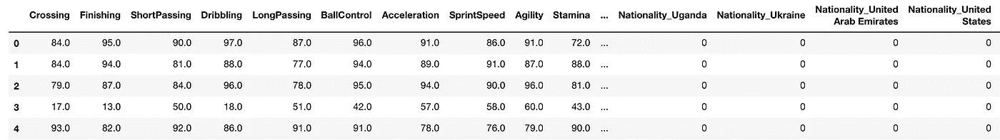
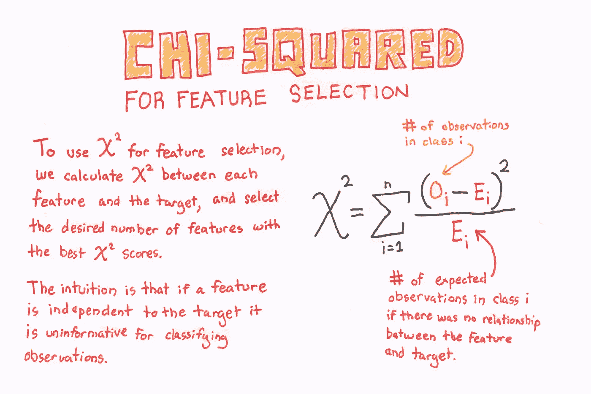
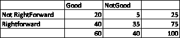
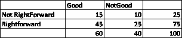
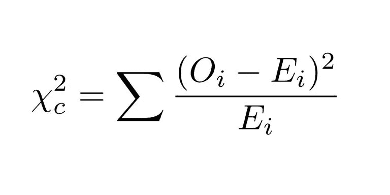
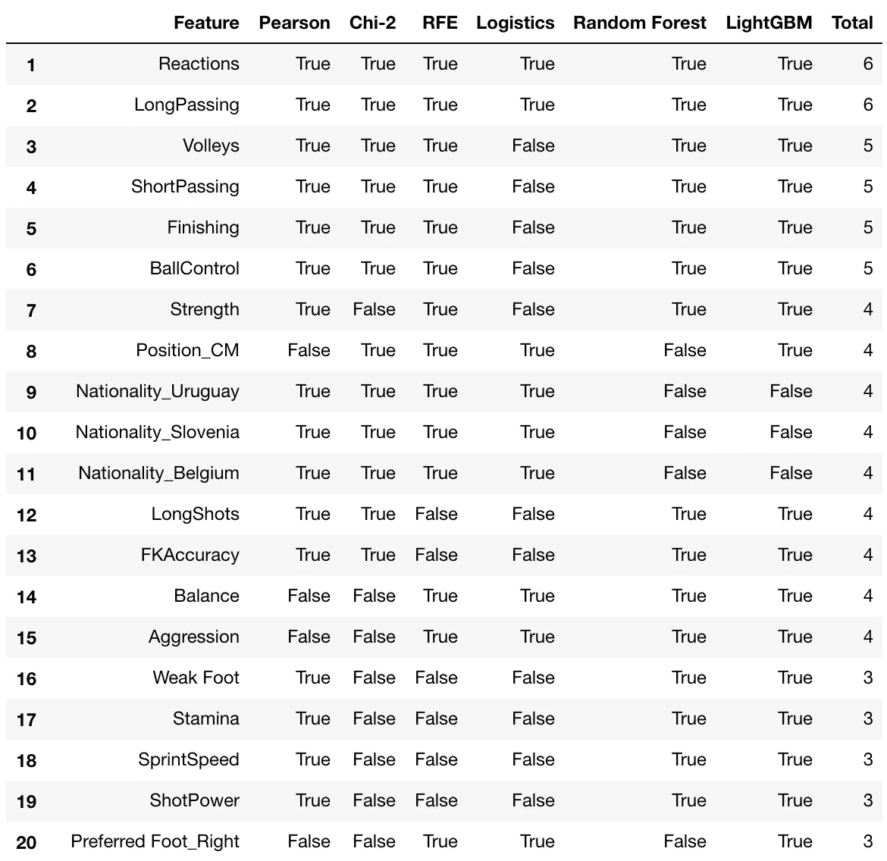

# 每个数据科学家都应该知道的 5 种特征选择算法

> 原文：<https://towardsdatascience.com/the-5-feature-selection-algorithms-every-data-scientist-need-to-know-3a6b566efd2?source=collection_archive---------0----------------------->


Source: [Pixabay](https://pixabay.com/photos/children-splash-asia-sunset-1822688/)

## [DS 算法](https://towardsdatascience.com/tagged/ds-algorithms)

## 额外收获:是什么让一个优秀的足球运动员变得伟大？

数据科学是对算法的研究。

我每天都在努力学习许多算法，所以我想列出一些最常见和最常用的算法，这些算法将在这个新的 [DS 算法系列](https://towardsdatascience.com/tagged/ds-algorithms)中使用。

当你创建了大量的特性，然后你需要想办法减少特性的数量，这种情况已经发生了多少次了。

我们有时最终会使用相关性或基于树的方法来找出重要的特征。

我们能给它增加一些结构吗？

***这篇文章是关于在处理数据时可以使用的一些最常见的特征选择技术。***

# 为什么选择功能？

在我们继续之前，我们需要回答这个问题。为什么不把所有的特征都交给 ML 算法，让它来决定哪个特征重要？

所以我们有三个理由不这么做:

## 1.维数灾难——过度拟合


[Source](https://chrisalbon.com/)

如果数据中的列数多于行数，我们将能够完美地拟合我们的训练数据，但这不会推广到新的样本。因此我们什么也没学到。

## 2.奥卡姆剃刀:

我们希望我们的 ***模型是简单的*** 和可解释的。当我们有很多特征时，我们就失去了可解释性。

## 3.垃圾输入垃圾输出:

大多数时候，我们会有许多非信息性的特征。例如，名称或 ID 变量。 ***低质量的输入会产生低质量的输出。***

此外，大量的特征使得模型庞大、耗时，并且在生产中更难实现。

# 那我们该怎么办？


我们只选择有用的特征。

幸运的是，Scikit-learn 让我们选择特性变得非常容易。我们可以有很多方式来考虑特征选择，但是大多数特征选择方法可以分为三大类

*   ***基于过滤:*** 我们指定一些度量并基于这些过滤特征。这种度量的一个例子可以是相关/卡方。
*   ***基于包装器:*** 包装器方法将一组特征的选择视为一个搜索问题。示例:递归特征消除
*   ***嵌入式:*** 嵌入式方法使用具有内置特征选择方法的算法。例如，套索和射频有自己的特征选择方法。

理论讲得够多了，让我们从五种特征选择方法开始。

我们将尝试使用数据集来更好地理解它。

我将使用一个足球运动员数据集来找出 ***是什么让一个好球员变得伟大？***

***不懂足球术语也不用担心。我会尽量把它保持在最低限度。***

下面是 Kaggle [内核](https://www.kaggle.com/mlwhiz/feature-selection-using-football-data)的代码，您可以自己尝试一下。

# 一些简单的数据预处理

我们已经做了一些基本的预处理，如删除空值和一个热编码。并且使用以下方式将该问题转换成分类问题:

```
y = traindf['Overall']>=87
```

在这里，我们用高总体来代表一个伟大的球员。

我们的数据集(X)如下所示，有 223 列。



train Data X

# 1.皮尔逊相关


这是一种基于过滤器的方法。

我们检查数据集中目标和数字特征之间的皮尔逊相关性的绝对值。我们根据这个标准保留前 n 个特征。

# 2.卡方检验

这是另一种基于过滤器的方法。

在该方法中，我们计算目标和数值变量之间的卡方度量，并且仅选择具有最大卡方值的变量。



[Source](https://chrisalbon.com/)

让我们创建一个小例子来说明如何计算样本的卡方统计量。

假设我们的数据集中有 75 个右前锋和 25 个非右前锋。我们观察到 40 个右前锋是好的，35 个不好。这是否意味着球员在右前卫会影响整体表现？



Observed and Expected Counts

我们计算卡方值:

为了做到这一点，我们首先找出如果两个分类变量之间确实存在独立性，我们期望落在每个桶中的值。

这很简单。我们将每个单元格的行和与列和相乘，然后除以总观察值。

so Good and NotRightforward 时段期望值= 25(行总和)*60(列总和)/100(总观察值)

为什么会这样？由于数据中有 25%的非右前锋，我们预计我们在该单元观察到的 60 名优秀球员中有 25%是右前锋。因此 15 个玩家。

然后我们可以使用下面的公式对所有 4 个单元格求和:



我不会在这里展示它，但卡方统计也以手动方式处理非负数字和分类特征。

我们可以从数据集获得卡方特征，如下所示:

# 3.递归特征消除


这是一个基于包装的方法。如前所述，包装器方法将一组特性的选择视为一个搜索问题。

来自`sklearn`文档:

> 递归特征消除(RFE)的目标是通过递归地考虑越来越小的特征集来选择特征。首先，在初始特征集上训练估计器，并且通过`*coef_*`属性或通过`*feature_importances_*`属性获得每个特征的重要性。然后，从当前特征集中删除最不重要的特征。该过程在删减集上递归重复，直到最终达到要选择的特征的期望数量。

正如你已经猜到的，我们可以使用任何估计方法。在这种情况下，我们使用`LogisticRegression`，RFE 观察`LogisticRegression`对象的`*coef_*` 属性

# 4.套索:从模型中选择


[Source](https://chrisalbon.com/)

这是一种嵌入式方法。如前所述，嵌入式方法使用具有内置特征选择方法的算法。

比如 Lasso 和 RF 都有自己的特征选择方法。套索正则化强制许多要素权重为零。

这里我们用套索来选择变量。

# 5.基于树:SelectFromModel


这是一种嵌入式方法。如前所述，嵌入式方法使用具有内置特征选择方法的算法。

我们还可以使用 RandomForest 根据特性的重要性来选择特性。

我们使用每个决策树中的节点杂质来计算特征重要性。在随机森林中，最终特征重要性是所有决策树特征重要性的平均值。

我们也可以使用 LightGBM。或者 XGBoost 对象，只要它有一个`feature_importances_`属性。

# 奖金


***当我们可以拥有一切的时候，为什么要用一个？***

答案是，在大量数据和时间紧迫的情况下，有时这是不可能的。

但是只要有可能，为什么不这样做呢？



我们检查是否得到了基于所有方法的特征。在这种情况下，正如我们所看到的,`Reactions`和`LongPassing`是一个高评价玩家的优秀属性。不出所料`Ballcontrol`和`Finishing`也占据了榜首。

# 结论

特征工程和特征选择是任何机器学习管道的关键部分。

我们力求模型的准确性，如果不一次又一次地重温这些作品，就不可能达到良好的准确性。

在本文中，我试图解释一些最常用的特性选择技术，以及我在特性选择方面的工作流程。

我也试图为这些方法提供一些直觉，但是你可能应该尝试更多地了解它，并尝试将这些方法融入到你的工作中。

如果你感兴趣的话，也请阅读我在特征工程上的[帖子。](/the-hitchhikers-guide-to-feature-extraction-b4c157e96631)

如果你想学习更多的数据科学知识，我想调出吴恩达的这个 [***精品课程***](https://coursera.pxf.io/NKERRq) 。这是我开始的原因。一定要去看看。

谢谢你的阅读。将来我也会写更多初学者友好的帖子。在 [**媒体**](https://medium.com/@rahul_agarwal?source=post_page---------------------------) 关注我，或者订阅我的 [**博客**](https://mlwhiz.ck.page/a9b8bda70c) 了解他们。一如既往，我欢迎反馈和建设性的批评，可以通过 Twitter [@mlwhiz](https://twitter.com/MLWhiz?source=post_page---------------------------) 联系。