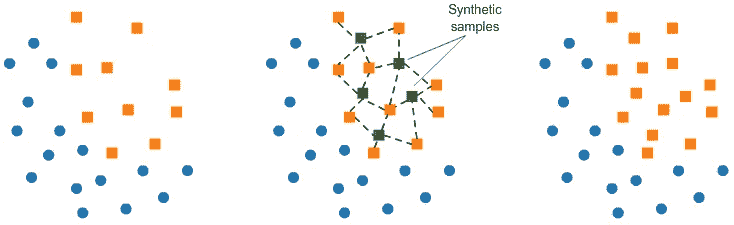
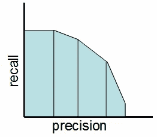

# 处理不平衡数据集的 5 种最有用的技术

> 原文：<https://towardsdatascience.com/the-5-most-useful-techniques-to-handle-imbalanced-datasets-6cdba096d55a?source=collection_archive---------8----------------------->


Image by [thatsphotography](https://pixabay.com/users/thatsphotography-3017066/?utm_source=link-attribution&utm_medium=referral&utm_campaign=image&utm_content=1562025) from [Pixabay](https://pixabay.com/?utm_source=link-attribution&utm_medium=referral&utm_campaign=image&utm_content=1562025)

## 如果您还没有遇到不平衡的数据集，您将会

您是否遇到过这样的问题:数据集中的正类样本如此之少，以至于模型无法学习？

***在这种情况下，你仅仅通过预测多数类就能获得相当高的准确度，但是你无法捕捉到少数类，这通常是首先创建模型的目的。***

这种数据集非常常见，被称为不平衡数据集。

> 不平衡数据集是分类问题的一种特殊情况，其中类之间的分布不均匀。通常，它们由两类组成:多数(消极)类和少数(积极)类

对于不同领域的不同用例，可能会发现不平衡的数据集:

*   **金融**:欺诈检测数据集的欺诈率通常约为 1–2%
*   **广告投放**:点击预测数据集也没有很高的点击率。
*   **交通** / **航空公司**:飞机会发生故障吗？
*   **医学**:患者是否有癌症？
*   **内容审核**:一个帖子包含 NSFW 内容吗？

那么我们如何解决这样的问题呢？

***这篇文章是关于解释你可以用来处理不平衡数据集的各种技术。***

# 1.随机欠采样和过采样


[Source](https://www.kaggle.com/rafjaa/resampling-strategies-for-imbalanced-datasets#t1)

一种被广泛采用并且可能是最直接的处理高度不平衡数据集的方法叫做重采样。它包括从多数类中移除样本(欠采样)和/或从少数类中添加更多样本(过采样)。

让我们首先创建一些不平衡数据的例子。

```
from sklearn.datasets import make_classificationX, y = make_classification(
    n_classes=2, class_sep=1.5, weights=[0.9, 0.1],
    n_informative=3, n_redundant=1, flip_y=0,
    n_features=20, n_clusters_per_class=1,
    n_samples=100, random_state=10
)X = pd.DataFrame(X)
X['target'] = y
```

我们现在可以使用以下工具进行随机过采样和欠采样:

```
num_0 = len(X[X['target']==0])
num_1 = len(X[X['target']==1])
print(num_0,num_1)# random undersampleundersampled_data = pd.concat([ X[X['target']==0].sample(num_1) , X[X['target']==1] ])
print(len(undersampled_data))# random oversampleoversampled_data = pd.concat([ X[X['target']==0] , X[X['target']==1].sample(num_0, replace=True) ])
print(len(oversampled_data))------------------------------------------------------------
OUTPUT:
90 10
20
180
```

# 2.使用不平衡学习的欠采样和过采样

不平衡学习(`imblearn`)是一个 Python 包，用来解决不平衡数据集的问题。

它提供了多种欠采样和过采样方法。

## a.使用 Tomek 链接的欠采样:

它提供的一种方法叫做 Tomek 链接。托梅克链是相邻的相反类的成对例子。

在该算法中，我们最终从 Tomek 链接中移除多数元素，这为分类器提供了更好的决策边界。


[Source](https://www.kaggle.com/rafjaa/resampling-strategies-for-imbalanced-datasets#t1)

```
from imblearn.under_sampling import TomekLinkstl = TomekLinks(return_indices=True, ratio='majority')X_tl, y_tl, id_tl = tl.fit_sample(X, y)
```

## b.使用 SMOTE 进行过采样:

在 SMOTE(合成少数过采样技术)中，我们在已经存在的元素附近合成少数类的元素。



[Source](https://www.kaggle.com/rafjaa/resampling-strategies-for-imbalanced-datasets#t1)

```
from imblearn.over_sampling import SMOTEsmote = SMOTE(ratio='minority')X_sm, y_sm = smote.fit_sample(X, y)
```

在`[imblearn](https://github.com/scikit-learn-contrib/imbalanced-learn#id3)`包中有各种各样的其他方法用于欠采样(聚类质心、近似缺失等)。)和过采样(ADASYN 和 bSMOTE)，您可以查看一下。

# 3.模型中的类权重


大多数机器学习模型都提供了一个叫做`class_weights`的参数。例如，在使用`class_weights`的随机森林分类器中，我们可以使用字典为少数类指定更高的权重。

```
from sklearn.linear_model import **LogisticRegression***clf =* **LogisticRegression**(***class_weight={0:1,1:10}***)
```

***但是后台到底发生了什么？***

在逻辑回归中，我们使用二元交叉熵计算每个示例的损失:

```
Loss = −*y*log(*p)* −(1−*y*)log(1−*p*)
```

在这种特殊的形式下，我们对积极的和消极的两类都给予同等的重视。当我们将 class_weight 设置为`class_weight = {0:1,1:20}`时，后台的分类器试图最小化:

```
NewLoss = −20**y*log(*p)* − *1**(1−*y*)log(1−*p*)
```

***那么这里到底发生了什么？***

*   如果我们的模型给出的概率为 0.3，并且我们错误地对一个正例进行了分类，则新损失的值为-20log(0.3) = 10.45
*   如果我们的模型给出的概率为 0.7，并且我们对一个负面的例子进行了错误分类，那么新的损失值将为-log(0.3) = 0.52

这意味着，在这种情况下，当我们的模型错误地分类了一个积极的少数群体的例子时，我们会惩罚它大约 20 倍以上。

如何计算 class_weights？

*没有一种方法可以做到这一点，这应该被构建为针对您的特定问题的超参数搜索问题。*

但是如果你想使用 y 变量的分布来获得 class_weights，你可以使用下面这个来自`sklearn`的实用程序。

```
**from** sklearn.utils.class_weight **import** compute_class_weightclass_weights = compute_class_weight('balanced', np.unique(y), y)
```

# 4.更改您的评估标准


每当我们处理不平衡的数据集时，选择正确的评估指标是非常重要的。一般来说，在这样的情况下，F1 的分数就是我想要的作为我的 [***评价指标的***](/the-5-classification-evaluation-metrics-you-must-know-aa97784ff226) 。

F1 分数是一个介于 0 和 1 之间的数字，是精确度和召回率的调和平均值。


***那么它有什么帮助呢？***

让我们从一个二元预测问题开始。我们正在预测一颗小行星是否会撞击地球。

因此，我们创建了一个模型，对整个训练集预测“否”。

***什么是准确度(通常是最常用的评估指标)？***

它超过了 99%,所以根据精确度，这个模型相当不错，但是毫无价值。

***现在 F1 的成绩是多少？***

我们这里的精度是 0。我们正课的回忆是什么？它是零。因此 F1 分数也是 0。

因此，我们知道准确率为 99%的分类器对我们的情况毫无价值。因此它解决了我们的问题。



Precision-Recall Tradeoff

简单来说， ***F1 分数在某种程度上维持了你的分类器*** 的精确度和召回率之间的平衡。如果你的准确率低，F1 就低，如果召回率再低，你的 F1 分数就低。

> 如果你是一名警督，你想抓罪犯，你想确定你抓的人是罪犯(精确)，你也想尽可能多地抓到罪犯(回忆)。F1 分数管理这种权衡。

## 怎么用？

您可以使用以下公式计算二元预测问题的 F1 分数:

```
**from** **sklearn.metrics** **import** f1_score
y_true = [0, 1, 1, 0, 1, 1]
y_pred = [0, 0, 1, 0, 0, 1]
***f1_score(y_true, y_pred)***
```

这是我的一个函数，我用它来获得最佳阈值，使二元预测的 F1 值最大化。below 函数遍历可能的阈值，以找到给出最佳 F1 分数的阈值。

```
# y_pred is an array of predictions
def bestThresshold(y_true,y_pred):
    best_thresh = None
    best_score = 0
    for thresh **in** np.arange(0.1, 0.501, 0.01):
        score = f1_score(y_true, np.array(y_pred)>thresh)
        if score > best_score:
            best_thresh = thresh
            best_score = score
    return best_score , best_thresh
```

# 5.多方面的


Try new things and explore new places

根据您的用例以及您试图解决的问题，各种其他方法也可能有效:

## a)收集更多数据

如果可以的话，这绝对是你应该尝试的事情。通过更多正面的例子获得更多的数据将有助于您的模型从更多样的角度来看待多数群体和少数群体。

## b)将问题视为异常检测

您可能希望将您的分类问题视为异常检测问题。

**异常检测**是对罕见项目、事件或观察结果的识别，这些项目、事件或观察结果通过与大多数数据的显著不同而引起怀疑

您可以使用隔离林或自动编码器进行异常检测。

## c)基于模型

有些模型特别适合不平衡的数据集。

例如，在 boosting 模型中，我们给在每次树迭代中被错误分类的案例更多的权重。

# 结论

在处理不平衡的数据集时，不存在放之四海而皆准的方法。你必须根据你的问题尝试多种方法。

在这篇文章中，我谈到了每当我面临这样的问题时，我脑海中通常会出现的怀疑。

一个建议是尝试使用以上所有的方法，看看哪个最适合你的用例。

如果你想[了解](/how-did-i-start-with-data-science-3f4de6b501b0?source=---------8------------------)更多关于不平衡数据集及其带来的问题，我想推荐吴恩达的这个 [***精品课程***](https://coursera.pxf.io/NKERRq) 。这是我开始的原因。一定要去看看。

谢谢你的阅读。将来我也会写更多初学者友好的帖子。在[](https://medium.com/@rahul_agarwal?source=post_page---------------------------)**关注我或者订阅我的 [**博客**](http://eepurl.com/dbQnuX?source=post_page---------------------------) 了解他们。一如既往，我欢迎反馈和建设性的批评，可以通过 Twitter [@mlwhiz](https://twitter.com/MLWhiz?source=post_page---------------------------) 联系。**

**此外，一个小小的免责声明——这篇文章中可能会有一些相关资源的附属链接，因为分享知识从来都不是一个坏主意。**