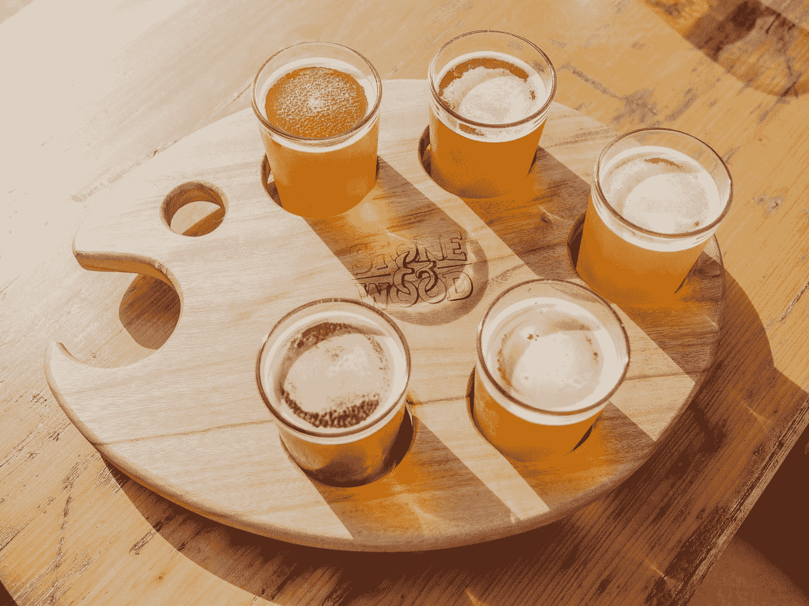

# 每个数据科学家都需要知道的 5 种采样算法

> 原文：<https://towardsdatascience.com/the-5-sampling-algorithms-every-data-scientist-need-to-know-43c7bc11d17c?source=collection_archive---------3----------------------->



## [DS 算法](https://towardsdatascience.com/tagged/ds-algorithms)

## 或者至少应该听说过

数据科学是对算法的研究。

我每天都在努力学习许多算法，所以我想列出一些最常见和最常用的算法，这些算法将会在这个新的 [DS 算法系列](https://towardsdatascience.com/tagged/ds-algorithms)中使用。

***这篇文章是关于在处理数据时可以使用的一些最常见的采样技术。***

# **简单随机抽样**

*假设您想要选择一个群体的子集，其中该子集的每个成员被选中的概率相等。*

下面我们从数据集中选择 100 个样本点。

```
sample_df = df.sample(100)
```

# **分层抽样**


假设我们需要估计选举中每个候选人的平均票数。假设这个国家有 3 个城镇:

A 镇有一百万工厂工人，

B 镇有 200 万工人

C 镇有 300 万退休人员。

我们可以选择在整个人口中随机抽取 60 个样本，但是随机样本有可能在这些城镇中不平衡，因此有偏差，导致估计中的重大误差。

相反，如果我们选择从城镇 A、B 和 C 分别随机抽取 10、20 和 30 个样本，那么对于相同的样本总量，我们可以产生较小的估计误差。

使用 Python 可以很容易地完成这样的事情:

```
from sklearn.model_selection import train_test_split
X_train, X_test, y_train, y_test = train_test_split(X, y,
                                                    stratify=y, 
                                                    test_size=0.25)
```

# **油藏取样**


我喜欢这个问题陈述:

***假设您有一个长度未知的大型项目流，我们只能迭代一次。***

***创建一个算法，从这个流中随机选择一个项目，这样每个项目都有同等的可能性被选中。***

我们如何做到这一点？

让我们假设我们必须从一个无限的流中抽取 5 个对象，这样每个元素被选中的概率是相等的。

```
import randomdef generator(max):
    number = 1
    while number < max:
        number += 1
        yield number# Create as stream generator
stream = generator(10000)# Doing Reservoir Sampling from the stream
k=5
reservoir = []
for i, element in enumerate(stream):
    if i+1<= k:
        reservoir.append(element)
    else:
        probability = k/(i+1)
        if random.random() < probability:
            # Select item in stream and remove one of the k items already selected
             reservoir[random.choice(range(0,k))] = elementprint(reservoir)
------------------------------------
[1369, 4108, 9986, 828, 5589]
```

可以从数学上证明，在样本中，每个元素从流中被选择的概率是相同的。

怎么会？

当涉及到数学时，想一个更小的问题总是有帮助的。

因此，让我们考虑一个只有 3 项的流，我们必须保留其中的 2 项。

我们看到第一项，我们把它放在列表中，因为我们的容器有空间。我们看到第二个项目，我们把它放在列表中，因为我们的容器有空间。

我们看到第三项。这就是事情变得有趣的地方。我们以 2/3 的概率选择列表中的第三个项目。

现在让我们看看第一项被选中的概率:

移除第一项的概率是元素 3 被选择的概率乘以元素 1 被从库中的 2 个元素中随机选择作为替换候选的概率。这个概率是:

`2/3*1/2 = 1/3`

因此 1 被选中的概率是:

`1–1/3 = 2/3`

对于第二个元素，我们可以有完全相同的论点，我们可以扩展到许多元素。

因此每个项目都有相同的概率被选中:`2/3`或者一般来说`k/n`

# 随机欠采样和过采样


[Source](https://www.kaggle.com/rafjaa/resampling-strategies-for-imbalanced-datasets#t1)

我们经常会遇到不平衡的数据集。

一种广泛采用的处理高度不平衡数据集的技术被称为重采样。它包括从多数类中移除样本(欠采样)和/或从少数类中添加更多样本(过采样)。

让我们首先创建一些不平衡数据的例子。

```
from sklearn.datasets import make_classificationX, y = make_classification(
    n_classes=2, class_sep=1.5, weights=[0.9, 0.1],
    n_informative=3, n_redundant=1, flip_y=0,
    n_features=20, n_clusters_per_class=1,
    n_samples=100, random_state=10
)X = pd.DataFrame(X)
X['target'] = y
```

我们现在可以使用以下工具进行随机过采样和欠采样:

```
num_0 = len(X[X['target']==0])
num_1 = len(X[X['target']==1])
print(num_0,num_1)# random undersampleundersampled_data = pd.concat([ X[X['target']==0].sample(num_1) , X[X['target']==1] ])
print(len(undersampled_data))# random oversampleoversampled_data = pd.concat([ X[X['target']==0] , X[X['target']==1].sample(num_0, replace=True) ])
print(len(oversampled_data))------------------------------------------------------------
OUTPUT:
90 10
20
180
```

# 使用不平衡学习的欠采样和过采样

不平衡学习(imblearn)是一个 Python 包，用来解决不平衡数据集的问题。

它提供了多种欠采样和过采样方法。

## a.使用 Tomek 链接的欠采样:

它提供的一种方法叫做 Tomek 链接。托梅克链是相邻的相反类的成对例子。

在该算法中，我们最终从 Tomek 链接中移除多数元素，这为分类器提供了更好的决策边界。


[Source](https://www.kaggle.com/rafjaa/resampling-strategies-for-imbalanced-datasets#t1)

```
from imblearn.under_sampling import TomekLinks

tl = TomekLinks(return_indices=True, ratio='majority')
X_tl, y_tl, id_tl = tl.fit_sample(X, y)
```

## b.使用 SMOTE 进行过采样:

在 SMOTE(合成少数过采样技术)中，我们在已经存在的元素附近合成少数类的元素。


[Source](https://www.kaggle.com/rafjaa/resampling-strategies-for-imbalanced-datasets#t1)

```
from imblearn.over_sampling import SMOTE

smote = SMOTE(ratio='minority')
X_sm, y_sm = smote.fit_sample(X, y)
```

在 [imblearn](https://github.com/scikit-learn-contrib/imbalanced-learn#id3) 包中有各种各样的其他方法用于欠采样(聚类质心、近似缺失等)。)和过采样(ADASYN 和 bSMOTE)，您可以查看一下。

# 结论

算法是数据科学的命脉。

***采样是数据科学中的一个重要话题，我们实际上并没有尽可能多地谈论它。***

一个好的抽样策略有时可以推动整个项目向前发展。糟糕的采样策略可能会给我们错误的结果。因此，在选择采样策略时应该小心谨慎。

所以，无论是在工作场所还是在酒吧，都要进行抽样调查。

如果你想了解更多关于数据科学的知识，我想调出吴恩达的这个 [***精品课程***](https://coursera.pxf.io/NKERRq) 。这是我开始的原因。一定要去看看。

谢谢你的阅读。将来我也会写更多初学者友好的帖子。在 [**中**](https://medium.com/@rahul_agarwal?source=post_page---------------------------) 跟踪我或订阅我的 [**博客**](https://mlwhiz.ck.page/a9b8bda70c) 了解他们。和往常一样，我欢迎反馈和建设性的批评，可以在推特[@ mlwish it](https://twitter.com/MLWhiz?source=post_page---------------------------)上找到。