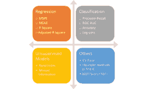
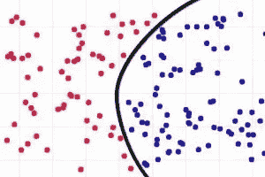
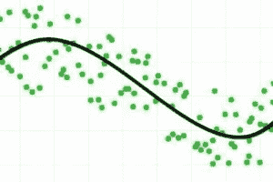

# 优化机器学习性能所需的 6 个指标

> 原文：<https://towardsdatascience.com/the-6-metrics-you-need-to-optimize-for-performance-in-machine-learning-d27761035bc3?source=collection_archive---------39----------------------->

有许多衡量模型性能的指标，这取决于你想要进行的机器学习的类型。在本文中，我们来看看分类和回归模型的性能度量，并讨论哪一个更好地优化。有时，要查看的指标会根据最初解决的问题而有所不同。

机器学习中的度量示例

# 分类问题的优化

分类图表示例

# 1.真阳性(回忆)

真实肯定率也称为召回率，是二进制/非二进制分类问题中的[最佳性能指标](/beyond-accuracy-precision-and-recall-3da06bea9f6c)。大多数情况下，我们只对正确预测一个类感兴趣。例如，如果你预测糖尿病，你会更关心预测这个人是否有糖尿病，而不是预测这个人没有糖尿病。在这种情况下，正类是“此人患有糖尿病”，负类是“此人没有糖尿病”。这仅仅是预测正类的准确性(**)这不是准确性性能度量。更多详情见下面的数字 4)**

# 2.ROC 曲线(受试者工作特性曲线)

ROC 曲线显示了您的分类模型在不同阈值(分类到某个类别的概率)下的性能。它绘制了真阳性率和假阳性率的对比图。降低阈值会增加你的真阳性率，但会牺牲你的假阳性率，反之亦然。

# 3.曲线下面积

AUC 也称为“ROC 曲线下面积”。简单地说，AUC 会告诉你正确分类的概率。更高的 AUC 代表更好的模型。

# 4.准确(性)

默认情况下，准确性是首先要考虑的。然而[一个真正的数据科学家知道准确性太容易误导人](/top-10-statistics-mistakes-made-by-data-scientists-2d58ccf12ab1)。更好的说法是预测所有类别的平均准确度。就像我提到的真阳性率，这是最理想的优化指标。准确度取真阳性和真阴性之和的平均值。大多数情况下，在不平衡的分类问题中，负类比正类更具代表性，所以你更有可能拥有非常高的真负率。准确性将偏向于可能没有人感兴趣的负类的准确预测。

# 机器学习中的回归优化

回归图示例

# 5.错误

误差通常被忽略在 R 旁边，它告诉我们更多关于回归直线拟合值的精度(即拟合值和最佳拟合直线之间的平均距离)。这在计算模型的置信度和预测区间时更为重要。由于使用了响应变量的自然单位，它更容易解释，而 R 没有单位，仅在 0 和 1 之间。

有不同类型的误差，如“平均绝对误差”和“均方根误差”每一种都有自己的优点和缺点，必须独立对待来评估一个模型。

# 6.R2

虽然标准误差很重要，但是 R 已经成为一个好的回归模型的事实上的度量。它告诉我们因变量和自变量之间的变化在多大程度上被模型所解释。较高的 R 给出了更好的模型，但是，如果接近 99%的过高 R 有时会导致过度拟合的风险。由于相关性和因果性的争论，r 可能会产生误导，从而给出不合逻辑的高 r。

# 用户的目标会影响模型的性能，所以要谨慎选择

在分类问题中，精确度并不总是最好的度量，R 也不一定是回归的最佳度量。它们都是最容易理解的，尤其是非技术的涉众(这可能是首先构建模型的最大原因)。最好的方法可能是考虑各种性能指标，并考虑您的初始目标。一个模型的性能总是受制于用户的目标。从一个人的角度来看，糟糕的表现可能不适合另一个人。

*原载于 2019 年 11 月 5 日*[*【https://blog.exxactcorp.com】*](https://blog.exxactcorp.com/the-6-metrics-to-optimize-performance-in-machine-learning/)*。*