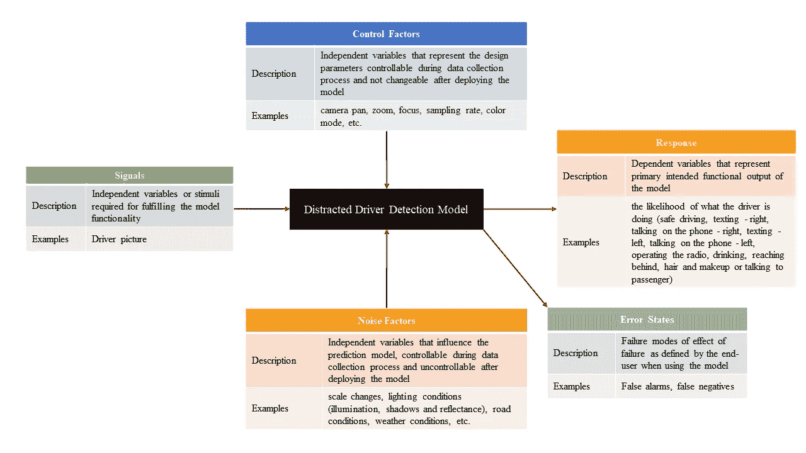

# 机器学习的 7 步程序

> 原文：<https://towardsdatascience.com/the-7-step-procedure-of-machine-learning-c15c922e7300?source=collection_archive---------13----------------------->

对于数据收集、机器学习(ML)模型开发、模型评估和模型部署，需要一个系统化的程序。图 1 示出了开发和部署数据驱动的机器学习模型的 7 步程序。

Fig. 1 7-steps ML Procedure | Credit: Alaa Khamis

这些步骤将在下面的小节中解释。

步骤 1:问题描述

创建成功的 ML 模型的第一步是理解手头的问题，描述它的特征，并从领域专家那里获得所有需要的知识，以帮助收集相关的数据和理解目标需求。需要理解问题的重要性及其具有挑战性的方面。不同的相关自变量和因变量需要由领域专家清楚地识别。自变量包括信号、控制因子和噪声因子，而因变量代表模型响应。信号是实现模型功能所需的刺激。例如，如图 2 的参数或 P 图所示，在基于视觉的分心驾驶员检测模型中，信号主要是由汽车中预先校准的摄像机拍摄的驾驶员照片。控制因素是可以在数据收集过程中和部署模型之后控制的设计参数。受控因素可以包括相机分辨率、摇摄、变焦、聚焦、采样率、颜色模式等。

Fig. 2 Visual Feature-based Distracted Driver Detection Model | Credit: Alaa Khamis

噪声因素影响设计，但仅在数据收集过程中可控，在部署模型后不可控。噪声因素可以包括但不限于比例变化、闪电条件(照明、阴影和反射)、道路条件、天气条件等。响应是模型的主要预期功能输出。在这个例子中，输出是驾驶员正在做的事情的可能性(安全驾驶、发短信—右、打电话—右、发短信—左、打电话—左、操作收音机、喝酒、伸手、头发和化妆或与乘客交谈)。最后，错误状态表示最终用户在使用预测模型时定义的故障模式或故障影响。在这种情况下，错误状态可能是假警报或假阴性。

步骤 2:数据收集

ML 模型开发周期的第二步是收集相关和全面的数据。没有给出所需数据量的神奇公式。这个量取决于许多因素，例如问题的复杂性和学习算法的复杂性，并且直接影响算法的可学习性和性能。应该结合不同的相关信号、控制因素和噪声因素。根据数据分析的类型，可以收集批量、近实时或实时数据。为了提高模型的稳健性，还强烈建议将敌对数据作为噪声因子。由于没有人有无限的资源和无限的时间来收集全面的数据，因此应该收集最相关的代表性数据。

第 3 步:数据准备—整理您的数据

数据准备是为模型开发准备数据的关键过程。该准备包括但不限于数据清理、标记数据、处理缺失数据、处理不一致数据、标准化、分段、数据平坦化、数据不平衡等。如果所选的 ML 方法不支持从数据进行表示学习，如在端到端学习方法的情况下，手工制作的区别特征也可以在该步骤中生成。特征提取是数据科学的黑色艺术。提取不同类别之间的区别特征或尽管同一类别的原始数据存在一些差异但保持不变的特征仍然是 ML 中未解决的问题。特征向量可以存储为 SQL/NOSQL 数据库，或者存储为本地或云服务器上的电子表格，以进一步用于模型训练、验证和测试。数据收集和准备是一个耗时的过程，约占基于 ML 的问题求解时间的 80%。

步骤 4:数据探索——更好地了解你的敌人

应进行单变量和多变量分析，以了解数据的可分性、线性和单调性。这些见解有助于选择正确的最大似然算法，因为根据机器学习中没有免费的午餐定理，不存在普遍优越的最大似然算法。统计机器学习算法在不同的下划线假设下工作，如数据是可分离的，或者数据具有特定的分布，或者数据是平衡的，或者数据之间没有空间和/或时间依赖性，等等。

第五步:建模——折磨你的数据，直到它承认

在建模步骤中，选择、训练、验证和测试 ML 模型。建立一个好模型的通常方法是尝试不同的算法并比较它们的性能。例如，理想的分类器能够很好地拟合历史数据(低偏差)，同时能够很好地推广到看不见的例子(低方差)。偏差-方差权衡分析有助于建立成功的 ML 模型。正如吴恩达在第三十届神经信息处理系统年会(NIPS 2016)上的讲话中所建议的，在建模期间应该分析四种类型的错误，即训练集错误、测试集错误、验证集错误和训练集错误。均方根误差(RMSE)可以说是用来评估预测模型性能的最重要的标准之一。RMSE 包括模型的可变性(精度)和它的偏差(准确性)。这两个分量可以与模型的精度(小方差)和准确度(小偏差)相关联。计算训练和测试期间的 RMSE，以便找出欠拟合或过拟合的发生。

第六步:评估——评估供词

应使用不同的定量和/或定性评估指标来证明训练模型的有效性。从广义上讲，评估指标可以分为与问题无关的指标和特定于问题的指标。前者的例子包括模型的实时性能、模型的内存占用、准确性、假阳性率、假阴性率、对数损失等。特定于问题的度量反映了解决问题的模型的质量。例如，在预测性维护系统中，常用的评估指标是故障时间(TTF)预测、剩余使用寿命(RUL)估计、设备的随机故障次数、设备的风险评分和磨损率。模型评估提供了量化的反馈来优化模型参数。可以手动优化参数，或者使用网格/随机搜索的自动调整，或者使用进化算法或强化学习算法，如 Google 最近提出的 autoML。

步骤 7:模型部署

一旦开发并优化了模型，就可以将其部署到系统/流程中。可以使用不同的方法来部署模型，例如针对 H2O 模型的 pickle 可序列化对象、本地语言、POJO(普通旧 Java 对象)或 MOJO(模型对象，优化)或使用 PMML(预测模型标记语言)。项目所有者应该参与评估模型的性能。部署模型的性能应该与基线或目标值进行比较，而不是与完美性进行比较。