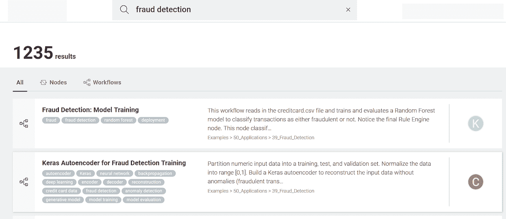
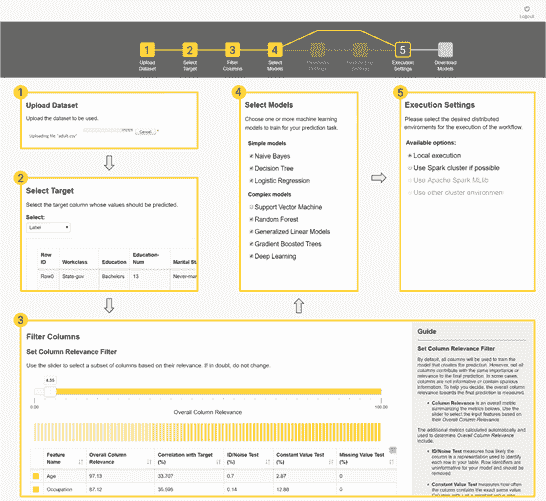

# 80/20 挑战:从经典到创新的数据科学项目

> 原文：<https://towardsdatascience.com/the-80-20-challenge-7b8bfb643947?source=collection_archive---------24----------------------->

有时当你和数据科学家交谈时，你会有这种感觉，好像你在和一个古老宗教的牧师交谈。晦涩的公式，复杂的算法，对初学者的俚语，最重要的是，需要一些新的脚本。如果你对所有的项目都有这种感觉，你可能和错误的数据科学家交谈。

**经典数据科学项目**

相对较大数量(我认为大约 80%)的数据科学项目实际上非常标准，一步一步地紧密遵循 [CRISP-DM](https://en.wikipedia.org/wiki/Cross-industry_standard_process_for_data_mining) 过程。这些就是我所说的经典项目。

**流失预测**

训练机器学习模型来预测客户流失是数据分析中最古老的任务之一。它已经在许多不同类型的数据上实现了很多次，而且它是[相对简单的](https://www.youtube.com/watch?v=RHsO10q7e2Y&feature=youtu.be)。

我们首先读取数据(一如既往)，然后是一些数据转换操作，由图 1 中的黄色节点处理。在提取用于训练的数据子集后，我们然后训练一个[机器学习模型](https://www.dataversity.net/automated-machine-learning-just-how-much/)，以将流失概率与每个客户描述相关联。在图 1 中，我们使用了决策树，但是当然，它可以是能够处理分类问题的任何机器学习模型。然后，在不同的数据子集上测试该模型，如果准确性指标令人满意，则将其存储在文件中。然后，将相同的模型应用于部署工作流中的生产数据(图 2)。

图 1:训练和评估决策树以预测客户流失概率

图 2:将之前训练好的决策树部署到生产性客户数据中

**需求预测**

需求预测是另一项经典任务，这次涉及时间序列分析技术。无论我们谈论的是客户、出租车还是千瓦，预测某个时间点的需求量是一项经常需要完成的任务。对此有许多经典的标准解决方案。

在需求预测问题的解决方案中，在读取和预处理数据之后，为每个数据样本创建过去 N 个值的向量。使用过去的 N 个值作为输入向量，训练机器学习模型以从过去的 N 个数值预测当前数值。在测试集上计算机器学习模型在数值预测上的误差，如果可接受，则将模型保存在文件中。

这种解决方案的一个例子如图 3 所示。这里，回归树的随机森林在出租车需求预测问题上被训练。它遵循的步骤与用于培训客户流失预测模型的工作流程非常相似(图 1)。唯一的区别是过去样本的向量、数值预测和在 Spark 平台上的完全执行。在部署工作流中，模型被读取并应用于纽约市过去 N 小时内使用的出租车数量，以预测特定时间所需的出租车数量(图 4)。

图 3:训练和评估回归树的随机森林，以根据时间序列中过去的 N 个数字来预测当前需要的出租车数量

图 4:将先前训练的随机回归树森林应用于过去 N 小时的出租车数量向量，以预测下一小时需要的出租车数量

大多数经典的数据科学项目都遵循类似的过程，要么使用监督算法解决分类问题，要么使用时间序列分析技术解决数值预测问题。根据应用领域的不同，这些经典项目占据了数据科学家工作的很大一部分。

**经典数据科学项目的自动化模型训练**

现在，如果我工作的项目中有很大一部分是如此经典和标准，我真的需要从头开始重新实现它们吗？我不应该。只要有可能，我应该依靠可用的示例，或者更好的是，蓝图工作流来启动我的新数据分析项目。例如，[工作流中心](https://hub.knime.com/)就是一个很好的来源。

假设我们被分配了一个关于欺诈检测的项目。那么，要做的第一件事就是去工作流中心搜索一个关于“欺诈检测”的例子搜索的前两个结果显示了解决这个问题的两种不同方法。第一种解决方案在覆盖两类的标记数据集上操作:合法交易和欺诈交易。第二种解决方案只在合法交易的数据集上训练一个[神经自动编码器](https://www.dataversity.net/fraud-detection-using-a-neural-autoencoder/)，随后在距离度量上应用一个阈值来识别可能的欺诈案例。

根据我们现有的数据，这两个例子中的一个将是最合适的。因此，我们可以下载它，并根据我们特定的数据和业务案例进行定制。这比从头开始一个新的工作流要容易得多。

图 5。搜索“欺诈检测”后，工作流中心的前两个结果

同样，如果这些应用程序如此经典，步骤总是相同的，难道我不能使用一个框架(总是相同的)来自动运行它们吗？这是可能的！对于最简单的数据分析解决方案尤其如此。有很多工具可以用来指导自动化。让我们再次搜索工作流中心。我们发现了一个名为“引导自动化”的工作流，这似乎是一个基于网络的自动化应用程序的蓝图，用于为简单的数据分析问题训练[机器学习模型](https://www.knime.com/blog/how-to-automate-machine-learning)。

实际上，这种“引导自动化”的蓝图工作流也包括少量的人工交互。虽然对于简单的标准问题，完全自动化的解决方案可能是可行的，但对于更复杂的问题，需要一些人工交互来引导解决方案朝着正确的方向发展。

图 6。引导式自动化解决方案中的网页序列:1。上传数据集 2。选择目标变量 3。过滤掉无信息列 4。选择要训练的机器学习模型 5。选择执行平台 6。显示精度和速度结果(此处未显示)

**更多创新数据科学项目**

现在谈谈数据科学家项目的剩余部分——根据我的经验，这大约占我所参与项目的 20%。虽然大多数数据分析项目都有些标准，但也有相对大量的新的、更具创新性的项目。那些通常是特殊的项目，既不是经典的也不是标准的，包括一项新任务的调查，一种新类型数据的探索，或者一种新技术的实现。对于这种项目，你通常需要开放地定义任务，了解最新的技术，并在提出的解决方案中具有创造性。有如此多的新材料，不可能在某个知识库中找到范例或蓝图。真的没有足够的历史来支持他们。

**创造性的机器学习**

我最近参与的一个项目旨在以某种特定的风格和语言生成自由文本。这个想法是使用机器学习来完成比通常的分类或预测问题更具创造性的任务。在这种情况下，我们的目标是为一个新的户外服装产品系列创造新的名字。传统上，这是一项营销任务，需要召开许多长时间的头脑风暴会议，以提出 10 个，也许 20 个可能的候选人名单。既然我们在谈论户外服装，我们决定这些名字应该让人联想到山。当时，我们不知道任何有针对性的解决方案。最接近的似乎是基于 LSTM 单位的自由文本生成神经网络。

我们收集了世界上所有山的名字。我们使用这些名字来训练一个基于 LSTM 的神经网络，以生成一个字符序列，其中下一个字符是基于当前字符预测的。结果是一个人造名字的列表，隐约让人想起真正的山，而且没有版权。事实上，人工生成保证了版权不受侵犯，对真实山脉名称的模糊回忆吸引了户外生活的爱好者。此外，有了这个神经网络，我们可以在几分钟内生成数百个这样的名字。我们只需要一个初始的任意字符来触发序列生成。

图 7。用于自由文本生成的具有 LSTM 单元隐藏层的神经网络

这个网络很容易扩展。如果我们将输入向量的序列从一个过去的字符扩展到许多过去的字符，我们可以生成比名字更复杂的文本。如果我们将训练集从山脉名称更改为说唱歌曲、莎士比亚悲剧或外语文本，网络将分别以说唱歌曲、[莎士比亚诗歌](https://www.knime.com/blog/use-deep-learning-to-write-like-shakespeare)或所选外语文本的形式生成免费文本。

**经典和创新的数据科学项目**

当您与数据科学家交谈时，请记住，并非所有的数据科学项目都是平等创建的。

一些数据科学项目需要标准和经典的解决方案。这种解决方案的例子和蓝图可以在许多免费的存储库中找到，例如 Workflow Hub。简单的解决方案甚至可以完全自动化，而更复杂的解决方案可以部分自动化，只需在需要的地方添加一些人工干预。

然而，数据科学家工作的一个较小但重要的部分是实施更具创新性的解决方案，需要大量的创造力和关于最新算法的最新知识。这些解决方案不能真正完全或者甚至部分自动化，因为问题是新的，并且在达到最终状态之前需要一些试运行。由于其新颖性，可能没有几个以前开发的解决方案可以用作蓝图。因此，最好的方法是从另一个应用领域重新采用类似的解决方案。

*所有图片来源于* [*KNIME*](https://www.knime.com/)

*如首次发表于*[*data versity*](https://www.dataversity.net/the-80-20-challenge-from-classic-to-innovative-data-science-projects/)*。*