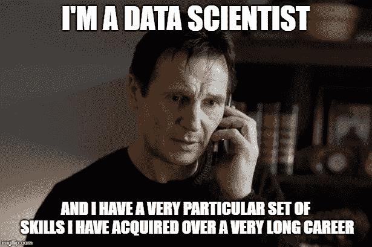

# 数据科学新手的绝对入门指南

> 原文：<https://towardsdatascience.com/the-absolute-beginners-guide-for-data-science-rookies-736e4fcbff0a?source=collection_archive---------7----------------------->

## 如何潜入数据海洋而不被淹没

Photo by [Kevin Fitzgerald](https://unsplash.com/@lespaulster11?utm_source=unsplash&utm_medium=referral&utm_content=creditCopyText) on [Unsplash](https://unsplash.com/s/photos/diving?utm_source=unsplash&utm_medium=referral&utm_content=creditCopyText)

因此，你可能在咖啡馆的随意交谈中听说过"*数据科学*"，或者在凌晨 3 点滚动你最喜欢的社交网络时看到的一篇文章中读到过"*数据驱动型公司*"，然后心想"这有什么大惊小怪的，嗯？!"。经过一些调查后，你最终会看到夸张的引用，如“ [*数据是新的石油*](https://www.economist.com/leaders/2017/05/06/the-worlds-most-valuable-resource-is-no-longer-oil-but-data) ”或“ [*人工智能是新的电力*](https://www.gsb.stanford.edu/insights/andrew-ng-why-ai-new-electricity) ”，并开始理解为什么[数据科学如此性感](https://hbr.org/2012/10/data-scientist-the-sexiest-job-of-the-21st-century)，现在学习它似乎是唯一合理的选择。

对你来说幸运的是，成为一名数据科学家不需要一个花哨的学位，你可以在家里舒适地学习任何东西。此外，21 世纪已经将在线学习确立为获取各种专业知识的可靠方式。最后，数据科学现在如此流行，以至于有无限的和不断增长的资源来学习它，这将玉米饼翻过来。拥有所有这些可能性，我应该选择哪一个？我的朋友，我希望我过去几个月的经历能帮助你消除疑虑。我们开始吧，好吗？

# 1.学什么？

数据科学家是这样一种球员，他可以从自己的球门开始比赛，运球越过几名防守队员，精确地传到点球点，然后在网内头球攻门，取得漂亮的进球。很抱歉提到足球，没办法，只是想想象一下你将如何掌握一套多样化的技能，这将使你在几乎任何与数据相关的问题上都非常有用。

现在，我将这些需求分为两种方法。首先，从技术角度来看，我们将回顾基础，这意味着数据科学以某种方式依赖的科学领域。其次，从一个更实际的角度来看，我将向您展示您应该关注哪些编程库，以便将您的手放在真正的数据项目上。

## 1.1 数据科学基础

*   **编程**💻 **:** 你的第一个任务将是选择是使用 [Python](https://www.python.org/) 还是 [R](https://www.r-project.org/) (我会给你留下一些帮助[这里](https://www.dataquest.io/blog/python-vs-r/)，这里[这里](https://www.datacamp.com/community/tutorials/r-or-python-for-data-analysis)和[这里](https://thenextweb.com/dd/2016/04/08/start-using-python-andor-r-data-science-one-best/))，然后埋头于编码。
*   **线性代数**📐 **:** 当您处理数据时，您会想知道如何将数据集表示为矩阵，并理解矢量化和正交性等概念。
*   **微积分**🔗 **:** 你将要编写和使用的许多模型将会使用诸如导数、积分和最优化等工具来计算并更快地找到问题的解决方案。
*   **概率**🎲 **:** 当你使用数据科学时，很多时候你会致力于预测未来的一些事情，所以你会想知道一些事情发生的可能性有多大，或者为什么两个事件是相关的。
*   **统计数据**📊为了描述你将要分析的信息，像平均值或百分位数这样的东西会派上用场，同时检验你的假设的测试也会出现。
*   **机器学习🤖:**也许是数据科学的核心，在你的项目中的某个时候，你会想要预测一些事情，这就是机器学习开始发挥作用的时候。

## 1.2 数据科学库

在自己编写了一段时间的代码后，您会发现每种编程语言都有一系列的包或库，它们提供了不同的函数和方法来更轻松地执行不同的任务。

在这里，您可以找到一个包含 Python 中最流行和最有用的数据科学库的表格，下面是一些简短的指南。如果你已经走了 R 的路，不要担心，我也会给你留下一篇非常好的文章，这里有一个类似 R 库的表。

Top Python Libraries for Data Science

开始做数据科学所需要的是入门套件，Numpy 提供了处理数据的基础，但是你可以更容易地处理熊猫。Scipy 提供了一些奇特的函数和方法来在 Numpy 框架之上执行高级计算，Matplotlib 将允许您可视化地绘制您的发现。最后，Scikit-learn 是机器学习的起点，它包含了应用所有经典回归、分类和聚类方法所需的一切。

另一方面，**深度学习**框架将帮助你建立人工神经网络来执行更复杂的机器学习任务，如图像识别。此外，还有其他的**数据可视化**选择，允许创建更加风格化和互动的情节，甚至在网络应用程序上。自然语言处理( **NLP** )是数据科学中非常受欢迎的领域，例如，它可以让 Alexa 或 Siri 理解你在说什么。当你寻找数据进行分析时，互联网是一个无限的来源，所以**网络搜集**工具可以方便地频繁收集和检索这些数据。最后但同样重要的是，Statsmodels(统计分析)和 XGBoost(梯度增强)将在一些更具体的任务中帮助你。

## 1.x 数据科学(不是这样的)加分项

到目前为止，我们已经讨论了使用数据，但是什么类型的数据呢？它可以是非常漂亮、干净和结构化的 csv 文件，也可以是包含数百万非结构化数据示例的庞大数据集，是的，伙计，我们已经不在堪萨斯了。

根据您最终的工作地点，您的公司可能会以不同的方式处理数据，但最肯定的是，他们将处理非常大的数据集，所以接下来的这两个工具是每个数据科学家的必备工具。

*   **数据库:**大公司把他们的数据储存在数据库里。为什么不是电子表格？嗯，基本上数据库是处理大块数据的合适方式，同时确保数据的完整性和安全性，并允许方便的查询和更新。现在，事情是有两种类型的数据库，关系数据库(SQL)和非关系数据库(NoSQL)，你可能想知道它们的区别(这篇[文章](https://www.xplenty.com/blog/the-sql-vs-nosql-difference/)可能会帮助你),并希望学会使用这两种数据库。
*   **大数据:**在处理大量数据时，你还必须考虑如何处理和提炼这些信息。当有数千行时，执行简单的任务可能只需要几秒钟，但当需要对数百万条记录运行高度复杂的模型时，可能需要几天。为此，您使用并行和分布式计算模型，以便在不同的内核或 CPU 中同时执行多个任务。两个最流行的框架是 [Hadoop MapReduce](https://hadoop.apache.org/) 和 [Spark](https://spark.apache.org/) (在这里阅读它们的区别)。

# 2.去哪里学？

## 2.1 训练营

训练营是学习数据科学最容易的选择，它们是几个模块的一体化捆绑包，为您提供数据分析所需的几乎所有知识。人们可能会争论这些主题所涵盖的深度，但事实是，他们擅长在数据相关的主题中提供良好的介绍和中级水平的专业知识，当你开始做自己的项目或工作时，更高级的水平肯定会到来，所以不要担心。

现在，似乎有许多选择，但最受欢迎和真正在线的两个训练营是 [Dataquest](https://www.dataquest.io/) 和 [Datacamp](https://www.datacamp.com/) ，这两个训练营引起了关于哪一个更好的激烈辩论，我个人认为这并不容易，但我会尝试展示它们的优缺点以及它们的主要差异，以便您可以更容易地做出选择。你也可以查看这个有趣的 Reddit [线程](https://www.reddit.com/r/datascience/comments/85mhrc/datacamp_vs_dataquest/)。

*   **Datacamp (DC) ⚙:** 成立于 2013 年，他们可以被称为数据科学训练营的创造者，在当今享有盛誉。他们从基于 R 的课程开始，但在过去几年中增加了 Python 内容。他们的课程是基于短视频，然后是问题和编程练习的混合，后者基本上包括完成已经存在的代码。除了编程练习之外，他们还提供了几个项目，在这些项目中，你可以运用你以前学过的多种能力。有几门课程是免费的，但要获取所有内容，你必须每月支付 29 美元。它还有一个基于 XP 的进度系统，可以帮助你保持节奏。
*   数据探索(DQ)🚀:在 Datacamp 成立两年后，他们可能不如第一家有名，但肯定一样好。与 DC 类似，他们从 Python 课程开始，但在途中增加了 R 课程。他们提供基于文本的课程，在这些课程中，在你学到每一点信息后，你都必须进行编码，以便将一切付诸实践，所以这是非常面向应用的。每个模块结束后，你必须在 Jupyter Notebook 中从头开始做一个现实生活中的项目(我们稍后会谈到这一点)，这样你就可以建立一个作品集来展示你的技能。Python 的第一个编码课程是完全免费的，但如果你想学习其中的一门课程，你就必须付费，Data Analyst 课程 29 美元，其他课程 49 美元。他们还指望一个活跃的 Slack 社区来解决你的疑惑或分享你的成就。

Data Science Bootcamps Comparison

总结一下。Datacamp 可能比 DQ 历史更悠久，提供的课程也更广泛，除了数据科学的核心知识之外，它还允许您深化其他学科。另一方面，Dataquest 更专注于通过高要求的练习和项目来建立一些强大的数据科学基础。

## 2.2 MOOCs

正如我在开头所说，在线学习正处于高峰期，越来越多的学生注册以扩展他们的知识，[全球超过 1 亿名学生，约有 11.4k 门课程可用](https://www.class-central.com/report/mooc-stats-2018/)，MOOCs 是王道。现在，魔力在哪里？他们提供自定进度的课程，通常可以免费旁听，课程内容广泛。如果你想学习，你可以每天花 1-2 个小时，并且尽可能地进步，因为教育从来不是每个人都能获得的。

下面你会发现一个非常简短的数据科学 MOOC 平台排名前四(imo)的对比图。如果你想更深入地了解它们之间的差异和利弊，我推荐你阅读这篇[的帖子](https://www.reviews.com/mooc-platforms/)，他们从几个方面对它们进行了非常详细的分析比较。稍后，我还会根据您的需求更详细地解释哪个平台更适合您。

MOOC Platforms Comparison

*   Coursera:mooc 的大老板，由吴恩达和达芙妮·柯勒创立，与顶尖大学和公司合作，很难不成为绝对的热门。课程包括测验和作业，而专业也有顶点项目，以评估你的进展。Coursera 提供两种主要模式:**课程**，免费审核，但一次性收费提供证书；和**专业**，这是一套相互关联的课程，你可以免费试用 7 天，然后每月支付费用(～50 美元)，直到你完成它，获得证书。**选择如果:**你对自己想学的东西足够清楚，可以亲自挑选课程，课程种类繁多，理论与应用平衡良好。
*   Udacity: 最初由斯坦福大学提供的一些免费计算机科学课程，现在是最受尊敬的 MOOC 平台之一，具有明确的技术相关内容导向，是与谷歌或亚马逊等真正顶尖的公司合作开发的。Udacity 拥有几门关于精确主题的免费课程，但他们的专长是他们的**nano degrees**，这是一套涵盖某一领域所有必要技能的课程(例如数据分析师)。**选择如果:**你想要以工作为导向的课程，旨在培养你从事数据职位所需的一切，并且不太在乎价格。
*   **EdX:**2012 年，麻省理工学院和哈佛大学共同创建了 MOOC 提供商。虽然只在 Coursera 之后一个月推出，但两者基本上分享了相同的教育课程和学习方法，有一个精心制作的平台和一个活跃的社区。他们的认证体系也非常相似，他们的**认证**课程与 Coursera 的课程相同，他们的**项目**相当于 Coursera 的专业。**选择如果:**你在 Coursera 上没有找到你要找的东西，虽然课程同样不错，但它们的种类较少，而且课程是一次性收费的，所以根据你的进度，它们会稍微贵一点。
*   Udemy: 与我们之前提到的其他三个相比，这是一个怪人，尽管 Udemy 提供的课程数以万计，但它们都是由私人提供的，每个人都可以成为教练！这表明他们的证书没有得到任何大学、公司或组织的支持。所有这一切意味着内容更容易创建，但优质课程可能更难找到，但你仍然可以找到一些非常好的东西。它们的价格可以涨到每道 200 美元，但你可以发现它们几乎总是以 10-15 美元的价格出售，所以不要绝望，等待它。**选择如果:**你只是对学习内容感兴趣，不太在乎证书，并且正在寻找负担得起的选择。

Top Data Science and Machine Learning Courses

当然，这些是我个人的选择，虽然大多数人会同意几乎所有的选择，但我鼓励你有其他的观点并进行更多的研究，中央课堂的这个[帖子](https://www.class-central.com/report/best-data-science-curriculum/)是一个很好的开始。

## 2.3 书籍

好的旧书！虽然它们实际上永远不会变老，但如果你明智地选择，它们可以成为支持你学习的非常有价值的资源。就数据科学书籍而言，它们通常有两种“格式”:普通理论或面向代码，尽管有时你也会发现两者的混合。此外，在这一点上，你应该已经知道什么编程语言更适合你，因为书籍的作者已经下定决心，书籍将只使用一种语言编写。

# 3.下一步是什么？

我们已经走了很长一段路，了解了成为一名数据科学家需要学习的内容和地点，但是您现在做什么呢？我将向您展示如何以正确的方式将您的技能付诸实践，以便您能够适应数据科学社区。

*   Jupyter📓:科学世界有点乱，大量的数学、图表和代码看起来像是你在做一些真正前卫的东西，但如果你不能清楚地展示出来，那它就一文不值。这就是为什么令人敬畏的 Jupyter 笔记本出现来帮助你，它们允许运行你的代码，绘制惊人的交互图，导入任何类型的数据，编写美丽的方程，并通过在一个精心展示的笔记本上降价来适当地评论一切，这样你就可以展示你的工作，而不是一个绝对无法辨认的混乱。[在这里](https://nbviewer.jupyter.org/github/rhiever/Data-Analysis-and-Machine-Learning-Projects/blob/master/example-data-science-notebook/Example%20Machine%20Learning%20Notebook.ipynb)你可以看到一个 Jupyter 笔记本的例子来理解我所说的。
*   **Kaggle🏆:**竞争数据科学可能听起来像大联盟，但 ka ggle(2017 年被谷歌收购)是一个非常棒的数据科学平台和社区，允许公司和组织创建竞赛(有时这是他们实际上想要解决的问题)，每个人都可以参与，甚至赢得丰厚的奖品，并通过显示迄今为止最佳结果的实时排名来计数。此外，它需要大量的学习材料来帮助您入门，还有一个包含各种类型和不同用途的数据集的巨大存储库，所以基本上您已经拥有了开始从事实际项目所需的一切！
*   **GitHub🐱:**在软件开发领域，一个叫做 Git 的东西被创造出来，这是一个版本控制软件，它基本上帮助跟踪一个多人工作的项目中的变化。在 GitHub 出现后，一个基于网络的版本控制托管服务，用非常简单的话来说，它有助于保持云上项目的组织和记录。在 GitHub 中，你会发现各种各样令人敬畏的回购，你可以[分叉](https://help.github.com/en/articles/about-forks)并为你的个人项目修改它们，但最重要的是，GitHub 将帮助你保持一个有组织的投资组合，供你在找工作时展示你的工作。
*   ❓: 编码之路并非一帆风顺，事实上处理所有的错误和调试数百行代码会变得非常烦人，但作为人类本性的一部分，我们已经从错误中吸取了教训，学会了如何不被同样的石头绊倒。Stackoverflow 是一个 Q &社区，由来自世界各地的开发人员组成，它允许您通过线程找到编程中常见(和不常见)问题的解释，每个人都可以轻松地提问和回答。当你绝望地在 Google 中使用 Ctrl+C/Ctrl+时，请记住这一点，它将把你重定向到 Stackoverflow 中你辉煌的答案，就像魔法一样。

Stackoverflow saving the day

# 一些最后的想法

我坚信一个好的专业人士总是在学习，在一个像我们这样充满活力的世界里，你很快就会被淘汰，这就是学习的力量所在，能够跟上时代并重塑自己不仅会帮助你成长为一名专业人士，还会帮助你成长为一个人。

最后，学习是一个非常个人化的过程，没有一个神奇的公式适用于所有人，尽管在这篇文章中，我试图以建议的形式给出多种选择，但最终决定权在你，只要确保你享受这一过程🏄

**2019 年 3 月更新。**