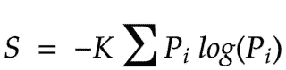
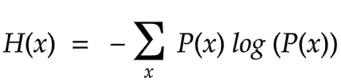

# 熵的丰富

> 原文：<https://towardsdatascience.com/the-abundance-of-entropies-6cd613139c82?source=collection_archive---------21----------------------->

## 理解熵的不同类型。

我曾经在不恰当的时候谈论信息论和香农，一般来说，你会发现我在随机的社交活动中脱口而出关于香农的信息。

我不应该说双关语，我显然不擅长！

# 信息信息无处不在！

> 有些人认为，通过研究另一天的科学发现，我们可以学会如何做出发现。另一方面，一位圣人观察到我们从历史中学不到任何东西，除了我们从历史中学不到任何东西，亨利·福特断言历史是一派胡言。
> 
> *-约翰·R·皮尔斯，* [*信息论导论*](https://www.amazon.com/Introduction-Information-Theory-Symbols-Mathematics/dp/0486240614)

约翰·R·皮尔斯的《信息论导论》这本书很美。它并没有很高的技术性，事实上，它是我爱上的一个数学理论的令人耳目一新的写照。

他认为，许多强大的科学发现不是通过对自然现象的研究产生的，而是通过对人造设备中的现象的研究产生的。

*熵*。在任何与信息论相关的课程中，你都会经常听到这个神秘的词。事实上，如果你从事过机器学习，你一定非常熟悉交叉熵这个术语！！
尽管如此，我们一定都在某个时候疑惑过— *熵不是在热力学中使用的吗？*

## 通信中使用的熵不同于统计力学或热力学中使用的熵。他们正在处理的问题完全不同。

# 热力学中的熵

[鲁道夫·克劳修斯](https://en.wikipedia.org/wiki/Rudolf_Clausius)在 19 世纪 50 年代为热力学定义了熵。气体的熵取决于它的温度、体积和质量。熵是可逆性的指标，即当熵没有变化时，过程是可逆的。

Boltzmann’s formula for entropy of gas.

不可逆的物理现象总是涉及熵的增加。有趣的是，这最初是由路德维希·玻尔兹曼在 1872 年到 1875 年间提出的！玻尔兹曼公式是热力学[熵](https://en.wikipedia.org/wiki/Entropy_(statistical_thermodynamics))最概括的公式。

> 因此，熵的增加意味着我们将热能转化为机械能的能力下降。熵的增加意味着可用能量的减少。
> 
> ——约翰·R·皮尔斯，[信息论导论](https://www.amazon.com/Introduction-Information-Theory-Symbols-Mathematics/dp/0486240614)

# 统计力学中的熵

> *虽然热力学给了我们熵的概念，但它并没有给出熵的详细物理图像，例如在分子的位置和速度方面。统计力学在特殊情况下确实给出了熵的详细的力学含义。*
> 
> ——约翰·R·皮尔斯，[信息论导论](https://www.amazon.com/Introduction-Information-Theory-Symbols-Mathematics/dp/0486240614)

在这里，我们认识到熵的增加意味着有序性的降低或不确定性的增加。

where K is Boltzmann’s constant and Pi is the probability of being occupied.

# 传播理论中的熵

传播理论或者当时叫什么信息论:

*   信息来源:作家，演讲者任何能产生信息的东西
*   消息:数据，如文本文档或你想发送给某人的东西。

随着关于实际将产生什么消息的不确定性变得越来越大，消息所传达的信息量也在增加。我们来看看。你有两个朋友。一个人(A 人)不停地给你发迷因，另一个人是一个普通人(B 人)，他有广泛的话题可聊。当你在手机上听到一声哔哔声，如果是 A 发来的，不确定性会减少，因为你知道信息的熵会减少。类似地，人 B 可以给你发送任何东西，因此你不知道信息会是关于什么的，不确定性是越来越高的熵。

如果是人 A，你已经认为它是一个迷因，当你打开它发现它是一个迷因。这是可以预见的，你打开它会得到一些信息。另一方面，打开不可预测的来自 B 的信息会给你更多的信息。

我们也可以看看刽子手的例子。如果你能猜出名字中比“of”或“the”更罕见的词，你会更了解这是哪部电影/书。

因此，高熵意味着更多的信息

或者

注意到它们在数学上是多么的相似了吗？

# 交叉熵

在机器学习中，交叉熵通常被用作损失函数。它是给定随机变量的两个概率分布之间的差值。

> ***交叉熵*** *:代表事件的平均总位数，来自 Q 而不是 p*
> 
> *Ref:*[*https://machinelingmastery . com/cross-entropy-for-machine-learning/*](https://machinelearningmastery.com/cross-entropy-for-machine-learning/)

所以当我们用交叉熵作为损失函数时

> *期望概率(y):数据集中一个例子的每个类标签的已知概率(P)。
> 预测概率(yhat):由模型(Q)预测的每一类标签实例的概率。*
> 
> *因此，我们可以使用上述交叉熵计算来估计单个预测的交叉熵；*
> 
> *其中* X *中的每个* x *是可以分配给该示例的类标签，并且* P(x) *对于已知标签将是 1，对于所有其他标签将是 0。*
> 
> *Ref:*[*https://machinelingmastery . com/cross-entropy-for-machine-learning/*](https://machinelearningmastery.com/cross-entropy-for-machine-learning/)

# 将信息与知识联系起来

文字，人类不断玩弄文字。当信息与知识联系在一起时，就会出现一些问题。我们不顾一切地把这个和统计力学联系起来！通信理论起源于电子通信，而不是统计力学。

# 外卖？

*   尽管有些人可能认为研究科学发现的历史是多余的，但科学发现是通过观察人造设备中的现象而发生的
*   通信中使用的熵之所以这么叫是因为数学类比，它与统计力学或热力学中定义的熵有很大不同。事实上，他们试图解决不同的问题。当热力学熵试图处理一个过程的可逆性时，它的统计力学对等物是根据分子的位置和速度来处理熵。通信中的熵是关于信息的，更多的熵，更多的信息
*   这里的信息与你传统的知识关联略有不同

*原载于 2019 年 11 月 8 日 https://megstalks.com**的*[T22。](https://megstalks.com/2019/11/08/origins-of-information-theory-abundance-of-entropies/)