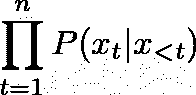

# 新 GPT 协议的可及性——文本生成和微调

> 原文：<https://towardsdatascience.com/the-accessibility-of-gpt-2-text-generation-and-fine-tuning-6a710f0fbbb0?source=collection_archive---------26----------------------->

## 使用正确的工具，使用 GPT-2 生成文本相当容易。了解如何做到这一点，以及如何在您自己的数据集上微调模型。


自然语言生成(NLG)是 NLP 社区中研究得很好的主题。随着深度学习方法的兴起，NLG 变得越来越好。最近，OpenAI 已经突破了极限，发布了[GPT-2](https://openai.com/blog/better-language-models)——一种基于[变形金刚](https://arxiv.org/abs/1706.03762)的模型，可以预测每个时间空间的下一个[令牌](https://arxiv.org/abs/1508.07909)。

如今，使用这些模型非常容易——您不需要自己实现代码，也不需要使用昂贵的资源来训练模型。例如，HuggingFace 已经[发布了一个 API](https://huggingface.co/transformers) ，它简化了对 OpenAI 发布的预训练 GPT-2 的访问。它的一些功能包括生成文本，以及在您自己的数据集上微调模型-转移已学习的分布，以便模型将从新域生成文本。

做所有这些都很容易——只需要安装相关的包并启动一个 python 脚本。然而，为了避免麻烦，你可以使用一个可用的平台，比如[Spell](https://spell.run)——你只需要指定你想要运行的，Spell 会处理剩下的事情(下载代码，安装软件包，分配计算资源，管理结果)。

虽然我不是一个拼写倡导者(我甚至没有尝试过该平台的其他功能，或者根本没有尝试过其他平台)，但我决定写一个教程，详细介绍我刚才描述的过程。要了解更多，你可以在这里找到教程。

如果你也喜欢玩机器生成的文本，请随意留下你得到的有趣文本的评论。:)

**更新:**上述链接中似乎不再提供该教程。虽然有点过时(HuggingFace API 从那以后改了很多)，下面是全文:

自然语言生成(NLG)是 NLP 社区中研究得很好的主题。解决文本生成挑战的一种方法是将记号序列(例如，单词或编码*P(x _ 1，…，x_n)* 的[字节对)的概率因式分解为得到每个记号 *x_1 【T5，…， *x_n* 的概率的乘积，这些记号以其前面的记号为条件:*](https://arxiv.org/abs/1508.07909)



给定一个训练数据集，可以训练这样一个模型，以最大化每个时间步下一个令牌的概率。一旦模型经过训练，您就可以通过从分布中一次抽取一个令牌来生成文本。轻而易举。

随着深度学习方法的兴起，NLG 变得越来越好。最近，随着 [GPT-2](https://openai.com/blog/better-language-models) 的发布，OpenAI 已经突破了极限。该模型使用众所周知的[变压器架构](https://arxiv.org/abs/1706.03762):为了计算下一个令牌上的分布，该模型使用自关注机制同时使用先前的令牌。

最近，HuggingFace 发布了一个 API 来简化对 GPT-2 的访问。它的一个功能是使用预先训练好的模型生成文本:

```
spell run — github-url [https://github.com/huggingface/transformers.git](https://github.com/huggingface/transformers.git) \
 — pip tqdm \
 — pip boto3 \
 — pip requests \
 — pip regex \
 — pip sacremoses \
“python examples/run_generation.py \
   — model_type=gpt2 \
   — length=70 \
   — prompt=’ ‘ \
   — model_name_or_path=gpt2"
```

以下是输出结果:

```
💫 Casting spell #1…
✨ Stop viewing logs with ^C
✨ Machine_Requested… done
✨ Building… done
✨ Run is running
…
…
…
$5.30-$10.00FREE SHIPPING
Items without a shipping address will be delivered to your confirmation email when you purchase your product.Use “POOL” when ordering; deliveries to POOL addresses are completely separate from shipping.<|endoftext|>Earth’s spin to new low the closer Earth takes to the Sun’s
✨ Saving… done
✨ Pushing… done
🎉 Total run time: 1m7.057677s
🎉 Run 1 complete
```

那很容易！OpenAI 使用了网络上找到的各种数据来训练模型，因此生成的文本几乎可以是任何自然的文本。但是，如果我们想要生成一种特定的文本，而不是多样性，会怎么样呢？让我们试着创造笑话吧！为此，我们必须使用笑话数据集来训练模型。不幸的是，获得这样一个数据集会非常困难！为了训练 GPT-2，它有 1.24 亿个重量需要学习(这仅仅是架构的缩小版)，我们需要大量的数据！但是我们怎么会有那么多笑话呢？简短的回答是:我们不会。

学习生成笑话包括学习如何生成看起来自然的文本，以及确保这些文本是有趣的。第一部分是大部分学习发生的地方。使用预训练版本的 GPT-2 作为起点，该模型不必从头开始学习如何生成看起来自然的文本。它所要学习的就是把注意力集中在有趣的文本上。一个相对较小的数据集就可以完成这项任务。

不要误解我，我们将使用的数据集不够大，不足以有意义地学习任何有用的东西。此外，训练一个模型来概括幽默的概念是一个难题。然而，为了这篇文章的目的——学习如何使用和微调 GPT-2 这样的模型——这就够了:我们将见证数据集如何将模型的分布转向在某种程度上看起来像笑话的文本。

我们将使用来自[短笑话数据集](https://raw.githubusercontent.com/amoudgl/short-jokes-dataset/master/data/onelinefun.csv)的一行笑话来微调 GPT-2。比一般的笑话要短，模特会更容易了解它们的分布。所以首先，让我们得到数据:

```
spell run “wget -O data.csv [https://raw.githubusercontent.com/amoudgl/short-jokes-dataset/master/data/onelinefun.csv](https://raw.githubusercontent.com/amoudgl/short-jokes-dataset/master/data/onelinefun.csv) && python -c \”import csv; f_in = open(‘data.csv’, ‘r’); f_out = open(‘data.txt’, ‘w’); f_out.write(‘\n’.join(row[‘Joke’] for row in csv.DictReader(f_in)))\””
```

输出是:

```
💫 Casting spell #2…
✨ Stop viewing logs with ^C
✨ Building… done
✨ Machine_Requested… done
✨ Run is running
 — 2019–11–09 21:36:14 —  [https://raw.githubusercontent.com/amoudgl/short-jokes-dataset/master/data/onelinefun.csv](https://raw.githubusercontent.com/amoudgl/short-jokes-dataset/master/data/onelinefun.csv)
Resolving raw.githubusercontent.com (raw.githubusercontent.com)… 151.101.0.133, 151.101.64.133, 151.101.128.133, …
Connecting to raw.githubusercontent.com (raw.githubusercontent.com)|151.101.0.133|:443… connected.
HTTP request sent, awaiting response… 200 OK
Length: 253462 (248K) [text/plain]
Saving to: ‘data.csv’ 0K ………. ………. ………. ………. ………. 20% 3.34M 0s
  50K ………. ………. ………. ………. ………. 40% 6.72M 0s
  100K ………. ………. ………. ………. ………. 60% 167M 0s
  150K ………. ………. ………. ………. ………. 80% 122M 0s
  200K ………. ………. ………. ………. ……. 100% 6.55M=0.03s2019–11–09 21:36:14 (8.14 MB/s) — ‘data.csv’ saved [253462/253462]✨ Saving… done
✨ Pushing… done
🎉 Total run time: 13.07418s
🎉 Run 2 complete
```

HuggingFace 已经为我们提供了微调 GPT-2 的脚本:

```
spell run — github-url [https://github.com/huggingface/transformers.git](https://github.com/huggingface/transformers.git) \
 — pip tqdm \
 — pip boto3 \
 — pip requests \
 — pip regex \
 — pip sacremoses \
-m runs/2/data.txt \
“python examples/run_lm_finetuning.py \
   — output_dir=output \
   — model_type=gpt2 \
   — model_name_or_path=gpt2 \
   — per_gpu_train_batch_size=2 \
   — num_train_epochs=10 \
   — do_train \
   — train_data_file=data.txt”
```

输出是:

```
💫 Casting spell #3…
✨ Stop viewing logs with ^C
✨ Machine_Requested… done
✨ Building… done
✨ Mounting… done
✨ Run is running…
…
…🎉 Total run time: 44h36m34.553059s
🎉 Run 3 complete
```

请注意，使用`-m`标志来安装前一次运行中下载的数据。

即使我们使用了一个小数据集(3K 的例子)，在一个 CPU 上运行 10 个历元也需要大约 44 小时。只能说明模型有多大。这就是为什么如果您想要使用更大的数据集或运行许多实验(例如，调整 hyper 参数)，您应该使用 GPU。

在获得上一次运行的结果后，让我们试着创造一个笑话:

```
spell run — github-url [https://github.com/huggingface/transformers.git](https://github.com/huggingface/transformers.git) \
 — pip tqdm \
 — pip boto3 \
 — pip requests \
 — pip regex \
 — pip sacremoses \
-m runs/3/output \
“python examples/run_generation.py \
   — model_type=gpt2 \
   — length=70 \
   — prompt=’ ‘ \
   — model_name_or_path=output”
```

输出是:

```
💫 Casting spell #4…
✨ Stop viewing logs with ^C
✨ Machine_Requested… done
✨ Building… done
✨ Run is running…
…
…“I’ve got seven fingers! But I don’t have those!”
Your childhood might be difficult, but at least it doesn’t taste like your grandfather’s.
Funny things never happen, in life.
Friends, We’ve met on the beach. What’s wrong with you?
If I’m speaking honestly, I could use some✨ Saving… done
✨ Pushing… done
🎉 Total run time: 51.047054s
🎉 Run 4 complete
```

该模型已经学会生成短句，这对于我们的数据集来说是典型的。这个相对容易掌握的数据统计学得很好！关于这个模型有多有趣——好吧……我让你来判断！


Photo by [Gratisography](https://www.pexels.com/@gratisography?utm_content=attributionCopyText&utm_medium=referral&utm_source=pexels) from [Pexels](https://www.pexels.com/photo/man-person-people-emotions-1990/?utm_content=attributionCopyText&utm_medium=referral&utm_source=pexels)

*这个帖子最初是我在 www.anotherdatum.com**的* [*发布的。*](http://anotherdatum.com/)