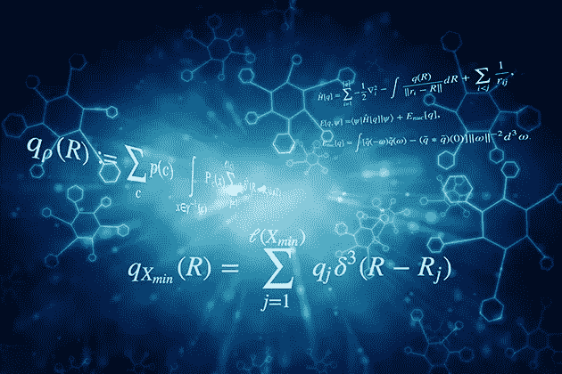
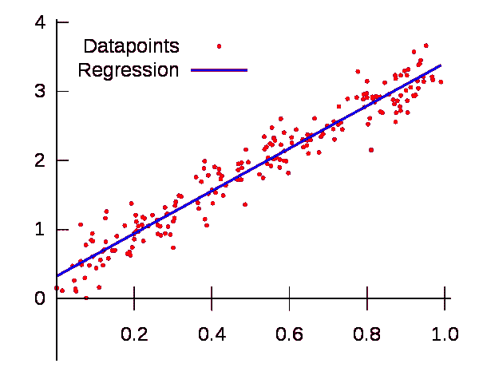
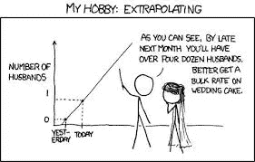
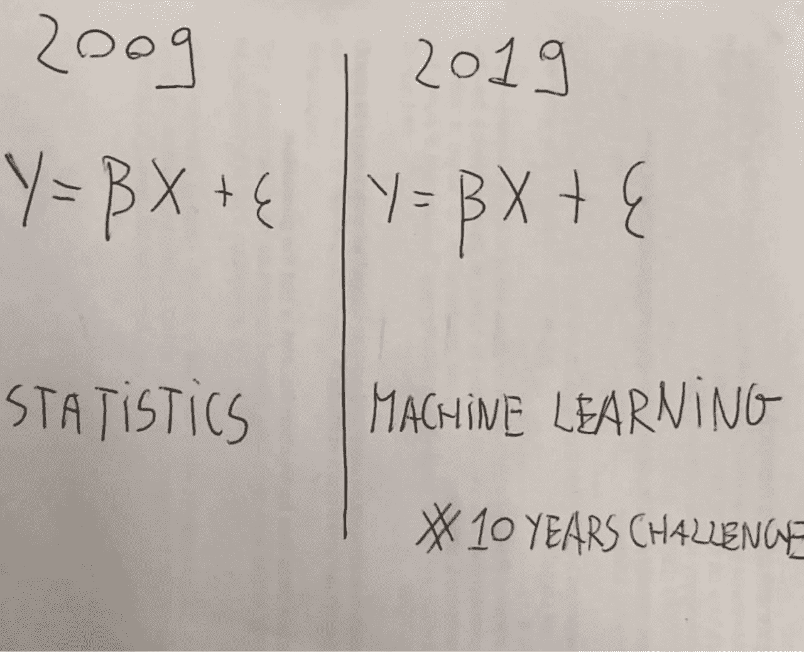

# 统计学和机器学习的实际区别

> 原文：<https://towardsdatascience.com/the-actual-difference-between-statistics-and-machine-learning-64b49f07ea3?source=collection_archive---------0----------------------->

## 不，它们不一样。如果机器学习只是美化了的统计学，那么建筑学只是美化了的沙堡建造。

老实说，我厌倦了在社交媒体上和我的大学里几乎每天都听到这样的辩论。通常，这伴随着一些含糊的陈述来解释问题。这样做双方都有罪。我希望在这篇文章结束时，你会对这些有些模糊的术语有一个更加了解的立场。

**论据**

与普遍的看法相反，机器学习已经存在了几十年。由于其巨大的计算需求和当时存在的计算能力的限制，它最初被避开。然而，由于信息爆炸产生的数据优势，机器学习近年来出现了复兴。

那么，如果机器学习和统计学是彼此的同义词，为什么我们没有看到每所大学的每一个统计系关闭或转变为“机器学习”系？因为他们不一样！

关于这个话题，我经常听到一些模糊的说法，最常见的是这样的说法:

*“机器学习和统计学的主要区别在于它们的目的。机器学习模型旨在尽可能做出最准确的预测。统计模型是为推断变量之间的关系而设计的。”*

虽然这在技术上是正确的，但它并没有给出一个特别明确或令人满意的答案。机器学习和统计学的一个主要区别确实是它们的目的。然而，说机器学习都是关于准确的预测，而统计模型是为推理而设计的，这几乎是一种毫无意义的说法，除非你精通这些概念。

首先，我们必须明白，统计和统计模型是不一样的。统计学是对数据的数学研究。除非你有数据，否则你无法做统计。统计模型是一种数据模型，用于推断数据中的关系，或者创建能够预测未来值的模型。通常，这两者是相辅相成的。

所以实际上有两件事我们需要讨论:第一，统计学和机器学习有什么不同，第二，统计模型和机器学习有什么不同。

说得更明白一点，有很多统计模型可以做出预测，但预测的准确性不是它们的强项。

同样，机器学习模型提供了不同程度的可解释性，从高度可解释性的[拉索回归](https://healthcare.ai/behind-scenes-lasso/)到难以理解的[神经网络](https://healthcare.ai/understanding-neural-network-making-pizza/)，但它们通常为了预测能力而牺牲可解释性。

从高层的角度来看，这是一个很好的答案。对大多数人来说已经足够好了。然而，有些情况下，这种解释让我们对机器学习和统计建模之间的差异产生了误解。让我们看看线性回归的例子。

**统计模型 vs 机器学习—线性回归示例**

在我看来，统计建模和机器学习中使用的方法的相似性导致人们假设它们是同一件事。这是可以理解的，但事实并非如此。

最明显的例子是线性回归，这可能是这种误解的主要原因。线性回归是一种统计方法，我们可以训练一个线性回归器，并获得与旨在最小化数据点之间的平方误差的统计回归模型相同的结果。

我们看到，在一种情况下，我们做了一些称为“训练”模型的事情，这涉及到使用我们数据的子集，我们不知道模型的表现如何，直到我们在训练期间不存在的额外数据(称为测试集)上“测试”这些数据。在这种情况下，机器学习的目的是在测试集上获得最佳性能。

对于统计模型，我们找到了一条使所有数据的均方误差最小化的线，假设数据是添加了一些随机噪声的线性回归量，这些噪声本质上通常是高斯噪声。不需要训练和测试集。对于许多情况，尤其是在研究中(例如下面的传感器示例)，我们的模型的要点是描述数据和结果变量之间的关系，而不是对未来数据进行预测。我们称这个过程为统计推断，而不是预测。但是，我们仍然可以使用该模型来进行预测，这可能是您的主要目的，但是评估模型的方式将不涉及测试集，而是涉及评估模型参数的显著性和稳健性。

(监督)机器学习的目的是获得一个可以进行可重复预测的模型。我们通常不关心模型是否可解释，尽管我个人建议总是进行测试以确保模型预测有意义。机器学习是关于结果的，它很可能在一个你的价值完全由你的表现来表征的公司工作。然而，统计建模更多的是寻找变量之间的关系以及这些关系的重要性，同时也是为了预测。

为了具体说明这两种程序的区别，我举一个个人的例子。白天，我是一名环境科学家，主要研究传感器数据。如果我试图证明传感器能够对某种刺激(如气体浓度)做出响应，那么我会使用统计模型来确定信号响应是否具有统计显著性。我会尝试理解这种关系，并测试其可重复性，这样我就可以准确地描述传感器响应的特征，并根据这些数据做出推断。我可能要测试的一些事情是，响应是否实际上是线性的，响应是否可以归因于气体浓度而不是传感器中的随机噪声，等等。

相比之下，我还可以获得一个由 20 个不同传感器组成的阵列，我可以用它来尝试和预测我新表征的传感器的响应。如果你不太了解传感器，这可能有点奇怪，但这是目前环境科学的一个重要领域。一个有 20 个不同变量的模型预测我的传感器的结果，这显然是关于预测的，我不期望它特别容易解释。由于化学动力学产生的非线性以及物理变量和气体浓度之间的关系，该模型可能有点像神经网络一样深奥。我希望模型有意义，但只要我能做出准确的预测，我就很高兴了。

如果我试图证明我的数据变量之间的关系达到一定程度的统计意义，以便我可以在科学论文中发表它，我会使用统计模型，而不是机器学习。这是因为我更关心变量之间的关系，而不是做出预测。做出预测可能仍然很重要，但大多数机器学习算法缺乏可解释性，因此很难证明数据内部的关系(这实际上是现在学术研究中的一个大问题，研究人员使用他们不理解的算法，并获得似是而非的推论)。

Source: [Analytics Vidhya](https://www.analyticsvidhya.com/blog/2015/12/hilarious-jokes-videos-statistics-data-science/)

应该清楚的是，这两种方法的目标是不同的，尽管它们使用了相似的方法来实现目标。机器学习算法的评估使用测试集来验证其准确性。然而，对于统计模型，通过置信区间、显著性检验和其他检验对回归参数的分析可用于评估模型的合法性。因为这些方法产生相同的结果，所以很容易理解为什么人们会认为它们是相同的。

**统计 vs 机器学习—线性回归示例**

我认为这种误解很好地概括在这个表面上诙谐的比较统计和机器学习的 10 年挑战中。

然而，仅仅因为这两个术语都利用了相同的基本概率概念，就将这两个术语混为一谈是不合理的。例如，如果我们声明机器学习只是基于这一事实的美化统计，我们也可以做出以下声明。

物理只是被美化了的数学。

动物学只是美化了的集邮。

建筑只是美化了的沙堡建筑。

这些陈述(尤其是最后一个)非常荒谬，都是基于将建立在相似概念上的术语合并的想法(双关语用于架构示例)。

实际上，物理学是建立在数学基础上的，它是应用数学来理解现实中的物理现象。物理学还包括统计学的一些方面，统计学的现代形式通常建立在一个框架上，该框架由策梅洛-弗兰克尔集合论和测度论组成，以产生概率空间。他们两个有很多共同点，因为他们来自相似的起源，并且运用相似的思想来得出逻辑结论。同样，建筑和沙堡建筑可能有很多共同点——虽然我不是建筑师，所以我不能给出一个明智的解释——但它们显然是不一样的。

为了让你了解这场辩论的范围，实际上在《自然方法》杂志上发表了一篇论文，概述了统计学和机器学习之间的差异。这个想法可能看起来很可笑，但这种程度的讨论是必要的，这有点可悲。

 [## 意义点:统计学与机器学习

### 统计学从样本中得出总体推断，机器学习找到可概括的预测模式。二…

www.nature.com](https://www.nature.com/articles/nmeth.4642) 

在我们继续之前，我将快速澄清另外两个与机器学习和统计学相关的常见误解。这些是人工智能不同于机器学习，数据科学不同于统计学。这些都是相当没有争议的问题，所以它会很快。

**数据科学**本质上是应用于数据的计算和统计方法，这些数据可以是小型或大型数据集。这也可以包括探索性数据分析，其中数据被检查和可视化，以帮助科学家更好地理解数据并从中做出推断。数据科学还包括像数据争论和预处理这样的事情，因此涉及某种程度的计算机科学，因为它涉及编码、建立数据库、web 服务器等之间的连接和管道。

你不一定需要用计算机来做统计，但是没有计算机你就不能真正做数据科学。你可以再一次看到，虽然数据科学使用了统计学，但它们显然是不一样的。

同样，**机器学习**也不等同于人工智能。事实上，机器学习是 AI 的一个子集。这是非常明显的，因为我们是在教(“训练”)一台机器根据以前的数据对某种类型的数据进行归纳推理。

**机器学习建立在统计学的基础上**

在我们讨论统计学和机器学习有什么不同之前，让我们先讨论一下相似之处。在前面的章节中，我们已经稍微提到了这一点。

机器学习是建立在统计框架之上的。这应该是显而易见的，因为机器学习涉及数据，而数据必须用统计框架来描述。然而，扩展到大量粒子热力学的统计力学也是建立在统计框架上的。压力的概念其实是一个统计量，温度也是一个统计量。如果你认为这听起来很可笑，这很公平，但这实际上是真的。这就是为什么你不能描述一个分子的温度或压强，这是没有意义的。温度是分子碰撞产生的平均能量的表现形式。对于足够多的分子，我们可以描述像房子或室外这样的东西的温度，这是有意义的。

你会承认热力学和统计学是一样的吗？不，热力学使用统计学来帮助我们理解传输现象形式的功和热的相互作用。

事实上，热力学不仅仅是建立在统计学的基础上。类似地，机器学习利用了数学和计算机科学的大量其他领域，例如:

*   数学和统计学领域的 ML 理论
*   优化、矩阵代数、微积分等领域的 ML 算法
*   来自计算机科学和工程概念的 ML 实现(例如内核技巧、特征散列)

当一个人开始在 Python 上编码，拿出 sklearn 库并开始使用这些算法时，许多这些概念都被抽象了，因此很难看出这些差异。在这种情况下，这种抽象导致了对机器学习实际涉及内容的无知。

**统计学习理论—机器学习的统计基础**

统计学和机器学习的主要区别在于统计学仅仅基于概率空间。您可以从集合论中获得统计数据的整体，集合论讨论了我们如何将数字分组到称为集合的类别中，然后对这个集合施加一个度量，以确保所有这些值的总和为 1。我们称之为概率空间。

**统计学**除了这些集合和测度的概念之外，没有对宇宙做任何其他假设。这就是为什么当我们用非常严格的数学术语指定一个概率空间时，我们指定了三样东西。

一个概率空间，我们这样表示，*(ω，F，P)* ，由三部分组成:

1.  一个[样本空间](https://en.wikipedia.org/wiki/Sample_space)，*ω*，这是所有可能结果的集合。
2.  一组[事件](https://en.wikipedia.org/wiki/Event_(probability_theory))、 *F* ，其中每个事件是一个包含零个或多个[结果](https://en.wikipedia.org/wiki/Outcome_(probability))的集合。
3.  将[概率](https://en.wikipedia.org/wiki/Probability)分配给事件，*P*；也就是从事件到概率的函数。

机器学习是基于统计学习理论，这仍然是基于概率空间的公理概念。这一理论是在 20 世纪 60 年代发展起来的，是对传统统计学的扩展。

机器学习有几个类别，因此我在这里只关注监督学习，因为它是最容易解释的(尽管仍然有些深奥，因为它被数学掩盖了)。

监督学习的统计学习理论告诉我们，我们有一组数据，我们表示为 *S = {(xᵢ,yᵢ)}* 。这基本上就是说，我们有一个由 *n* 个数据点组成的数据集，每个数据点都由一些我们称之为特征的其他值来描述，这些值由 *x、*提供，这些特征由某个函数映射，从而给出值 *y.*

它说我们知道我们有这个数据，我们的目标是找到将 *x* 值映射到 *y* 值的函数。我们把能够描述这种映射的所有可能函数的集合称为假设空间。

为了找到这个函数，我们必须给算法一些方法来“学习”处理问题的最佳方法。这是由损失函数提供的。因此，对于我们拥有的每个假设(提出的函数)，我们需要通过查看所有数据的**预期风险**的值来评估该函数的表现。

预期风险本质上是损失函数乘以数据的概率分布的总和。如果我们知道映射的联合概率分布，就很容易找到最佳函数。然而，这通常是未知的，因此我们的最佳选择是猜测最佳函数，然后根据经验决定损失函数是否更好。我们称之为**经验风险**。

然后，我们可以比较不同的函数，并寻找给我们带来**最小预期风险**的假设，即给出数据上所有假设的最小值(称为下确界)的假设。

然而，该算法有作弊的倾向，以便通过过度拟合数据来最小化其损失函数。这就是为什么在学习了基于训练集数据的函数之后，该函数在测试数据集上被验证，这些数据没有出现在训练集中。

我们刚刚定义的机器学习的本质引入了过度拟合的问题，并证明了在执行机器学习时需要训练和测试集。这不是统计学的一个固有特征，因为我们并没有试图最小化我们的经验风险。

选择最小化经验风险的函数的学习算法被称为[经验风险最小化](https://en.wikipedia.org/wiki/Empirical_risk_minimization)。

**示例**

以简单的线性回归为例。在传统意义上，我们试图最小化一些数据之间的误差，以便找到一个可以用来描述数据的函数。在这种情况下，我们通常使用均方误差。我们把它平方，这样正负误差就不会互相抵消。然后，我们可以以封闭形式求解回归系数。

碰巧的是，如果我们将损失函数设为均方误差，并执行统计学习理论所支持的经验风险最小化，我们最终会得到与传统线性回归分析相同的结果。

这只是因为这两种情况是等价的，同样，对相同的数据执行最大似然法也会得到相同的结果。最大似然法有不同的方式来达到同样的目标，但是没有人会争辩说最大似然法和线性回归是一样的。最简单的情况显然无助于区分这些方法。

这里要指出的另一个要点是，在传统的统计方法中，没有训练和测试集的概念，但是我们确实使用度量来帮助我们检查我们的模型如何执行。因此，评估程序是不同的，但两种方法都能够为我们提供统计上稳健的结果。

还有一点是，这里的传统统计方法给出了最优解，因为该解具有封闭形式。它没有测试出任何其他假设，也没有汇聚成一个解决方案。然而，机器学习方法尝试了一系列不同的模型，并收敛到最终的假设，这与回归算法的结果一致。

如果我们使用不同的损失函数，结果就不会收敛。例如，如果我们使用铰链损失(使用标准梯度下降是不可微分的，因此需要其他技术，如近似梯度下降)，那么结果将是不同的。

可以通过考虑模型的偏差来进行最终的比较。人们可以要求机器学习算法测试线性模型，以及多项式模型、指数模型等，看看这些假设是否更好地符合给定我们的*先验*损失函数的数据。这类似于增加相关的假设空间。在传统的统计学意义上，我们选择一个模型，并可以评估其准确性，但不能自动使其从 100 个不同的模型中选择最佳模型。显然，模型中总是存在一些偏差，这些偏差源于算法的初始选择。这是必要的，因为找到对数据集最优的任意函数是 NP 难问题。

## **那么哪个更好呢？**

这其实是一个很傻的问题。就统计学与机器学习而言，没有统计学，机器学习就不会存在，但机器学习在现代非常有用，因为自信息爆炸以来，人类可以访问大量数据。

比较机器学习和统计模型有点困难。你使用哪一种主要取决于你的目的是什么。如果你只是想创建一个可以高精度预测房价的算法，或者使用数据来确定某人是否可能感染某些类型的疾病，机器学习可能是更好的方法。如果您试图证明变量之间的关系或从数据中进行推断，统计模型可能是更好的方法。

Source: [StackExchange](https://datascience.stackexchange.com/questions/42621/data-science-related-funny-quotes)

如果你没有强大的统计学背景，你仍然可以学习机器学习并利用它，机器学习库提供的抽象使得非专家使用它们非常容易，但是你仍然需要对底层的统计思想有一些理解，以防止模型过度拟合并给出似是而非的推论。

## 我可以在哪里了解更多信息？

如果你有兴趣深入研究统计学习理论，有很多关于这个主题的书籍和大学课程。以下是我推荐的一些讲座课程:

 [## 9.520/6.860，2018 年秋季

### 该课程从统计学习的角度涵盖了机器学习的基础和最新进展…

www.mit.edu](http://www.mit.edu/~9.520/fall18/)  [## ECE 543:统计学习理论(2018 年春季)

### 统计学习理论是一个新兴的研究领域，交叉在概率，统计，计算机…

maxim.ece.illinois.edu](http://maxim.ece.illinois.edu/teaching/spring18/index.html) 

如果你对钻研概率空间感兴趣，那么我提前警告你，它在数学中相当沉重，通常只在研究生统计课上涉及。这里有一些关于这个主题的好资料:

[http://users . jyu . fi/~ miparvia/Opetus/Stokastiikka/introduction-probability . pdf](http://users.jyu.fi/~miparvia/Opetus/Stokastiikka/introduction-probability.pdf)

https://people.smp.uq.edu.au/DirkKroese/asitp.pdf

感谢您的阅读！

## 时事通讯

关于新博客文章和额外内容的更新，请注册我的时事通讯。

 [## 时事通讯订阅

### 丰富您的学术之旅，加入一个由科学家，研究人员和行业专业人士组成的社区，以获得…

mailchi.mp](https://mailchi.mp/6304809e49e7/matthew-stewart)