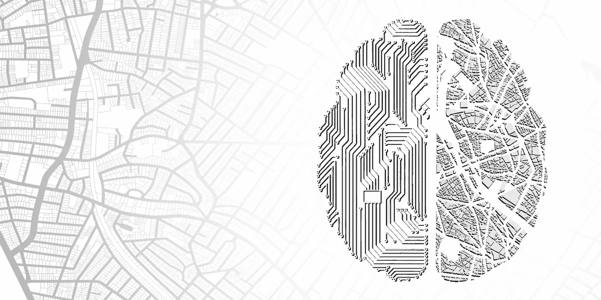
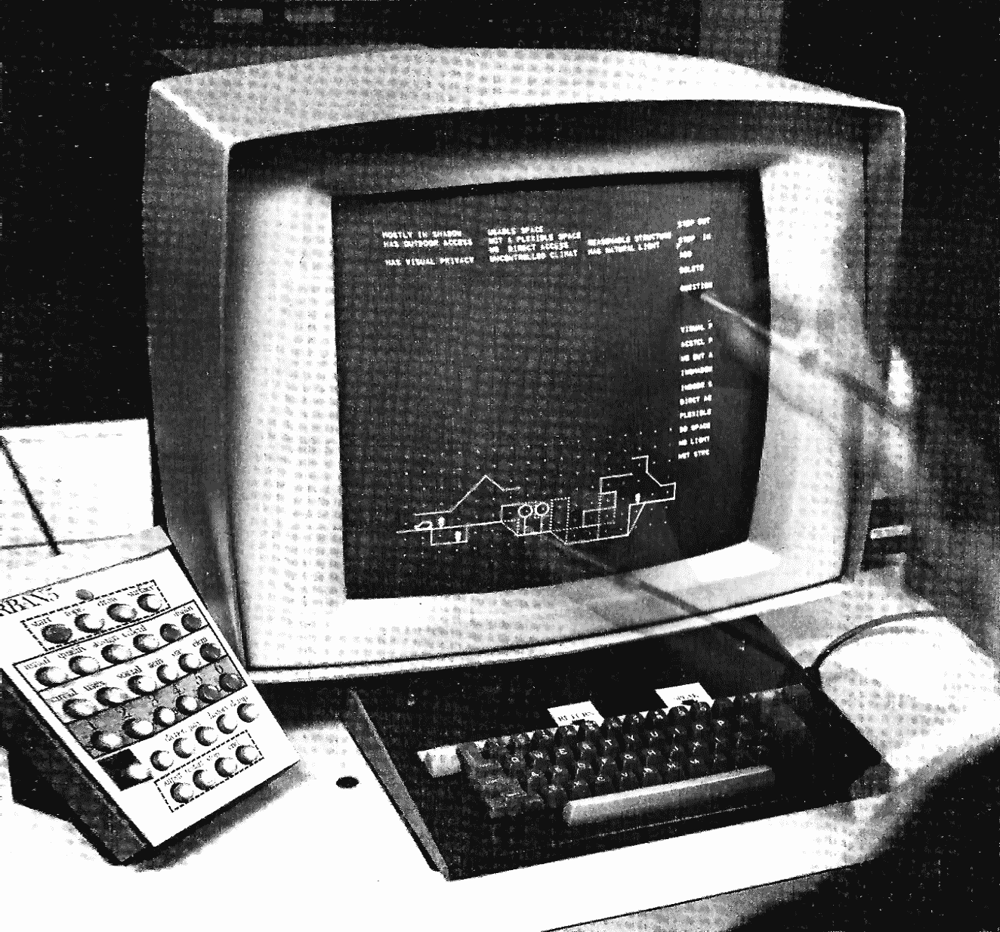
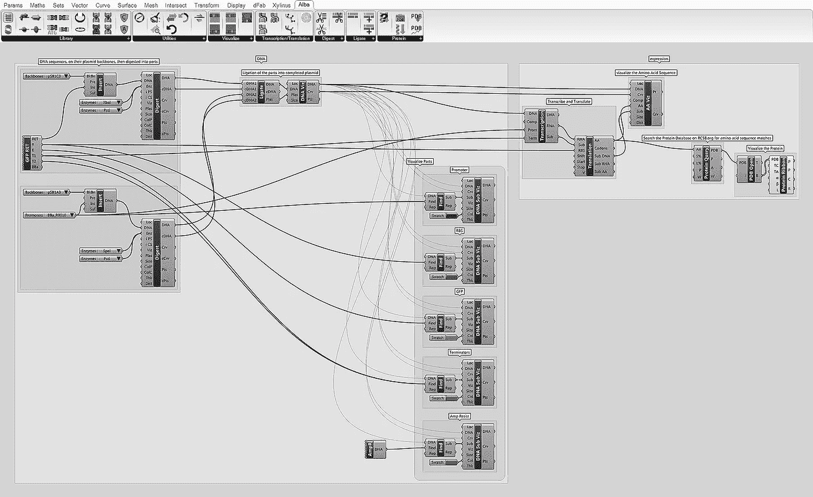
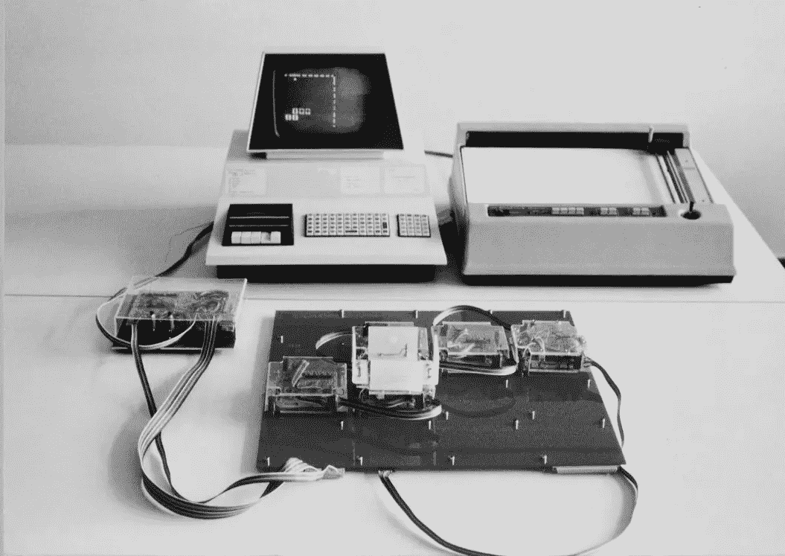
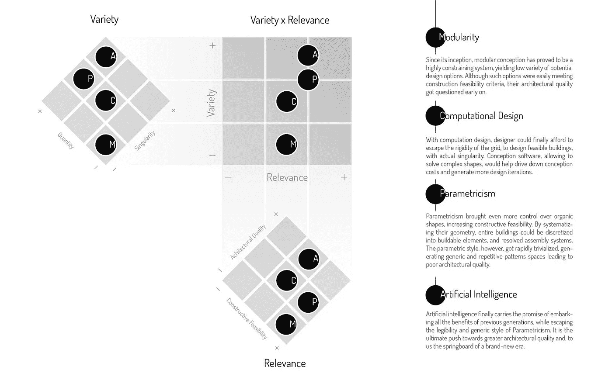

# 建筑人工智能的出现

> 原文：<https://towardsdatascience.com/the-advent-of-architectural-ai-706046960140?source=collection_archive---------6----------------------->

## 历史视角

[*斯塔尼斯拉斯·夏洛*](https://www.linkedin.com/in/stanislas-chaillou-b1931090/) *，哈佛大学设计研究生院**| 2019 年 2 月 17 日*

[*法语版*](https://medium.com/@sfjchaillou/lia-en-architecture-c805651d7f42)

*本文放出* [*我们的论文*](https://www.academia.edu/39599650/AI_Architecture_Towards_a_New_Approach) *的一部分，在哈佛开发，2019 年 5 月提交。这件作品是一个更大的作品的一个组成部分，调查艾在建筑上的开端，它的* [*历史背景*](/the-advent-of-architectural-ai-706046960140) *，它的潜在空间* [*组织*](/ai-architecture-f9d78c6958e0)*&*[*风格*](/architecture-style-ded3a2c3998f) *。*

今天，建筑实践、建筑方法、建筑传统和建筑技术是激烈争论的焦点。受到外来者的挑战，带来新的实践，以及来自内部的质疑，正如从业者对其当前状态的怀疑，建筑正在经历一场真正深刻的(r)进化。

在将对我们的学科留下持久影响的因素中，技术无疑是起作用的主要载体之一。价值链每一步的技术解决方案的出现已经极大地改变了建筑。建筑的概念事实上已经开始了缓慢的转变:首先是利用新的建筑技术，然后是开发足够的软件，最终今天是引入统计计算能力(包括数据科学和人工智能)。与其说是一种破坏，不如说我们希望在这里看到一种延续，这种延续引领建筑经历了一系列的演变，直到今天。*模块化*、*计算设计、参数化*以及最后的*人工智能*对我们来说是慢节奏转变的四个错综复杂的步骤。在历史背景之外，我们假设这种演变是建筑概念彻底改进的线框。

# 一.四阶段序列

M 这就是为什么当回顾历史时，区分创造的两个层次至关重要:发明& *创新。* *发明*源于学术研究，而*创新*则由*发明*诱发。在建筑领域，创新实际上塑造了一种持续发展的实践。在不同时期、发明&创新之间一直在反复进行的实践。从那里开始，我们的编年史旨在展示计算和建筑领域的深刻交织的演变，然后介绍建筑人工智能时代，作为一个顶点。这就是为什么重建我们学科近期历史的背景和亮点是我们工作的先决条件。

**Inventions & Innovations** | Source: Author

## 模块化系统

模块化可以作为系统化建筑设计的起点。始于 30 年代初，模块化建筑的出现将语言和建筑语法带入概念阶段，有助于简化和合理化建筑设计。

早在 1920 年，瓦尔特·格罗皮乌斯就为包豪斯提出了理论，模块化电网承载着技术简单和价格低廉的希望。模块化来自不同的方向，最初是作为学者和实践者的研究课题出现的。Gropius 最初引入了“ *Baukasten* ”的概念，这是一个典型的模块，然后通过严格的组装规则进行聚合。这种系统性将在一年后的勒·柯布西耶的“*Modulor*”(*图 1* )中得到呼应。通过将模块化的严格性应用到人类尺度，勒·柯布西耶在 1946 年提供了模块化原则的整体实现。

Figure 1: **Corbusier’s Modulor**

建筑环境的尺寸将根据人体的关键指标和比率进行调整。事实上，从马赛的“*拉图雷特”*到“*统一住宅*”，勒·柯布西耶将尺寸和跨度系统化，以匹配“*模数*”的处方。然而，随着巴克明斯特·富勒的出现，模块化迅速向一个更加一体化的愿景发展，将建筑系统嵌入模块中，Dymaxion House 就是一个例子。这一尝试将模块化住房的可能性推向了极致，为行业开创了一个充满活力的先例和概念验证。

此后，跟随这些早期的理论家，建筑师被邀请弯曲他们的设计精神，以矩阵的命令，同样的道理，转移部分建筑设计的技术性到模块的逻辑。更少的麻烦，更低的成本，更多的可预测性。模块化将迅速扩展到整个行业:罗伯特·w·麦克劳克林教授于 1933 年建造的温斯洛·艾姆斯住宅，是世界上第一个大规模模块化项目，被视为一个重大突破，就像摩西·萨夫迪极具表现力的 Habitat 67 一样。城市规划甚至在 60 年代初也受到了影响，当时像*建筑事务所*的“*插件城市*这样的项目开发了模块化城市的可能性。通过不断组装和拆卸三维结构矩阵上的模块，城市可以找到一个更新的逻辑，解决增长的可能性和一如既往的可行性的必要性。

然而，通过机械规则连接网格、模块和组装系统最终导致了一种类似乐高积木的建筑概念的游戏化。但是实践不能仅仅是一个“放在一起”的棋盘游戏，聚集了一套基本的组装规则和过程。由此产生的设计的单调很快使这一理论变得无足轻重，其装配系统的建设性弱点最终使建筑师望而却步。然而，通过它的规则系统，模块化今天仍然是一个潜在的建设性原则，在实践中仍然是生动的。

## 计算设计

在**80 年代之交，随着模块化系统的复杂性飙升，计算的出现为模块化设计带来了可行性和可扩展性。除了模块的复活，基于规则的设计的系统性在某种程度上得到了恢复。**

早在 50 年代中期，一个来自不同方向的关于计算设计潜力的高层次思考就在一个相邻的学科中开始了:工程学。1959 年，Patrick Hanratty 教授发布了 PRONTO，这是 CAD(计算机辅助绘图)软件的第一个原型，面向工程零件设计。这种软件提供的可能性，加上快速发展的潜在计算能力，引发了建筑领域的讨论。不久之后，建筑师兼加州大学伯克利分校教授克里斯托弗·亚历山大(Christopher Alexander)通过制定计算设计的关键原则开始了这场讨论。在他的“*关于形式综合的笔记*”(1964)和后来的“*一种模式语言*”(1968)中，Alexander 理论化了为什么以及如何使用计算机来解决形状设计的问题。他对软件设计潜力的早期理解与当时以硬件为中心的关注形成了深刻的对比。他在书中定义的基本原则至今仍是软件编程的基石:递归、面向对象编程以及它们在设计中的应用等概念代表了一种根本性的进步。随着这一势头，整整一代计算机科学家和建筑师将创造一个新的研究领域:计算设计。由尼古拉斯·尼葛洛庞帝教授领导的麻省理工学院建筑机器小组(AMG)可能是其最典型的体现。

Figure 2: **URBAN 5, AMG MIT**

尼葛洛庞帝的书“*建筑机器*”(1970)概括了 AMG 使命的本质:研究机器如何增强创作过程，更具体地说，是作为一个整体的建筑生产。随着 URBAN II 项目和后来 URBAN V 项目的发布，该小组将在工业界参与任何努力之前展示 CAD 应用于空间设计的潜力。

在这样的结论性研究之后，建筑师和整个行业积极地将这些发明推向创新状态。弗兰克·盖里无疑是这一事业最活跃的倡导者。对他来说，计算的应用可以极大地放宽装配系统的界限，并允许新的形状和建筑几何形状。盖里科技公司(Gehry Technologies)由盖里和吉姆·格利姆夫(Jim Glymph)在 80 年代创立，通常使用早期的 CAD-CAM 软件——如来自*达索系统*的*CATIA*——来解决复杂的几何问题。盖里科技为 30 年的计算设计开创了先例，向建筑师展示了计算的价值，引发了专业的滑坡。在接下来的 15 年里，不可阻挡的计算能力增长&数据存储能力，加上越来越便宜和更加用户友好的机器，极大地促进了 3D 设计软件的采用。建筑师基于一个明确的基本原理迅速认可了新系统:计算设计 **(1)允许严格控制几何形状，提高设计的可靠性、可行性和成本**、 **(2)促进和简化设计师之间的合作**、 **(3)** **最终实现了比传统手绘所能承受的更多的设计迭代**。更多测试&更多选择以获得更好的设计。

然而，在这个过程中，当设计师们从事计算设计时，一些缺点最终出现了。特别是，某些任务的重复性和对复杂几何形状缺乏控制成为严重的障碍。**这些为计算设计中出现的全新运动铺平了道路:*参数化*。**

## 参数化

在 **的参数世界中，当合理化为简单的规则集时，重复的任务和复杂的形状都有可能被处理。这些规则可以编码在程序中，以自动化耗时的手动执行过程。**这种模式推动了参数化技术的出现。简而言之，如果一项任务可以解释为给计算机的一组命令，那么设计师的任务就是将它们传达给软件，同时隔离影响结果的关键参数。一旦编码完成，架构师将能够改变参数并生成不同的可能场景:不同的潜在形状，同时产生多个设计输出。

20 世纪 60 年代初，Luigi Moretti 教授宣布了参数化建筑的出现。他的项目“ *Stadium N* ”虽然最初是理论性的，但却是第一次清晰地表达了参数化。通过定义 19 个驱动参数，其中包括观众的视野和裁判的日照，莫雷蒂直接从这些参数的变化中推导出体育场的形状。最终的形状，虽然令人惊讶且相当有机，但提供了这种新的参数美学的第一个例子:外观上是有机的，但作为一个构思过程却是严格理性的。三年后，伊凡·苏泽兰将把这一原理引入计算世界。萨瑟兰是 SketchPad 的创始人，这是第一款真正用户友好的 CAD 软件。嵌入在软件核心的“*原子约束*的概念是萨瑟兰对莫雷蒂的参数概念的翻译。在典型的画板绘图中，每个几何图形实际上都在机器端被转换成一组*原子约束*(参数)。这个概念是参数化设计在计算机术语中的首次表述。Samuel Geisberg，Parametric Technology Corporation(PTC)的创始人，后来在 1988 年推出了 Pro/ENGINEER，这是第一款向用户提供几何参数的软件。随着软件的发布，盖斯伯格完美地总结了参数理想:

> “我们的目标是创建一个足够灵活的系统，鼓励工程师轻松考虑各种设计。设计变更的成本应该尽可能接近零。”

由于萨瑟兰和盖斯伯格的努力，设计和计算之间的桥梁已经搭建起来，新一代“参数意识”建筑师可以茁壮成长。正如 P. Schumacher 所解释的，随着建筑师越来越有能力使用参数代理来操纵他们的设计，这个学科“慢慢地向参数化靠拢”。在他的书《参数化主义，一种新的全球建筑风格&城市设计中，Schumacher 清楚地展示了参数化主义是如何在建筑学科中逐渐意识到参数概念的结果。

从参数的发明，到将其转化为整个行业的创新，我们看到了一些关键人物，他们塑造了参数化的出现。扎哈·哈迪德建筑师事务所的作品最能体现建筑的参数化。哈迪德夫人是一名在英国接受培训的伊拉克建筑师，她有数学背景，她创办了自己的事务所，目的是通过参数化设计将数学和建筑结合起来。她的设计通常是编码在程序中的规则的结果，允许对建筑物的几何形状进行前所未有的控制。每一个建筑动作都会转化为给定的参数调整，从而形成特定的建筑形状。迄今为止，哈迪德的设计是将建筑设计量化为一系列参数的完美范例。然而，如果没有大卫·于滕在 2000 年开发的软件 Grasshopper，她的工作是不可能的。Grasshopper 作为一个可视化编程界面，允许建筑师轻松地隔离他们设计的驱动参数，同时允许他们迭代地调整它们。其界面的简单性(*图 3* )与内置功能的智能性相结合，今天继续为世界上大多数建筑的设计提供动力，并激发了整整一代“参数化”设计师。

Figure 3: **Grasshopper Interface by David Rutten**

最后，除了 Grasshopper 为建筑设计带来的短期好处，一场由参数化驱动、始于 21 世纪初的更深刻的革命今天仍在进行中:BIM(建筑信息建模)。在时任 Autodesk 副总裁的 Philip Bernstein 的带领下，BIM 的诞生和完善将建筑行业的合理性和可行性提升到了一个全新的水平。BIM 的基本思想是，建筑 3D 模型中的每个元素都是驱动每个对象形状并记录它们的参数(“属性”)的函数。从 Autodesk Revit——当今主要的 BIM 软件——到萨瑟兰的*画板*,我们看到一个共同的线索:明确利用参数作为设计的驱动力。

然而，在过去的 10 年里，设计的参数化已经被证明在技术上和概念上都达到了一个平台期。参数化建模未能考虑**(1)******(2)空间组织和风格的必要性高于严格的效率****(3)****场景的可变性**，最后 **(4)** **模拟的计算成本**。除了技术上的缺陷，参数化设计的理论前提也有缺陷:建筑可能是固定数量的参数的结果，建筑师可以简单地将其编码，作为一种抽象，远离其背景，环境和历史。事实上，当“照章办事”时，参数主义被证明忽略了空间规划的巨大复杂性:无数的参数和深刻的文化&社会因素实际上参与了城市平衡。随着我们的职业遭遇人工智能，这种以系统方式结合相邻学科的深层现实今天终于可以得到解决。**

## **人工智能**

**人工智能从根本上来说是一种架构的统计方法。人工智能的前提是将统计原理与计算相结合，这是一种新的方法，可以改善参数化架构的缺点。**

**机器所理解的“学习”对应于计算机在面对复杂问题时的能力，首先是理解显示给他的选项的复杂性，其次是建立“直觉”来解决所面临的问题。事实上，早在 1956 年，当创造人工智能的概念时，约翰·麦卡锡就已经将其定义为“*使用人脑作为机器逻辑的模型*”。人工智能不是设计一个为一系列变量和规则构建的确定性模型，而是让计算机根据从数据中收集的信息或用户传输的信息来创建中间参数。一旦达到“学习阶段”，机器就可以生成解决方案，不只是简单地回答一组预定义的参数，而是创建模拟在学习阶段向他显示的信息的统计分布的结果。这一概念是人工智能带来的范式转变的核心。机器建立自己对问题的理解的部分独立性，加上它消化一组例子的复杂性的能力，颠倒了参数化的前提。由于并非所有规则&参数都由用户预先明确声明，机器可以出人意料地揭示潜在的现象，甚至试图模仿它们。这是从启发式世界(基于规则的决策)到统计学世界(基于随机的决策)的巨大飞跃。**

**一些理论家早就预测了人工智能在建筑领域的渗透，他们在我们之前就看到了人工智能在建筑设计方面的潜力。这些先驱们远没有设计出智能算法，而是设计并推测了这种系统的潜力。当内格罗蓬特和他的团队发布 URBAN II 时，“机器助手”的想法已经开始酝酿了。URBAN V 是一个较新的版本，它可以帮助设计师调整房间布局(定义为区块),当用户在模块化网格上绘图时，可以优化邻近区域和光线条件。事实上，URBAN V 区分了两层信息:隐性和显性。隐式维度是机器处理并推导出来的维度，而显式维度是用户设置的维度。《都市 V》中的这种信息双重性，正是内格罗蓬特所希望的人机互补的直接翻译。正是在这组隐含参数中，“智能”——换句话说，机器中内置的人工智能——会找到它的表达方式。通过调整隐含参数，计算机提出的修正将作为建议呈现给用户。对于放置不当的房间，URBAN V 会通知用户:“ *TED，许多冲突正在发生*”。几年后，时任剑桥大学建筑学教授的塞德里克·普莱斯(Cedric Price)发明了*发电机* (1976 年，*图 4* )。**

****

**Figure 4: **The** **GENERATOR Machine, Cedric Price****

**普莱斯认可内格罗蓬特的工作，利用 AMG 在人工智能方面的工作并进一步推进，研究自主不断变化的建筑的想法，这将“智能地”响应和适应用户的行为。对于 Price 来说，在“智能”这个术语下，隐藏着对行为进行编码的思想，生成器将会遵循这一思想。然而，贝娄·内格罗蓬特的工作，或者说普莱斯的原型，存在一个未解决的问题:算法的实际智能。尽管接口和协议已经就绪，但基于简单的启发式关系，核心算法的实际过程复杂性仍然相当弱。**

**智能算法的设计，也称为 AI，实际上在 80 年代初重新引起了人们的兴趣。计算能力的突然增加和资金的急剧增加使智能问题重新成为 AI 研究的中心。这个时期的关键是两个主要的革命:专家系统和推理机。前者对应于能够使用条件语句基于一组规则进行推理的机器。这在当时是一个真正的突破。后者，最好的例子是由 Douglas Lenat 开发的 Cyc 项目 T1，涉及面向推理的机器。使用一个知识库(一组真值陈述)，一个推理机将能够推断出一个新陈述的真实性。直到 90 年代早期，人工智能的数学化，这个领域才会带来真正有希望的结果。一种新型模型的出现肯定会揭示人工智能的潜力:网络和机器学习。通过使用分层管道，也称为网络，现在机器能够处理比以前开发的模型更复杂的问题。这种模型可以被“训练”，或者换句话说，为特定的任务进行调整。更有趣的是，这种想法是在一种特定类型的模型中提出的:生成对抗性神经网络(GANs)。谷歌大脑(Google Brain)研究员伊恩·古德费勒(Ian Goodfellow)在 2014 年首次提出了这一理论，该模型提供了使用网络来生成图像，同时通过自我纠正的反馈回路来确保准确性(*图 5* )。**

****

**Figure 5: **GAN Typical Architecture****

**Goodfellow 的研究颠覆了 AI 的定义，从分析工具变成了生成代理。出于同样的原因，他让人工智能离建筑学更近了一步:绘画和图像制作。总而言之，从简单网络到 GANs，新一代工具加上越来越便宜和可获得的计算能力，今天正在将人工智能定位为一种负担得起的强大媒介。如果尼葛洛庞帝或普莱斯的工作几乎没有真正的机器智能，今天的建筑软件终于可以利用这种可能性。**

**尽管人工智能对建筑的潜在代表非常有前途，但它仍然取决于设计师向机器传达其意图的能力。由于机器必须经过训练才能成为一个可靠的“助手”，架构师面临两个主要挑战: **(1)他们必须选择一个适当的分类法**，即可以转化为机器量化指标的一组正确的形容词和 **(2)他们必须在广阔的人工智能领域中选择适当的工具并训练它们**。这两个先决条件将最终决定人工智能架构的成败。**

# **二。持续的进步**

**M **模块化、计算设计、参数化和人工智能:这四个阶段的序列反映了进展的年表，一步一步地塑造和精炼了建筑手段&方法。我们希望在这种势头下看到一种“持续进步”的形式，就像整个行业所经历的那样，而不是一系列不相关的中断。在此基础上，一套合适的矩阵帮助我们描绘出这种动态。****

**首先，为了证明我们的主张，我们在这里假设架构可以被理解为一个生成设计的过程，我们可以通过两个维度来描述:一方面是产生的输出的多样性或**另一方面是设计的适用性或**【相关性】。******

******【多样性】**取决于两个基本指标:确定所创造的选择数量的“设计数量”和衡量它们各自差异的“设计独特性”。****

******“相关性”**复合了“建设性的可行性”，即设计的可操作性及其“建筑质量”，包括最佳的项目组织、空间布局和环境适应性。****

********

******Variety x Relevance** Framework | Source: Author****

****最终， ***多样性*(数量 X 奇异性)*****关联性*(建造可行性 X 建筑质量)**的组合创造了一个框架，这个框架 **(1)映射并对比了我们四个时期** - *模块化*、*计算设计、*和*人工智能*、 **(2) 各自的定位******

****这个展示，虽然是方向性的和定性的，但却是一个强有力的网格来代表我们论文的核心概念。总之，这种持续发展的动力是由每个运动在某个特定时间点的限制所触发的，并因新运动的到来而加剧。****

********

# ****结束语****

****我们 **今天面临着一个巨大的挑战:将人工智能引入建筑设计领域。**毫无疑问，人工智能永远不会——永远不可能——自动化建筑师的直觉和感受力。人类使用机器作为工具。不是反过来。然而，从智能助理中受益是我们力所能及的，应该仔细研究、测试和体验。****

****此外，人工智能不仅仅是突然中断的结果。这是 70 年发明和创新的顶点。**由于人工智能可以平衡效率和组织性，同时提供大量相关的设计选项，**我们从中看到了丰富结果的可能性，这将补充我们的实践，并解决我们学科的一些盲点。我们绝不把人工智能看作是建筑领域的新教条，而是把这个领域视为一个充满潜力和希望的新挑战。****

# ****文献学****

*   ******超越计算机的数字建筑**，罗伯托·博塔齐，布卢姆斯伯里****
*   ******数据驱动的设计&构造**，兰迪·多伊奇，威利****
*   ******建筑智能，设计师和建筑师如何创造数字景观**，Molly Wright Steenson，麻省理工学院出版社****
*   ******建筑谷歌**，*超越网格——建筑&信息技术第 226–229 页*，Ludger Hovestadt，Birkhauser****
*   ******算法复杂性:凭空而来**，*复杂性，设计策略&世界观第 75–86 页*，安德里亚·格莱尼格&格奥尔格·弗拉赫利奥蒂斯，伯克豪斯****
*   ******代码&机器**，*代码，操作间&旁白第 41–53 页*，Andrea Gleiniger&Georg Vrachliotis，Birkhauser****
*   ******格罗皮乌斯的问题还是关于在建筑和艺术中揭示和隐藏代码**，*代码，介于操作&叙述第 75–89 页*，安德烈·格莱尼格&格奥尔格·弗拉赫利奥蒂斯，伯克豪斯****
*   ******软架构机器**，尼古拉斯·尼葛洛庞帝，麻省理工学院出版社。****
*   ******建筑机器**，尼古拉斯·尼葛洛庞帝，麻省理工学院出版社。****
*   ******一种模式语言，关于合成形式的注释**，克里斯多夫·亚历山大，[链接](http://www.patternlanguage.com/ca/ca.html)****
*   ******地图的变形；或者输入 RoweBot** ，安德鲁·威特，日志#36****
*   ******灰拳击**，安德鲁·威特，日志#43****
*   ******人类与人工智能中的暗示性绘画，**辜莞允·马丁内兹，哈佛 GSD 论文，2016****
*   ******启用替代架构:参与式设计的协作框架，** Nathan Peters，哈佛 GSD 论文，2017****
*   ******DANIEL:自动分析和检索建筑平面图的深度架构**，Divya Sharma，Nitin Gupta，Chiranjoy Chattopadhyay，Sameep Mehta，2017，IBM Research，IIT 焦特布尔****
*   ******建筑平面图中的自动房间检测和房间标记**，Sheraz Ahmed，Marcus Liwicki，Markus Weber，Andreas Dengel，2012 年，凯泽斯劳滕大学****
*   ******利用空间索引自动解释平面图**，哈南·萨梅特，阿雅·索费尔，1994 年，马里兰大学****
*   ******解析平面图图像**，塞缪尔·道奇，久旭，比约恩·斯坦格，2016，亚利桑那州立大学，乐天理工学院****
*   ******项目探索:生成性设计在建筑空间规划中的应用**，丹尼尔·纳吉，达蒙·刘，约翰·洛克，吉姆·斯托达特，洛伦佐·维拉吉，王雷，戴尔·赵和大卫·本杰明，2016，生活，欧特克工作室****
*   ******光栅转矢量:再访平面图变换**，刘晨，吴家军，Pushmeet Kohli，川口恭誉古川，2017，华盛顿大学，深度思维，麻省理工学院****
*   ****图形文档视觉理解的关系模型。建筑制图应用，2014 年，巴塞罗纳自治大学****
*   ******基于骨骼上下文的形状匹配与建模**，谢军，heng-Ann Heng，Mubarak Shah，2007，中佛罗里达大学，香港中文大学****
*   ******平面图解释的统计分割和结构识别**，Lluís-Pere de las Heras，Sheraz Ahmed，Marcus Liwicki，Ernest Valveny，Gemma Sánchez，2013，西班牙巴塞罗那计算机视觉中心****
*   ******结合使用统计和结构策略在平面图中进行无监督和独立于符号的墙壁分割**，llus-Pere de las Heras、Ernest Valveny 和 Gemma Sanchez，2014 年，西班牙巴塞罗那计算机视觉中心****
*   ******使用生成式对抗网络支持智能移动应用的路径规划**，Mohammadi，Mehdi，Ala Al-Fuqaha 和 Jun-Seok Oh。, 2018****
*   ******基于方形树形图算法的平面图自动实时生成**，Fernando Marson 和 Soraia Raupp Musse，2010 年，PUCRS****
*   ******建筑程序建模**，帕斯卡·穆勒，彼得·旺卡，西蒙·海格勒，安德烈亚斯·乌尔默，吕克·范·古尔，2015，苏黎世联邦理工学院，亚利桑那州立大学****
*   ******建筑空间规划的生成式设计**，Lorenzo Villaggi 和 Danil Nagy，2017，Autodesk Research****