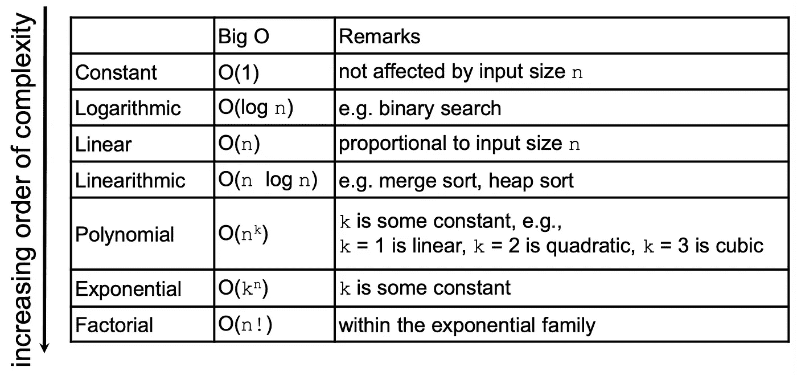
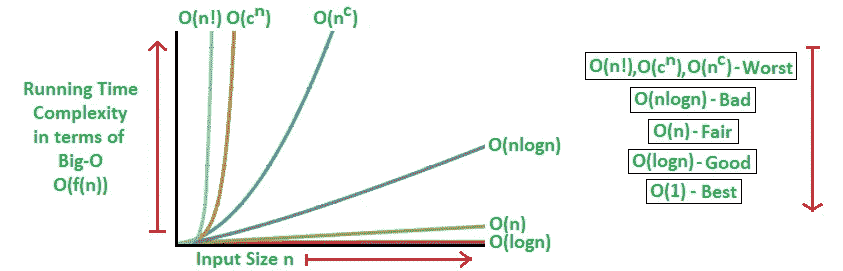
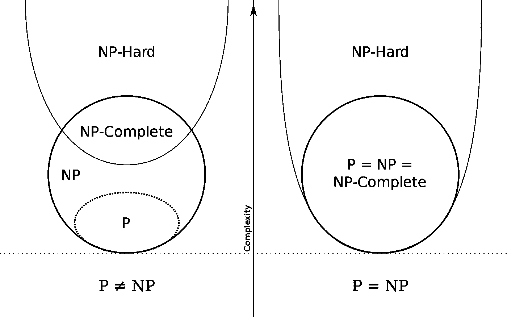
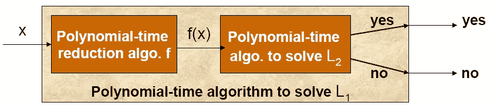

# 老年 P 对 NP 问题

> 原文：<https://towardsdatascience.com/the-aged-p-versus-np-problem-91c2bd5dce23?source=collection_archive---------10----------------------->

## 为什么 P=NP 如此重要，值得 100 万美元的奖金？

Photo by [Helloquence](https://unsplash.com/@helloquence?utm_source=medium&utm_medium=referral) on [Unsplash](https://unsplash.com?utm_source=medium&utm_medium=referral)

> p 对 NP。这是可以解决的吗？

它是由[粘土数学研究所](https://en.wikipedia.org/wiki/Clay_Mathematics_Institute)选出的七个[千年奖问题](https://en.wikipedia.org/wiki/Millennium_Prize_Problems)之一，每个问题的第一个正确答案将获得 100 万美元的奖金。这是七个问题中最近提出的问题(1971 年)，也是最容易解释的问题(希望如此)。

# 这是怎么回事？

在我们深入探讨之前，我希望可以安全地假设点击本文的人具有一些编程背景，并对算法及其运行时(时间和空间复杂性)有所了解。我不会详细讨论技术细节，但会向那些非技术人员提供一些背景知识。

## 非编程人员需要了解的基本概念

(*熟悉时空复杂性的可以跳过这一节*)

*   **算法基本上只是一套用编程语言编写的指令**
*   **算法是计算机程序背后的“大脑”** —它们本质上帮助解决我们的日常问题，如车辆路线、蛋白质折叠、排序、寻找质数、图形搜索等。
*   **每个算法都有一个时间和空间复杂度**——这本质上是一种技术上更酷的说法，即每个算法都需要一些时间来运行，并在执行时占用我们计算机上的一些内存

Big O Notation and Orders of Complexity

*   **多项式时间慢** —当谈到时间复杂度(即运行一个算法需要多少时间)时，编程社区根据输入大小 *n* 来衡量一个算法需要的时间。当自变量趋向于某个特定值或无穷大时，描述函数极限行为的数学符号称为**大 O 符号**。一般来说，任何在多项式时间内运行的算法(即给定大小为 *n* 的输入，需要 *n^k* 时间)都被认为是慢的，但仍被社区“接受”为上限。任何速度较慢的东西都被编程社区认为是不可用的，因为相对于输入大小来说，花费的时间太快了。

Above table represented visually

## 那么，什么是 P 对 NP 的问题呢？

*声明一下，现状是 P≠NP。*

***P*** (多项式时间)是指一个算法在多项式时间内可以解决的一类问题。在 ***P*** 类中的问题可以从简单的乘法到寻找列表中最大的数字。它们是相对“容易”的一组问题。

***NP*** (非确定性多项式时间)是指非确定性计算机可以在多项式时间内解决的一类问题。这实质上是“如果我有无限的计算能力(即，我需要多少台计算机)，我就能在最多多项式时间内解决任何问题”的另一种说法。更直观地说，它指的是目前无法找到足够快速(多项式时间)答案的一类问题，但如果有人提供了问题的解决方案，就可以快速**验证**(在多项式时间内)。这里的术语“验证”是指能够检查所提供的解决方案是否确实正确。

显然，基于以上定义，***p*⊆*NP***。让我们看一个例子来说明这个抽象的问题。

最常见而有效的例子之一是 [*数独*](https://en.wikipedia.org/wiki/Sudoku) 。给定一个未解的数独网格(例如 9 x 9)，一个算法要花相当多的时间来解一个。然而，如果 9 x 9 的网格增加到 100 x 100 或 10，000 x 10，000 的网格，解决它所花费的时间将会成倍增加，因为问题本身变得更加困难。然而，给定一个解出的数独网格(9 x 9 ),即使大小扩展到 10，000 乘 10，000，也很容易验证特定解是否正确。它会更慢，但是检查解决方案的时间会以更慢的速度增加(**多项式**)。

还有许多其他的 ***NP*** 问题，包括[背包问题](https://en.wikipedia.org/wiki/Knapsack_problem)和[旅行推销员问题](https://en.wikipedia.org/wiki/Travelling_salesman_problem)，它们的相似之处在于它们很难解决但很快得到验证。我们在这里试图解决的根本问题是:

> ***能够快速识别* NP *正确答案是否意味着也有快速找到的方法？***

如果是这样的话(即 P=NP)，这将极大地改变我们看待这些 ***NP*** 问题的方式，因为这意味着有一种快速的方法来解决所有这些问题，只是我们还没有找到解决方法。

# 如果这还不够复杂，让我们来增加点趣味。

## NP-完全和 NP-困难

在这些 ***NP*** 问题中，存在着一类被研究者称为***NP-完全*** 问题的问题。在形式上，它们是一组问题，其中的每一个问题，任何其他的 ***NP*** 问题都可以在多项式时间内**化简为**(在下面提到*)，并且其解仍然可以在多项式时间内被验证。这意味着*任何* ***NP*** 问题都可以转化为 ***NP-Complete*** 问题。*

通俗地说，他们是 ***NP*** 问题中的“最难”的。这样如果任何一个*一个****NP-完全*** 问题都可以在多项式时间内解决，那么*每一个****NP-完全*** 问题都可以在多项式时间内解决， ***NP*** 中的*每一个*问题都可以在多项式时间内解决(即 P=NP)。最著名的例子是旅行推销员问题。

Photo by [JESHOOTS.COM](https://unsplash.com/@jeshoots?utm_source=medium&utm_medium=referral) on [Unsplash](https://unsplash.com?utm_source=medium&utm_medium=referral)

还有一组问题叫做 ***NP-Hard*** 问题。这些问题至少和 ***NP*** 问题一样难，但是**没有**要求其在多项式时间内求解的条件。这表明 ***NP-Hard*** 问题不一定属于 ***NP*** 类。一个例子是解决一个国际象棋棋盘——给定一个国际象棋棋盘的状态，几乎不可能判断在给定状态下的给定移动是否实际上是最优移动。形式上，不存在多项式时间算法来验证一个 NP 难问题的解决方案。

如果我们把两者放在一起，一个 ***NP-Complete*** 问题暗示它是 ***NP-Hard*** ，但是一个 ***NP-Hard*** 问题并不暗示它是 ***NP-Complete*** 。

## 定义 NP-完全性

一个问题 *L* ，是**NP-Complete如果:**

1.  *L* 是 NP 难
2.  *L* 属于 NP

下图(*聚焦左手边*)应该会让事情更清楚。

P versus NP diagram (source: [https://en.wikipedia.org/wiki/P_versus_NP_problem](https://en.wikipedia.org/wiki/P_versus_NP_problem))

## 等等，把 A 减为 B 是什么意思？

**归约**形成了***NP-完全性*** 的症结。

通俗地说，一个问题 *L1* 可以简化为另一个问题 *L2* 如果:

*   L1 的任何实例都可以被建模为 L2 的实例
*   后者的解决方案提供了前者的解决方案，反之亦然

为了直观地理解这一点，我们可以这样想:

> 如果 L1 被简化为 L2，L1 必须至多和 L2 一样难对付。相反，L2 必须至少和 L1 一样努力。

数学上，这表示为:***L1*****≤p*L2***(读作“ *L1 多项式可约为 L2* ”)。

Visual representation of above, where f represents the polynomial-time reduction algorithm (Source: Singapore Management University)

## 如果 P 实际上等于 NP 会发生什么？

既然我们已经定义了所有这些不同的术语，一个更重要的问题是——“为什么所有这些都很重要？”。找到这个问题的解决方案不仅在学术界，而且在实际情况下都会产生深远的影响。这包括:

*   **密码术**——从我们维护的许多密码到我们在自动取款机上使用的 PIN 码，我们依靠这些代码来管理我们的日常生活，因为它们容易检查，但人们很难破解。
*   **车辆路线** —运输和物流的流动将在全球范围内得到优化，影响到从运输到电子商务再到制造的许多行业。
*   **——了解或预测一个给定的氨基酸序列(一种蛋白质)将如何折叠形成其三维形状，将有助于药物设计等许多领域，甚至可能治愈癌症。**

# **结束语**

**对我来说，我更像一个实用主义者，而不是理想主义者。我站在一边，认为 P **不等于**和 NP，而且可能永远不会相等。尽管我很想发现癌症的治疗方法(通过快速蛋白质折叠)或快速车辆路线，但我相信世界本来就应该像现在这样复杂。公司之所以存在，是因为它们相互竞争，寻找更好的(但永远不是最好的)方法来解决这些问题。这些无法解决的问题推动着我们的经济和世界。**

**如果真的有解决这个问题的方法，这个问题的复杂性保证了现金奖励远远超过 100 万美元。**

*****支持我！*** —如果你喜欢我的内容并且*没有*订阅 Medium，请考虑支持我并通过我在这里的推荐链接[订阅](https://davidcjw.medium.com/membership) ( *注意:你的一部分会员费将作为推荐费*分摊给我)。**

# **参考**

1.  **[https://en.wikipedia.org/wiki/P_versus_NP_problem](https://en.wikipedia.org/wiki/P_versus_NP_problem)**
2.  **[https://www.youtube.com/watch?v=YX40hbAHx3s](https://www.youtube.com/watch?v=YX40hbAHx3s)**
3.  **[https://bigthink.com/technology-innovation/what-is-p-vs-np?rebelltitem=1#rebelltitem1](https://bigthink.com/technology-innovation/what-is-p-vs-np?rebelltitem=1#rebelltitem1)**
4.  **[http://news.mit.edu/2009/explainer-pnp](http://news.mit.edu/2009/explainer-pnp)**
5.  **[https://www.cse.iitk.ac.in/users/sb/papers/a-talk.pdf](https://www.cse.iitk.ac.in/users/sb/papers/a-talk.pdf)**