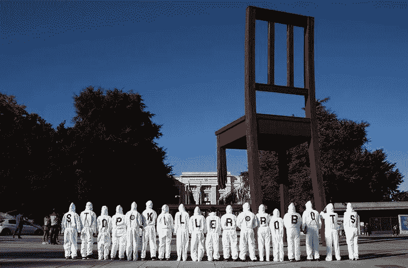
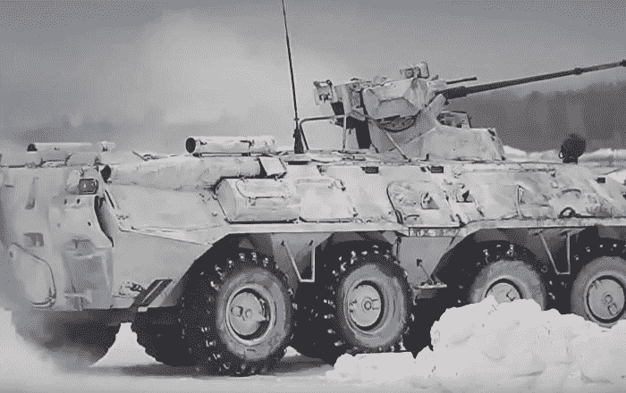

# 2019 年的人工智能军备竞赛

> 原文：<https://towardsdatascience.com/the-ai-arms-race-in-2019-fdca07a086a7?source=collection_archive---------13----------------------->

## 埃隆·马斯克和斯蒂芬·霍金的激进主义已经失败

Image depicts activists from the “Campaign to Stop Killer Robots” group, [protesting outside the United Nations in Geneva](https://www.politico.eu/article/killer-robots-us-russia-block-formal-talks-on-whether-to-ban/)

黑仔机器人已经到来。诚然，这些'[致命的自主武器](https://news.cnrs.fr/opinions/a-guide-to-lethal-autonomous-weapons-systems)距离超级智能还有很长的路要走——2019 年的 AI 比终结者更接近瓦力。尽管如此，在过去的五年里，人工智能在军事技术上的应用确实是爆炸性的；尤其是受到来自美国、中国和俄罗斯的密集国家投资的推动。

一些有关方面预见到了这种升级。埃隆·马斯克和斯蒂芬·霍金只是众多知名人士中的两位[，他们在 2018 年签署了](https://www.theguardian.com/science/2018/jul/18/thousands-of-scientists-pledge-not-to-help-build-killer-ai-robots)“致命自主武器誓言”，呼吁全球禁止自主武器。该宣言谴责这些武器是“危险的不稳定因素”和“强大的压迫工具”。未来生命研究所在 2017 年组织了一次更大的[承诺，明确警告全球大国之间可能开始致命自主武器的军备竞赛。](https://futureoflife.org/lethal-autonomous-weapons-pledge/)

这篇文章将展示这种激进主义是多么的无效，不管它的初衷是多么的好。人工智能领域的军备竞赛已经开始，而且已经持续了多年。现在是 2019 年，我们不能浪费时间假装潘多拉的盒子还没有被打开。是时候盘点人工智能武器化的潜在证据，并考虑产生这一泥潭的地缘政治动机了。

**准备，设置，消失**

一场推动人工智能军备竞赛的国家之旅也可以从莫斯科开始。普京政府，几乎没有一个符合现有全球规范的政府，明确反对建立新的规范(反对自主武器)。莫斯科甚至成功地游说减少各国开会讨论这个问题的天数。俄罗斯自己也声称限制自主武器开发是不合适的，因为“这种武器很少被开发出来”。

俄罗斯无私地努力编造这种谎言。泄露的 2019-2021 年人工智能专用研发预算显示，未来三年，国家投资([以前为](https://www.defenseone.com/technology/2019/01/russia-expect-national-ai-roadmap-midyear/154015/)【4.9 亿美元】)几乎*翻了一番。俄罗斯在这一地区的意图不是秘密。问问格拉西莫夫将军就知道了，他是俄罗斯军队的总参谋长:[他在国家通讯社上公开表示“机器人将是未来战争的主要特征之一……(俄罗斯)正在寻求战场的完全自动化。”](http://www.militarynews.ru/story.asp?rid=1&nid=476975)*

*想知道未来战争会发生什么，看看俄罗斯武器制造商皇冠上的宝石:卡拉什尼科夫(无处不在的 AK-47 的制造商)。这个军火巨头正在开发和发射一整套自主武器，每一种都有一个“神经网络”,使机器能够挑选目标并自主决定是否交战。另一家俄罗斯武器制造商 Degtyarev[已经开发了](https://www.forbes.com/sites/noelsharkey/2018/11/28/killer-robots-from-russia-without-love/)一种叫做 Nerekhta 的自主“自杀机器”。这种无人驾驶飞机被建造来悄悄地接近目标，然后爆炸摧毁防御工事或敌人的坦克。*

**

*A Nerekhta participating in combat drills*

*这里需要强调的是，所选的例子只是俄罗斯冰山的一角:我们还没有接触到[自主核潜艇](https://en.wikipedia.org/wiki/Status-6_Oceanic_Multipurpose_System)、[智能虫群机器人导弹](https://www.newsweek.com/drones-swarm-autonomous-russia-robots-609399)或[阿玛塔 T-14“超级坦克”。情况相当清楚:俄罗斯有一个庞大而雄心勃勃的自主武器计划，并将其视为国家安全利益的核心。因此，没有人应该对普京(已经)对全球人工智能武器禁令的幽灵发起进攻感到惊讶。](https://www.forbes.com/sites/noelsharkey/2018/11/28/killer-robots-from-russia-without-love/)*

*或许更令人惊讶的是，俄罗斯在自主武器问题上的立场与美国和中国的立场是如此一致。事实上，对于两个努力在有争议的地缘政治问题上达成共识的地缘政治大国来说，美国和俄国在反对禁止自主武器方面表现出了惊人的凝聚力(T2)。*

*为什么会这样？不需要触及总司令的[特有的特质；尝试一个简单的数字(尽管有很多零)。五角大楼已经承诺在美国军事人工智能上花费 90 亿美元，明确指出需要跟上俄罗斯和中国的军事技术。虽然美国在人工智能上的预算只占整个国防开支的一小部分，就像在俄罗斯一样，但这个数字在最近几年翻了一番。](https://www.npr.org/2018/07/17/629601233/trumps-helsinki-bow-to-putin-leaves-world-wondering-whats-up)*

*在全球大国中独一无二的是，美国[已经开始](https://www.bloomberg.com/news/articles/2018-05-18/the-u-s-army-is-turning-to-robot-soldiers)在动荡的战斗地区部署自动驾驶汽车，数量庞大，作用重大。自主海军车辆已经开始在南中国海巡逻——更大、更强大的机器已经上路。最令人震惊的是，在奥巴马政府的领导下，美国无人驾驶飞机已经在阿富汗和巴基斯坦遍地开花。美国反对所有禁止自主武器的行动的原因非常清楚:美国想要赢得军备竞赛，而不是阻止它。*

*就其本身而言，中国实际上已经在去年四月表示支持禁止在战场上使用自主武器。然而，有眼光的读者应该对中国的声明有所保留:就在同一天，中国空军[发布了一种新型自主无人机的“智能群体”设计计划](https://mp.weixin.qq.com/s/xfw3hZkCiPJa-gX3GExEcQ)。同样，即使在去年，中国的自主武器项目也创造了成功的故事。[一些评论家认为中国在军备竞赛中占据了无可置疑的优势；与北京支持禁止人工智能武器有些矛盾。](https://thediplomat.com/2018/08/the-trouble-with-chinas-edge-in-the-ai-arms-race/)*

*Lawfare 的 Elsa Kania】认为中国在军事人工智能方面正在推行一种“战略模糊”的政策:向有关人权组织展示口头承诺，而不牺牲任何发展尖端致命自主武器的真正灵活性。毕竟，成为人工智能(包括武器开发)的全球领导者是[字面上的中国官方计划](https://www.nytimes.com/2017/07/20/business/china-artificial-intelligence.html)；当战略利益受到威胁时，北京不会太在意人权组织。*

*换句话说，世界上三个最大的军事强国已经:*

*   *认定自主武器对他们的军事战略至关重要；*
*   *增加这些武器的资源和发展；和*
*   *描述了在其他强国技术发展的背景下对更先进武器的需求。*

*我们不得不这样称呼它:一场严重的军备竞赛。*

***埃隆和他的朋友们的清算***

*在我看来，根据现有的证据，继续积极阻止致命自主武器的发展是站不住脚的。埃隆·马斯克和《未来生活》阻止军事人工智能军备竞赛的善意努力已经失败。在这个阶段，俄国、中国和美国(更不用说[和许多小国家](https://www.timesofisrael.com/unmanned-subs-and-sniper-drones-israel-unveils-its-weapons-of-the-future/))在致命自主武器上投入了大量资金，并将其视为未来武装冲突的基础。我们可以预计军事人工智能的资源将继续升级，各州将开始部署更多的先进无人机。*

*值得注意的是，大国的这种行为完全符合他们的理性动机(而不是，例如，[符合一个糟糕的科幻小说情节](https://en.wikipedia.org/wiki/RoboCop#Plot))。单方面支持人工智能武器禁令和降低武器发展不符合任何大国的利益。如果有人这样做，另一个大国可能会抓住机会在武器化人工智能方面发展无懈可击的优势，这种可能性几乎是不可避免的。自主无人机之间的战斗[很可能会由哪一方拥有更强大的软件和自主权](https://www.researchgate.net/publication/256017649_The_Seabots_are_Coming_Here_Should_They_Be_Treated_as_'Vessels')来决定。能够自主“思考”、反应、操纵和参与的机器将战胜速度较慢的机器，更不用说行动迟缓的人类了。*

*考虑到这种地缘政治背景，那些担心机器人崛起的人还有什么选择呢？一个答案可能是专注于开发军事人工智能的实际工作人员和科学家，而不是他们为之工作的国家。数千名工程师去年游行抗议 Maven 项目，这是五角大楼的一个军事人工智能项目。那个项目[如期取消](https://www.wired.com/story/google-wont-renew-controversial-pentagon-ai-project/)。很可能更多的人工智能最聪明的头脑不想利用他们的天赋来推进发动战争的技术。*

*活动人士的另一个选择是支持一项实际上能够获得主要大国共同支持的国际协议。我的立场是，激进分子可能不得不搁置任何全面禁止开发或部署的野心，但一个更渐进的协议可能会成功:也许是一个人工智能行为准则，规范国家如何部署自主武器。各国对发展一个共享的规则集，或者至少是一个解决由新技术的新颖应用引起的外交争端的机制有着浓厚的兴趣。*

*这幅图景并不像看上去那么黯淡。尽管这篇文章引用了一些听起来不可思议的人工智能开发项目，但一位专家认为自主战争机器的“一般”智能比一个蹒跚学步的小孩还不如[。马斯克和霍金可能未能避免人工智能军备竞赛，但至少他们最担心的事情还没有曝光。](https://arxiv.org/pdf/1801.00631.pdf)*

* [## 黑仔机器人的武器控制

### 是时候召开一个可编程的日内瓦会议了

medium.com](https://medium.com/@mattjbartlett/arms-control-for-killer-robots-54dfdbedcb13)*