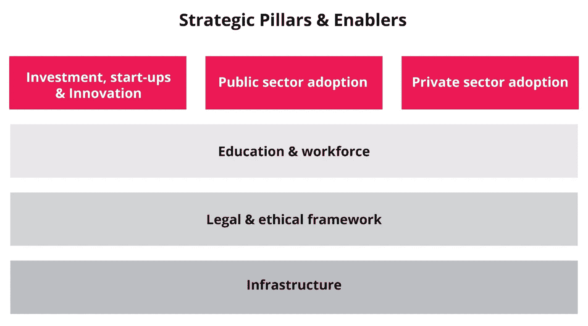

# 人工智能发射台终于来了！

> 原文：<https://towardsdatascience.com/the-ai-launchpad-is-finally-here-2523426ef77d?source=collection_archive---------16----------------------->

Image by [skeeze](https://pixabay.com/users/skeeze-272447/?utm_source=link-attribution&utm_medium=referral&utm_campaign=image&utm_content=600500) from [Pixabay](https://pixabay.com/?utm_source=link-attribution&utm_medium=referral&utm_campaign=image&utm_content=600500)

人工智能(AI)发射台是不同组织(无论是公共还是私人组织)可以开发旨在进行国际部署的人工智能解决方案的地方。通过这样一个发射台，这些系统可以在一个受控、安全的环境中进行试验和测试，从而为大规模采用做好准备。

# **组件**

Source: [https://malta.ai](https://malta.ai)

发射台的各个组件分为两部分:促成因素和战略支柱。促成因素是构成战略的基本组成部分。没有它们，我们就无法构建人工智能系统。这些包括底层基础设施、法律和道德框架以及教育和劳动力促成因素。战略支柱依赖于基本组成部分。这些包括私营部门、公共部门和投资(包括初创企业和创新)。这些不同的元素共同构成了人工智能启动平台战略。

# **目标**

Photo by [Franck V.](https://unsplash.com/@franckinjapan?utm_source=medium&utm_medium=referral) on [Unsplash](https://unsplash.com?utm_source=medium&utm_medium=referral)

该战略的目标多种多样，涉及前面提到的不同组成部分，但在下文中，我们将对主要目标进行综合。这些战略进一步分为两个部分，短期战略是到 2022 年可实现的，长期愿景是到 2030 年及以后的 10 年战略。

**短期策略**包括以下内容:

*   提高公民对人工智能的认识。
*   加深学生对人工智能的认识。
*   创造由公民塑造的人工智能政策。
*   在不同部门产生投资和创造就业机会。
*   刺激研发(R&D)和创新。
*   在当地推动人工智能试点项目，然后在国外推出。
*   对公职人员进行人工智能培训，建立人工智能驱动的政府。
*   帮助商业界发展人工智能解决方案的知识。
*   为人工智能驱动的世界准备好国家的劳动力。
*   更新法律，使其有能力处理颠覆性技术。
*   推出人工智能认证框架。
*   提供高质量的开放数据集。
*   推动自然语言处理算法在本地语言中的应用。
*   启动高性能计算访问策略。

**长期战略**包括以下内容:

*   确保 AI 成为我们日常生活不可或缺的一部分。
*   让人工智能成为大多数 R&D 活动的关键推动者。
*   把这个国家变成人工智能的全球中心。
*   用人工智能解决方案为公共服务提供动力。
*   利用人工智能提高整体业务绩效。
*   确保所有工人都具备所需的技能。
*   让人工智能成为国家课程的一部分。
*   给教育者配备 AI 工具。
*   保证强有力的法律、治理和社会保护。
*   有效利用人工智能、5G、物联网(IOT)和其他新兴技术。
*   对个人数据提供更好的所有权和控制。

# **地点**

Photo by [Ferenc Horvath](https://unsplash.com/@designhorf?utm_source=medium&utm_medium=referral) on [Unsplash](https://unsplash.com?utm_source=medium&utm_medium=referral)

AI launchpad 位于马耳他，这是一个人口约 50 万的小国，其中许多人都懂信息技术。该国一直处于各种创新监管框架的前沿，这些框架旨在促进新兴技术的采用，如区块链。它也是欧盟最小的成员之一，这使得它成为一个拥有 5 亿用户市场的理想发射台。由于它位于地中海中部，其战略位置也瞄准了非洲和中东的国家。这些国家在全球拥有 15 亿潜在用户。此外，由于大多数马耳他人至少会说两种语言(英语是他们的官方语言之一)，在马耳他交流相当容易。拥有 300 天的阳光、令人难以置信的文化遗产、安全的环境和壮丽的海滩；这个国家也是居住和组建家庭的理想之地。

# **实施**

Photo by [Nick Fewings](https://unsplash.com/@jannerboy62?utm_source=medium&utm_medium=referral) on [Unsplash](https://unsplash.com?utm_source=medium&utm_medium=referral)

10 月在马耳他举行的三角洲峰会上启动了 AI Launchpad 战略。对于马耳他来说，这是一个迷人的时期，因为它将开始实施新的人工智能战略。政府希望马耳他在人工智能方面成为世界十大国家之一。还有很长的路要走，这并不容易，但愿景已经确定。我们现在要做的就是努力落实。

*AI 战略完整文档可在此下载*[*https://Malta . AI*](https://malta.ai)

[*关于教育的 AI 战略总结可以在这里找到！*](https://medium.com/@alexieidingli/boosting-our-educational-system-and-our-workforce-using-ai-a676afacb9cd)

[**Alexei Dingli**](http://www.dingli.org/)**Prof 是马耳他[大学](https://www.um.edu.mt/)的 AI 教授。二十多年来，他一直在人工智能领域进行研究和工作，协助不同的公司实施人工智能解决方案。他的工作被国际专家评为世界级，并赢得了几个当地和国际奖项(如欧洲航天局、世界知识产权组织和联合国等)。他出版了几本同行评审的出版物，并且是马耳他[的成员。人工智能](https://malta.ai/)工作组是由马耳他政府成立的，旨在使马耳他成为世界上顶尖的人工智能国家之一。**