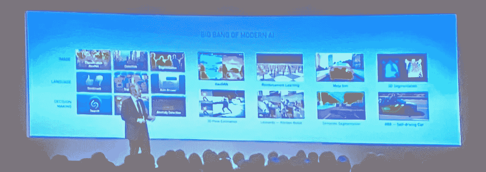
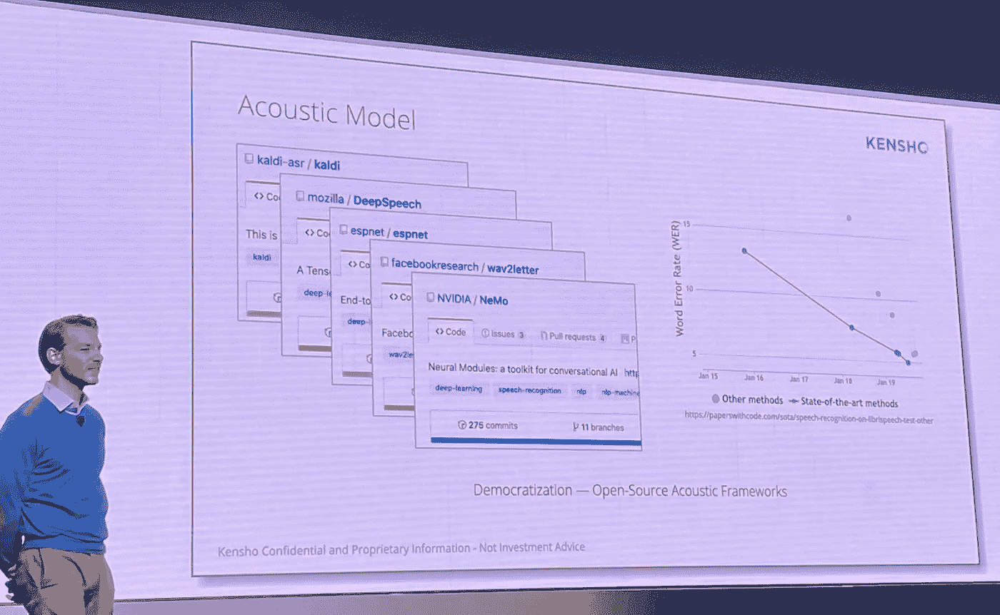
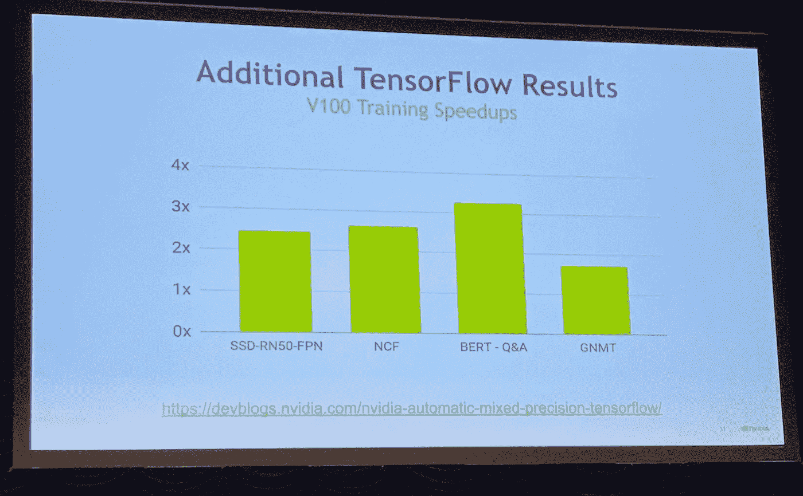

# 人工智能竞赛在 2019 年 GPU 技术大会上继续升温

> 原文：<https://towardsdatascience.com/the-ai-race-continues-to-heat-up-at-the-gpu-technology-conference-2019-69c50c5b2b6a?source=collection_archive---------46----------------------->

*下面是一个创业公司创始人对英伟达 GPU 技术大会的看法。无论你是想知道 5G 将如何创造新的机会，还是为什么幽灵餐厅需要人工智能，在这个快速发展的领域保持最新都是一个好主意。*

# **美国国家标准与技术研究院正式定义 AI:**

> *人工智能的定义:工程系统获取、处理和应用知识和技能的能力*

我很喜欢这个定义，因为它没有提到“人类”,而这正是人们通常想到人工智能时会想到的。有一个普遍接受的定义是很重要的，因为全世界都在学习人工智能到底是什么。

# **主题演讲亮点**

最有趣的事情英伟达加速计算副总裁伊恩·巴克说，创业公司受到的影响是:

*   **5G 网络**承诺向塔提供 1 毫秒的延迟。因此，有可能将所有计算转移到靠近塔楼的小型数据中心，同时仍然获得实时计算。这使得消费者实际使用的设备几乎免费。但是，电信公司正在排队安装数据中心，大型科技公司正在寻求使自己的设备更便宜。初创公司将不得不寻找新的设备和服务。Nvidia 在 5G 上加倍努力，为 edge 推出了新的 [Jetson Xavier NX](https://nvidianews.nvidia.com/news/nvidia-announces-jetson-xavier-nx-worlds-smallest-supercomputer-for-ai-at-the-edge) 平价超级计算机。
*   **机器人**来了！神经网络今天正在进行运动规划，但让机器人在人类周围安全仍然是一个挑战。机器人有许多形状和形式，像送货机器人(运送食物的小型车辆)。创始人应该意识到，机器人领域的很多问题都在积极解决中，所以以前你认为不可能的事情现在可能成为可能。
*   **幽灵餐厅**是那些[没有店面](https://www.forbes.com/sites/lanabandoim/2019/01/28/how-ghost-restaurants-are-changing-the-restaurant-business-model/#e00c9d641d74)的餐厅，它们完全依赖像无缝这样的送货服务。餐馆老板应该把这当成一个新产品类别，因为你可以在同一个厨房里混合不同的菜肴。想象一下在同一个厨房里开 5 家幽灵餐厅。发现幽灵餐厅似乎很难——消费者会想把这些选项浮出水面，因为这里的食物应该更便宜。



Big Bang of Modern AI has many different industries racing to incorporate deep learning to make old products perform better and new products that were previously not possible.

# 神经网络在解决视觉和语音，但是在核心技术大众化的情况下，你能做出成功的创业吗？

我的上一家公司开发了安卓上最成功的[语音助手之一，下载量超过 1000 万。言语一直是个难题。](http://skyviapp.com)

但是在过去的三年里，错误率从 13%下降到了 5%,而且所有的技术都是开源的。那么如果你是一家拥有语音识别技术优势(Nuance)的公司，你会如何竞争？同样，由几个拥有技术领先地位的博士经营的创业公司将会非常困难→技术将会很快变得大众化。



Speech recognition open source projects drive error rates from 13% to 5% in just 3 years, that’s astounding progress.

# TensorFlow 使混合精度易于使用

Y 你知道，如果你在 FP16 中运行，带张量核的新 GPU 使[训练快得多](https://medium.com/the-mission/why-your-personal-deep-learning-computer-can-be-faster-than-aws-2f85a1739cf4)。但是 FP16 很难使用，因为如果你的梯度值太小，你可能没有足够的精度，反之亦然，如果你的梯度值太大。

所以 TensorFlow 做了所有的艰苦工作，只需一个调用就可以包装您的模型以启用 FP16——它会自动缩放精度并选择正确的图形组件转换为 FP16。

```
tf.train.experimental.enable_mixed_precision_graph_rewrite (opt, loss_scale='dynamic')
```

启用 FP16 混合精度时，速度提高了 2 到 3 倍，如下面的基准测试所示:



Benchmark speedup by turning on mixed precision in TensorFlow

# 最后的想法

总的来说，我感觉像图像识别和语音识别这样的基本人工智能技术正在成为主流(大约在 ResNet 之后 4 年)。政府实体都有与人工智能相关的项目。

但是除了插入现有的模型，我没有看到任何真正革命性的东西。也许会发生在 2020 年。