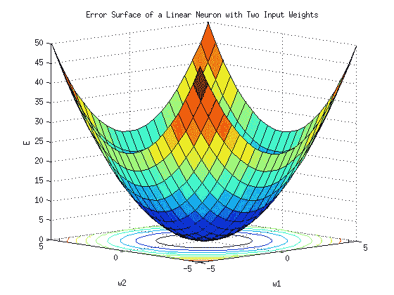
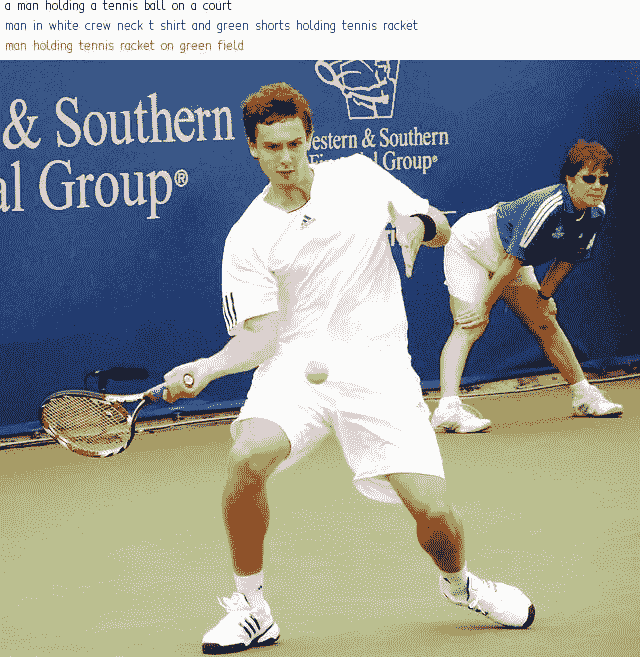

# 学会像政治家一样说话的人工智能

> 原文：<https://towardsdatascience.com/the-ai-that-learned-to-talk-like-a-politician-8d28df4ff364?source=collection_archive---------30----------------------->

## 神经网络训练中实现特异性和准确性平衡的案例研究

Credit: Cloudsight

在[之前的一篇文章](/use-ai-to-write-captions-for-images-with-cloudsight-python-a82115f16ab8)中，我分享了一些关于 Cloudsight 人工智能平台的细节，该平台能够用完整的人类可读的句子描述图像。

[Cloudsight](https://cloudsight.ai/) 团队非常友好地分享了他们的系统如何工作的大量细节，我将深入研究这些细节。我认为他们的平台是一个有趣的深度学习案例研究，并揭示了与任何从事人工智能和数据科学工作的人相关的见解。

当 Cloudsight 创建他们的神经网络驱动字幕平台时，他们遇到了一个我认为很有趣的训练挑战。这就像过度拟合，但有一个扭曲。这无意中导致了一个人工智能训练自己像政治家一样说话！

## NN 训练，有转折

在 Cloudsight 的平台上，用户上传一张图片，系统会尝试用完整的句子标题来描述它。他们的系统的基本架构使用基于变压器的方法中的神经网络来创建他们的字幕，利用主要是电子商务图像的巨大训练集。

在训练他们的模型时，他们遵循训练神经网络的标准协议。您向它提供输入，评估它的输出，让它通过它的节点传播错误，改变不同输入和隐藏层的权重。然后你重复做同样的事情，一遍又一遍，重复一定次数的训练。

NNs find the minima on an error surface by iterating through multiple training epochs. Credit: Wikimedia.

对于 NNs，真的没有停止条件。因此，通常的协议是监控输出，并查看错误率何时达到稳定水平。当这种情况发生时，你可以相当确定模型已经在误差曲面上找到了一个极小值。

也许你用不同的起始条件再次运行这个模型，确保你找到了一个全局最小值而不是局部最小值。但是最后，你会看到一个清晰的平台，知道模型已经完全训练好了，你可以停下来了。

## 特定与一般

Cloudsight 的协议有点不一样，因为他们的评测标准有点不一样。他们的系统生成的字幕必须对人有意义。因此，为了选择适当数量的训练时期，他们必须由一个人来运行他们系统的输出，这个人决定神经网络的标题是否准确地描述了一幅图像。

但是有个问题。这个系统有一个漏洞。

起初，Cloudsight 发现他们未经训练的神经网络在生成非常具体的字幕方面做得很好。对于这篇文章顶部的训练图像，比如写着“穿着白色圆领 t 恤和绿色短裤拿着网球拍的男子”、“绿茵场上拿着网球拍的男子”等。

Credit: Cloudsight

这非常具体——你可以描述这个人的性别、他们的行为(一般来说)以及他们的服装。

这也是不对的。这个男人穿着白色短裤，不是绿色的。模型很可能看到了其他人弯腰时的绿色，并将“绿色短裤”分配给了拿着球拍的人。他是在球场上，不是在球场上。

根据 Cloudsight 的评估标准，神经网络因产生这种不正确的输出而受到惩罚。所以它做了一些非常有趣的事情。随着每一个连续的训练时期，它变得更加普遍。因此，它甚至不再试图描述这个人的服装、背景等，而是慢慢转向描述“一个站着的人”或仅仅是“一个人”

事情是这样的——从技术上讲，输出是正确的*。图像*确实*描绘了一个人。所以神经网络会在输出上得到“正确”的分数，即使输出非常非常一般。*

## 绕着问题说话

用 R.E.M .的话来说，这个系统已经学会了“一种解决问题的方法”。

事实上，正如 Cloudsight 在他们的内部评论中指出的那样，NN 已经知道如何像一个政治家一样行事——选择几乎没有实际内容的输出，因此总是避免说错任何话。

面试官:先生，你对税收减免持什么态度？

政治家:我认为所有美国人都有权在这片我们称之为家园的伟大土地上发挥他们的全部潜力。

*人群:**雷鸣般的掌声***

当然，问题是，虽然根据 Cloudsight 的评估标准，一般输出在技术上是正确的，但作为实际的标题，它也有点儿没用。

当然，图像中确实有一个人。而是他们正在做的动作，他们拿着什么，等等。这很重要。

## 一种新的过度拟合

Cloudsight 在这里的挑战本质上是一个过度拟合的问题——但有了新的变化。

任何从事数据科学的人都熟悉过度适应训练数据的问题。选择过于特定领域或过于狭窄的数据，你可以训练一个回归模型或神经网络，在这方面做得很好。但是把这个模型放到现实世界中，它会做得很糟糕。您已经使您的模型“过度适应”了训练数据，它不能处理您的训练集之外的任何东西。

Cloudsight 的系统面临着不同版本的过度拟合。它没有过度适应*训练数据*，而是过度适应*评估标准*。

它并没有真正变得更擅长描述图像，而是变得非常擅长制作游戏系统的装备，满足评估标准(“这个标题准确描述了图像的视觉内容吗？”)而忽略了系统的实际业务/技术用例(提供人类可读的图像标题)。

**这说明了在训练神经网络或其他深度学习模型时，非常仔细地选择评估标准的重要性**。现代神经网络是强大的。他们会学会满足你的评价标准。但是如果标准有缺陷，你的产出也会有缺陷。

## 一个解决方案

Cloudsight 解决了这个问题，它根据特定客户的使用案例定制了训练时期的数量，从而提高了模型的准确性/通用性。

对于一些用户来说，一个更冗长的——但可能不准确的——标题就可以了。也许他们有自己的人在循环中，他们可以捕捉像绿色短裤这样的错误，并对计算机生成的字幕进行简单的更改。对于这些用户(像股票照片行业的用户)，Cloudsight 可以通过更少的时期(平均 4 个)进行训练，使结果更加冗长和具体，可能会损失准确性。

对于其他用户来说，准确性是至关重要的——他们宁愿要一个笼统的标题，而不是一个不准确的标题。对他们来说，“一个人”可能是好的，并且比更具体的标题更好，更可能是不准确的。基本上，他们想要一个政治家。对于手动检查标题的资源有限的用户，或者处理大量图像的用户(如电子商务平台)，这是有意义的。对于这些用户来说，Cloudsight 平均训练 18 个历元，从而产生更通用但通常更准确的输出。

基本上，Cloudsight 认识到他们的训练协议必须在准确性和通用性之间取得平衡，并通过不同数量的时期(平均在 3 到 20 个之间)进行训练，在不同的点为不同的用户设置两者之间的阈值和截止点。

## 经验教训

同样，Cloudsight 的经验强调了在训练深度学习系统时，适当设置评估标准的重要性。**仅仅因为你得到了无错的输出并不意味着你实际上已经解决了你想要解决的现实世界的问题**。

这也说明了在你的评估过程中加入一个团队的重要性。人类可以发现过度拟合的例子，并设计出适合特定商业案例的解决方案。对于 Cloudsight 来说，这意味着使用他们的过度拟合问题作为工具，根据不同的客户用例定制训练时期的数量，从而改变他们模型的输出。

对于其他人来说，这可能意味着知道何时需要更多的数据，以避免过度适应特定的数据集。或者，这可能意味着寻找公共数据集之外的训练数据，以确保您不会过度适应您的竞争对手已经可用的材料。

这也可能是对政治家的评论——但那是另一篇文章的主题！