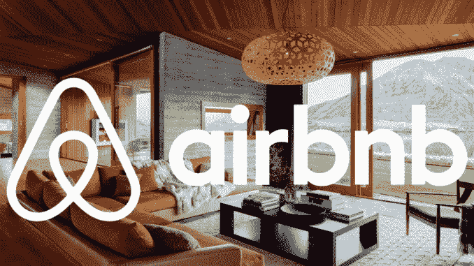

# Airbnb 数据科学家访谈

> 原文：<https://towardsdatascience.com/the-airbnb-data-scientist-interview-da8baa14b5da?source=collection_archive---------12----------------------->

数据科学对 Airbnb 有多重要？按照他们的说法，*“数据是客户的声音，数据科学是对声音的诠释”*。Airbnb 以让公众了解他们的数据科学和机器学习团队而自豪，这些团队为他们的市场产品提供支持。Airbnb 的数据科学家精通处理大量数据，并将其解释给业务职能部门。

Airbnb 的数据科学家的职责是:

*   组织数据和创建 ETL 管道。
*   分析、处理数据，并将数据可视化为有用的信息。
*   在实践中应用数据科学来移动指针。

*如果你正在寻找更受欢迎的数据科学指南，请查看* [*Square 数据科学家访谈*](https://www.interviewquery.com/blog-square-data-scientist-interview/) *和* [*DoorDash 数据科学家访谈*](https://www.interviewquery.com/blog-doordash-data-science-interview-questions/) *。*

# **Airbnb 的数据科学家角色**

在 Airbnb，数据科学家的角色分为三层。即:**分析、推理、算法。**

**数据科学家——分析**这个职位需要评论和问很多问题。这一类别的数据科学家必须非常注重细节和好奇，同时专注于分析数据，以确定业务决策，从而推动工作。这个职位与脸书和 LinkedIn 等公司的数据科学职位非常相似。

**数据科学家——推理**职位与利用数据可视化和统计学解决问题有关。符合这一类别的候选人拥有丰富的经济学和统计学知识，并拥有较高的博士学位背景。

数据科学家—算法职位是编程工作量最大的。数据科学家需要使用不同的编程语言，创建模型，并将机器学习系统部署到生产中。数据科学家必须解决的问题与所有用户的排名推荐和匹配最相关。这个角色最类似于机器学习工程师。

# **面试流程**

Airbnb 数据科学家面试流程包括三个阶段。

## **电话筛选**

第一阶段是招聘人员的电话筛选。Airbnb 会仔细查看申请人的简历，看看申请人的资质如何。Airbnb 招聘人员对数据科学申请者关心的一件事是他们对 Airbnb 和产品的了解。如果可以的话，创造性地联系 Airbnb，或者对他们的产品进行预先分析，并考虑你将构建或开发哪些功能。

## **数据科学带回家挑战**

第二阶段是数据科学挑战。Airbnb 将向您发送数据科学带回家挑战。一般来说，会给你带回家的作业或挑战，他们会要求你在 24 到 48 小时内完成并发回。

分析带回家挑战是一项数据分析挑战。给定一个数据集，分析它并制作一个 powerpoint 演示文稿。

对于数据科学家算法职位，候选人将获得一个 Airbnb 带回家的问题，要求在 3 小时内解决。主要测试来自数据的洞察力，并建立一个简单的预测模型，并对您选择该模型的原因进行推理。

***如果你想要一份 Airbnb 的带回家挑战，就来看看我的创业*** [***面试查询***](https://www.interviewquery.com/) ***。***

## **现场面试和演示**

第三个也是主要的阶段是内部数据挑战。在这一点上，候选人被介绍给 Airbnb 数据团队，向他们展示了作为数据科学家在 Airbnb 工作的基本情况。之后，一个真正的任务是给候选人一个开放式的分析问题。这取决于候选人整理数据，提出策略，并向团队解释他们的策略对他们有什么用。这项挑战的时间通常为 7 小时。在分配的时间到期时，候选人被要求向 Airbnb 小组展示他/她的作品。

通过这一阶段的候选人现在被安排参加另一轮面试。总共有 5-1:1 的访谈，其中两个是白板编码的技术访谈，另外两个是最后一个行为的产品访谈。

# **样本 Airbnb 数据科学家面试问题**

为了帮助你充分准备 Airbnb 的数据科学面试，这里有一些你应该准备好的问题。

*   为 Airbnb 房源设计一个推荐系统。
*   在 SQL db 中，您需要哪些表和索引来管理聊天线程？
*   你如何衡量我们运营团队的效率？
*   昨天我们看到页面浏览量有所下降。你会如何调查发生的事情？
*   你会如何向商业人士解释 p 值？
*   一位产品经理运行 AB 测试，并返回 0.04 的 p 值。你如何评估结果的有效性？
*   *给定两个表，一个包含用户简介和兴趣，另一个包含要推荐的房子，以及主题标签和元数据，如便利设施、价格、评论、位置、国家、主题等..使用这些数据创建一个推荐引擎。*
*   *修改 K-means 和 K-NN 的机器学习实现。*

***对 Airbnb 更多问题及解决方案感兴趣？报名*** [***面试查询***](https://www.interviewquery.com/) ***！***

## 最后的提示

在**内部数据科学带回家挑战**中，大多数候选人都没能通过面试。当最初熟悉模式和数据系统，并且没有足够的时间来应对挑战时，到现场是很困难的。为了做好准备，用你可以在网上找到的数据集热身，练习其他算法角色的编码挑战，比如 LeetCode 问题。

机器学习算法基础知识( **K-means，KNN，线性回归，SVM，决策树，随机森林**等。)应该是知道的，不过有个数学基础知识也无妨，还有概率。SWE(软件工程)的基础知识也会派上用场。

> [*在面试查询上试试下面这个来自 Airbnb 面试的机器学习问题。*](https://www.interviewquery.com/questions/booking-regression)
> 
> 假设我们想要建立一个模型来预测 Airbnb 上的预订价格。
> 
> *在线性回归和随机森林回归之间，哪个模型表现更好，为什么？*

还有，在 Airbnb 上做足功课。关于他们的文化、公司核心价值观以及最近的产品和发布的研究文章。

最后，当你被要求为你的简历辩护时，做好准备。不要轻视任何问题，因为招聘人员没有时间开玩笑。如果他们问你任何问题，那是因为他们需要答案来给你的表现打分。