# 阿凯克信息标准

> 原文：<https://towardsdatascience.com/the-akaike-information-criterion-c20c8fd832f2?source=collection_archive---------1----------------------->


Image by [Manfred Antranias Zimmer](https://pixabay.com/users/Antranias-50356/?utm_source=link-attribution&utm_medium=referral&utm_campaign=image&utm_content=339506) from [Pixabay](https://pixabay.com/?utm_source=link-attribution&utm_medium=referral&utm_campaign=image&utm_content=339506) under [Pixabay license](https://pixabay.com/service/license/)

## 了解 AIC 及其使用方法

## AIC 简介

**A**kaike**I**information**C**riterion(**AIC**)让您测试您的模型与数据集的拟合程度，而不会过度拟合。

AIC 分数奖励达到高拟合优度分数的模型，如果它们变得过于复杂则惩罚它们。

就其本身而言，AIC 分数没有多大用处，除非将其与竞争模型的 AIC 分数进行比较。

具有较低 AIC 分数的模型预期在其拟合数据集的能力和避免过度拟合数据集的能力之间达到较好的平衡。

## **AIC 得分公式**

AIC 分数的计算公式如下:

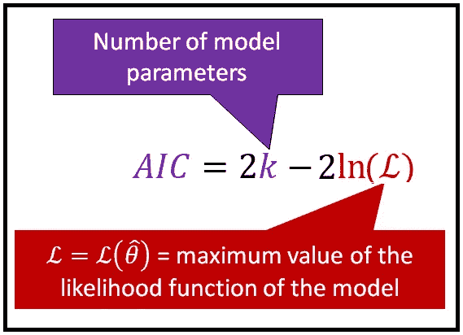

*Formula for the Akaike Information Criterion (Image by* [*Author*](https://sachin-date.medium.com/)*)*

AIC 公式建立在四个概念之上，这四个概念相互依存，如下所示:

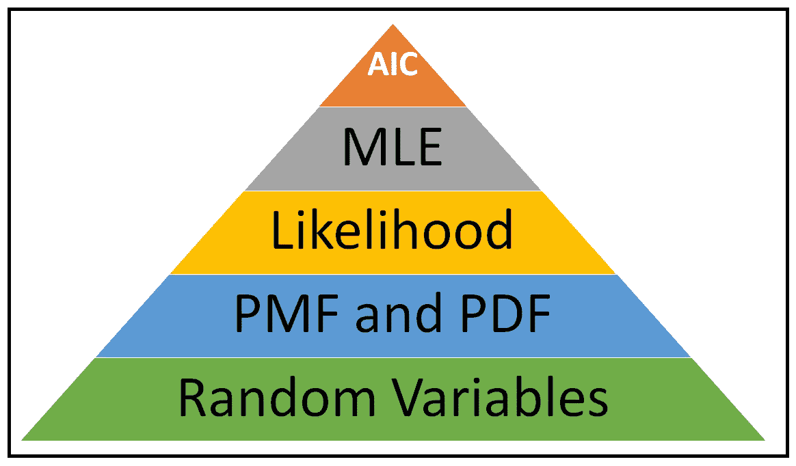

The concepts on which the AIC is based *(Image by* [*Author*](https://sachin-date.medium.com/)*)*

让我们再来看看 AIC 公式，但这一次，让我们重新组织一下:

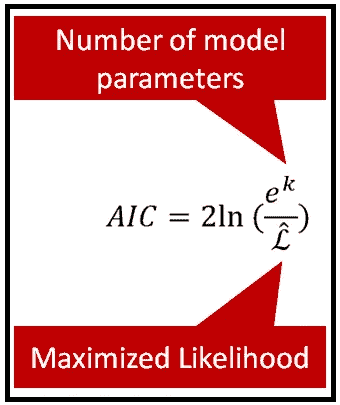

AIC formula *(Image by* [*Author*](https://sachin-date.medium.com/)*)*

让我们回忆一下，较小的 AIC 分数比较大的分数更可取。使用重写的公式，可以看到模型的 AIC 分数将如何与分子值的增长成比例地增加，分子值包含模型中参数的数量(即模型复杂性的度量)。并且 AIC 分数将与分母的增长成比例地降低，分母包含模型的最大对数似然(正如我们刚刚看到的，它是模型拟合优度的度量)。

## **使用 AIC 分数比较两个模型**

AIC 分数只有在用于比较两个模型时才有用。假设我们有两个这样的模型，参数数量分别为 *k1* 和 *k2* ，AIC 得分为 AIC_1 和 AIC_2。

假设 AIC_1 < AIC_2 i.e. model 1 is better than model 2.

How much worse is model 2 than model 1? This question can be answered by using the following formula:

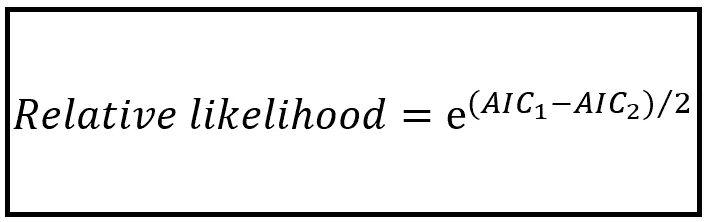

Relative likelihood of AIC models *(Image by* [*Author*](https://sachin-date.medium.com/)*)*

Why use the ***exp()*** 函数计算相对似然？为什么不从 AIC_1 中减去 AIC_2 呢？首先， ***exp()*** 函数确保相对可能性总是正数，因此更容易解释。

## **示例**

如果您使用 Python *statsmodels* 库来构建和训练一个**O**rdinary**L**east**S**quares**R**egression 模型，则 statsmodels

## **:如何使用 AIC 选择最佳模型**

让我们进行一个有希望成为有趣的模型选择实验。我们将使用马萨诸塞州波士顿市 1978 年至 2019 年的日平均气温数据集。这些数据可以从 NOAA 的网站上下载。

原始数据集(你可以在这里访问[)包含日平均温度值。原始数据的前几行复制如下:](https://gist.github.com/sachinsdate/d58a6363b700acd6fcdb0e9e4395e474)

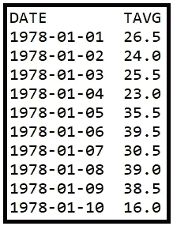

*(Image by* [*Author*](https://sachin-date.medium.com/)*)*

## 探索数据集

对于我们的模型选择实验，我们将在一个月的水平上聚集数据。

汇总后，我们将很快看到如何在*熊猫*中进行汇总，每个月的绘制值如下所示:

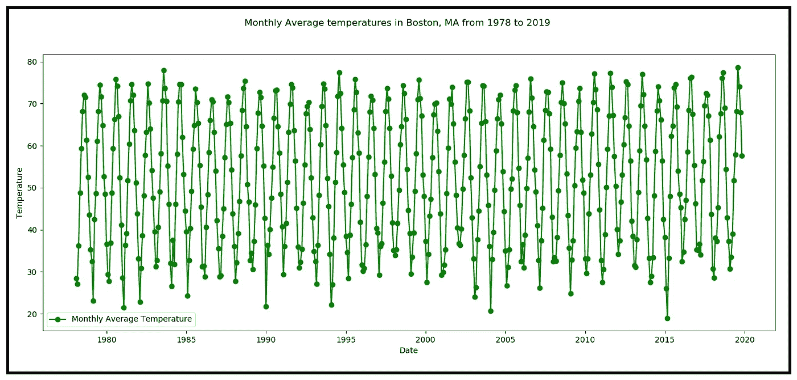

Monthly average temperature in the city of Boston, Massachusetts (Source: [NOAA](https://www.ncdc.noaa.gov/cdo-web/search)) *(Image by* [*Author*](https://sachin-date.medium.com/)*)*

让我们也绘制平均温度 TAVG 对其自身的时间滞后版本，从 1 个月到 12 个月的各种时间滞后。以下是一组结果散点图:

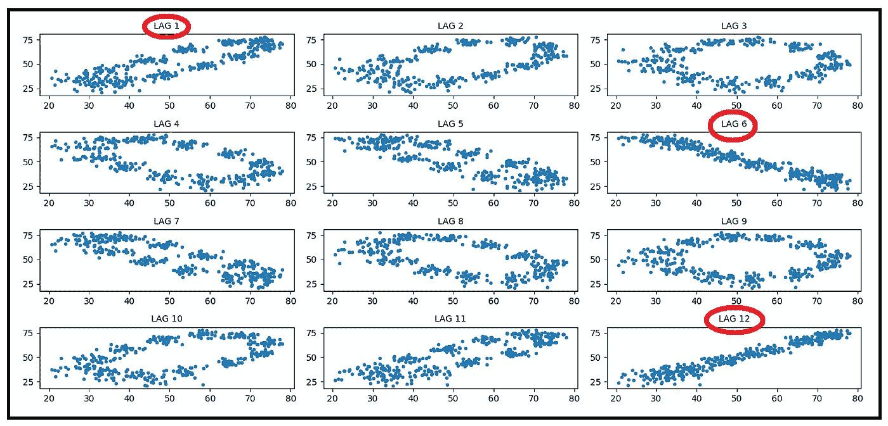

Scatter plots of average monthly temperature against lagged versions of itself *(Image by* [*Author*](https://sachin-date.medium.com/)*)*

很明显，滞后 6 和滞后 12 具有很强的相关性，这是月平均温度数据所预期的。诸如 LAG1、LAG5 和 LAG7 之类的其他滞后也可能表现出解释目标变量值的一些变化的显著能力。我们很快就会知道这是不是真的。

## 回归目标

我们回归的目标是创建一个模型来预测波士顿的月平均温度，即 TAVG 值。因此，我们的目标，也称为响应变量，将是 TAVG。

## 回归策略

我们的回归策略如下:

1.  由于我们在滞后 6 和 12 处看到了很强的季节性，我们将假设目标值 TAVG 可以使用目标值的一个或多个滞后版本进行预测，直到滞后 12。
2.  因此，我们将把滞后变量 TAVG_LAG_1，TAVG_LAG_2，…，TAVG_LAG_12 添加到我们的数据集中。这些是我们的解释变量。
3.  接下来，我们将使用 *statsmodels* 库构建几个普通的最小二乘回归(OLSR)模型。每个模型都试图用一些时滞变量的组合来解释 TAVG 的变化。由于我们不知道滞后变量的什么组合会导致“最优”模型，我们将通过滞后变量的所有可能组合进行强力搜索。总共有 4000 多种型号组合！
4.  我们将建立一个滞后变量模型，对应于这些组合中的每一个，训练模型，并检查其 AIC 分数。
5.  在我们搜索模型空间的过程中，我们将跟踪具有最低 AIC 分数的模型。
6.  最后，我们将打印出具有最低 AIC 分数的模型的概要特征。我们还将使用其他几个模型评估标准来检查这个最优模型，比如 t 检验和 f 检验。
7.  最后，我们将在测试数据集上测试最优模型的性能。

让我们实施这个策略。

## 使用 Python、pandas 和 statsmodels 实现回归策略

导入所有必需的包。

```
**import** pandas **as** pd**from** patsy **import** dmatrices**from** collections **import** OrderedDict**import** itertools**import** statsmodels.formula.api **as** smf**import** sys**import** matplotlib.pyplot **as** plt
```

将数据集读入熊猫数据框。

```
df = pd.read_csv(**'boston_daily_temps_1978_2019.csv'**, header=0, infer_datetime_format=**True**, parse_dates=[0], index_col=[0])
```

数据集包含日平均温度。我们想要月平均值。因此，让我们将数据累计到一个月的水平。事实证明，使用熊猫*做这件事很简单。*

```
df_resampled = df.resample(**'M'**).mean()
```

我们将在数据集中添加滞后变量列。让我们创建数据集的副本，这样我们就不会干扰原始数据集。

```
df_lagged = df_resampled.copy()
```

添加 12 列，每一列包含 TAVG 的滞后版本。

```
**for** i **in** range(1, 13, 1):
   df_lagged[**'TAVG_LAG_'** + str(i)] = df_lagged[**'TAVG'**].**shift**(i)
```

打印出滞后变量数据集的前 15 行。

```
print(df_lagged.head(15))
```

这将打印出以下输出:

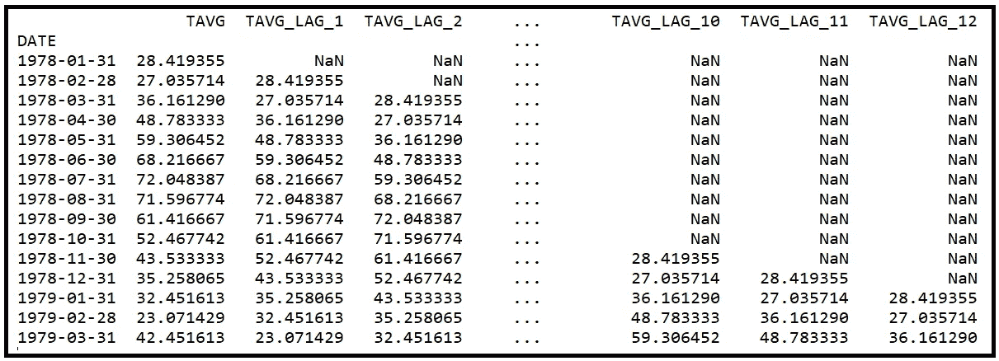

The data set containing 12 lagged variables *(Image by* [*Author*](https://sachin-date.medium.com/)*)*

前 12 行包含由 *shift* 函数引入的 nan。让我们去掉这 12 行。

```
**for** i **in** range(0, 12, 1):
   df_lagged = df_lagged.drop(df_lagged.index[0])
```

打印出前几行，以确认 nan 已被删除。

```
print(df_lagged.head())
```

在我们对数据进行更多的观察和研究之前，我们将留出 20%的数据集来测试最优模型。

```
split_index = round(len(df_lagged)*0.8)split_date = df_lagged.index[split_index]df_train = df_lagged.loc[df_lagged.index <= split_date].copy()df_test = df_lagged.loc[df_lagged.index > split_date].copy()
```

现在让我们创建滞后值的所有可能组合。为此，我们将创建一个字典，其中的键包含从 1 到 12 的不同组合。

```
lag_combinations = OrderedDict()l = list(range(1,13,1))

**for** i **in** range(1, 13, 1):
   **for** combination **in** itertools.combinations(l, i):
      lag_combinations[combination] = 0.0
```

接下来，我们将迭代所有生成的组合。对于每个滞后组合，我们将使用 [*patsy* 语法](https://patsy.readthedocs.io/en/latest/quickstart.html)构建模型的表达式。接下来，我们将为变量的滞后组合构建线性回归模型，我们将在训练数据集上训练模型，我们将要求 *statsmodels* 为我们提供模型的 AIC 得分，如果当前得分小于目前看到的最小值，我们将记录 AIC 得分和当前“最佳模型”。我们将在下面这段代码中完成所有这些工作:

```
#Current minimum AIC score
min_aic = sys.float_info.max#Model expression for the best model seen so far
best_expr = **''**#OLSResults objects for the best model seen so far
best_olsr_model_results = **None** expr_prefix = **'TAVG ~ '**#Run through each lag combination **for** combination **in** lag_combinations:
   expr = expr_prefix

   i = 1 #Build the model's expression in patsy notation, for e.g. 'TAVG ~ TAVG_LAG_1 + TAVG_LAG_2' represents a model containing two lag variables and TAVG_LAG_1 and TAVG_LAG_2 plus the intercept**for** lag_num **in** combination:
      **if** i < len(combination):
         expr = expr + **'TAVG_LAG_'** + str(lag_num) + **' + '
      else**:
         expr = expr + **'TAVG_LAG_'** + str(lag_num)

      i += 1

   print(**'Building OLSR model for expr: '** + expr)

   #Given a model expression, patsy makes it easy to carve out the X,y matrices from the data set. We will use X_test, y_test later for testing the model. y_test, X_test = dmatrices(expr, df_test, return_type=**'dataframe'**)

   #Build and fit the OLSR model using statsmodels
   olsr_results = smf.ols(expr, df_train).fit()

   #Store away the model's AIC score
   lag_combinations[combination] = olsr_results.aic print(**'AIC='**+str(lag_combinations[combination])) #If the model's AIC score is less than the current minimum score, update the current minimum AIC score and the current best model
   **if** olsr_results.aic < min_aic:
      min_aic = olsr_results.aic
      best_expr = expr
      best_olsr_model_results = olsr_results
```

最后，让我们根据我们的评估标准打印出最佳 OLSR 模型的摘要。这是 AIC 分数最低的型号。

```
print(best_olsr_model_results.summary())
```

这将打印出以下输出。我在输出中突出了几个有趣的区域:

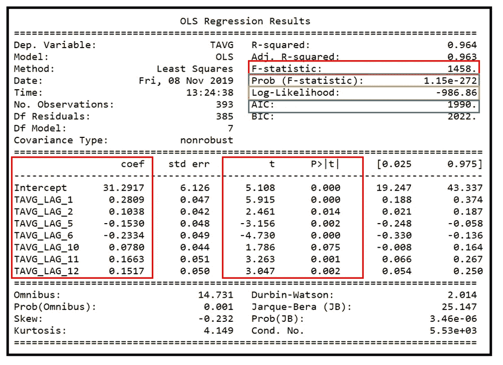

Model summary generated by statsmodels *OLSResults.summary() (Image by* [*Author*](https://sachin-date.medium.com/)*)*

让我们检查突出显示的部分。

## 模型参数的选择

我们基于 AIC 评分的模型评估策略已确定了一个具有以下参数的模型:


Model parameters and their regression coefficients *(Image by* [*Author*](https://sachin-date.medium.com/)*)*

其他滞后 3、4、7、8、9 已被确定为不足以*共同*解释因变量 TAVG 的方差。例如，我们看到 TAVG_LAG_7 没有出现在最佳模型中，即使从我们之前看到的散点图来看，响应变量 TAVG 和 TAVG_LAG_7 之间似乎有很大的相关性。遗漏的原因可能是 TAVG_LAG_7 中的大部分信息可能已经被 TAVG_LAG_6 捕获，并且我们可以看到 TAVG_LAG_6 包括在最优模型中。

## 模型参数的统计显著性(t 检验)

第二件要注意的事情是，除了 TAVG_LAG_10 之外，最优模型的所有参数**在双尾 t-检验的 95%置信水平下分别*具有统计显著性。他们“t”分数的报告 p 值小于 0.025，这是在双尾检验中 95%置信水平下的阈值 p 值。***

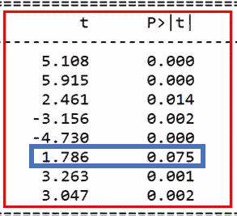

The t value and the p-value of the model parameters *(Image by* [*Author*](https://sachin-date.medium.com/)*)*

## 模型参数的联合显著性(f 检验)

第三件要注意的事情是，在解释响应变量 TAVG 的方差时，模型的所有参数*都是共同显著的*。

这可以从 [F 统计量](/fisher-test-for-regression-analysis-1e1687867259) 1458 看出。在 95%的置信度下，其 p 值为 1.15e-272。这个概率值小得令人难以置信，以至于你甚至不需要查找 [F 分布](http://www.socr.ucla.edu/Applets.dir/F_Table.html)表来验证 F 统计量是否显著。该模型在解释 TAVG 中的方差方面肯定比仅使用截距的模型好得多。

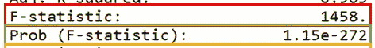

F-statistic and its p-value. All mdoel parameters are jointly significant *(Image by* [*Author*](https://sachin-date.medium.com/)*)*

> 要了解更多关于如何解释 F-统计量的信息，请参考我关于[F-检验](/fisher-test-for-regression-analysis-1e1687867259)的文章。

## AIC 分数和拟合模型的最大对数似然

最后，我们来看看 *statsmodels* 报道的 **1990.0** 的 **AIC** 得分，以及 **-986.86** 的最大化对数似然。

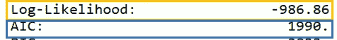

Maximized Log-likelihood and the AIC score *(Image by* [*Author*](https://sachin-date.medium.com/)*)*

我们可以看到模型包含 **8 个参数(7 个时滞变量+截距)**。所以根据 AIC 分数的公式:

AIC 得分= 2*参数数量-2 *最大化对数似然
= 2*8 + 2*986.86 = 1989.72，四舍五入到 1990。0

这正是 statmodels 报告的值。

## 在样本外数据上测试模型的性能

我们实验的最后一步是在测试数据集上测试最优模型的性能。请记住，模型在训练期间没有看到这些数据。

我们将要求模型使用以下单行代码对测试数据集生成预测:

```
olsr_predictions = best_olsr_model_results.get_prediction(X_test)
```

让我们得到预测的汇总框架，并打印出前几行。

```
olsr_predictions_summary_frame = olsr_predictions.summary_frame()print(olsr_predictions_summary_frame.head(10))
```

输出如下所示:

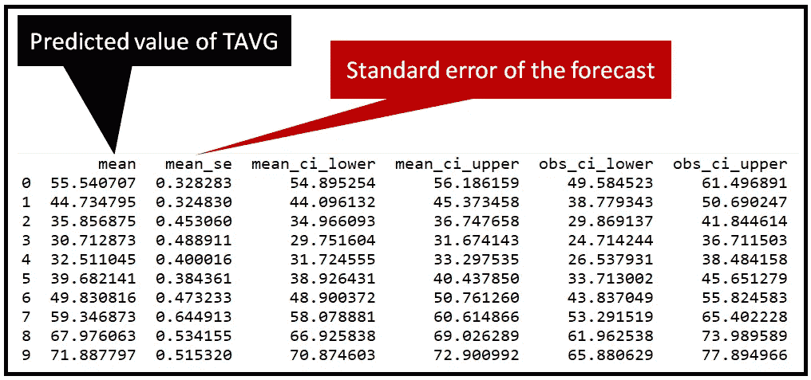

Prediction summary frame: first 10 rows *(Image by* [*Author*](https://sachin-date.medium.com/)*)*

接下来，让我们提取实际和预测的 TAVG 值，以便绘制它们:

```
predicted_temps=olsr_predictions_summary_frame[**'mean'**]actual_temps = y_test[**'TAVG'**]
```

最后，让我们绘制预测的 TAVG 与来自测试数据集的实际 TAVG 的关系图。

```
fig = plt.figure()fig.suptitle(**'Predicted versus actual monthly average temperatures'**)predicted, = plt.plot(X_test.index, predicted_temps, **'go-'**, label=**'Predicted monthly average temp'**)actual, = plt.plot(X_test.index, actual_temps, **'ro-'**, label=**'Actual monthly average temp'**)plt.legend(handles=[predicted, actual])plt.show()
```

情节是这样的:

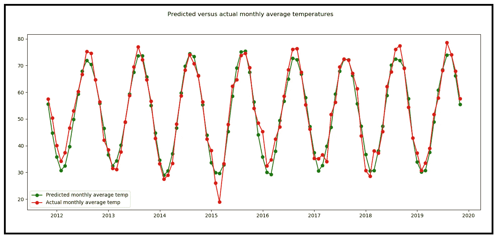

Predicted versus actual values of average monthly temperatures *(Image by* [*Author*](https://sachin-date.medium.com/)*)*

在上面的图中，看起来我们的模型惊人地能够预测未来几年的温度！然而，现实却大相径庭。我们要求模型做的是通过考虑上个月、前一个月等的温度来预测当前月的平均温度。换言之，通过考虑模型的参数值:TAVG_LAG1、TAVG_LAG2、TAVG_LAG5、TAVG_LAG6、TAVG_LAG10、TAVG_LAG11、TAVG_LAG12 和回归截距。

我们要求模型对每个时间段进行预测，并且我们要求它对测试数据集中的样本数量一样多的时间段进行预测。因此，我们的模型只能可靠地做出一个月的预测。鉴于模型中的参数之一是上个月的平均温度值 TAVG_LAG1，这种行为是完全可以预料的。

这就完成了我们的选型实验。

以下是本文中使用的完整 Python 代码:

数据集在[这里](https://gist.github.com/sachinsdate/d58a6363b700acd6fcdb0e9e4395e474)可用。

## 摘要

让我们总结一下要点:

*   **AIC** 分数为您提供了一种衡量模型拟合度的方法，同时惩罚过度拟合数据的模型。
*   AIC 分数本身是没有用的。在进行模型选择时，需要将其与其他模型的 AIC 分数进行比较。较低的 AIC 分数表明较高的拟合优度和较小的过度拟合倾向。
*   在使用 AIC 评分进行模型选择时，还应进行其他重要测试，如学生 t 检验和 [F 检验](/fisher-test-for-regression-analysis-1e1687867259)，以便对模型对所考虑数据集的适用性进行 360 度评估。

*感谢阅读！我撰写关于数据科学的主题，重点是时间序列分析和预测。*

*如果你喜欢这篇文章，请关注我的*[***Sachin Date***](https://timeseriesreasoning.medium.com)*获取关于时间序列分析和预测主题的提示、操作方法和编程建议。*