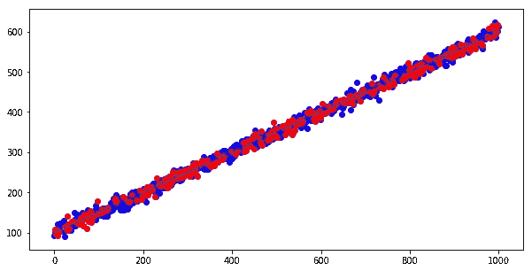
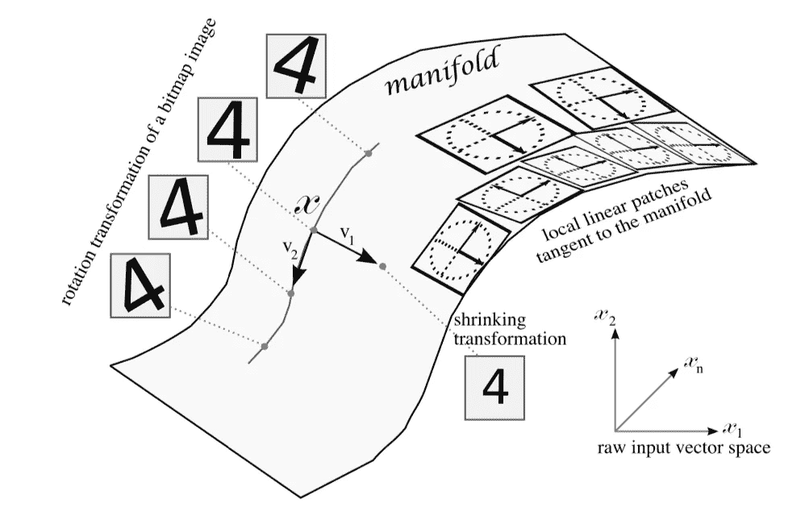

# 深度学习模型总是最好的吗？

> 原文：<https://towardsdatascience.com/the-almighty-deep-learning-or-is-it-270d09ea2f27?source=collection_archive---------29----------------------->

## 神经网络和线性回归之间的实验比较。


Photo by [Alina Grubnyak](https://unsplash.com/@alinnnaaaa?utm_source=medium&utm_medium=referral) on [Unsplash](https://unsplash.com?utm_source=medium&utm_medium=referral)

深度学习(DL)已经接管了 AI/ML 在工业和研究社区中的几乎所有应用领域。两年前我离开了学术界，在数据科学(DS)部门工作，我有机会见证了 DL 在这两个领域的出现和流行。尽管在许多应用/研究中，DL 无疑优于“传统的”ML 方法，但越来越多的学术科学家和 ML 实践者呼吁认识到这样一个事实，即在学术界和工业界，DL 模型和思维模式可能(并继续)被滥用([https://towards data science . com/the-machine-learning-crisis-in-scientific-research-91e 61691 AE 76](/the-machine-learning-crisis-in-scientific-research-91e61691ae76))。这已经成为一个时髦的词，使用相关的方法没有进一步的考虑或简单的自我提问:“这真的是这个问题的最佳选择吗？”。

我有多次机会面试团队中数据科学家职位的候选人，有几次我问了这样一个问题:

> 可以请你说一个你认为或确定知道 DL 模型会失效的例题吗？

当然，这个问题是一个公开的讨论，没有正确或错误的答案，但我经常发现候选人措手不及。

现在有无数的 ML 工具箱和平台，应用 ML 模型从来没有这么容易。同样，毫无疑问，所有使用 DL 的成功案例都会有，我相信会有更多；然而，正如我们都同意的那样，没有适用于所有情况的“通用”ML 模型，每个模型都有其[致命弱点](https://en.wikipedia.org/wiki/Achilles%27_heel)，DL 也不例外。

回到面试问题，我给自己构造了一个“思想实验”(更像是 DS 语言的 Jupiter 笔记本实验)，关于一个案例，天真地应用一个 DL 模型会失败。

**实验**

让我们创建一个合成数据集。我们假设我们正在观察来自未知*函数*的测量值，并且我们希望在使用标记数据进行训练之后，建立一个 ML 模型来预测给定采样独立变量的目标。事实上，未知函数(有时被称为“天知道”函数)是数据的自然分布，它产生我们观测到的测量值。在这个实验中，我们使用一个简单的直线函数`y=a*x+b`作为天知道的函数。然后，我们在目标中加入一些白噪声来模拟测量过程中的不确定性。

```
a = 0.5
b = 100
noise_mag = 10x = np.array(range(1000))
y = a*x + b
white_noise = noise_mag * np.random.randn(len(x))
y_noise = y + white_noise# --- split train test
x_train, x_test, y_train, y_test = train_test_split(x, y_noise, test_size=0.30, random_state=42)x_train = x_train.reshape(-1,1)
x_test = x_test.reshape(-1,1)
y_train = y_train.reshape(-1,1)
y_test = y_test.reshape(-1,1)plt.figure(figsize=(10,5))
plt.plot(x,y)
plt.scatter(x_train, y_train, c='b')
plt.scatter(x_test, y_test, c='r')
```



The visualization of the synthetic dataset.

正如我们所见，这是一个简单的数据集，自变量和因变量之间存在线性关系。

为了给数据引入一些错觉，我们创建了额外的“琐碎”特征:

```
x_tri_0 = x + 10
x_tri_1 = x * 10
x_tri_2 = np.power(x, 2)x_tri = np.concatenate((x.reshape(-1, 1), x_tri_0.reshape(-1, 1), x_tri_1.reshape(-1, 1), x_tri_2.reshape(-1, 1)), axis=1)
```

因此，我们添加了另外三个特性，它们都是原始特性的依赖项(通过线性和非线性转换创建)。任何在生产中处理过 ML 模型的人都能够很容易地指出，那些琐碎的特征可以通过查看特征相关性而被过滤掉。人们会看到 4 个特征之间有很强的相关性，表明只有一个特征可以代表全部数据。

当我们在做一个思维实验时，我们想看看在没有适当的数据清理和分析步骤的情况下，神经网络模型如何在原始数据上执行。因此，我们继续将这 4 个特征*直接*输入到 DL 模型中。

我们做了一个标准的训练测试数据集分割和训练一个 Keras 神经网络。

```
x_train, x_test, y_train, y_test = train_test_split(x_tri, y_noise, test_size=0.30, random_state=42)
y_train = y_train.reshape(-1,1)
y_test = y_test.reshape(-1,1)model = Sequential()model.add(Dense(50, input_dim=4))
model.add(Dense(10))
model.add(Dense(1))model.compile(loss='mse', optimizer='adam', metrics=['mse'])model.fit(x_train, y_train, epochs=150, batch_size=8)pred_keras = model.predict(x_test)
print('Test error of keras = {}'.format(
    np.sqrt(mean_squared_error(pred_keras, y_test))
))
```

这会产生:

```
Test error of keras = 36.048217021416036
```

我们的均方根误差(RMSE)为 36.048。

接下来，让我们去掉所有琐碎的特性，用我们上面构建的完全相同的 Keras 模型再试一次。换句话说，我们的特征空间现在有 1 维，而不是以前的 4 维，因为我们只保留“真实”的特征。这一次，我们得到:

```
Test error of keras = 13.52335035135193
```

RMSE 的显著改善(与 36.048 相比)。因此，我们看到一个 DL 模型(在这种情况下是一个神经网络)不能避免坏数据。

最后，我们来试试一个最简单也是最耗时的方法:线性回归。

```
lm = linear_model.LinearRegression()
model = lm.fit(x_train, y_train)
pred_linear_reg = model.predict(x_test)
print('Test error of linear regression = {}'.format(
    np.sqrt(mean_squared_error(pred_linear_reg, y_test))
))print('Linear model coefficient = {}'.format(model.coef_))
print('Linear model intercept = {}'.format(model.intercept_))
```

我们有以下结果:

```
Test error of linear regression = 9.416628580704634
Linear model coefficient = [[0.49959806]]
Linear model intercept = [99.95399408]
```

请注意，在上面的代码中，`x_train`只有“真”特性，即 dimension = 1。真是惊喜！RMSE 只有 9.42。请注意，线性模型在估计系数(0.4995 比 0.5)和截距(99.95 比 100)方面也做得很好。此外，RMSE 接近白噪声幅度(9.42 比 10)，因为线性回归模型非常接近基础(天知道)函数`y=a*x+b`。

**结论**

*   与任何其他 ML 方法一样，DL 由于较差的(或没有)特征准备而失败。捕捉特征空间中的抽象的能力并不能使它免受不干净数据的影响。
*   请注意，即使具有真实特征，Keras 模型的表现也不如线性回归(13.52 比 9.42)。在数据特征空间维数很高的问题上，DL 模型优于传统方法，但“实际”特征空间是数据空间的低维流形。这一点将在下面进一步讨论。

让我们来看看这个从 Yoshua Bengio 的一篇论文中复制的图[1]:



Image courtesy: [https://www.nowpublishers.com/article/Details/MAL-006](https://www.nowpublishers.com/article/Details/MAL-006)

假设你有一个 128x128 的数字 4 的灰度图像。由于这是一个 128x128 的图像，所以数据的维数是 128*128=16，384(一个像素是数据的一维)。现在，假设我们变换图中的数字 4，通过旋转或转换，每个变换的状态生成一个数据点。例如，我们有 100 张不同姿势的 4 号图片。如果我将这 16，384 维数据中的 100 个数据点绘制成 2D 图(16，384 行 100 个分笔成交点)，显然人们无法识别这些数据只是数字 4 的不同姿势。作为人类，我们不会在数据的每个单独维度上感知数据(和世界)，我们会在抽象和代表性的层面上感知它们。

同样的基本原则也适用于 DL 方法家族。

DL 方法被设计用于识别高维数据空间中的代表性模式(通常在低维中)。

在文中的例子中，实际自由度(DOF)只有 2(旋转和平移)，但数据空间的维数是 16384！对于传统方法来说，这是一个非常具有挑战性的问题，但是随着输入数据沿着层向上传播，DL 模型将能够学习更高级别的抽象和代表性特征。

那么，你的问题有这种性质吗？在我们的思想实验中，肯定不是，通过选择与数据性质(线性关系)匹配的正确模型(线性回归)，简单的线性回归胜过神经网络。

这篇文章是基于我的知识，当然它是有限的，所以请随时分享你的想法/评论。

快乐(机器)学习！

**参考**

[1] Yoshua Bengio，[学习人工智能的深度架构](https://www.nowpublishers.com/article/Details/MAL-006) (2009)，机器学习的基础和趋势