# 强化学习中的全能政策梯度

> 原文：<https://towardsdatascience.com/the-almighty-policy-gradient-in-reinforcement-learning-6790bee8db6?source=collection_archive---------4----------------------->

## 对策略梯度的概念及其如何适应强化学习的一步一步的简单解释。也许太简单了。

在这篇文章中，我将解释我们是如何推导出基本政策梯度定理的。为什么要对政策梯度有所了解？了解政策梯度是如何定义的将会给你工具去理解 90%的强化学习算法和论文。像这样的报纸:

因此，如果你对强化学习感兴趣，我强烈建议你参与 PG 的主题，因为它打开了数百万扇门。咒语是这样的:

> 我知道政策梯度从何而来，我能理解大部分强化学习。

区分策略梯度算法(我们使用策略梯度)和我们可以通过简单数学定义的策略梯度是很重要的。我经常看到人们对这两个概念感到困惑，所以我觉得有必要一开始就清楚地说明:

> 策略梯度是策略梯度强化学习算法的基础

现在，也有其他种类的强化学习算法，与政策梯度无关。但是策略梯度算法很酷，因为我们直接从优化中得到一个参与者(策略)。

# 预赛

> 盖房子，需要从地基开始。

我们强化学习的目标是什么？目标是最大化我们的政策 **π** 的回报 **J** ，自然，我们的政策是用某种参数来参数化的，我们在这里用 **θ** (theta)来表示。所以，简单地写下来，目标是这样的:

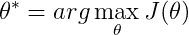

我们省略了编写 **π** ，因为我们说过 **π** 是由 **θ** 参数化的，这只是一个编写约定。等式表明，我们想要的是回报最大化的参数——废话！还不严重。请注意，这个定义在强化学习中是通用的，我们可以将各种东西打包到我们想要优化的这些参数中，这些参数也可以引用 Q 值函数参数，然后我们将查看基于值的方法，但在本文中，我们专注于策略梯度。既然知道了政策的回报是什么，就可以开始用更有意义的方式来讨论了。

首先，重要的是要注意，在强化学习中，我们处理马尔可夫决策过程或部分可观察的马尔可夫决策过程，从现在开始表示为 MDPs 和 POMDPs。MDPs 和 POMDPs 是形式化动态系统的一个很好的框架。基本上，我们可以将系统中的每个转换定义如下:

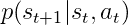

因此，简单地说，这表示在给定当前状态和动作的情况下，下一个状态的概率，所以我们也知道 MDP 是随机的，我们可能不确定在下一步中我们将结束于哪个状态。请注意，这里只有一步历史的概念，新状态只关心以前的状态和动作，这也称为马尔可夫性质或马尔可夫假设。这适用于 POMDPs 中的 MDPs，下一个状态附加地以一些不可见的隐藏状态为条件，这使得它们更困难但也更普遍。所以，让我们大声清楚地说出来:

> 马尔可夫假设指出下一个状态仅仅依赖于当前状态和动作。

既然我们理解了 MDP 的来源，并且有了一个观察环境(动态系统)的框架，我们就回到定义政策梯度。到目前为止，我们已经知道策略的回报是什么，并且知道如何在环境中编写转换。基本上，我们可以预计，我们将从不同的起始位置(轨迹)获得许多不同情况的数据。轨迹**τ**(τ)的返回是什么？嗯，它是轨迹中所有奖励的总和，非常简单:

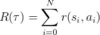

这个 **r** 函数是你通常会从你的环境中得到的阶梯奖励。我在这里使用了一个总和，所以我们假设环境是离散的(不是状态和动作)。有时，我们在这个方程中加入一个介于 0 和 1 之间的贴现因子，使一个无限和成为有限，但这对于有限轨迹并不是严格必要的。重要的是要知道，你可能知道也可能不知道这个回报函数在分析上看起来是什么样子，这就是强化学习的美妙之处。

很好，现在我们知道轨道的返回是什么了。但是我们也知道我们的环境是随机的！因此，我们的轨迹变成了一个随机变量(不管政策是否随机)。因此，我们的回报变成了一个随机变量！那么当我们最大化一个随机变量时，我们最大化了什么？我们最大化这个随机变量的期望值，或者在我们的例子中，最大化政策的回报:

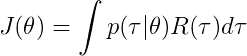

所以期望只是随机变量所有可能实现的加权和，其中权重是实现发生的概率。这非常有意义，你会想要对更有可能的东西进行加权，因此更有可能的轨迹的回报在我们的预期中具有更大的权重(非常有意义！).对于那些对微积分有问题的人，不要害怕积分，它基本上是一个表达式的和，当迭代一个连续变量的所有值(无限个值)时，连续变量就是我们的轨迹。

注意另一件事，轨迹概率是以政策参数为条件的条件概率。这是因为动作取决于策略，下一个状态取决于当前动作和当前状态，因此轨迹取决于参数和环境动态。瞧啊。完美的感觉。我们可以这样写出这个条件:

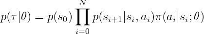

因为马尔科夫假设，我们只能把这个条件概率写成如上。这就是为什么它提炼出上面的好产品，很容易处理。到目前为止一切顺利……“自主”机器人正在等待。

# 梯度

> 最后是有趣的部分！

好了，现在我们了解了轨迹的条件概率，什么是轨迹，什么是轨迹回报，什么是策略回报，什么是预期策略回报…现在我们可以开始讨论优化部分，把数学提升一个档次。

所以，我们想最大化我们的回报，我们想通过梯度下降来实现。我们需要保单收益相对于保单参数θ的梯度。

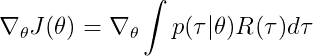

在这种情况下，梯度可以进入积分，所以我们得到下面的等式:

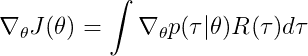

好的，所以回报取决于最终的轨迹，而不是直接取决于参数。我们只需要担心积分中的条件概率项。让我们根据目前所写的内容写出来:

取乘积的梯度真的很难看，我们不是真的想要那个，我们想要更好的，我们想要一个和。我们能做什么？你们中的一些人听说过对数导数技巧。洞察力如下(是的，它真的很简单),并且完全基于对对数求梯度的方式:

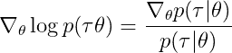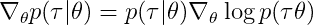

回到我们的政策梯度。现在我们可以这样写:

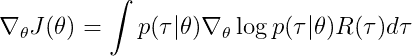

我们展开对数中的项，注意结果是我们可以将乘积写成对数的和(典型的对数和规则):

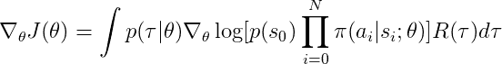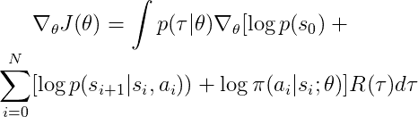

基于标准微积分，梯度算子滑入总和，不依赖于参数的部分变为 0，策略对数似然保持不变:

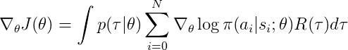

结果是对轨迹的期望。现在我们可以写出辉煌的最终结果，或者换句话说叫做政策梯度定理:

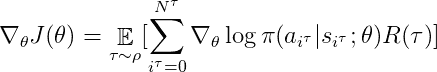

I have written tau in the superscript because logically we compute the some for many trajectories.

预期下的希腊字母 ro 表示我们的政策和环境动态所导致的轨迹分布，我们根据这些动态来计算我们的预期。这种分布会导致很多令人头痛的问题，因为为了得到期望的良好估计，我们需要能够很好地代表我们的分布的样本。这正是非策略策略梯度算法的不足之处，因为它们使用来自不同行为策略的数据，导致不同的分布，从而导致对策略梯度的错误估计。无独有偶，我也写过一篇关于这个的文章:[离策强化学习算法的虚假承诺](/the-false-promise-of-off-policy-reinforcement-learning-algorithms-c56db1b4c79a)。如果你对更多的细节感兴趣，请阅读它。

我们不能直接计算这个期望，它需要我们计算给定政策的所有可能的轨迹。我们能做的是用蒙特卡罗抽样来估计它。这只是一种奇特的说法，即我们对给定政策的一些轨迹进行采样，并取平均值作为期望值的估计。我们可以将它写成下面的形式，稍微滥用符号(M 表示我们用于估计的轨迹的数量):

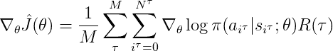

这基本上就是全部了。这自然是一个更好的估计，我们有更多的样本，当然，如果样本保持真实的诱导分布的基础上，目前的政策，我们正在优化。换句话说，我们目前的政策所导致的分布与样本所来自的分布相似吗？为了缓解这种情况，研究人员采用了一些聪明的技巧，比如重要性抽样、替代损失函数等等，我不会在这里讨论，也许下次吧。

现在，我们终于到了帖子的末尾，回头看看它…我相信，如果你理解了所有的概念，现在你已经有了理解策略梯度算法的(非常)坚实的基础，你也可以尝试消化一些强化学习论文了！作为下一篇文章，你可能想知道为什么非政策强化学习效果不好:

1.  [非策略强化学习算法的虚假承诺](/the-false-promise-of-off-policy-reinforcement-learning-algorithms-c56db1b4c79a)

希望这是有趣和直观的！如果你什么都明白，那就做得很好，如果不是，没什么大不了的，大多数人一开始都不明白。再研究一遍。现在你有了工具，强化学习的世界已经开放了…玩得开心点！

Photo by [Zac Durant](https://unsplash.com/@zacdurant?utm_source=medium&utm_medium=referral) on [Unsplash](https://unsplash.com?utm_source=medium&utm_medium=referral)