# 200 本书的剖析

> 原文：<https://towardsdatascience.com/the-anatomy-of-200-books-c09ca91fd084?source=collection_archive---------24----------------------->

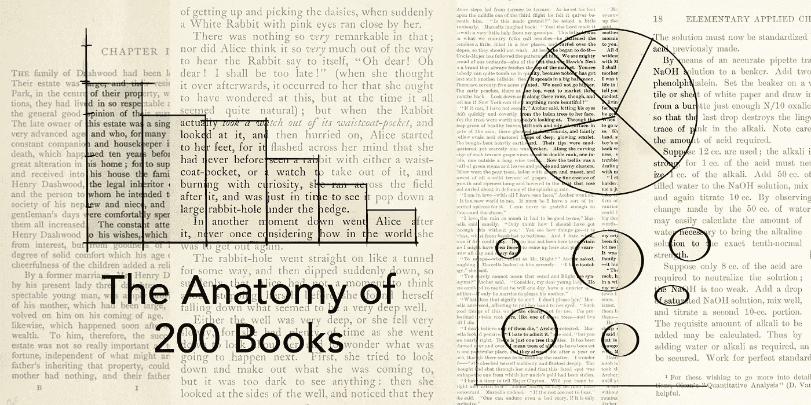

2011 年的某个时候，虽然我不记得是什么时候或如何发生的，但我意识到我想念阅读。我童年时是个书虫，但常见的干扰——电视、视频游戏、当时被称为互联网的神秘事物——侵蚀了我的阅读习惯。文字让位给了像素。那一年，我逐渐开始重新阅读，一个分水岭时刻在年底到来:我买了一台 Kindle。这是一个恰当的名字；我失去的阅读欲望又复活了。我发现自己一天中抽出越来越多的时间来阅读，这是我可以轻松做到的。

当 2012 年 1 月到来时，我决定我应该记录我所读到的。我还没有发现 Goodreads，所以我从一个普通的旧 Excel 电子表格开始。这包括我读过的每本书的作者、标题和流派。我接着发现了 Goodreads，但我保留了电子表格，在这两个网站上跟踪我的书。在过去一年左右的时间里，我觉得有必要对这些年的数据做些什么。在那段时间的大部分时间里，我没有好的输出想法。

2018 年底，我开始了一些关于数据分析的在线课程。作为一名 UX 研究人员，我总是对定性数据感到最舒服。我想在我的弓上加一根弦，提高我的数字能力。我还发现了安德烈·倪瓒在那段时间写的一篇文章。Andrea 分享了我记录阅读书籍的习惯，也分享了我讲述故事的愿望。我非常感谢 Andrea 向我介绍了一些工具，这些工具帮助我完成了这些工作(将在下一节介绍)。我从这篇文章中受到启发，并决定“媒介”将是一个讲述我的故事的好媒介。我的目标是应用我从课程中学到的原则来帮助讲述这个故事。

接下来是那个故事，用我读过的书来衡量我七年的人生。在那段时间里，我在三个城市生活过，换过职业，移民过，回国过，结过婚。我生活中的大变化引发了成百上千的小变化。但是书籍是永恒的。我很惊讶一本书仅仅看一眼书名就能唤起如此生动的记忆。我回到了去过的咖啡馆，乘过的火车，午餐时间去过的公园，以及其他十几个地方和时间。

# 方法

下面是我的方法的概要。如果你对书籍比对数据分析更感兴趣，你可以跳过要点后更详细的描述。

*   建立一个电子表格来记录我读过的书。这结合了我自己的数据点和 Goodreads 获取的数据
*   使用 [OpenRefine](http://openrefine.org) 清理数据
*   使用 Google Sheets 和 Microsoft Excel，使用查询和数据透视表进行数据分析
*   故事板我想用 iPad 版画板讲述的数据故事
*   使用 Excel 创建基本图表的数据可视化，使用 [RAWGraphs](https://rawgraphs.io) 和 [VizyDrop](https://vizydrop.com) 创建更复杂的可视化
*   按照我的故事板写文章

这个方法始于我从 2012 年开始维护的电子表格。最初，我保持电子表格的基本形式，只记录作者、标题和流派。当我开始使用 Goodreads 时，我开始在我的电子表格中添加更多的列，这些列包含了我捕获的所有额外的数据点。在这个练习中，我手动添加了几个数据点，因为 Goodreads 不会跟踪它们。例如，Goodreads 并不记录你在某一年阅读了多少新作者。

随着电子表格中填充了我想要处理的所有数据，是时候清理它了。我用的是 OpenRefine，它有一点点的学习曲线。但是在几个教程视频之后，我能够完成我的电子表格所需要的基本操作。这是非常干净的开始，因为我已经从头开始建立了表。但是它也指出了一些一致性问题，比如作者的标签。例如，它显示我有一辆乔治·R·R·马丁和一辆乔治·r·r·马丁。

有了非常干净的数据，我开始了我的分析。我从 Google Sheets 开始，给自己做了一个仪表板，显示我需要的许多基本计数。这对提高我的语法是一个很好的练习。我有一些想法，但不确定如何执行，所以我求助于谷歌的帮助文档。当谈到数据透视表时，我将电子表格迁移到 Excel，因为我发现 Google Sheets 上的数据透视表功能几乎无法使用。也就是说，当我完成这个项目后，我重新访问了谷歌的数据透视表，它已经被完全修改了。也许我不是唯一有困难的人。

当我把数据榨干以获得真知灼见时，是时候弄清楚我在讲什么故事了。我开始写下所有的数据点，并寻找主题。这些主题将构成故事的主体。随着主题的出现，我做了一些故事板草图，包含了我想要包含的可视化:

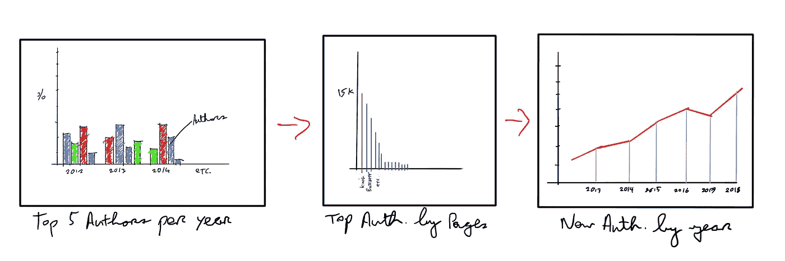

我的低保真度草图最终只是故事的一部分。在我开始使用 RAWGraph 和 VizyDrop 这样的工具之前，我并不知道有可视化存在。这两款产品都很棒，只需点击一个按钮，就能为您提供数十张图表。这些观想中的一些相当突出，很难不被带走。我试着坚持让观想服务于我想要讲述的故事。我希望我在这方面取得了成功。

做完这些，是时候写了。我把文章的主体分为“作者”和“书籍”，最后是一些总结性的想法。

# 作者

首先，这是我迄今为止读过的所有作者的形象化描述:

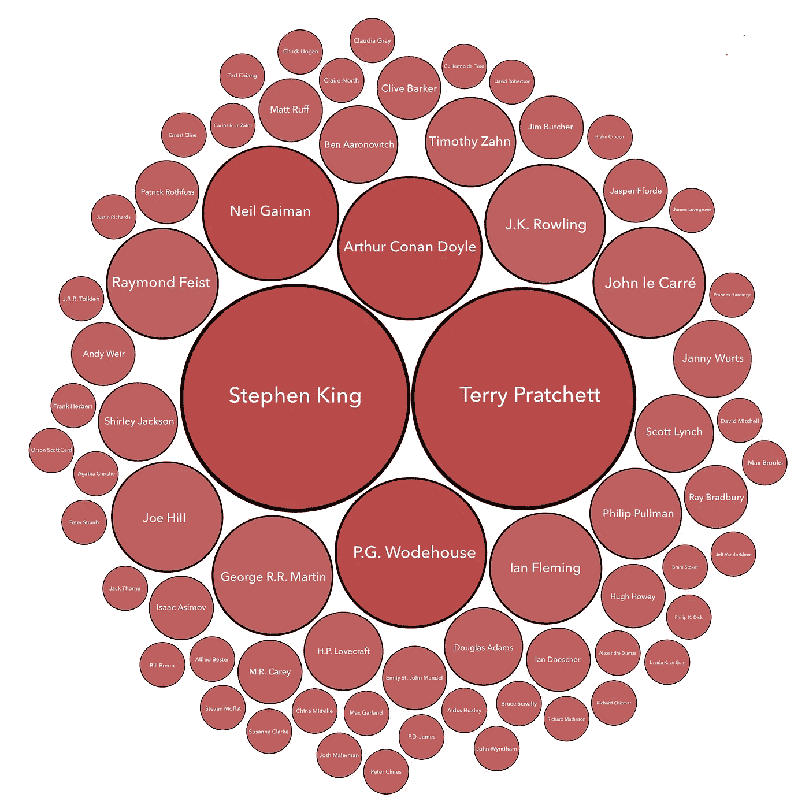

在记录我阅读习惯的七年时间里，我总共阅读了 71 位作者的作品。虽然我手头没有任何基准，但我怀疑这是一个狭窄的作者范围。上面显示的作者中，有 43.6%的人读过两本或更多的书。似乎如果我喜欢一本书，那么我很可能会回到那位作者身边。如果我真的喜欢一本书，我会一次又一次地回来——我的前五位阅读作者占我读过的所有书籍的 39.5%。其中大部分属于斯蒂芬·金(24)。试图阅读马丁·路德·金的目录就像沿着错误的方向登上自动扶梯，这就是他出版新书的能力。这位恐怖片大师是特里·普拉切特(23 岁)，他在 2015 年的去世是文学界的巨大损失。我在 *Discworld* 的持续旅程感觉更像是一次朝圣，而不是一种爱好。最近我意识到我应该放慢我的进度，因为我不想让它结束。

我把我最喜欢的五位作家(金、普拉切特、伍德豪斯、柯南道尔和盖曼)按年份进行了分类。看一下细目分类，似乎我在某一年里“迷上”了某个特定的作者。五位作者中的四位都占据了一年内阅读量的大部分(尼尔·盖曼是个例外)。然而，这一趋势在过去几年中似乎趋于平稳:

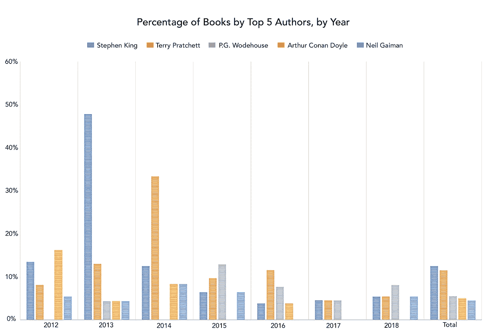

2013 was the year I tackled King’s Magnum Opus, **The Dark Tower**, and all its associated works. All things serve the Beam.

当你看读了的*页而不是读了*的*本书时，前五名改变了作文。前五名中掉出了 P.G .伍德豪斯和亚瑟·柯南·道尔，取而代之的是乔治·R·R·马丁和雷蒙德·费斯特。我想这并不奇怪，那些以维多利亚时代伦敦为背景的古怪故事而闻名的作者被高度幻想的巨著作者取代了。*

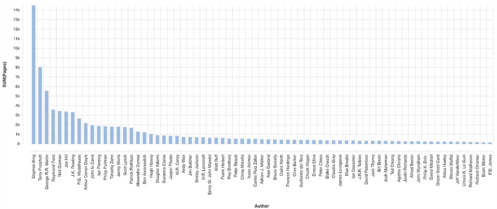

我在上面提到过，我对作者的依赖在最近几年已经开始趋于平稳。随着时间的推移，新的*作者和独特的*作者的阅读数量进一步证明了这一点。*新作者*是一个不言自明的指标:它是一个我以前没有读过的作者的介绍。*独特作者*指的是在任何给定年份只读一次的人。检查这些维度的数据表明，自 2012 年以来，我一直在拓宽自己的视野:**

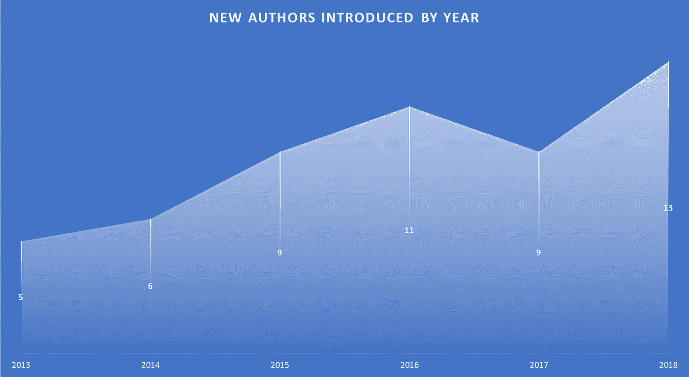

2012 is excluded from this chart, as all authors were ‘new’ as far as the records are concerned.

除了 2017 年之外，我个人图书馆的新作者数量每年都在增长。我不认为这是我有意识的努力，但看到这种趋势既有趣又令人鼓舞。现在我知道了这些数字，我将尝试保持这一趋势。

换个角度看，2017 年是我最多元化的阅读年。就独特作者而言，这是我唯一一年实现了作者与书籍 1:1 的比例。我承认这不是随机的——这是我在那年年初给自己设定的阅读挑战。由于我阅读的书籍量增加，我在 2018 年增加了*独特作者*的数量。这意味着，从绝对值来看，自 2014 年以来，独立作者的数量逐年上升:

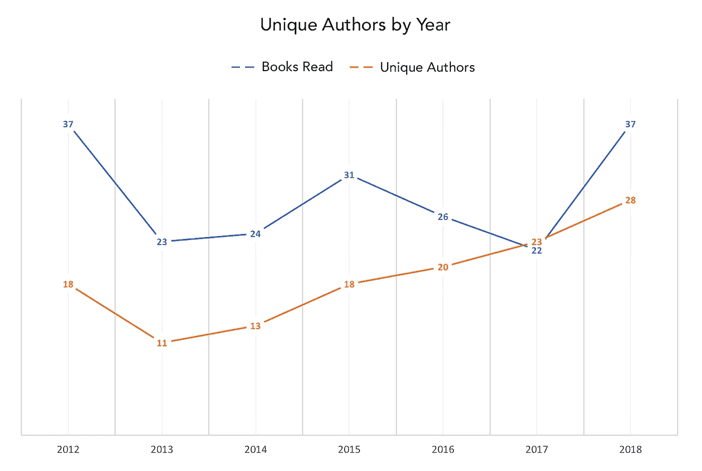

The 1:1 ratio for 2017, reported above, is not quite accurate; during that year I read ***Mistress of the Empire***, co-written by Raymond Feist and Janny Wurts, meaning the number of unique authors outnumbers books read.

看待这些数字的另一种方式是衡量每年每位作者平均阅读的书籍数量。这一数字从 2012 年的 2.1 人下降到 2017 年的 1 人，然后在去年再次攀升。

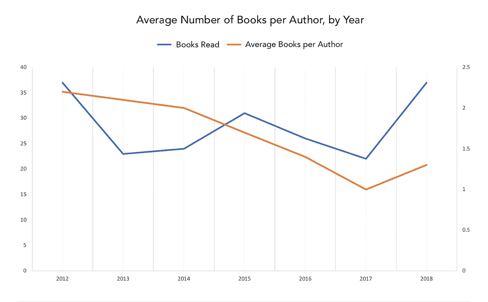

最后一个作者指标与性别有关。这并不适合伟大的阅读:200 本书中只有 25 本是女性作者写的，总共有 11 位*独特作者*。当绘制在下面的冲积图上时，我有点吃惊地看到，我在跟踪我的书四年后读到了我的第一位女性作者:

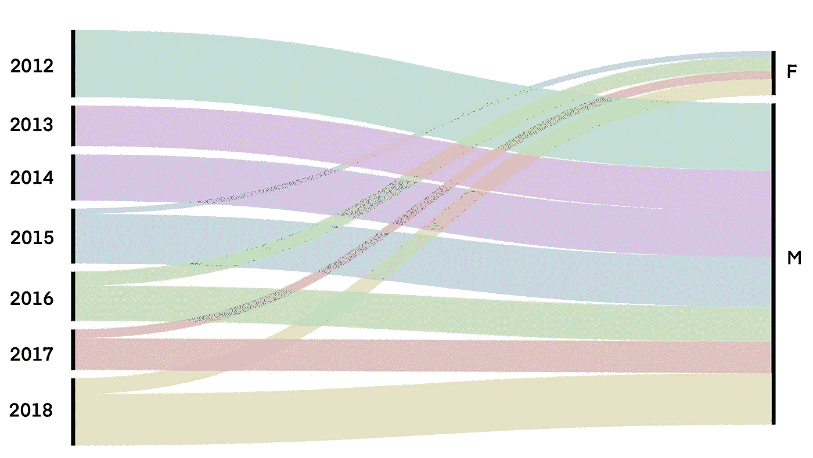

在我开始研究阅读习惯背后的数据之前，我并没有过多考虑作者的性别。因此，至少令人鼓舞的是，自 2015 年以来，这一比例一直稳步增长，2018 年是迄今为止的峰值。我想继续这一趋势，尤其是因为我最喜欢的一些作家是女性。苏珊娜·克拉克的乔纳森·斯特兰奇和诺瑞尔先生；克莱尔·诺斯的*哈利·奥古斯特的前十五个生命*；还有艾米丽·圣约翰·曼德尔的*站 11*跃入脑海。

# 书

我阅读的书籍的数据包括长度、类型和出版日期等方面。不过，我首先要谈的是书籍的形式。正如我已经提到的，我对阅读乐趣的重新发现在很大程度上归功于我购买了 Kindle。它让我意识到，由于它的外形，我几乎可以在任何地方阅读。也就是说，Kindle 对我来说不仅仅是方便。这本身就是一种美好的阅读体验，这是人们在谈论便利因素时有时会失去的一种品质。Kindle *Voyage* 是我拥有的设计最好的产品之一。

我意识到自己有被当成亚马逊骗子的风险。但所有这一切都是为了说明我和纸质书一样热爱电子书。我不需要检查数据就知道它们占了阅读书籍的最大份额——结果高达 79%。就年度分布而言，似乎没有任何可辨别的模式。我阅读电子书和纸质书比例相等的唯一一年是 2014 年。每隔一年，电子书都会或多或少地占据主导地位:

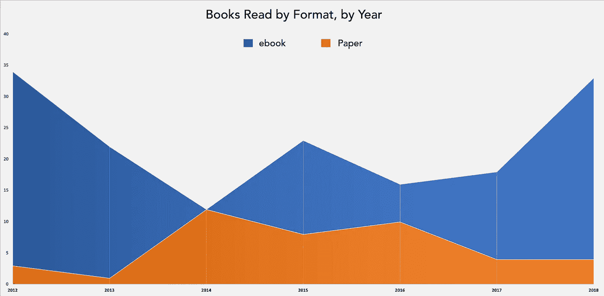

绝大多数纸质书都是精装本。我一直在收集分别由 Gollancz 和 Everyman 出版的 *Discworld* (特里·普拉切特)和 *Jeeves* (P.G. Wodehouse)的精装本。作为我的前五名作者中的两位，这些版本一直支撑着我收藏的纸质书的数量。

从阅读量来看，2012 年以来我已经阅读了 81，302 页，平均每本书 407 页。我特别感兴趣的是这将如何按年分解。我想知道我在任何一年的个人情况会如何影响我的阅读量，以及它在数据中的可见程度。

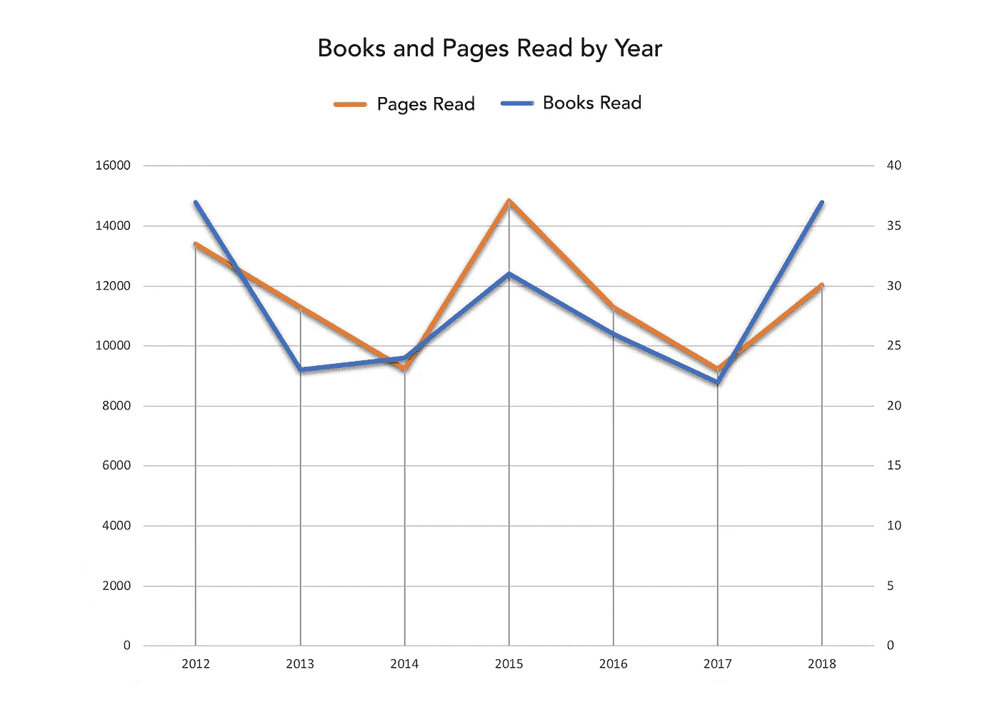

我的个人环境对我阅读习惯的影响在 2015 年最为明显。那一年是我阅读量最大的一年。也是在那一年，我搬到了伦敦，在那里我每天大约花一个小时坐地铁。诚然，以伦敦的标准来看，这相当不错，但这是我职业生涯中迄今为止最长的一次通勤。从数据来看，我似乎利用了我较长的通勤时间，阅读了我收藏的一些较大的书籍。我看了苏珊娜·克拉克的*乔纳森·斯特兰奇和诺瑞尔先生*，亚历山大·仲马的*基督山伯爵*，还有乔治·R·R·马丁那年*冰与火之歌*系列的大部分。2017 年，我从伦敦搬回爱尔兰，在此过程中短暂中断了职业生涯。图表显示，三个月不通勤影响了我的生产率，当我重新开始工作并开始在都柏林通勤时，生产率再次上升。

说到大部头，我平均每年写一本书不到一千页。这并不是一个非常平均的分布——正如上面提到的，其中一半都是在 2015 年被阅读的——但在那之后的三年里，我只读过一本。事实上，总的来说，我对更长书籍的兴趣似乎在减弱:帕特里克·罗特福斯的*智者的恐惧*是我自 2016 年以来读过的唯一一本超过 700 页的书。在 2017 年之前，我平均每年阅读 3.6 本这样长度的书。

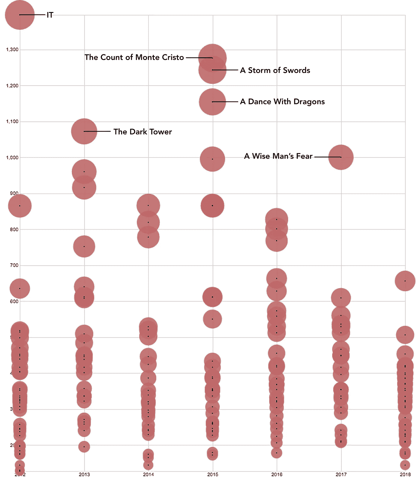

Not Pictured: A few months before I started recording my reading habits I read King’s The Stand. If plotted here it would sit alongside his other masterpiece, IT, at circa 1350 pages.

这就引出了一个问题:在过去的七年里，网页的整体分布是什么样的？如上所述，每本书的总页数是 407 页。但是这并没有产生一个非常有趣的视觉效果，所以我画出了我的 200 本书的页面间隔。这表明模态组是 325 到 368 页:

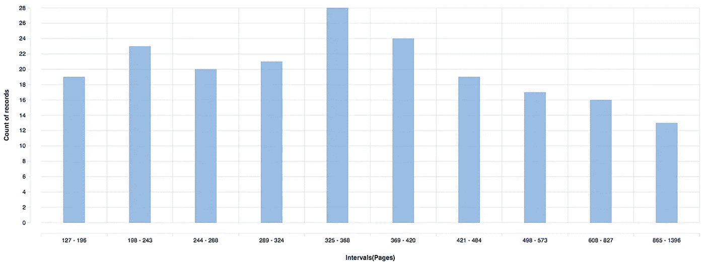

这一篇幅看起来甚至达到了 370 页左右，从那里开始逐渐减少到笨重的大部头。我应该指出，2018 年占了较低端书籍的很大一部分。秋天的某个时候，我意识到我可以看 200 本书了。我承认，达到这一里程碑的前景影响了我今年剩余时间的阅读选择。2018 年阅读的 37 本书中有 20 本属于前四个发行组——占这些组的近四分之一。

我分析的最后一个主题是关于体裁。在安德里亚·倪瓒的文章中，体裁划分是小说和非小说。我理解保持二进制的好处。超越这种区分来分解书籍是困难的，因为它变得武断了。流派之间的界限往往很模糊。雷德利·斯科特的《异形》是恐怖片还是科幻小说？也就是说，把我读过的书分成不同的类型正是我所做的，不管是否科学。

这不仅仅是因为我的个人图书馆里缺少非小说类书籍。在某种程度上，这取决于我是如何记录的。我的书单上有我只为消遣而读的书。这些年来，我为了职业发展，或者为了改善我生活的其他方面，读了很多书，但是它们不在这里。也就是说，我想找到更多的非小说类书籍，它们的故事和小说类书籍一样吸引我。

我想找到一种方法使类型定义不那么武断，所以我想到了众包的主意。Goodreads 提供了一本书的流派，由用户决定。这些类型按照用户提名的降序排列。例如，理查德·马特森的*我是传奇*被归入“恐怖”、“科幻”、“小说”、“经典”、“吸血鬼”和“后启示录”等类型。但是我想保持流派的相互排斥。由于大多数用户将它归入恐怖片类别，这就是我在数据中记录的方式。这被证明是大多数书籍的有效方法，但在某些情况下，它造成了不一致。例如，它会把《T4》和《福尔摩斯探案集》分成不同的类别，比如“小说”、“经典”和“侦探”。但在大多数情况下，坚持 Goodreads 用户是很容易的。这给我留下了五种类型的清晰分类:幻想、小说、恐怖、非小说和科幻:

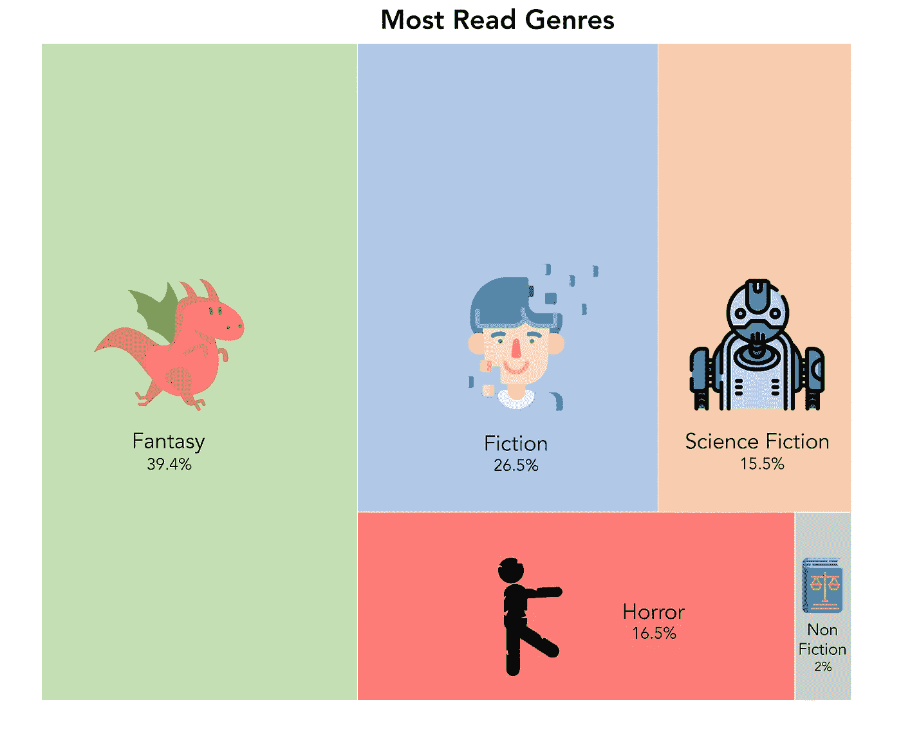

Tree Maps aren’t terribly exciting, so I couldn’t help adding a flourish. Icons made by [Freepik](http://www.freepik.com/) from [www.flaticon.com](http://www.flaticon.com/)

当绘制在图表上时，这是另一个让我惊讶的结果。如果有人逼我说出我最喜欢的类型，我会在恐怖片和科幻片之间抛硬币。和电影一样，它们是我最认同的类型。事实上，在我的书中，这两者几乎是掷硬币的结果。令人惊讶的是，他们分别是第三和第四名。

就新作者而言，科幻小说似乎是我最喜欢冒险的领域。看下面的图表，这是唯一一个新作者比以前读过的作者多的类型(除了非小说类):

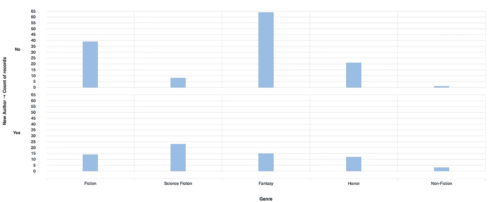

仔细想想，这是有道理的。我读过的奇幻书籍往往是一个长系列的一部分(其中一些，看起来，没有尽头。我会为下一部*《冰与火之歌》*、*《弑君者编年史》*或*《绅士混蛋》*做些什么。我的小说习惯也是如此:P.G .伍德豪斯和阿瑟·柯南-道尔以跨越一长系列书籍的人物而闻名。还有我对间谍的亲近感。我经常回到伊恩·弗莱明和约翰·勒·卡里，分别跟随詹姆斯·邦德和乔治·斯迈利的冒险。至于恐怖，嗯，你只需要看看哪个作家是我阅读排行榜上的第一名。就科幻小说而言，我倾向于少读系列小说，多读独立故事。奇怪的是，在我的科幻书架上有很多系列的书，我只看过第一本书。其中包括弗兰克·赫伯特的*沙丘编年史*，奥森·斯科特·卡德的*安德的传奇*，以及道格拉斯·亚当斯的*银河系漫游指南*。我说好奇是因为我喜欢这些系列的开场，但出于某种原因，我没有继续下去。

我探索的关于体裁的最后一个数据点是出版日期。我想知道我是否倾向于某一特定流派中的某一特定时代，以及它们之间的比较情况:

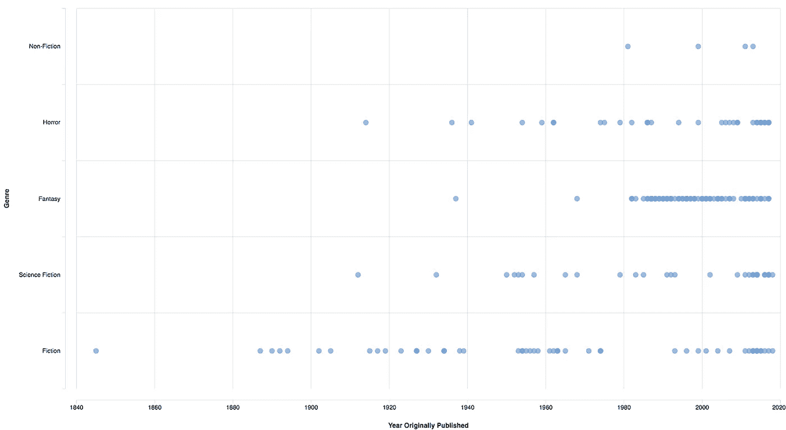

不同流派之间有一些非常明显的差异。幻想立即脱颖而出，成为与特定时间框架联系最紧密的类型。我只读过两本 1980 年前出版的奇幻书，比任何其他类型的书都少(同样抛开非小说类)。在所有的类型中，它集中了 20 世纪 80 年代、90 年代和 21 世纪 10 年代出版的书籍。另一方面，出版日期分布最广的类型是小说。大仲马的光辉复仇史诗《基督山伯爵》是我读过的最古老的书。恐怖片和科幻片分布相当均匀。我本以为 20 世纪中期会有更多的科幻书籍，但只有四本书代表了科幻小说的“黄金时代”。

# 结论

这项工作有两个主要目标:

1)运用我在数据分析和可视化课程中学到的一些原则

2)通过我在过去七年里收集的数据，了解我自己和我的阅读习惯。以下是一些要点:

*   这些数据强调了我已经怀疑过的事情——我是一个“舒适区”读者。我倾向于回到相同的作者、类型和系列。在任何一年，我都更有可能拿起一本我以前读过的作者的书，而不是尝试一本新书。此外，那一年我很有可能会多看几本那位作者的书。我读的每三本书里就有一本是新作者写的，但我想让这一点更接近其他每本书。
*   我的总体阅读效率没有太多明显的模式。在这七年中，阅读的书籍数量在再次转向另一个方向之前，连续两年多没有上升或下降。我已经预料到了这一点，但波峰和波谷并不像我想象的那样容易映射到我生活中的特定时期。我能确定的唯一趋势是，在过去几年里，我对长篇大论的兴趣有所减弱。平均页数从 2015 年的 478 页逐渐下降到 2018 年的 325 页。

那么，我该如何处理这些信息呢？除了写这篇文章之外，它还对我的阅读习惯提出了一些调整，我将尽力去做:

*   更多地突破我的舒适区:我希望新老作者的比例更高。在这个目标下，我想增加女性作家的数量，因为七分之一的女性作家表现不佳。
*   舒适区也适用于流派。我计划增加休闲时阅读的非小说类书籍的数量。如果几年后我再做这个练习，我希望这个百分比至少能达到两位数。
*   如果奇幻书籍的数量保持不变，我想扩展到其他作者和系列。

我的阅读时间对我来说很宝贵，但我不认为这些变化会对它产生更坏的影响。我通常不喜欢阅读挑战，但我对横向引导我的习惯的想法感到兴奋。

我应该就这项工作本身说几句话。我处理的数据集并不复杂，但是使用 OpenRefine 这样的工具应用数据清理这样的原则是很好的。关于数据故事课程，我能够很好地运用一些实用的技巧。它教会了我故事板对我的数据的有效性。我还学到了老师演示的一些具体的故事机制，这很有帮助。

我并不是说这份工作除了个人宣泄之外还有任何特殊的价值。希望对喜欢阅读或喜欢数据的人有一些新奇的价值。或者像我一样，那些落在维恩图的中间。也就是说，我不想开始把书看成是一系列的标签和百分比。我要暂时忘记这些数据，继续阅读。

— — — — — — — — — —

**更新**

一些人建议我将我的原始数据附加到这篇文章中。在写这篇文章时，我想到了这一点，但我的问题是数据不是很整齐。我不是电子表格语法方面的专家，所以我使用了一些混乱的“技巧”，我相信更熟练的人会有更直接的方法来实现相同的结果。

也就是说，我花了几个小时整理电子表格，我认为它现在适合公众分享。[您可以在这里访问电子表格](https://docs.google.com/spreadsheets/d/1XNE1To4o215RJebbOwH0sUYlHknfGE8t0FDVR5DCIqA/edit?usp=sharing)。要使用逐年细分功能(U4 在‘Dashboard’)，你必须制作自己的副本；请随意这样做。

当我更新这篇文章时，我想我应该指出一些发表后不久发生的很酷的事情。我工作的公司主办了一次 UX 设计会议，并为不同类别的演讲征集演讲者。其中一个类别被称为*研究故事时间*，演讲者将讲述与研究相关的故事，这些故事比给出的核心演讲更不寻常，或者更冷门。我改编了这篇文章，并将其作为提案提交(演讲必须以 [*PechaKucha*](https://en.wikipedia.org/wiki/PechaKucha) 的风格发表)，它被接受了。谈话进行得很顺利，但我想提到的是，在我谈到我的阅读缺乏多样性之后，我收到了大量关于女性写的科幻小说的推荐。我的积压现在看起来有点健康，并帮助我发现了作家，如 N. K .杰斯明，贝基钱伯斯，玛丽多里亚罗素和奥克塔维亚 e .巴特勒。我期待着阅读这些作者的作品，并在下次做这个练习时有一个更平衡的阅读组合。