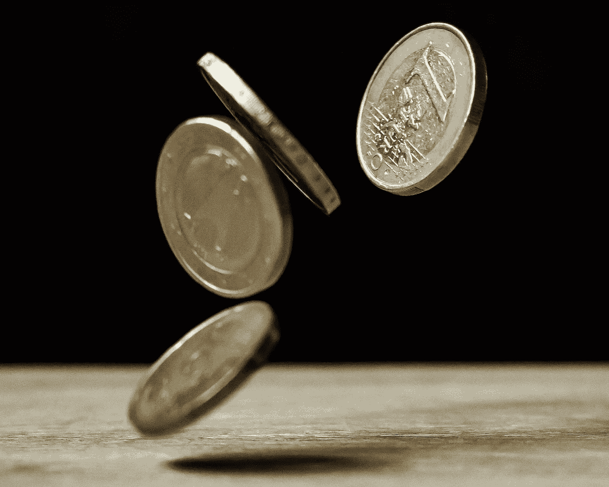
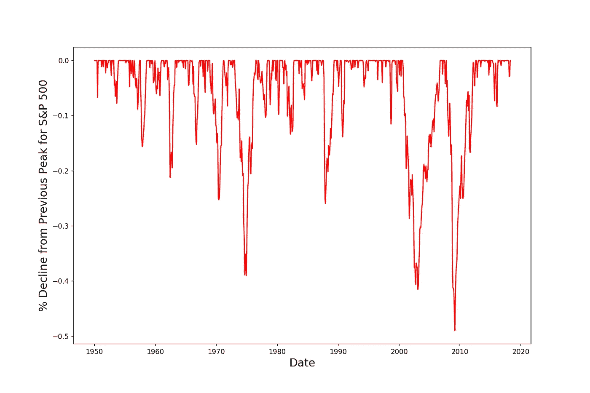
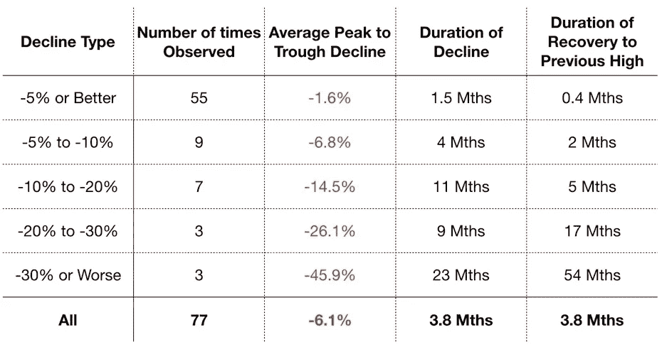
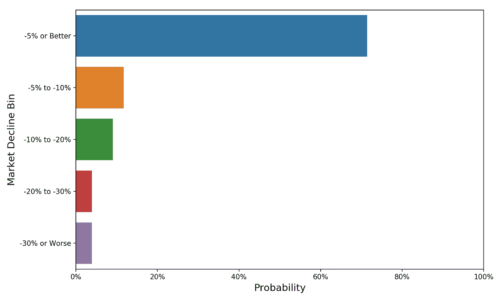
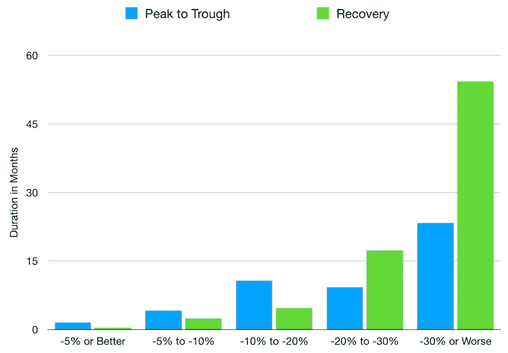
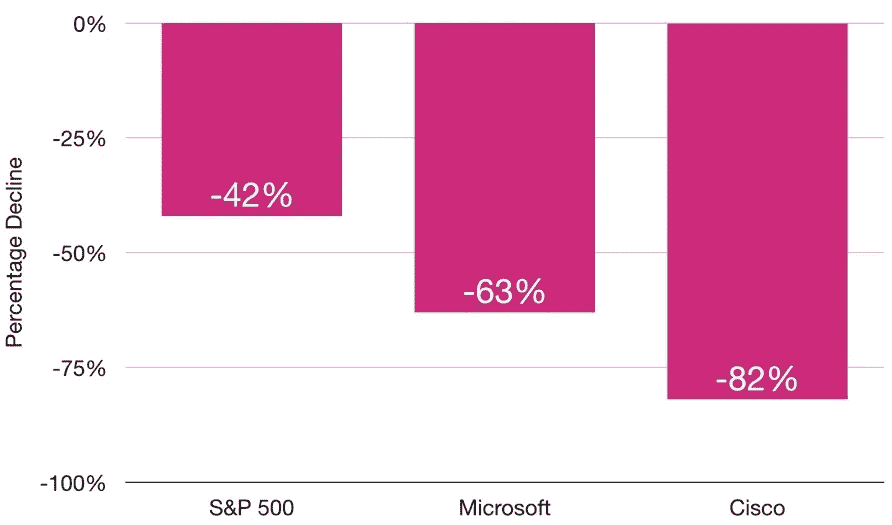
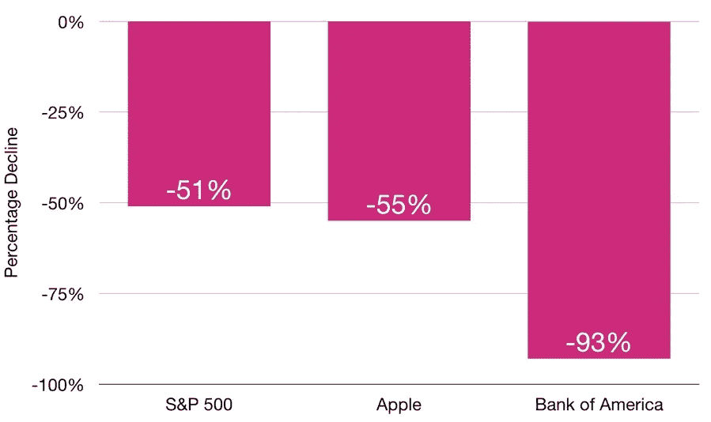

# 对股市低迷的剖析

> 原文：<https://towardsdatascience.com/the-anatomy-of-a-stock-market-downturn-6527e31406f0?source=collection_archive---------9----------------------->

## 我们调查过去的股市下跌，以了解下一次可能会是什么样子

*如果你想用我的代码运行你自己的分析，你可以在我的 GitHub 这里* *找到* [*。*](https://github.com/yiuhyuk/market_decline)

十年来，尽管利率上升，收益率曲线反转，特朗普发推文，欧洲经济问题和贸易战，这波牛市仍在继续。但是现在如果你和五个人谈论股票市场，你可能会得到五种不同的关于股票和经济走向的观点。但不管你的个人观点是什么，你目前的定位是什么，思考一下聚会的结局可能是什么样子都是有帮助的。在本帖中，我们将通过 Python EDA(探索性数据分析)来看一看。

> "幸运青睐有准备的人。"— **路易·巴斯德**

# 检查市场下跌

在我看来，股市崩盘和/或衰退的定性影响比它们对你的投资组合的即时定量影响重要得多。随着时间的推移，损失的美元可以赚回来，但市场崩盘可能造成的心理创伤和压力要持久得多。在经济开始再次繁荣后很长一段时间，对糟糕时期的记忆继续伤害着一代又一代的投资者——通过对股市的恐惧和面对金融决策时的过度避险。

也就是说，回答“在一次典型的市场下跌中，股票会下跌多少？”这个问题肯定是有用的要做到这一点，让我们来看看标准普尔 500(美国股票市场的一个很好的代表)的历史。

下图描述了标准普尔 500 的下降(即从之前的历史高点下降的百分比)。我只看二战后的数据，因为经济和股票市场在过去几十年里变化太大了。此外，我使用的回报是价格回报，不包括股息(股息为市场下跌提供了少量缓冲，在本次分析中我想忽略这一点)。最后，我认为任何负的月回报，不管多小，都是股市下跌。

S&P 500 Decline from Previous Peak (Since 1950)

一些有趣的事情跳了出来:

*   自 1950 年以来，标准普尔 500 下跌超过 30%的情况只有三次。然而，其中的两次(互联网泡沫和金融危机)都发生在过去 20 年里。
*   20 世纪 70 年代对投资者来说是一个可怕的时代。当时原油价格飙升，通货膨胀和利率经常超过 10%(美联储的目标是 2%)，失业率居高不下。
*   相比之下，上世纪 90 年代(互联网泡沫破裂前)和 2010 年代(金融危机后至今)一直非常平静，让市场不断创出历史新高。这些长期平静的时期似乎更像是一种例外，而非常态。
*   随后的市场大崩盘(跌幅超过 20%)的复苏进展缓慢，通常需要几年时间才能恢复到前所未有的高点。通常这些大的下跌伴随着经济衰退。
*   另一方面，较小的市场下跌(跌幅小于 20%)通常会在市场低谷的几个月内迅速恢复(因为市场参与者意识到他们所恐慌的任何“股市妖怪”都不是真实的)。

# 对数字的深入探究

总而言之，我看了 820 个月的数据(从 1950 年到现在)。其中，282 个月(34%的观察值)的股票收益为负。最糟糕的一个月是 2008 年 10 月，T2 下跌了 20%(T3)(这发生在金融危机期间)。

然而，大多数下跌持续时间超过一个月——在我的样本中，市场下跌的平均时间是 3.8 个月。因此，不要只看每个月本身，更有启发性的是关注整个波峰到波谷的下跌，无论是一个月还是几个月。

下表从几个方面分析了这些从峰值到谷值的下降。

*   **平均峰谷跌幅**衡量标准普尔 500 指数(不包括股息)的平均峰谷跌幅百分比。
*   **下跌持续时间**衡量前一个历史高点和当前市场下跌低谷之间的平均时间长度。
*   **恢复到前期高点的持续时间**衡量股票市场从低谷到下一个历史高点的平均时间长度。

Metric Comparison for Market Declines of Varying Magnitude

让我们将观察频率(表中的**观察次数**)绘制为概率。

> **在大多数情况下(观察到的市场下跌的 71%)，市场在最坏的情况下经历了 5%的下跌**。

而整体平均 6.1%的跌幅也不算太差。但是，如果我们只关注标准普尔 500 下跌超过 5%的时候，事情看起来要危险得多:

> 其中 59%的时候，市场下跌 10%或更多，27%的时候，市场暴跌 20%或更多！

因此，当市场下跌超过 5%时，我们需要认识到这样一个事实，即市场可能会继续下跌，并有可能崩盘。请注意，我们这里使用的是小样本，因此会有很多噪音。

Historical Probabilities of Market Declines of Varying Magnitude

从上面的表格中，我们还可以清楚地观察到两种类型的市场下跌(在下面的柱形图中可以看到):

1.  小幅下跌之后是快速、大幅的反弹。
2.  需要数年时间才能恢复的可怕的股市崩盘。这些损失需要更长的时间来弥补，因为大的市场崩溃通常伴随着衰退、银行信贷紧缩、投资者绝望和大量破产。

请记住，我在数据中忽略了股息。有了股息(尤其是如果你再投资的话)，回收期会有所缩短。

Market Crashes of -20% or Worse Take Much Longer to Recover From

最后，从上面的图表中注意，在更大的下跌中，标准普尔 500 花时间寻找底部(蓝色柱)。所以，如果你想低价买入，要循序渐进，有纪律。最有可能的是，你最终会买一些，然后看着市场在下个月再下跌 5%(这时你可以再买一些)。

# 股市崩盘时，高飞的股票会跌回地面

最后，让我们看看过去的股市宠儿在互联网泡沫破裂或金融危机中的表现，以了解今天的高材生如网飞或 T2 在市场严重低迷时的表现。

在 20 世纪 90 年代末互联网泡沫最盛的时候，领先的科技公司如[微软](https://finance.yahoo.com/quote/msft)和[思科](https://finance.yahoo.com/quote/csco)处于世界之巅。然后泡沫破裂，持有这些股票的投资者损失惨重:

Ouch!

2008 年，金融危机前夕，[苹果](https://finance.yahoo.com/quote/AAPL/)发布 iPhone 仅一年，而[美国银行](https://finance.yahoo.com/quote/BAC)是世界上最大和最赚钱的银行之一。接着，房地产泡沫破裂，全球金融体系几乎崩溃:

Bank Stocks Got Crushed in 2008

在这两种情况下，当天最受欢迎的股票在崩盘期间的跌幅都超过了整体市场。然而，在 2000 年，科技股是最被高估的，因此它们的跌幅明显大于整体市场。与此同时，在 2008 年，正是银行坐拥金融市场，因此银行股在随后的经济衰退中遭受了最沉重的打击。

# 关键要点

*   大多数市场跌幅都很小，很快就恢复了。即使是 15%的跌幅，平均也是在谷底后 5 个月恢复。我想“购买蘸酱”终究还是有一些智慧的。
*   股市崩盘(下跌 20%或以上)要痛苦得多，这不仅是因为下跌的幅度，还因为平均需要 1.5 到 4.5 年才能从损失中恢复过来。
*   当我这样说的时候，这听起来很明显——但是在标准普尔 500 已经下跌了至少 5%的情况下，我们面临着更大的市场崩溃风险。
*   在牛市的后期，集中持有当天最受欢迎的股票是有风险的。在崩盘期间，这些雄心勃勃的人受到的惩罚远远超过整体股市。
*   在市场下跌期间，逐步并有纪律地部署资金。在严重下跌的情况下，股市至少需要几个月才能触底，因此随着时间的推移，应该有足够的机会平仓。
*   如果像大多数情况一样，市场迅速反弹，不要因为你没有配置好所有的现金而去 FOMO。未来总会有更多的购买机会。

祝你好运！

# *延伸阅读*

[*股票是否提供正的预期回报？*](/do-stocks-provide-a-positive-expected-return-d21571e78ea4)

我有足够的钱退休吗？