# AOC 回复数据集

> 原文：<https://towardsdatascience.com/the-aoc-reply-dataset-190925c3d6f9?source=collection_archive---------16----------------------->

众议员亚历山大·奥卡西奥-科尔特斯的“@AOC”推特账户是政治讨论的热点。这位经验丰富的互联网冲浪者警告说，“不要看评论，”但我在那里花了很多时间，阅读，困惑，幸运的是只有一次被引诱回复(有人说她只能在布鲁克林获得选票)。

在政治推特上，最刻薄的用户被称为“机器人”。我不知道这些帐户是否是真正的保守派，钓鱼的一次性帐户，或者有组织的政治或垃圾邮件机器人。我只知道，即使我屏蔽了最差的账户，还是会有更多的账户出现。

# 机器学习的机会

我认为对 AOC 回复的大样本进行分析和聚类会很有趣。把账户当蜜罐。也许由此产生的模型可以学会过滤掉任何地方的不良推文？

理想的系统(在我看来)会自动将推文分类成 5-10 个原型，用户可以选择看或不看。我没有资源来手动标记每一条推文，而这正是我对监督学习的期望。
“情绪分析”对推文中的关键词做得太多了，对上下文没有帮助——是有人愤怒地回应一篇新闻文章，还是对一只酒店的猫尖叫？

## 抓取 Twitter

Twitter 的官方 API 为他们的数据提供了一个狭窄的选择范围。不幸的是，没有一个可以获取特定推文的回复 GitHub 和 StackOverflow 上流传着一些脚本，可以搜索最近的推文并挑选出回复，但以 Twitter 的速度，我永远不会捕捉到一周或一个月的讨论。另一种选择是稍微修改一下。

(非服务条款友好，继续下去风险自负)
我写了[一个 TamperMonkey 脚本](https://github.com/mapmeld/aoc_reply_dataset/blob/master/scan.js)让我的浏览器在我滚动回复时下载每条推文的文本和元数据。我已经注销了我的帐户，以获得一个没有用户阻塞的更少偏见的视图(注意 Twitter 已经在旧线程中隐藏了一些用户)。我打开了 2019 年 3 月“@AOC”账号发的每一条推文和转发。最终结果是大约 110，000 个回复(一个 27.1 MB 的 CSV)。我愿意与研究人员分享代码和数据。

# 相关作品

*   [OpenAI 关于 NLP 无监督学习的帖子](https://openai.com/blog/language-unsupervised/)很漂亮，涵盖了许多不同的选项。
*   2016 年大选后，Twitter 发布了俄罗斯代理人的推文，然后由外部研究人员使用无监督的 NLP 进行分析:[https://arxiv.org/abs/1810.01466](https://arxiv.org/abs/1810.01466)
*   使用 word2vec 和 k-means 聚类分析 Reddit 评论和推文的教程:
    [https://medium . com/ml 2 vec/using-word 2 vec-to-analyze-Reddit-comments-28945 D8 CEE 57](https://medium.com/ml2vec/using-word2vec-to-analyze-reddit-comments-28945d8cee57)
*   使用 SciKit-Learn 对数据进行分层聚类[https://stack abuse . com/hierarchical-clustering-with-python-and-SciKit-Learn/](https://stackabuse.com/hierarchical-clustering-with-python-and-scikit-learn/)

# 方法学

我想出了一些分析推文的方法:

*   **A** : **对可疑用户的文本进行监督学习—** 根据用户名和用户名(以数字结尾，以 MAGA、QAnon 或 Trump 结尾)选择一组“可能恶意”的推文。这是*不是因为政治*而禁止用户，而是开发一个以 burner 和 troll 账户为模式的模型。根据回复的文本训练一个模型，并根据他们的分数对一条推文进行评级。
*   **B:对亵渎性和煽动性用户的文本进行监督学习—** 与之前类似—在推文文本中搜索关键词的回复(亵渎性、无关主题中的煽动性话题、人身侮辱、标签)。将这些推文以及这些用户的任何其他推文放入“恶意”集合，并根据他们的分数对其他推文进行评级。
*   **C:使用 word2vec 的无监督学习—** 对 Tweet 文本运行 word2vec，然后使用 k-means 聚类进行分组。
*   **D:使用 scikit-learn 的无监督学习—** 使用 scikit-learn 和关键字标志进行层次聚类(因为全文似乎不太容易适用于该程序)。

# 分析和结果

## **监督学习的结果**

由于手动过程，我起初不想标记推文，但有了用户名选项，只需几条 SQL 语句。首先，统计数据:

*   在 110，000 条回复中，17k 条来自以 3+数字结尾的“数字用户”,大约 2000 条来自拥有特朗普/马加/匿名/民族主义者名字的用户
*   没有明显的领导者:其中只有 12 个在一个月内发布了 30 多条回复
*   在 3，300 名多次回复的用户中，他们平均每周仍不到一次

对我来说，这强调了 Twitter 上一个缺失的功能:一个简单的正则表达式可以找到成千上万的用户，我没有时间一一解决。现有的“黑名单”忽略了创建新账户有多容易。

我有过用 Google AutoML 建立一个[监督的 NLP 模型的经验，但是考虑到所有的原始推文和回复，它最初没有将*的任何*归类为“坏推文”。当您的数据非常不平衡(6:1 或更糟)时，AutoML 可以忽略次要类别，并声称精确度在 80%左右。](https://medium.com/@mapmeld/can-deepclapback-learn-when-to-lol-e4a2092a8f2c#ff45-f4b5cf78534b)

对于我的第二次运行，我决定收集亵渎的推文(以及它们的作者的额外推文)，总共 15k。我用 15k 条随机选择的正常推文平衡了这些推文，而不是完整的数据集。

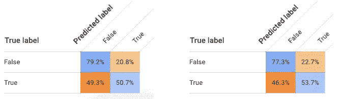

Confusion matrix for “reply” and “original tweet | reply” input formats were similar

混淆矩阵在这里很难读懂，但是预测“真实”意味着模型认为它是亵渎的。不同寻常的是，这个模型的有用性取决于哪些推文属于预测真实/亵渎，但在我最初的选择过程中被标记为虚假。我检查了这个类别:

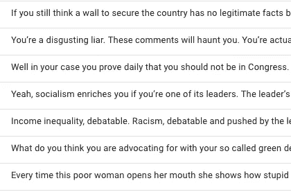

另一类显示的是被认为是亵渎性的用户的推文，而这个模型会把它们标为非亵渎性的。

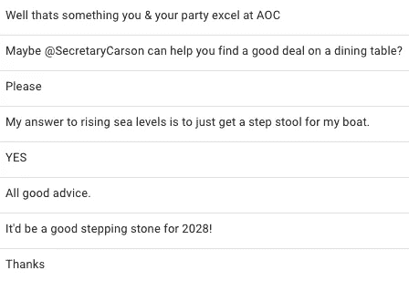

这两个列表都令人鼓舞——我很高兴 Python 脚本和 SQL 查询模板可以进行粗略的标记，AutoML 可以从中构建更通用的规则，并且产生的分类器似乎工作得很好。

我更喜欢一个分类器，它将原始推文的文本和回复作为单独的列，并使用其他推文属性。对我来说幸运的是，微软刚刚为 Azure 添加了一个自动化实验平台，[这本入门指南](https://docs.microsoft.com/en-us/azure/machine-learning/service/how-to-create-portal-experiments)将于 2019 年 5 月发布。Azure 运行各种算法并报告哪种算法具有最好的准确性，在本例中是“MaxAbsScaler，SGD”(从 0 到 1 缩放每一列，然后使用[随机梯度下降](https://en.wikipedia.org/wiki/Stochastic_gradient_descent))。

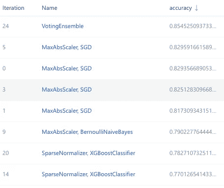

‘VotingEnsemble’ combines multiple methods. Stochastic Gradient Descent was the winner here

据报道，准确率很高，但我不可能审查 Azure 版本的应该是糟糕的推文。我可以将模型下载为 145 MB 的 pickle 文件，但不清楚如何在 Azure 环境或我的本地机器上继续使用它。如果出现更好的文档和演练，请关注这个空间。

## 无监督学习的结果

Reddit NLP 教程非常容易使用，以至于我很快从自己的数据集中聚类出单词。我要了 10 组，并从每组中打印出最上面的单词:

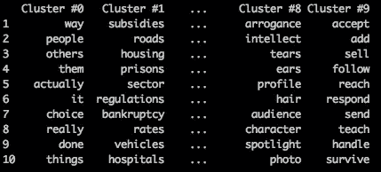

一开始我很气馁。集群#1 挑选了一些基础设施和政策术语，但它挑选了其中的*许多*。聚类#9 似乎只是“动词”。另一组有*、【更快】、【更便宜】、【更聪明】、【更好】、【更少】……语法相关但意义不相关的单词。*

在扩展我的脚本以显示 50 个集群之后，它们包括了如下主题:

*   **环境**(‘温度’，‘降温’，‘灭绝’，‘洪水’，‘洪水’，‘灾害’，‘温室’，‘自然’，‘流行病’，‘雪’，‘工业’)
*   骂人('黑客'、'独裁者'、'激进分子'、'骗子'、'演员'、'骗子'、'骗子'、'失败者')
*   **道德**(‘漏过的’，‘贡献’，‘违反’，‘PACS’，‘助手’，‘账目’，‘隐藏的’，‘道德’)
*   **少数群体**

聚类分析的效用是混合的，因为它确实显示了属于主题组的关键词，但我不认为这有助于揭示好的和坏的推文。**更新:**我正在看一门[斯坦福 NLP 课程](https://www.youtube.com/playlist?list=PLoROMvodv4rOhcuXMZkNm7j3fVwBBY42z)Gensim syn 0 解释——将单词放入向量空间的原始数据是在 2016 年大选之前创建的，因此特朗普、克林顿和其他单词的关联自此发生了变化。
我决定遵循[这篇 Twitter 分析教程](https://www.procogia.com/blog-posts/2018/11/26/tweet-clustering-with-word2vec-and-k-means)的路径，生成一些 D3 直方图来显示与环境相关的回复是由源自 AOC 的环境和绿色新政推文激发的。

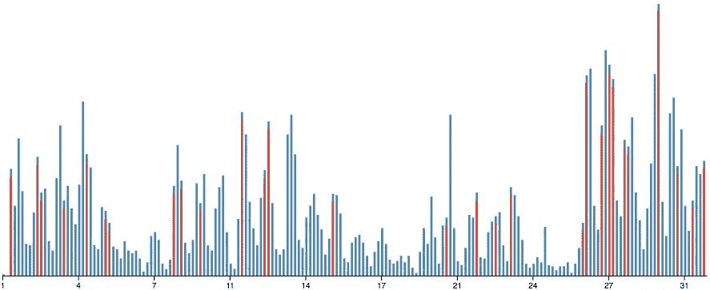

histogram of original environment Tweets and replies; each bar represents 4 hours

与环境相关的回复 AOC 每天都达到峰值，并在 MSNBC 与克里斯·海耶斯(Chris Hayes)的一次市政厅会议后飙升。让我们为下一个图表设置新的坐标轴。从零时发布一条新的环境推文开始，相关回复通常会在什么时候出现？

decay of interest in a Tweet by minute (environmental topics and environmental replies only)

这与骂人的回答相比如何？

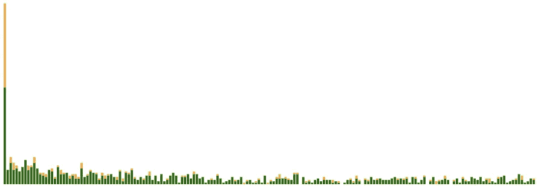

after environmental tweets, environmental replies (green) and name-calling replies (orange) are almost even in the first 30 seconds; name-calling immediately tapers off to a lesser share of Tweets

最后，我决定构建层次聚类模型，重点是对用户回复的总和进行分类。我创建了几个列来统计在一个扩展的亵渎性列表中出现的术语、环境词、骂人的词等，这些都是上一个示例中的集群所通知的。我查看了 10 个集群和 30 个集群的几个用户的推文，但在他们的推文中看不到有意义的共性？在我看过的所有样本中，除了一个之外，肯定都有攻击性的陈述。我想知道它们是否按照出现次数从高到低进行分组，这更多地是由帖子数量而不是实际内容驱动的。

# 测试它

在新的 AOC 推文中，哪些推文会被标记？让我们回顾一下我在 AutoML 中制作的监督学习模型。我打开预测标签，浏览了几条推文(这些被标记为“恶意”)。

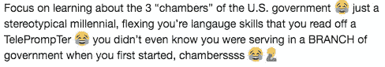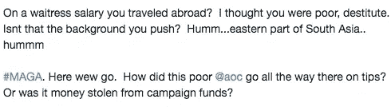

here wew go: 99% positive

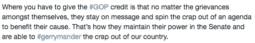

even though this one is anti-GOP, it was flagged

令人失望的是，下面的一些糟糕的推文不会受到该模型的影响。
*(****5 月 7 日更新*** *:我选择了一些不具有辱骂性或阻止价值的样本……它们的好坏取决于上下文和你的个人政治，但我认为它们是糟糕的回复，而 ML 模型不是)*

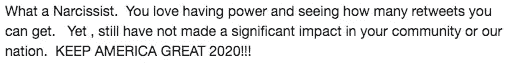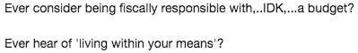

# 结论

我不会用这个平台来追踪复杂的巨魔。回到我开始屏蔽的时候，我会通过检查他们的照片、个人资料和追随者数量来确认一个帐户是否“值得”,以确认该帐户是否只是一个一次性/政治巨魔帐户。我会找到有“旅游交易”的账户，有一天这些账户会切换到所有大写的政治讨论、股票照片和所有数字用户名。Twitter 确实有所有这些数据，加上社交图、位置/IP、登录行为、用户对用户屏蔽和静音以及报告历史。对于他们来说，预测我可能会阻止谁是微不足道的。

我成功的地方是收集了一个有趣的数据集(我希望与更多的研究人员分享),并产生了一个平台的下一个最好的东西:一个针对政治和新闻线索的部分过滤器。它使用机器学习，而不是简单的正则表达式(尽管，老实说，看起来仅此一项就可以过滤掉很多)。我也很高兴它不是一个广泛的政治分类器，因为它是针对“坏”推文进行训练的，而不是保守派推文或布莱巴特文章或 Gab 内容的数据集。

无监督学习，至少对于像我这样的教程爱好者来说是普遍可用的，对分析比对内容分类更有用。这让我很惊讶，我希望能了解更多。
Azure 有一套很好的库和 Jupyter 笔记本基础设施，我将在未来的监督学习项目中使用它们，但我迷失在它们的界面中。

我期待看到其他算法阻止社会主义者的观点或在这方面的其他扭曲。我们如何在 Twitter 上使用过滤气泡，同时仍然获得稳定的、对我们有挑战性的、写得很好的故事？
听起来像是另一种算法的工作🤔