# 神经网络的逼近能力(使用 Python 代码)

> 原文：<https://towardsdatascience.com/the-approximation-power-of-neural-networks-with-python-codes-ddfc250bdb58?source=collection_archive---------15----------------------->


Image by [Gerd Altmann](https://pixabay.com/fr/users/geralt-9301/?utm_source=link-attribution&utm_medium=referral&utm_campaign=image&utm_content=2926087) from [Pixabay](https://pixabay.com/fr/?utm_source=link-attribution&utm_medium=referral&utm_campaign=image&utm_content=2926087).

## 为什么神经网络可以预测(几乎)任何过程的结果

# 介绍

众所周知，神经网络可以逼近任何连续数学函数的输出，不管它有多复杂。以下面的函数为例:

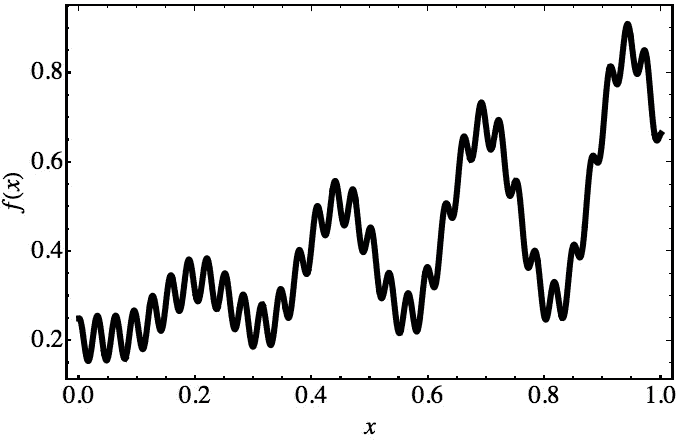

Generic function (generated using [Mathematica](https://www.wolfram.com/mathematica/)).

尽管它的形状非常复杂，我们稍后将讨论的定理保证了我们可以建立某种神经网络，它可以像我们想要的那样精确地逼近 *f(x)* 。因此，神经网络显示了一种普遍的行为。

神经网络受到如此多关注的原因之一是，除了这些相当显著的通用属性，[它们还拥有许多强大的学习功能算法](http://neuralnetworksanddeeplearning.com/chap4.html)。

# 普遍性和数学基础

这篇文章将给出人工神经网络这些近似能力背后的一些基本数学结果(定理)的非正式概述。

> “几乎任何你能想象到的过程都可以被认为是函数计算……[例子包括]根据一段音乐的简短样本命名一段音乐[…]，将一段中文文本翻译成英文[…]，获取一个 mp4 电影文件并生成电影情节的描述，以及对表演质量的讨论。”
> 
> —迈克尔·尼尔森

# 使用神经网络作为逼近器的动机:Kolmogorov 定理

1957 年，俄罗斯数学家[安德雷·柯尔莫哥洛夫](https://en.wikipedia.org/wiki/Andrey_Kolmogorov)，[证明了](https://link.springer.com/chapter/10.1007/978-94-011-3030-1_56)一个关于多变量实函数表示的重要定理，他因在广泛的数学课题(如概率论、拓扑学、湍流、计算复杂性等)上的贡献而闻名。根据 Kolmogorov 定理，多元函数可以通过(有限个)一元函数的和与合成的组合来表示。


The Russian mathematician Andrey Kolmogorov (Wikipedia)

稍微正式一点，该定理陈述了在 *n* 维超立方体(其中 *n* ≥ 2)中定义的实变量的连续函数 *f* 可以表示如下:

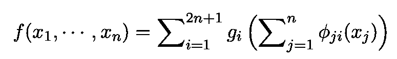

Kolmogorov’s Theorem (1957)

在这个表达式中， *g* s 是一元函数，ϕs 是连续的、完全(单调)递增的函数(如下图所示)，不依赖于 *f.* 的选择

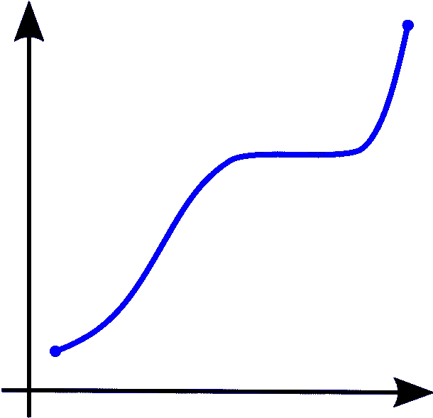

Examples of monotonous functions (Wikipedia).

# 通用逼近定理(UAT)

UAT 指出，包含具有有限数量节点的单个隐藏层的前馈神经网络可以用于逼近任何连续函数，只要满足关于激活函数形式的相当温和的假设。现在，由于我们能够想象的几乎任何过程都可以用某种数学函数来描述，神经网络至少在原则上可以预测几乎每个过程的结果。

使用不同激活函数的前馈人工神经网络的通用性有几种严格的证明。为了简洁起见，我们只讨论 sigmoid 函数。Sigmoids 是“S”形的，包括作为特例的[逻辑函数](https://en.wikipedia.org/wiki/Logistic_function)、 [Gompertz 曲线](https://en.wikipedia.org/wiki/Gompertz_curve)和 [ogee 曲线](https://en.wikipedia.org/wiki/Ogee_curve)。

# 乙状结肠的 Python 代码

构建和绘制 sigmoid 函数的快速 Python 代码如下:

```
import numpy as np
import matplotlib.pyplot as plt
%matplotlib inlineupper, lower = 6, -6
num = 100def sigmoid_activation(x):
    if x > upper:
        return 1
    elif x < lower:
        return 0
    return 1/(1+np.exp(-x))vals = [sigmoid_activation(x) for 
       x in np.linspace(lower, upper, num=num)]
plt.plot(np.linspace(lower, 
                     upper, 
                     num=num), vals);
plt.title('Sigmoid');
```

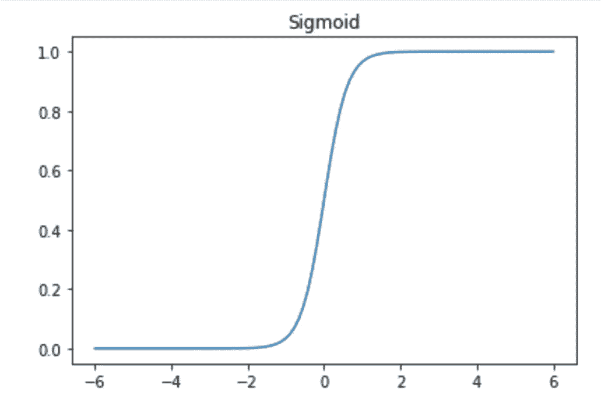

A plot of the sigmoid function. In the code, the conditionals inside the function are included to avoid problematic computations at large values.

# 乔治·西本科的证明

Cybenko (1989) 给出的证明以其优雅、简单和简洁而闻名。在他的文章中，他证明了下面的说法。设ϕ是 sigmoid 型的任何连续函数(见上面的讨论)。给定任何多元连续函数

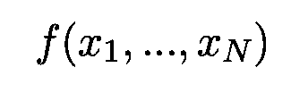

在 *N* 维实空间的[紧](https://en.wikipedia.org/wiki/Compact_space)子集和任何正ϵ内，都有向量

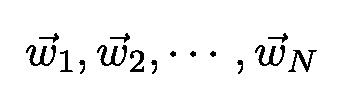

(权重**、常数**

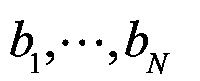

(**偏置**术语)和

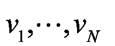

到这样的程度

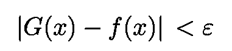

对于紧凑子集内的任何*x*(NN 输入)，其中函数 *G* 由下式给出:

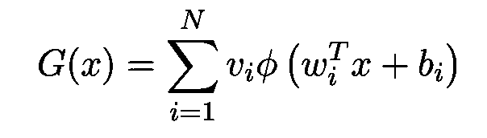

选择适当的参数，神经网络可以用来表示各种不同形式的函数。

# 使用 Python 的示例

为了使这些陈述不那么抽象，让我们构建一个简单的 Python 代码来说明到目前为止所讨论的内容。以下分析基于迈克尔·尼尔森(Michael Nielsen)的[伟大的在线书籍](http://neuralnetworksanddeeplearning.com/chap4.html)，以及[马特·布雷姆斯](http://argmatt.com)和[贾斯汀·庞德斯](http://linkedin.com/in/pounders)在[大会数据科学沉浸式(DSI)](https://generalassemb.ly/education/data-science-immersive) 上的精彩演讲。

我们将构建一个神经网络来近似以下简单函数:

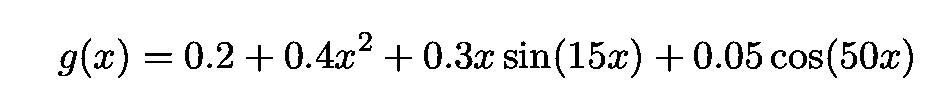

在深入研究代码之前，需要做一些说明:

*   为了使分析更加直观，我将使用 sigmoid 函数的简单极限情况。当重量非常大时，s 形接近[亥维赛阶梯函数](https://en.m.wikipedia.org/wiki/Heaviside_step_function)。因为我们将需要添加来自几个神经元的贡献，所以使用阶跃函数比一般的 sigmoids 更方便。

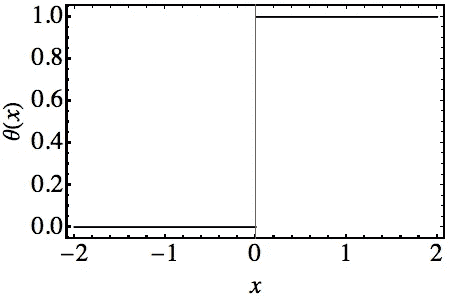

*   在 sigmoid 逼近阶跃函数的极限中，我们只需要一个参数来描述它，即阶跃发生的点。[s 的值可以表示为](http://neuralnetworksanddeeplearning.com/chap4.html)等于 *s=-b/w* 其中 *b* 和 *w* 分别是神经元的偏差和权重。
*   我要建立的神经网络将是一个非常简单的网络，有一个输入、一个输出和一个隐藏层。如果两个隐藏神经元对应的权值绝对值相等，符号相反，则它们的输出变成一个“[凸起](http://neuralnetworksanddeeplearning.com/chap4.html)”，其高度等于权值的绝对值，宽度等于每个神经元的 *s* 值之差(见下图)。

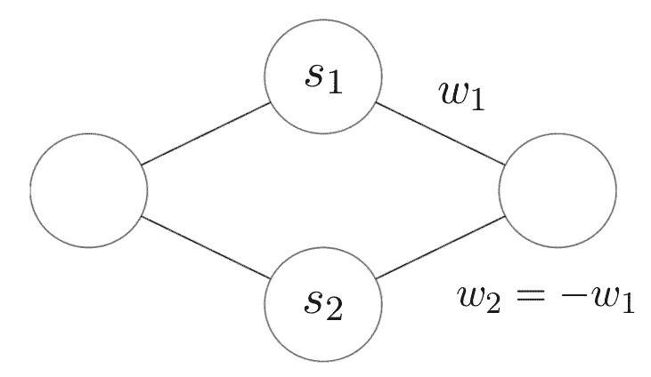

*   我们使用下面的[符号](http://neuralnetworksanddeeplearning.com/chap4.html)，因为权重的绝对值是凸起的**h**8。

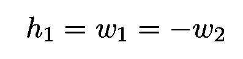

*   因为我们想要近似 *g，*隐藏层的加权输出必须包含 sigmoid 的逆。事实上，它必须等于:

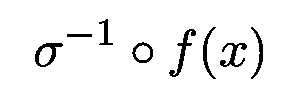

为了重现该函数，我们选择 *h* s 的值为(见下图):

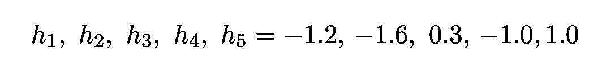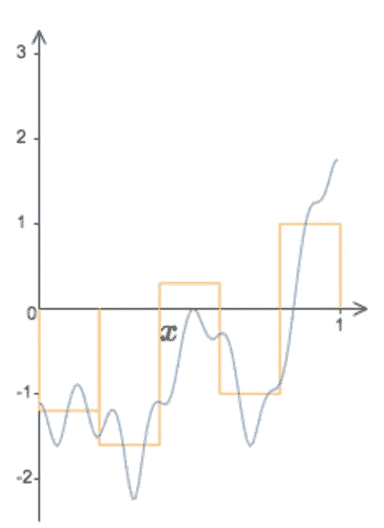

Taken from [here](http://neuralnetworksanddeeplearning.com/chap4.html).

# 代码

代码以下列定义开始:

*   我们首先导入需要构建反 sigmoid 函数的`inversefunc`
*   然后我们选择一个非常大的权重给 sigmoid，使其类似于 [Heaviside](https://en.m.wikipedia.org/wiki/Heaviside_step_function) 函数(正如刚刚讨论的)。
*   我们选择输出激活作为身份函数`identify_activation`
*   该函数的作用是从 *s* 和 *w* 中恢复原来的 *(w，b)* 参数化(记得 s 是步进位置)。
*   架构设置好了，所有的 *w* s 和 *b* s 都选择好了。数组`weight_outputs`的元素是从上一节给出的输出权重值中获得的。

```
from pynverse import inversefuncw = 500def identity_activation(x):
    return(x)def solve_for_bias(s, w=w):
    return(-w * s)steps = [0,.2,.2,.4,.4,.6,.6,.8,.8,1]bias_hl = np.array([solve_for_bias(s) for s in steps])
weights_hl = np.array([w] * len(steps))
bias_output = 0
weights_output =np.array([-1.2, 1.2, -1.6, 1.6, 
                          -.3, .3, -1])
                          1, 1, 1, -1])
```

最后的步骤是:

*   编写一个我称之为`nn`的`Python`函数来构建和运行网络
*   打印出近似值和实际函数之间的比较。

```
def nn(input_value):

    Z_hl = input_value * weights_hl + bias_hl
    activation_hl = np.array([sigmoid_activation(Z) 
                              for Z in Z_hl])Z_output = np.sum(activation_hl * weights_output) 
               + bias_outputactivation_output = identity_activation(Z_output) 

    return activation_outputx_values = np.linspace(0,1,1000)
y_hat = [nn(x) for x in x_values]def f(x):
    return 0.2 + 0.4*(x**2) + 0.3*x*np.sin(15*x)+ 0.05*np.cos(50*x))y = [f(x) for x in x_values]inv_sigmoid = inversefunc(sigmoid_activation)y_hat = [nn(x) for x in x_values]
y_invsig = [inv_sigmoid(i) for i in y]
_ = plt.plot(x_values, y_invsig)
_ = plt.plot(x_values, y_hat)
_ = plt.xlim((0,1))
```

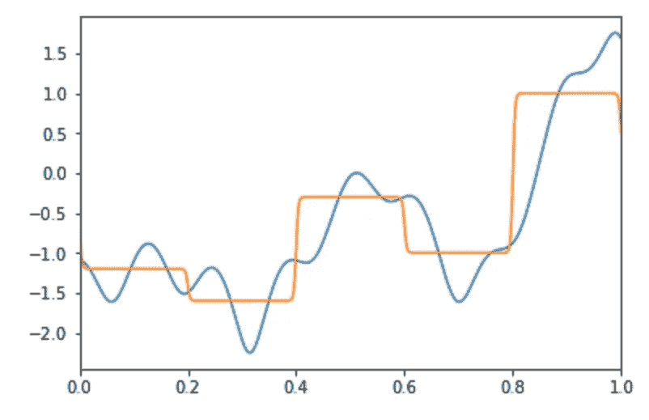

Approximating the weighted output of the hidden layer using sigmoid functions with very large weights (such that the sigmoids approach step functions).

这个近似值远非理想。然而，是否可以直接改进它，例如，通过增加节点数或层数(但同时避免过度拟合)。

# 结论

在本文中，我描述了神经网络通用属性背后的一些基本数学，并展示了一个简单的 Python 代码，它实现了一个简单函数的近似。

尽管文章中已经包含了完整的代码，但我的 Github 和我的个人网站 www.marcotavora.me(希望)还有一些关于数据科学和物理学的有趣内容。

感谢您的阅读，再见！

顺便说一下，建设性的批评和反馈总是受欢迎的！