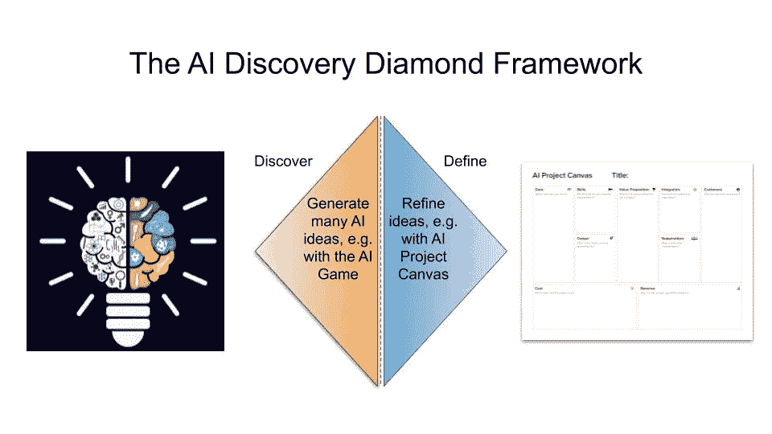
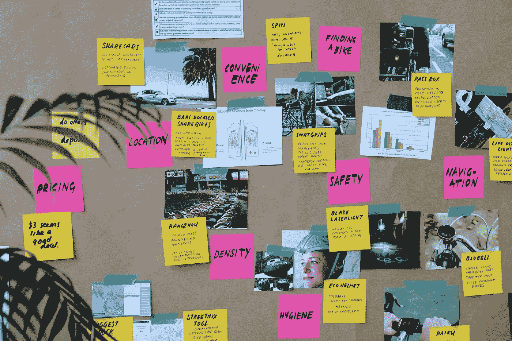
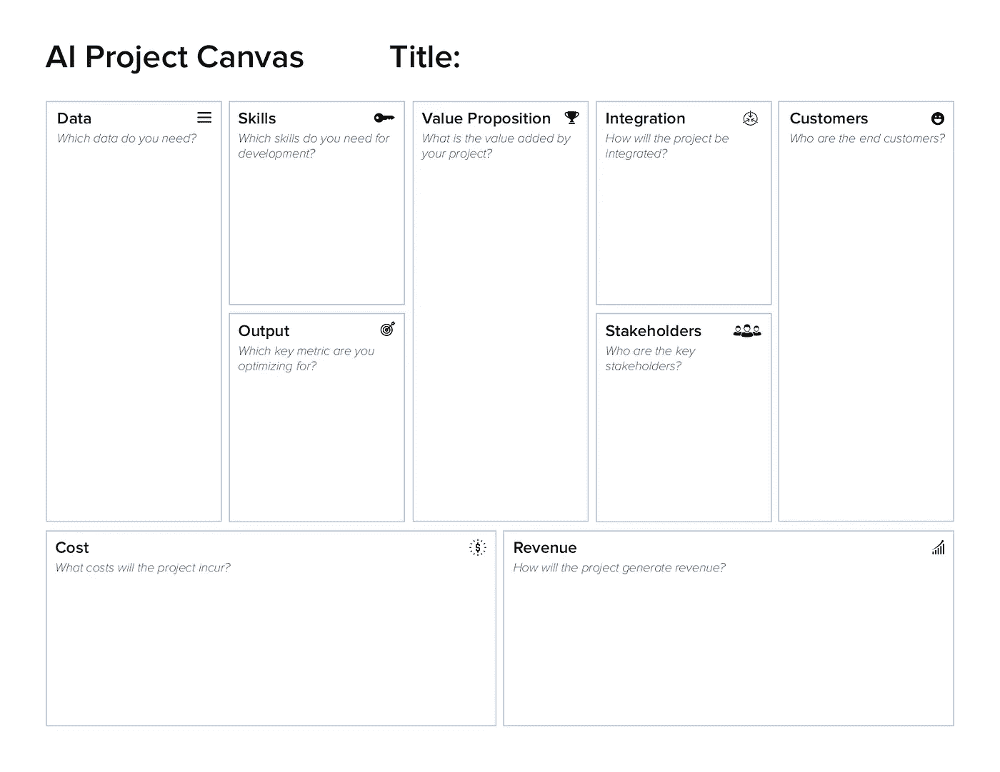
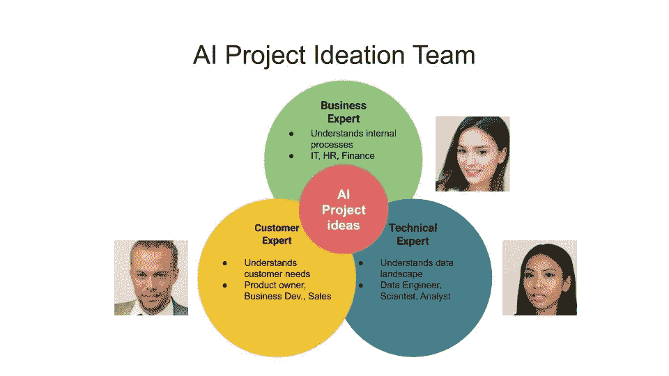
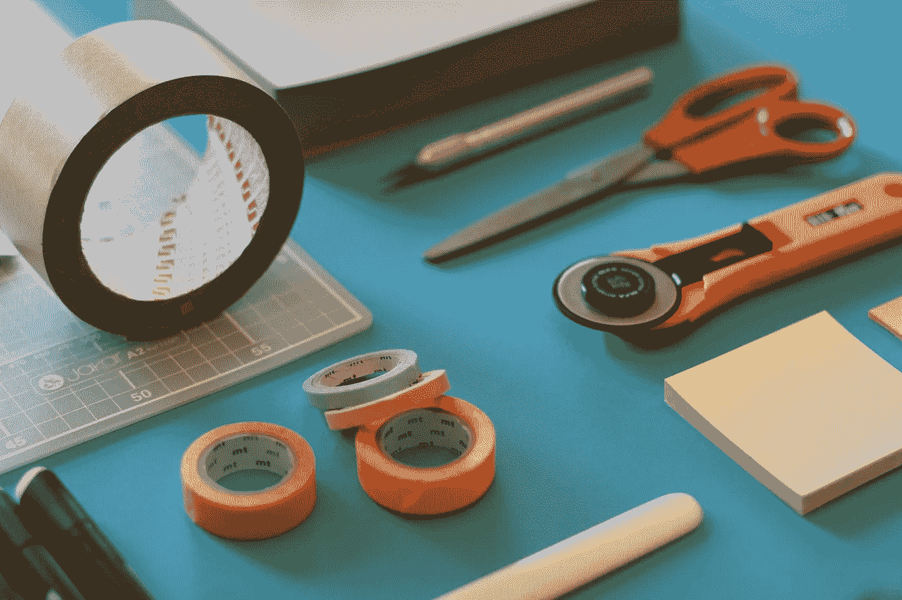

# 寻找人工智能项目的艺术和科学

> 原文：<https://towardsdatascience.com/the-art-and-science-of-finding-ai-projects-4bf82b4899c3?source=collection_archive---------14----------------------->

## [人工智能项目管理](https://towardsdatascience.com/tagged/project-management-ai)

## 不知道如何入门 AI？使用人工智能发现钻石框架产生人工智能项目想法。

人工智能的潜力是巨大的。80%的美国首席执行官认为人工智能将在未来五年内显著改变他们做生意的方式， [2019 普华永道美国首席执行官调查](https://www.pwc.com/us/en/library/ceo-agenda/ceo-survey.html)称。然而，人工智能不仅是未来，也是现在。根据 [2019 财富调查](https://fortune.com/2019/05/16/fortune-500-2019-ceo-survey/)，60%的财富 500 强公司已经采用人工智能来改善流程。虽然全球经济前景可能很严峻，但首席执行官们期待人工智能创造产品和提高效率。

Photo by [Jo Szczepanska](https://unsplash.com/@joszczepanska?utm_source=unsplash&utm_medium=referral&utm_content=creditCopyText) on [Unsplash](https://unsplash.com/s/photos/project?utm_source=unsplash&utm_medium=referral&utm_content=creditCopyText)

现在你的经理对人工智能的潜力感到兴奋，并要求你提出人工智能项目的想法。但是你如何产生人工智能项目的想法呢？你需要和谁谈？你如何创建一个成功的人工智能项目创意管道？

这篇文章向你介绍了一个提出人工智能项目想法的框架。它侧重于思考 AI 项目的基础，项目生成框架，以及寻找 AI 项目的团队。内容基于全球专家 [landing.ai](https://landing.ai/) 、 [Alexander Thamm GmbH](https://www.google.com/url?sa=t&rct=j&q=&esrc=s&source=web&cd=1&cad=rja&uact=8&ved=2ahUKEwjC6qPClJzmAhVCDewKHTNXDCIQFjAAegQIARAC&url=https%3A%2F%2Fwww.alexanderthamm.com%2Fde%2F&usg=AOvVaw2Mt1hM7WsUgAnL2vSguzNq) 、 [In The Pocket](https://inthepocket.com/technologies/machine-learning) 的输入，以及我的个人经验。

# 理解商业和人工智能

在开始任何项目构思工作之前，你首先需要一个坚实的基础。只有了解你的公司和人工智能的能力，你才能找到人工智能项目。对外部顾问来说，了解一家企业可能具有挑战性，因为他们需要迅速找出一家公司的古怪之处。然而，对于有经验的员工来说，这仍然很重要。

Photo by [Franck V.](https://unsplash.com/@franckinjapan?utm_source=unsplash&utm_medium=referral&utm_content=creditCopyText) on [Unsplash](https://unsplash.com/s/photos/ai?utm_source=unsplash&utm_medium=referral&utm_content=creditCopyText)

AI 通常擅长三件事:创造新产品、改进现有产品和自动化任务。虽然前两类承诺新的收入，最后一类旨在降低成本。正如您在[数据科学家业务基础](/business-basics-for-data-scientists-862f116a82da)中所了解到的，在降低成本之前专注于增加收入是明智的建议。

> 当采用传统软件开发无法解决挑战时，就使用人工智能应用程序。当潜在模式不明显时，通常就是这种情况。—[Patrick glau ner 博士](https://www.linkedin.com/in/glauner/)，数据学院负责人， [Alexander Thamm GmbH](https://www.alexanderthamm.com/)

当寻找人工智能项目创意来推动收入时，你可以尝试生成新的基于人工智能的产品，或者用人工智能改进现有产品。为新产品寻找人工智能项目，了解你所在的行业。您的客户有哪些痛点？要确定如何用 AI 改进现有产品，你需要彻底了解现有产品。产品经理可以帮助你了解现有的机遇和挑战，并让你有机会寻找人工智能项目的想法。

> 你的公司到处都是机会。每个部门都应该有一个问题的答案:“你的哪些日常任务可以通过计算机视觉或 NLP 得到增强？”— [肯尼·赫尔森斯](https://www.linkedin.com/in/kennyhelsens/)，艾领先，[在口袋里](https://inthepocket.com/)

当寻求通过人工智能降低成本时，专注于自动化任务是至关重要的。要实现任务自动化，您需要了解内部流程和法规。与财务、人力资源或 IT 等业务支持职能部门的员工会面，规划高度重复性的任务。这些任务是自动化的主要目标。

> *人工智能是自动化的兴奋剂。人工智能项目的一个丰富的想法来源将在于自动化人类今天正在做的任务。尝试识别人们正在做的特定任务，并检查是否有可以自动化的任务。——*[*博士*吴恩达](https://www.linkedin.com/in/andrewyng/) *，CEO landing.ai，在* [*如何选择你的第一个 ai 项目*](https://hbr.org/2019/02/how-to-choose-your-first-ai-project)

Photo by [Franck V.](https://unsplash.com/@franckinjapan?utm_source=unsplash&utm_medium=referral&utm_content=creditCopyText) on [Unsplash](https://unsplash.com/s/photos/automation?utm_source=unsplash&utm_medium=referral&utm_content=creditCopyText)

在做了繁重的工作之后，你理解了你所经营的业务和人工智能项目的能力。接下来，让我们应用这个框架来不断地提出人工智能项目的想法。

# 人工智能发现钻石框架

本文提出的方法是人工智能发现钻石框架。这个框架给你一个结构化的方法来提出人工智能项目的想法。

人工智能发现钻石框架由两个迭代组成。首先，你提出尽可能多的人工智能项目想法。第二，你把名单缩小到最有希望的。让我们详细地看一下每个迭代。

## 发现——产生一个人工智能项目创意池

人工智能发现钻石的第一个迭代步骤探索你面前的广阔解决方案空间。潜在的假设是，有价值的人工智能项目想法可以以任何形式和情况出现，没有想法是愚蠢到不值得考虑的。有不同的方法来提出疯狂的人工智能想法。

Photo by [Jo Szczepanska](https://unsplash.com/@joszczepanska?utm_source=unsplash&utm_medium=referral&utm_content=creditCopyText) on [Unsplash](https://unsplash.com/s/photos/brainstorming?utm_source=unsplash&utm_medium=referral&utm_content=creditCopyText)

例如，位于比利时的数字产品工作室[在口袋里](https://inthepocket.com/)创造了[人工智能游戏](https://inthepocket.com/ai-the-game)来帮助你提出人工智能项目的想法。它使用人工智能项目想法的参考，例如人脸识别来解锁智能手机或自动分类电子邮件，以启动构思过程。参与者使用这些参考项目作为刺激，将它们转化为自己的想法。

> AI 这个游戏是一种可以和一小群人一起玩的纸牌游戏。理想情况下，你和 10 个人玩两轮，玩一个小时，在这期间你会想出 20 个点子。许多想法并不总是伟大的，这没关系。如果一个小时后，小组提出了 2 或 3 个新鲜的、有价值的概念，那么花时间总是值得的。— [肯尼·赫尔森斯](https://www.linkedin.com/in/kennyhelsens/)

即使你不玩 AI 这个游戏，和一群合适的人一起头脑风暴也会让你走得更远。头脑风暴法的想法可以是[循环法](https://www.toolshero.com/creativity/round-robin-brainstorming/)、[安静写作](https://gamestorming.com/brainwriting/)，或者其他产生想法的敏捷方法。有一个知识渊博的主持人来指导头脑风暴会很有帮助。

然而，人工智能项目想法的唯一数量并不代表一切。到现在为止，你可能已经有了许多人工智能项目的想法，但是你如何将注意力集中在最有前途的项目上呢？

## 定义—缩小最有前途的人工智能项目想法的范围

一旦你收集了许多想法，是时候对这些想法进行排序了。在[圣杯人工智能项目的美丽](/the-beauty-of-holy-grail-ai-projects-and-how-to-find-them-5dbbbadd7ae6)中，你已经读到风险和影响是评估人工智能想法的最关键因素。评估人工智能项目想法可行性的一个重要工具是[人工智能项目画布](/introducing-the-ai-project-canvas-e88e29eb7024)。

人工智能项目画布可以帮助你就你的项目提出正确的问题。你对这个项目令人信服的回答越多，它的可行性就越高。在你为每一个人工智能项目构想制定了人工智能项目画布之后，你可以方便地对项目进行排序，并关注最有前途的项目。在口袋里设计了他们的 [AI 值画布](https://inthepocket.com/ai-value-canvas)也是为了这个目的。

Photo by [Jeff Sheldon](https://unsplash.com/@ugmonk?utm_source=unsplash&utm_medium=referral&utm_content=creditCopyText) on [Unsplash](https://unsplash.com/s/photos/project?utm_source=unsplash&utm_medium=referral&utm_content=creditCopyText)

现在你知道了如何找到人工智能项目的想法，让我们来看看你应该招募哪些关键人物来提出伟大的人工智能项目想法。

# 团队想出伟大的人工智能项目的想法

你需要一个专家梦之队来提出有前途的人工智能项目想法。团队成员应该是以下三个领域的专家:业务、客户和数据。让我们看一下每一个类别。

第一类由商业专家组成。这些同事非常了解公司及其流程。理想情况下，他们对现有流程有一个很好的概述，并在人工智能的正确推动下，可以提出如何自动化流程的想法。来自 IT、财务或人力资源部门的同事是团队的有益补充。

Photo by [Jo Szczepanska](https://unsplash.com/@joszczepanska?utm_source=unsplash&utm_medium=referral&utm_content=creditCopyText) on [Unsplash](https://unsplash.com/s/photos/project?utm_source=unsplash&utm_medium=referral&utm_content=creditCopyText)

第二类是真正从客户角度出发的员工。同事们了解客户的痛点和需求。他们的知识对于提出充满人工智能的产品创意将是无价的。产品负责人、项目经理、业务开发人员和销售同事都很符合这种情况。

> 在客户方面，你需要技术专家、了解过去已经尝试过的东西的决策者和创新经理。业务分析师、数据科学家和数据策略师是可能的外部项目合作伙伴。帕特里克·格劳纳博士

第三类是技术数据专家，即数据学家。他们了解技术领域，可以帮助回答技术问题。数据学家还了解前沿技术的发展，并可以专注于将研究突破应用于新的人工智能项目想法。数据工程师、科学家和分析师是第三类研讨会的参与者。根据吴恩达的说法，理想情况下，数据学家的大本营在一个集中的人工智能团队中。

> 在人工智能时代，许多公司的关键时刻将是组建一个集中的人工智能团队。这个人工智能团队可以隶属于首席技术官、首席信息官或 CDO。它也可以由专门的 CAIO(首席人工智能官)领导。— [吴恩达](https://medium.com/u/592ce2a67248?source=post_page-----4bf82b4899c3--------------------------------)， [AI 转型剧本](https://landing.ai/ai-transformation-playbook/)

从软技能的角度来看，寻找对人工智能有创造力和兴趣的参与者。当您为研讨会搭建舞台时，请确保营造一个安全和信任的氛围。在探索阶段，所有的想法都是有效的，而你想要利用那些天马行空的想法。在定义阶段，当评估人工智能项目潜力时，切换到更理性和保守的心态，特别是当你仍然处于人工智能成熟之旅的早期阶段时。

# 关键要点

在这篇文章中，你学习了如何简化寻找合适的人工智能项目想法的过程。在了解你所在的业务和人工智能的能力后，人工智能发现钻石可以帮助你从构思到评估。加入正确的团队，你会想出出色的人工智能项目创意。

*   先了解业务和人工智能潜力
*   使用人工智能发现钻石框架来寻找新的人工智能项目创意
*   召集合适的商业、客户和技术专家团队来构思新的人工智能项目

现在是你把这篇文章中的理论知识应用到现实生活中的时候了。我们非常感谢您的任何反馈！如果你想听更多关于商业、项目管理和数据科学的交集，**在 [Medium](https://medium.com/@janzawadzki) 、 [LinkedIn](https://www.linkedin.com/in/jan-zawadzki/) 或 [Twitter](https://twitter.com/janmzawa) 上关注** me。