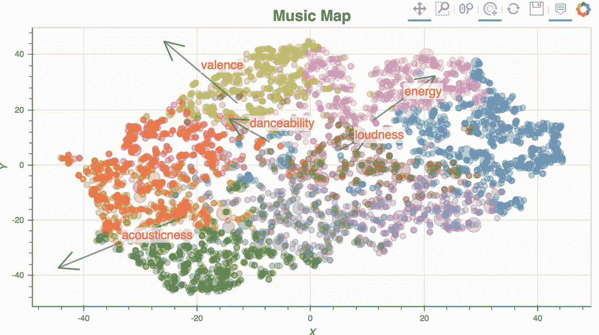
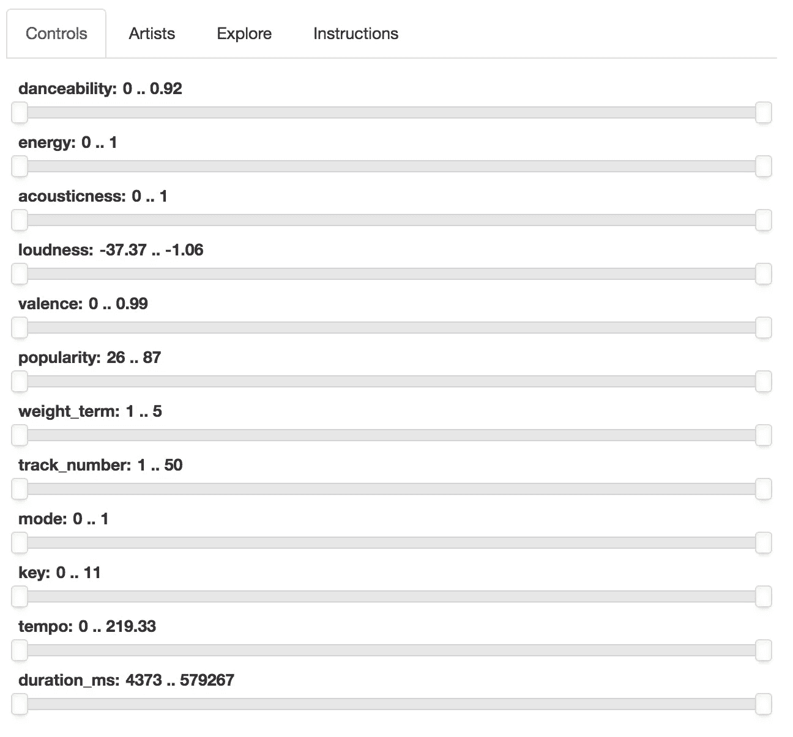

# 创建混音带的艺术——一种数据科学方法

> 原文：<https://towardsdatascience.com/the-art-of-creating-a-mixtape-a-data-science-approach-1902065b1d1d?source=collection_archive---------11----------------------->

> [查看交互式仪表板原型，探索您的音乐库](https://s-farooq.github.io/musicmap)(仅适用于桌面！)

《汉密尔顿》的创作者林·曼努埃尔·米兰达(Lin Manuel Miranda)谈到混音带是我即将与大家分享的这个项目的最佳介绍:

> 米兰达:我成长在盒式磁带衰落、CD 增长的时代。所以混音带——不是混音 CD，是混音带——是纽约青少年友谊和交配仪式的重要组成部分(笑声)。如果你是一个女孩，我想要你——为了向你表明我喜欢你，我会给你做一盘 90 分钟的磁带，在里面我会展示我的品味。我会给你放一首音乐剧歌曲，旁边放一首嘻哈歌曲，旁边放一首老歌，旁边放一首你可能从未听过的流行歌曲，同时下意识地告诉你我有多喜欢你的这些歌曲。
> 
> 我想我在 90 年代通过制作混音带为百老汇谱曲学到的东西比我在大学里学到的还多。**你正在学习上升和下降，能量和节奏的变化。你在炫耀你的品味和推荐人。你想变得机智，通过播放不是你写的音乐。**所以我的节目最初的名字叫“汉密尔顿混音带”并非偶然这就是我写乐谱的方法。这是，这是…
> 
> 格罗斯:哦，这就是你这么叫它的原因。哦，好吧。我明白了。
> 
> 米兰达:是的。这是，这是我所知道的关于这家伙的一切，这是一个旅程，你也是一个旅程。再说一次，我在 CD 之前制作这种区别磁带的原因是**你必须按照我为你安排的顺序来听。你知道，A 面到 B 面是我们的表演休息时间。我这么说是为了回答你的问题，因为我有朋友只听嘻哈音乐。我有只听音乐剧的朋友，我骄傲地站在中间，我会说，我要用这首歌改变你的生活。**

是啊！创作混音磁带背后有一种艺术——有了 Spotify 这样的应用和我们弹指一挥间就能获得的海量曲目，这种艺术已经被遗忘了。但它仍然存在，也许它被称为播放列表，也许它失去了混音带所具有的一些浪漫属性，但为另一个人的耳朵精选音乐的基本情感是——我从个人经历中说的——一种非常棒的感觉。

林强调了制作混音带的基础:

1.  流畅很重要——有起伏和节奏变化，这些元素是游戏的一部分。*播放列表*的场景受到了影响，因为我们仍然把它当作一个推荐系统——试图根据情绪、流派、艺术家等找到*【相似】*足够多的东西。这也是为什么它失去了混音带的浪漫。换句话说，我们的播放列表没有“故事”,它们平淡无奇，毫无关联。播放列表上的曲目聚集在一起，因为它们碰巧都在同一个派对上(形象地说)，喜欢相同的东西，吃相同的食物。这没什么意思。冲突发生了什么？帝国的兴衰？命运和性格的紧张关系，直到最后的旋律来解决我们巨大的痛苦。
2.  **订单很重要** —因此，专辑订单很重要！我越来越少尝试“随机播放”音乐——艺术家为听过第一首歌的耳朵设计了第二首歌。作为一名馆长，我也希望我的弟子们能自律。我希望他们按照指示，按顺序听，不要把我的选择看成“这里有一堆我最喜欢的歌曲”，而是“我 ***设计了*** 这个列表是为了 ***你*** 按照这个特定的顺序，为了 ***你！***’。
3.  **真实性很重要**——混音带不能通过在谷歌上搜索“与朋友分享的最佳混音带”来制作。混音带不是来自“这是你的朋友会喜欢的最好的 8 首歌”的帖子。混音带肯定不是来自“我运行了一个算法，它决定这是 7 首让你爱上的歌”。混音带来自内心，来自经历，来自我生活中积累的元素，来自你的积累。如果像林说的那样，我说‘我要改变你的人生！’当我创作一张混音带时，这意味着我知道改变生活需要什么！托尔斯泰，定义艺术，把一个大的依赖于真诚，“*如果只有观众或旁听者被作者感受到的感情所感染***，这就是艺术。**

*但在后卡带和 CD 时代，很难遵循这些原则。为什么？因为选择。选择太多。我可以直接访问数百位艺术家的数千首歌曲，我怎么能选择 10-15 首呢……我甚至不能把我所有的曲库都保存在我的记忆中。在一个朋友请求与他分享我的音乐时，我被这种存在危机所困扰，我开始思考:我有成千上万首歌曲可供选择，我的过程是什么？我如何着手制作这个混音带？唉，我希望我能更好地欣赏我的音乐……所以，我们在这里。*

# *更好地欣赏我的音乐*

**

*A Better View: Music Map*

*曲目是复杂的，像艺术家、专辑或流派这样的单一描述符不足以抓住它们潜在的“感觉”。因此，我需要一种方法来获取更多信息，并在开始选择之前了解我的歌曲“库存”。反复地，这导致了[一个交互式仪表盘](https://s-farooq.github.io/musicmap)的功能原型，它将允许我*在 ***地图形式*** (如上图所示)中漫游*我的音乐库，其方式比在列表上向下滑动更具信息性。*

*仪表板是一个探索性的研究工具，允许我查看其他混音带(专辑)的空间映射，也是一个组织工具，为我的播放列表选择曲目。*

> **这里有一个快速的例子，我首先找到一首不太积极(低价)但充满活力的歌曲，然后将它与特定艺术家的歌曲联系起来(看台):**

* [## musicmapclip.mov

### 编辑描述

drive.google.com](https://drive.google.com/open?id=1ySBf1fYVeT_rEJr6vUdRn2g4adBNZoD7) 

## 声音特征

为了了解歌曲的潜在属性，我想到自己做声音分析，但后来发现 Spotify 在计算音频特征方面做了一些很好的工作。以下是经过一些过滤后证明对创建空间映射有用的方法:

*   **Acousticness:** " *从 0.0 到 1.0 的音轨是否声学的置信度度量。*
*   **可跳舞性:“** *可跳舞性描述了一个曲目在音乐元素组合的基础上适合跳舞的程度，包括速度、节奏稳定性、节拍强度和整体规律性。*
*   **能量:** *“能量是从 0.0 到 1.0 的度量，代表强度和活动的感知度量。通常，充满活力的曲目让人感觉速度快、声音大、嘈杂。”*
*   **响度:** *“一个音轨的整体响度，单位为分贝(dB)。响度值是整个轨道的平均值，可用于比较轨道的相对响度。*
*   **价:** *“从 0.0 到 1.0 的一个度量，描述一个音轨所传达的音乐积极性。高价曲目听起来更积极(例如，快乐、愉快、欣快)，而低价曲目听起来更消极(例如，悲伤、沮丧、愤怒)。”*

## 2D 制图的技术细节

我把上面的特征(+一些其他的)缩放成正态分布，然后用 TSNE 把它们缩减成二维，这样我就可以创建你上面看到的“音乐地图”。现在我们有了一个歌曲库的鸟瞰图，其中每首歌曲都与另一首歌曲相对应，而不是一个无意义的无尽条目列表。我还使用 K-means 高维聚类来获得歌曲组——每种颜色代表一个不同的聚类——它们在地图上充当认知地标，指示分离和边界。我喜欢地图，我认为空间性有助于知识组织，从而使构建认知地图变得更容易。认知地图有助于捕捉项目之间的联系。然后，我计算了每个音频特征在 X 轴和 Y 轴上的线性梯度，并用指示流向的箭头对其进行了标注。

## 如何解读图形

*   每个圆点是一首歌，它的位置反映了它与其他歌曲的相关性。例如，左边的歌曲与右边的歌曲相比，与中间的歌曲有更大的不同。
*   流向箭头离地图中心越远，相应方向的流向越强。例如，地图的左下方包含显著的声学特征，因为**声学**梯度箭头长且远离中心。另一方面，**响度**梯度箭头较小并且更靠近地图的中心，这表明尽管在地图的右上象限中较响的歌曲有一定的相关性，但是相关性较弱。
*   颜色是集群，意味着相同颜色的点在更高的维度上聚集在一起，它们有助于看到两组重叠的边界。

> 这种基于图形的用户界面是我一直在思考和尝试的，比如博客帖子、推文等等。因为[我认为改变用户界面结构也会改变我们的思维方式](https://shaham.ca/thinking-outside-gui)。

## 交互式控件

Control Panel for Music Map

当然，盯着五颜六色的点看并不能提供多少信息，所以我让它与标签互动，并添加了过滤和聚焦地图的控件。我还增加了交互功能，可以选择歌曲添加到你的混音带中，并在地图上追踪它们的位置。

**互动功能:**

*   ***控件*** 选项卡可以根据歌曲的各种属性过滤地图。
*   ***艺术家*** 选项卡也允许过滤艺术家。
*   ***浏览*** 标签显示地图上您将鼠标悬停在轨迹上时轨迹的详细信息。
*   ***将鼠标悬停在一首歌曲上*** 也会在地图上高亮显示同一专辑中的其他歌曲及其排序。
*   ***点击一首歌曲*** 会将它添加到地图下方的 mixtape 表中，在这里你可以点击预览按钮，从歌曲中间快速获得一段 30 秒的片段。
*   ***切换*** ***右上角的*** 按钮可以让你切换不同的地图视图。

# 绘制混音带

在探索、研究和选择之后，你可以看到你的混音带的最终空间之旅。

Sample Mixtape Spatial Journey

回到我们最初的混音原则:我们使用了潜在的声音特征来强调和设计**流**——我们可以从地图的各个部分设计运动，就像把听众从良好的共鸣音响带到压抑但充满活力的流行音乐，再到柔和的凝视鞋子的梦幻流行音乐序列。为心流而设计的一部分是在地图上研究你最喜欢的艺术家的其他专辑的动向。**顺序**考虑到了，我们按顺序一首接一首地挑选我们的歌曲。最后，**真实性**，虽然不能保证真诚，但我们的地图包含了来自我们自己图书馆的歌曲。因此，至少，这种结构允许真实、真诚地选择确实感染了我们的歌曲，正如我们期望它们感染另一个人一样。* 

# *结束语*

*   *我在这篇文章中链接的原型是从我自己的图书馆中随机选择的不同流派的艺术家构建的——更倾向于独立/摇滚/声学。(奇怪的是，分享一个人的音乐库有点*暴露*…但别担心，我没有泄露我所有的秘密(歌曲)！)*
*   *这种方法显然强调音乐的声音部分，而不是歌词。进一步的工作将结合歌词和词汇质量的主题建模。我不久前做的一个项目对此进行了一些探索。*
*   *目前，我使用 Bokeh 独立 Javascript 来完成整个事情，以避免处理任何服务器成本:)因此，我没有通过 Spotify API 添加自动播放列表创建。目前，你可以创建一个歌曲列表，然后自己将它们添加到 Spotify 播放列表中。*

*如果你觉得这很有趣，并且想要你自己的音乐地图，我不能保证，但是给我你的艺术家列表，我会看看我能做什么！*