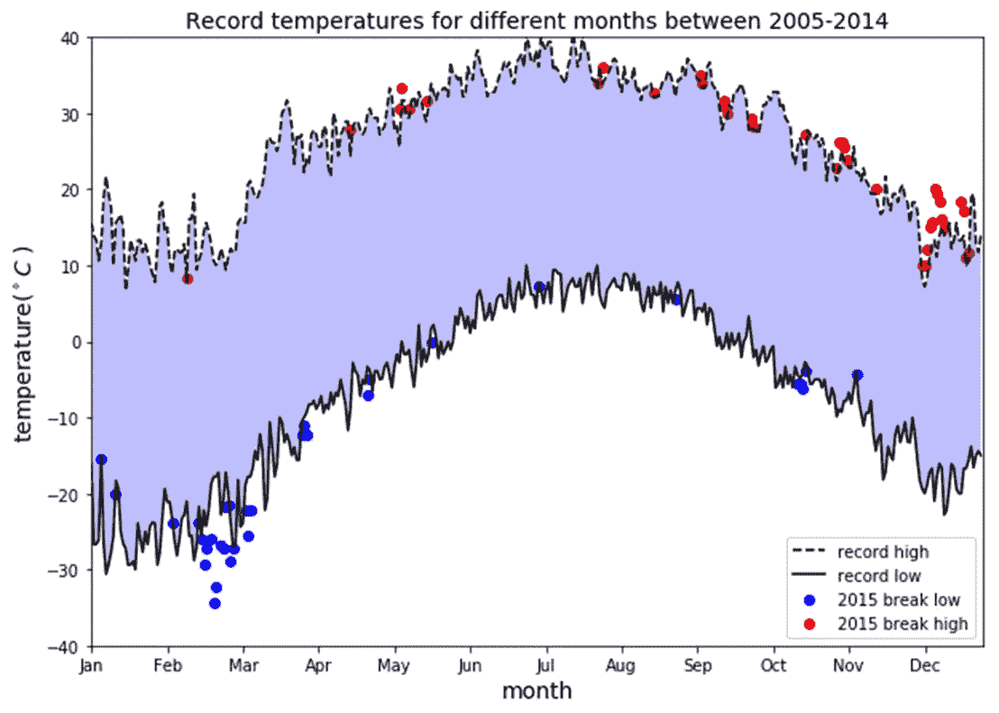
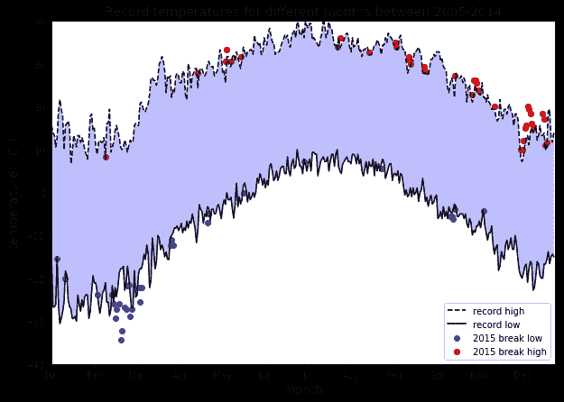
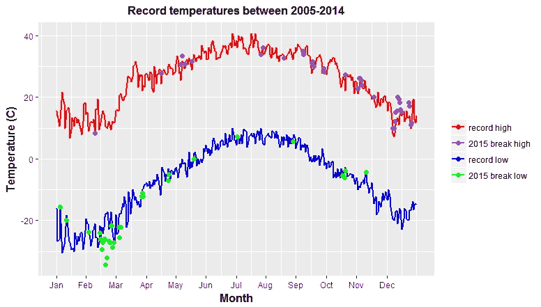

# 数据可视化的艺术——使用 Matplotlib 和 Ggplot2 实现天气数据可视化

> 原文：<https://towardsdatascience.com/the-art-of-data-visualization-weather-data-visualization-using-matplotlib-and-ggplot2-4d4b48b5b7c4?source=collection_archive---------21----------------------->



数据可视化与其说是**科学**，不如说是一门**艺术**。为了产生良好的可视化效果，您需要将几段代码放在一起，以获得出色的最终结果。本教程演示了如何通过分析天气数据产生良好的数据可视化。

在第一节的**中，我们使用 matplotlib 包制作了一个可视化。在**第二节**中，我们尝试使用 ggplot2 再现可视化。**

在深入研究数据可视化艺术之前，让我们首先讨论一个好的数据可视化的基本组件。

# 良好的数据可视化的组成部分

一个好的数据可视化由几个组件组成，这些组件必须组合在一起才能产生最终产品:

a) **数据组件**:决定如何可视化数据的第一个重要步骤是了解数据的类型，例如分类数据、离散数据、连续数据、时间序列数据等。

b) **几何组件:**您可以在这里决定哪种可视化适合您的数据，例如散点图、线形图、条形图、直方图、QQ 图、平滑密度、箱线图、对线图、热图等。

c) **映射组件:**这里你需要决定用什么变量作为你的 x 变量，用什么变量作为你的 y 变量。这一点非常重要，尤其是当数据集是包含多个要素的多维数据集时。

d) **秤组件:**在这里您可以决定使用哪种秤，例如线性秤、对数秤等。

e) **标签组件:**这包括轴标签、标题、图例、使用的字体大小等。

伦理成分:在这里，你要确保你的视觉化图像讲述的是真实的故事。在清理、总结、操作和制作数据可视化时，你需要意识到你的行为，并确保你没有利用你的可视化来误导或操纵你的观众。

本文将比较 **Python 的 Matplotlib** 和 **R 的 ggplot2** 包在分析和可视化天气数据方面的优势。

该代码将执行以下数据可视化任务:

1.  它返回了 2005 年至 2014 年期间一年中每天的最高纪录和最低纪录的折线图。一年中每一天的最高温度和最低温度之间的区域用阴影表示。
2.  覆盖 2015 年打破十年记录(2005-2014 年)最高或最低记录的任何点(最高和最低)的 2015 年数据散点。

**数据集**:本项目使用的 NOAA 数据集存储在文件 [weather_data.csv](https://github.com/bot13956/weather_pattern/blob/master/weather_data.csv) 中。这些数据来自国家环境信息中心(NCEI)每日全球历史气候网络(GHCN-Daily)的一个子集。GHCN-Daily 由来自全球数千个地面站的每日气候记录组成。这些数据是从美国密歇根州安阿伯市**附近的数据站**收集的。

本文的完整代码可以从这个资源库下载:[**https://github.com/bot13956/weather_pattern**](https://github.com/bot13956/weather_pattern)。

# I .使用 Python 的 Matplotlib 包进行气象数据分析和可视化

# 1.导入必要的库和数据集

```
**import** **matplotlib.pyplot** **as** **plt**
**import** **pandas** **as** **pd**
**import** **numpy** **as** **np**
df=pd.read_csv('weather_data.csv')
df.head()
```

# 2.数据准备和分析

```
#convert temperature from tenths of degree C to degree C
df['Data_Value']=0.1*df.Data_Valuedays=list(map(**lambda** x: x.split('-')[-2]+'-'+x.split('-')[-1], df.Date))years=list(map(**lambda** x: x.split('-')[0], df.Date))df['Days']=days 
df['Years']=yearsdf_2005_to_2014=df[(df.Days!='02-29')&(df.Years!='2015')]
df_2015=df[(df.Days!='02-29')&(df.Years=='2015')]df_max=df_2005_to_2014.groupby(['Element','Days']).max()
df_min = df_2005_to_2014.groupby(['Element','Days']).min()
df_2015_max=df_2015.groupby(['Element','Days']).max()
df_2015_min = df_2015.groupby(['Element','Days']).min() record_max=df_max.loc['TMAX'].Data_Value
record_min=df_min.loc['TMIN'].Data_Value
record_2015_max=df_2015_max.loc['TMAX'].Data_Value
record_2015_min=df_2015_min.loc['TMIN'].Data_Value
```

# 3.生成数据可视化

```
plt.figure(figsize=(10,7))plt.plot(np.arange(len(record_max)),record_max, '--k', label="record high")plt.plot(np.arange(len(record_max)),record_min, '-k',label="record low")plt.scatter(np.where(record_2015_min < record_min.values),
            record_2015_min[record_2015_min < 
            record_min].values,c='b',label='2015 break low')plt.scatter(np.where(record_2015_max > record_max.values),
            record_2015_max[record_2015_max >      
            record_max].values,c='r',label='2015 break high')plt.xlabel('month',size=14)plt.ylabel('temperature($^\circ C$ )',size=14)plt.xticks(np.arange(0,365,31),
          ['Jan','Feb','Mar','Apr','May','Jun','Jul','Aug',   
           'Sep','Oct','Nov','Dec'])ax=plt.gca()ax.axis([0,365,-40,40])plt.gca().fill_between(np.arange(0,365), 
                       record_min, record_max, 
                       facecolor='blue', 
                       alpha=0.25)plt.title('Record temperatures for different months between 2005-2014',size=14)plt.legend(loc=0)

plt.show()
```



**Weather data visualization using matplotlib.**

# 二。使用 R 的 Ggplot2 软件包进行天气数据分析和可视化

我在想，我能不能用 R 的 ggplot2 包制作一个类似的上图？

因此，我决定进行类似的分析，看看我能与 ggplot2 接近到什么程度。

# 1.导入必要的库和数据集

```
library(tidyverse)
library(readr)
df<-read.csv("weather_data.csv")
```

# 2.数据准备和分析

```
**#convert temperature from tenths of degree C to degree C**df$Data_Value = 0.1*df$Data_Value **#functions to split date** split_function<-function(x)unlist(strsplit(x,'-'))year_function<-function(x)split_function(x)[1]
day_function<-function(x)paste(split_function(x[2],
                               split_function(x)[3],sep='-') **#create Day and Year columns** day<-sapply(as.vector(df$Date),day_function)
year<-sapply(as.vector(df$Date),year_function)
df<-df%>%mutate(Day=day,Year=year ) **#filter leap year and select 10 year observation period: 2005-2014** df_2005_to_2014<-df%>%filter((df$Day!='02-29') (df$Year!='2015'))df_2015<-df%>%filter((df$Day!='02-29')&(df$Year=='2015')) **#record min and max for each day of the year for the 2005-2014 period** record_max<-df_2005_to_2014%>%group_by(Day)%>%summarize(Max = max(Data_Value),Min=min(Data_Value))%>%.$Maxrecord_min<-df_2005_to_2014%>%group_by(Day)%>%summarize(Max = max(Data_Value),Min=min(Data_Value))%>%.$Min **#record min and max for each day of the year for 2015** record_2015_max<-df_2015%>%group_by(Day)%>%summarize(Max = max(Data_Value),Min=min(Data_Value))%>%.$Maxrecord_2015_min<-df_2015%>%group_by(Day)%>%summarize(Max = max(Data_Value),Min=min(Data_Value))%>%.$Min
```

# 3.为可视化准备数据

```
**#data frame for the 2005-2014 temperatures** y<-c(seq(1,1,length=365),seq(2,2,length=365))
y<-replace(replace(y, seq(1,365),'max'),seq(366,730),'min')
values<-data.frame(day=c(seq(1,365), seq(1,365)),element=sort(y),Temp=c(record_max,record_min))
q<-values%>%mutate(element=factor(element))**#data frame for the 2015 temperatures** max_index<-which(record_2015_max>record_max)
min_index<-which(record_2015_min < record_min)dat15_max<data.frame(max_index=max_index,
                     Tmax=record_2015_max[max_index])dat15_min<-data.frame(min_ndex=min_index,  
                      Tmin=record_2015_min[min_index])
```

# 4.生成可视化

```
q%>%ggplot(aes(day,Temp,color=element))+
    geom_line(size=1,show.legend = TRUE)+
    geom_point(data=dat15_max,
               aes(max_index,Tmax,color='max_index'),
               size=2,show.legend = TRUE)+        
    geom_point(data=dat15_min,
               aes(min_index,Tmin,color='min_index'),
               size=2,show.legend = TRUE)+  
    scale_colour_manual(labels=c("record high","2015 break  
               high","record low","2015 break low"),
               values=c('red','purple','blue','green'))+    
    xlab('Month')+ 
    ylab('Temperature (C)')+  
    scale_x_continuous(breaks = as.integer(seq(1,335,length=12)), 
           labels=c('Jan','Feb','Mar','Apr','May','Jun','Jul','Aug',
             'Sep','Oct','Nov','Dec'))+ 
    ggtitle("Record temperatures between 2005-2014")+  
    theme(    
    plot.title = element_text(color="black", size=12, hjust=0.5,       
                              face="bold"),    
    axis.title.x = element_text(color="black", size=12,   
                                face="bold"),     
    axis.title.y = element_text(color="black", size=12,   
                                face="bold"),    
    legend.title = element_blank())
```

以下是使用 R 的 ggplot2 的输出:



# 观察

我尽力用 R 的 ggplot2 包制作了一个可视化效果，它与用 Python 的 Matplotlib 制作的非常相似。

在我看来，对于这个特定的项目，与 R 的 ggplot2 包相比，Matplotlib 产生了更好、更漂亮的可视化效果。与 ggplot2 相比，使用 matplotlib 生成可视化效果所需的工作量(代码行)更少。

如果您有兴趣下载 Matplotlib 和 ggplot2 执行的源代码，请访问下面的 Github 资源库:[**https://github.com/bot13956/weather_pattern**](https://github.com/bot13956/weather_pattern)**。**

请留下关于如何改进 ggplot2 可视化的建议的反馈意见。我很肯定质量可以提高。