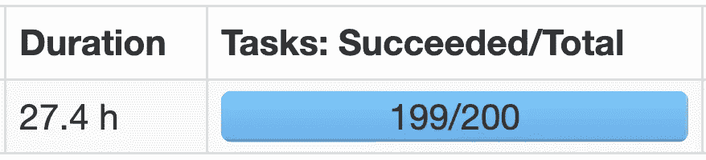
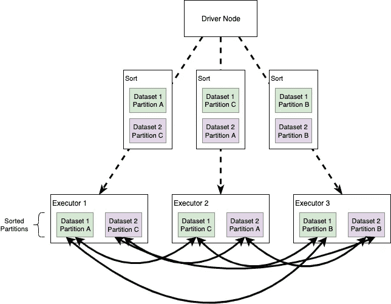
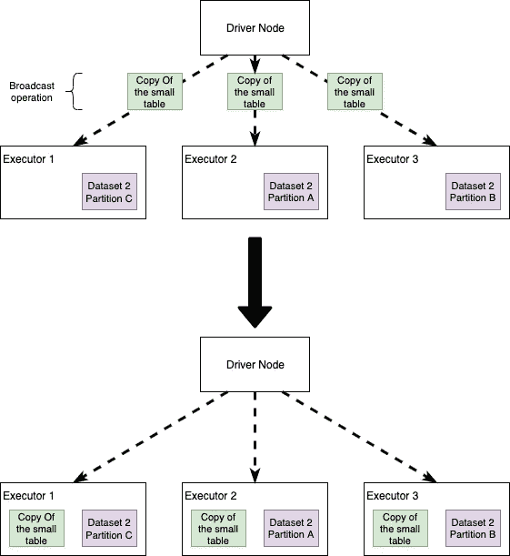
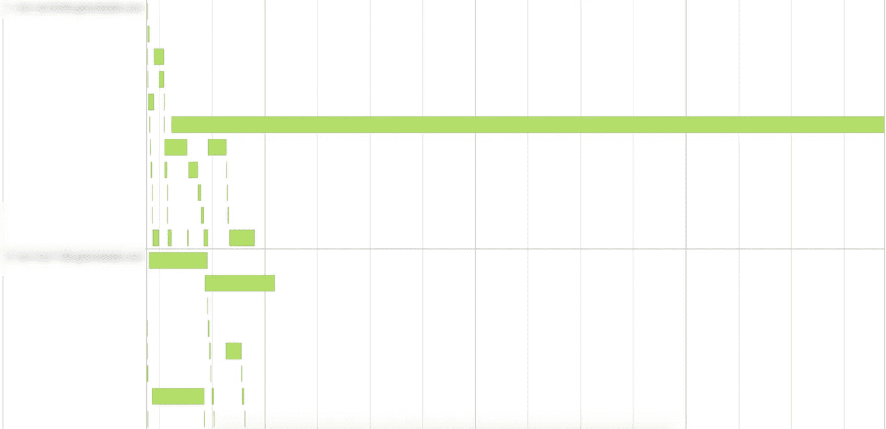
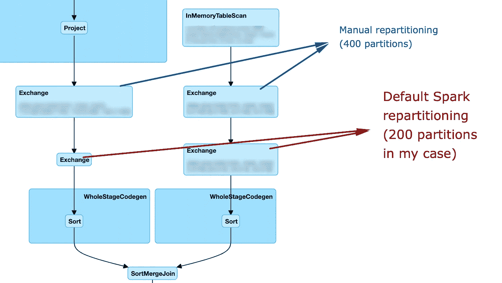
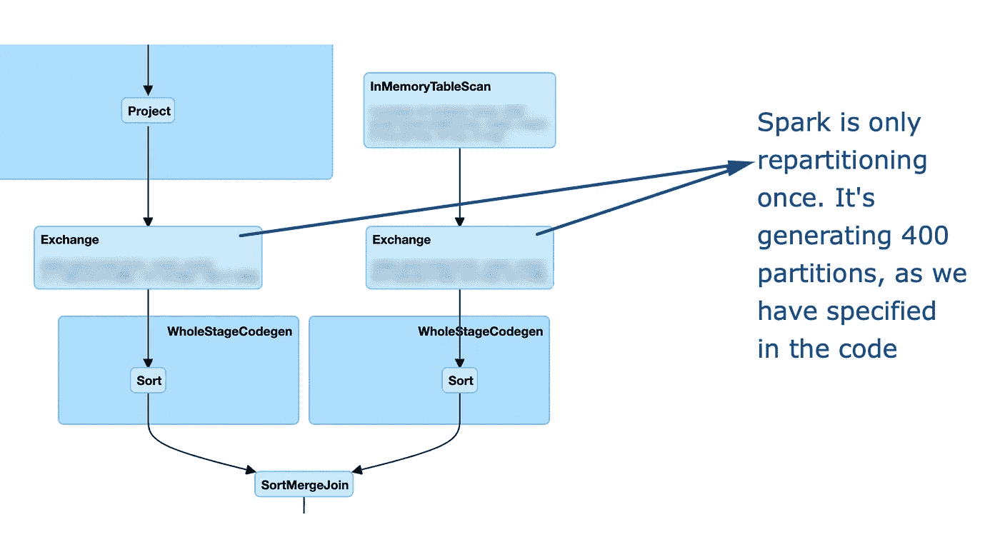
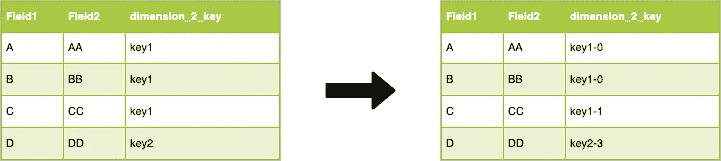
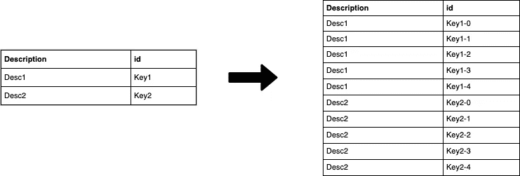
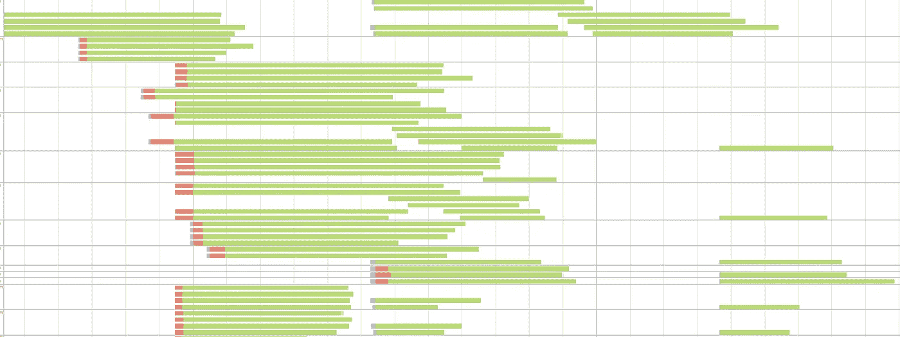

# 火花中加入的艺术

> 原文：<https://towardsdatascience.com/the-art-of-joining-in-spark-dcbd33d693c?source=collection_archive---------0----------------------->

## 加速火花连接的实用技巧


几个月前，我遇到了阿帕奇火花，这是一见钟情。我的第一个想法是:“*这么强大的东西怎么会这么容易使用，真是不可思议，我只需要写一堆 SQL 查询！*”。事实上，从 Spark 开始非常简单:它有多种语言的非常好的 API(例如 Scala、Python、Java)，几乎可以只使用 SQL 来释放它的所有能力，它有一个广泛的社区和大量的文档。我的起点一直是一本书， [**Spark:权威指南**](https://amzn.to/39TIOYN) **( < -附属链接** [**美国**](https://amzn.to/39TIOYN) **，** [**英国**](https://amzn.to/2K82rBO) **)** ，我相信这是一个很好的工具介绍:它的作者是[比尔·钱伯斯](https://databricks.com/speaker/bill-chambers)(data bricks 的产品经理)和[马泰·扎哈里亚](https://databricks.com/speaker/matei-zaharia)

很快我意识到事情并不像我过去认为的那么简单。同样的发现可能是你阅读这篇文章的原因。例如，我敢打赌，你会发现下面的图像非常熟悉:



正如您可能已经知道的，上面是连接操作期间数据偏斜的典型表现:一个任务将永远无法完成，因为所有连接工作都放在单个执行程序进程上。

# 过度简化 Spark 连接表的方式

看看我们通常用 Spark 连接哪些表，我们可以确定两种情况:我们可能将一个大表和一个小表连接在一起，或者将一个大表和另一个大表连接在一起。当然，在 Spark 开发过程中，我们会面临介于这两个极端之间的所有灰色阴影！

坚持上面提到的用例，Spark 将以两种不同的方式执行(或被我们强制执行)连接:如果我们要连接两个大表，要么使用**排序合并连接**，如果涉及的至少一个数据集足够小，可以存储在单个 all 执行器的内存中，则使用**广播连接**。请注意，还有其他类型的连接(例如混洗散列连接)，但是前面提到的那些是最常见的，尤其是 Spark 2.3 中的那些。

## **排序合并连接**

当 Spark 将执行计划中的操作转换为排序合并连接时，它会在节点之间启用**所有对所有的通信策略:驱动程序节点将编排执行器，每个执行器将持有一组特定的连接键。**在运行实际操作之前，先对分区进行排序**(这个操作本身明显很重)。可以想象这种策略会很昂贵:节点需要使用网络来共享数据；**注意，排序合并连接倾向于最大限度地减少集群中的数据移动，尤其是与混排散列连接相比**。**



In a Sort Merge Join partitions are sorted on the join key prior to the join operation.

## **广播加入**

当 Spark 决定向所有执行器节点发送**一个表的副本时，就会发生广播连接。这里的直觉是，如果我们广播其中一个数据集，Spark 就不再需要一个全对全的通信策略，每个执行器都可以独立地将每个节点中的大数据集记录与小(广播的)表**连接起来。我们会看到这个简单的想法通常会提高性能。



In a Broadcast Join a copy of the small table is sent to all the Executors. Each executor will then perform the join without the need of network communication

## **消灭我们的敌人**

在连接操作中，我们可能面临的一些最大的威胁是:

*   **数据偏斜度**:我们执行连接的键在集群中分布不均匀，导致其中一个分区非常大，不允许 Spark 并行执行操作和/或拥塞网络。请注意**偏斜是一个影响许多并行计算系统的问题**:这里的关键词是“并行”，只有当我们能够同时执行多个操作时，我们才能利用这些工具，因此任何发现自己处于某种偏斜操作的数据处理系统都会遇到类似的问题(例如，它也会发生在运行混合整数线性规划优化的分支定界算法时)。
*   **全对全的沟通策略**
*   **有限的遗嘱执行人记忆**

在深入研究一些优化连接的想法之前，有一点很重要:有时我会用执行时间来比较不同的连接策略。实际上，较低的绝对执行时间并不意味着一种方法绝对优于另一种方法。性能还取决于 Spark 会话配置、集群上的负载以及配置和实际代码之间的协同作用。因此，阅读下面的内容，收集一些你可能需要根据具体情况定制的想法！

# 播还是不播

首先，让我们看看如果我们决定在一个连接期间广播一个表会发生什么。请注意，Spark 执行计划可以自动转换成广播(不需要我们强制)，尽管这可能因 Spark 版本和配置方式而异。

我们将连接两个表:*事实表*和*维度表*。首先，让我们看看它们有多大:

```
fact_table.count // #rows 3,301,889,672
dimension_table.count // #rows 3,922,556
```

在这种情况下，数据没有倾斜，分区也没有问题— *你必须相信我的话*。注意, *dimension_table* 并不“小”(虽然大小不是我们仅通过观察行数就能推断出来的信息，但我们更愿意看看 HDFS 上的文件大小)。

顺便说一句，让我们尝试在不广播的情况下连接这些表，看看需要多长时间:

```
Output: Elapsed time: 215.115751969s
```

现在，如果我们广播维度表会发生什么？通过对 join 操作的简单添加，即将变量 *dimension_table* 替换为*broadcast(dimension _ table)*，**，我们可以强制 Spark 使用 broadcast** 来处理我们的表:

```
Output: Elapsed time: 61.135962017s
```

广播使代码运行速度**提高了 71%**！再次，阅读这个结果时要记住我之前写的关于绝对执行时间的内容。

播音总是对表演有好处吗？**完全没有！**如果您尝试执行上面的代码片段，为集群提供更多的资源(尤其是更多的执行器)，非广播版本将比广播版本运行得更快！**出现这种情况的一个原因是因为广播操作本身是相当昂贵的**(这意味着所有的节点都需要接收表的副本)，所以毫不奇怪**如果我们增加需要接收表的执行者的数量，我们增加了广播成本**，这可能突然变得高于加入成本本身。

重要的是要记住，当我们广播时，我们会碰到每个 Executor 节点上可用的内存(这里有一篇关于 Spark 内存的简短文章)。**这很容易导致内存不足异常**或者让你的代码不稳定:想象一下广播一个中等大小的表。你运行代码，一切都很好，超级快。几个月后，你突然发现你的代码坏了。经过几个小时的调试后，您可能会发现，您为使代码快速运行而传播的中等大小的表不再是“中等”的了。外卖，**如果你播的是中等大小的桌子，你需要确定它以后还是中等大小！**

# 扭曲它！这太耗时间了。

当您想要连接两个表时，偏斜是一个常见的问题。当连接键在数据集中不是均匀分布时，我们说连接是偏斜的。在偏斜连接期间，Spark 不能并行执行操作，**，因为连接的负载会不均匀地分布在执行器上**。

让我们用旧的*事实表*和一个新的维度:

```
fact_table.count // #rows 3,301,889,672
dimension_table2.count // #rows 52
```

太好了，我们的 *dimension_table2* 非常小，我们可以直接广播它！让我们一起来看看会发生什么:

```
Output: Elapsed time: 329.991336182s
```

现在，在 SparkUI 上观察任务在执行过程中发生了什么:



如上图所示，**其中一项任务比其他任务**花费了更多的时间。这显然表明数据中存在**偏斜度**——通过查看 *fact_table 中连接键的分布，可以很容易地验证这一猜想。*

为了让事情顺利进行，我们需要找到一种方法来重新分配工作负载，以提高我们的 join 的性能。我想提出两个想法:

*   **选项 1** :我们可以尝试**重新划分我们的事实表**，以便在节点中分配工作
*   **选项 2** :我们可以人为创建一个重新分区密钥(*密钥加盐*)

## **选项 1:重新划分表格**

我们可以选择一个均匀分布的列，并相应地对表进行重新分区；**如果我们将此与广播**结合起来，我们应该已经实现了重新分配工作量的目标:

```
Output: Elapsed time: 106.708180448s
```

请注意，我们希望选择一个也考虑基数的列(例如，我不会选择基数“太高”或“太低”的键，我让您量化这些术语)。

重要注意事项:如果您无法广播维度表，但仍想使用此策略，**需要使用同一个分割器对连接的左侧和右侧进行重新分区！让我们看看如果我们不这样做会发生什么。**

考虑下面的代码片段，让我们看看 Spark UI 上的 DAG

If we don’t specify a partitioner, Spark may decide to perform a default repartitioning before the join



正如您所看到的，在这种情况下，我的重新分区基本上被忽略:**在执行之后，spark 仍然决定使用默认配置**重新交换数据。让我们看看，如果使用相同的分区器，DAG 会如何变化:

Using the same partitioner allows Spark to actually perform the join using our custom options



## **选项 2:密钥加盐**

另一个策略是**伪造一个新的连接密钥！**

我们还是想逼 spark 做一个大桌子的统一重新划分；在这种情况下，我们还可以将密钥加盐与广播结合起来，因为维度表非常小。

左表的连接键存储在字段 *dimension_2_key* 中，非均匀分布。第一步是让这个场更“均匀”。一种简单的方法是在连接键上随机附加一个 0 到 N 之间的数字，例如:



正如您所看到的，我们修改了 *dimension_2_key* ，它现在是“均匀”分布的，**我们正朝着集群上更好的工作负载前进。**我们已经修改了连接键，所以**我们需要在维度表**上做同样的操作。为此，我们为事实表中的每个“新”键值在维度中创建一个对应的值:对于维度表中的每个 *id* 值，我们生成 N 个值**，其中我们将[0，N]区间中的数字附加到旧 id 上。**让我们用下面的图片更清楚地说明这一点:



**此时，我们可以使用“新的”salted 键连接两个数据集。**

这个简单的技巧将**提高 DAG 执行的并行度**。当然，我们增加了维度表的行数(在本例中 N=4)。较高的 N(例如 100 或 1000)将导致键在事实中更均匀的分布，**但是维度表的行数更多！**

让我们编码这个想法。

首先，我们需要将 salt 添加到事实表的键中。这是一项极具挑战性的任务，或者更好地说，这是一个决策点:

*   **我们可以使用 UDF** :简单，但是可能会很慢，因为 Catalyst 对 UDF 不是很满意！
*   **我们可以使用*rand*SQL 操作符**
*   **我们可以使用*单调递增 id* 函数**

只是为了好玩，让我们采用第三种选择(它似乎也更快一点)

现在我们需要用新的键“分解”维度表。我发现最快的方法是创建一个包含 0 到 N(在本例中为 0 到 1000)之间的数字的虚拟数据集，并用这个“虚拟”数据集交叉连接维度表:

最后，我们可以使用 salted key 连接表，看看会发生什么！

```
Output: Elapsed time: 182.160146932s
```

同样，执行时间并不是理解我们改进的一个很好的指标，所以让我们看看事件时间表:



如您所见，我们大大提高了并行度。

在这种情况下，简单的重新分区和广播比制作新的密钥更有效。请注意，这种差异不是由于连接，而是由于事实表提升过程中的随机数生成。

# 外卖食品

*   连接可能很难调优，因为性能与代码和 Spark 配置(执行器数量、内存等)都有关系。)
*   一些最常见的连接问题是节点之间的所有对所有通信和数据偏斜
*   如果集群中有足够的内存，我们可以使用小型表或中型表的广播来避免所有对所有的通信
*   广播并不总是有益于性能:我们需要关注 Spark 配置
*   如果广播表随时间增长，广播会使代码不稳定
*   偏斜会导致集群上的工作负载不均衡，从而导致很小一部分任务花费的时间比平均时间长得多
*   对抗偏态有多种方法，一种是重新划分。
*   我们可以创建自己的重新分区密钥，例如使用密钥加盐技术

# 看看这些其他的文章！

[](/six-spark-exercises-to-rule-them-all-242445b24565) [## 六个星火练习来统治他们

### 一些具有挑战性的 Spark SQL 问题，易于在许多现实世界的问题上提升和转移(带解决方案)

towardsdatascience.com](/six-spark-exercises-to-rule-them-all-242445b24565) [](/clustering-pollock-1ec24c9cf447) [## 聚类波洛克

### 杰森·布拉克绘画的聚类分析——如何利用 k-means 进行色彩分组

towardsdatascience.com](/clustering-pollock-1ec24c9cf447)