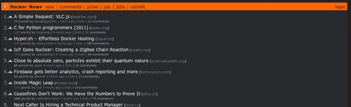
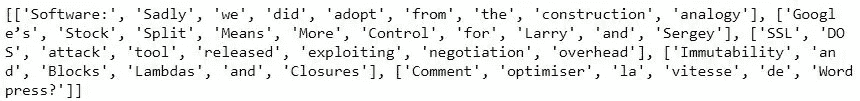
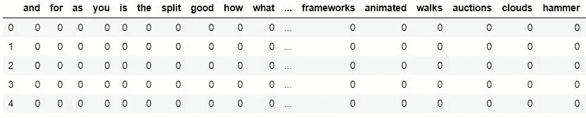
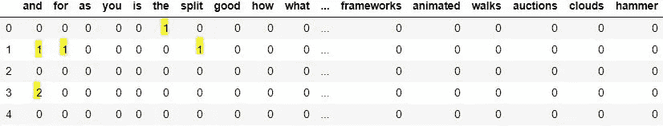

# 上行投票的艺术:使用 NLP 根据标题预测上行投票

> 原文：<https://towardsdatascience.com/the-art-of-the-upvote-using-nlp-to-predict-upvotes-based-on-headline-458408be3c73?source=collection_archive---------34----------------------->

我最喜欢的项目是那些试图理解人类行为和行动的项目。无论是试图预测自行车租赁最受欢迎的工作日，还是教育水平与个人是否喜欢原版《星球大战》三部曲有任何关系。

在线互动，尤其是在论坛中，非常有趣，因为它们是如此的被动和无形。一个简单的“喜欢”或“赞成”可以是有意的，也可以是无意义的。与脸书和 Instagram 不同，论坛大多是匿名的。这个事实使得像 Reddit 和 Hacker News 这样的地方特别有趣。

## 目标

我在这个项目中的目标是根据标题预测黑客新闻文章获得的投票数。由于 upvotes 是受欢迎程度的一个指标，我想发现哪种类型的文章最受用户欢迎。

## 数据

该项目使用的数据是 2006 年至 2015 年用户向《黑客新闻》提交的资料。这个数据是开发者 Arnaud Drizard 利用黑客新闻 API 刮出来的，可以在这里找到[。](https://github.com/arnauddri/hn)

我从数据中随机抽取了 300 行，并删除了除提交时间、upvotes、url 和 headline 之外的无关列。

# 现在是有趣的部分，NLP！😎

我选择使用单词包模型，它描述了单词在文档中的出现，或者在我们的例子中是标题。这包括以下步骤:

1.  标记每个标题
2.  创建独特单词的集合或“词汇表”
3.  创建单词袋矩阵
4.  给标题中的每个单词打分
5.  管理词汇

## 标记化

第一步是标记每个标题。每个标题都表示为一个字符串。标记化包括将这些单个字符串拆分成标题中的几个单个单词(标记)的字符串。这对于稍后创建词汇和单词包矩阵是必要的。

Example of tokenization

## 创建词汇和词汇包向量

每个独特的单词都成为词汇的一部分。我选择将词汇表转换成熊猫数据框，如下所示。这允许我在下一步填充数据框，并将其用作单词袋矩阵。

data frame of BoW vocabulary

数据框中的每一行代表数据集中每个索引处的标题。此时，矩阵中充满了 0，因为我还没有对标题中的单词进行评分。

## 得分单词

最简单的计分方法是计算每个单词的出现次数。我用这种方法来填充矩阵。

bag of words matrix

## 管理词汇

此时，我有一个相对较大的数据框架。减少它的一个简单的方法是删除停用词。停用词是这样的词:a，and，the，it，is 等。那不代表任何真正的意义。这样做应该会减少下一节中计算的误差量。

# 训练模型和进行预测

回到我的目标，我想训练一个模型来预测一个标题将获得的支持票数。在转移到更复杂的模型之前，最好先看看一个简单的模型是否能完成工作。

## 线性回归

我将使用 sci kit-learn***train _ test _ split***函数将我的数据分成训练集和测试集。我将 80%用于训练，20%用于测试，并使用均方差作为我的误差度量。

X: bag of words matrix; y: upvotes

我最终得到的 MSE 是 2361.02，这导致了 48.59 的 RMSE。这意味着平均误差与真实值相差 48.59 票。考虑到我的数据的平均投票数是 10，这是一个很大的错误。我将使用随机森林模型再次尝试，看看更复杂的模型是否能帮助我减少错误。

## 随机森林

使用随机森林只是稍微增加了我的模型的准确性，从误差 48.59 到 45.41。这仍然是一个很大的误差。标题可能不是预测上行投票的最佳特征，因为它不一定指示帖子活动。评论数量和提交时间可能是更好的功能。

*也许在第二部里？*