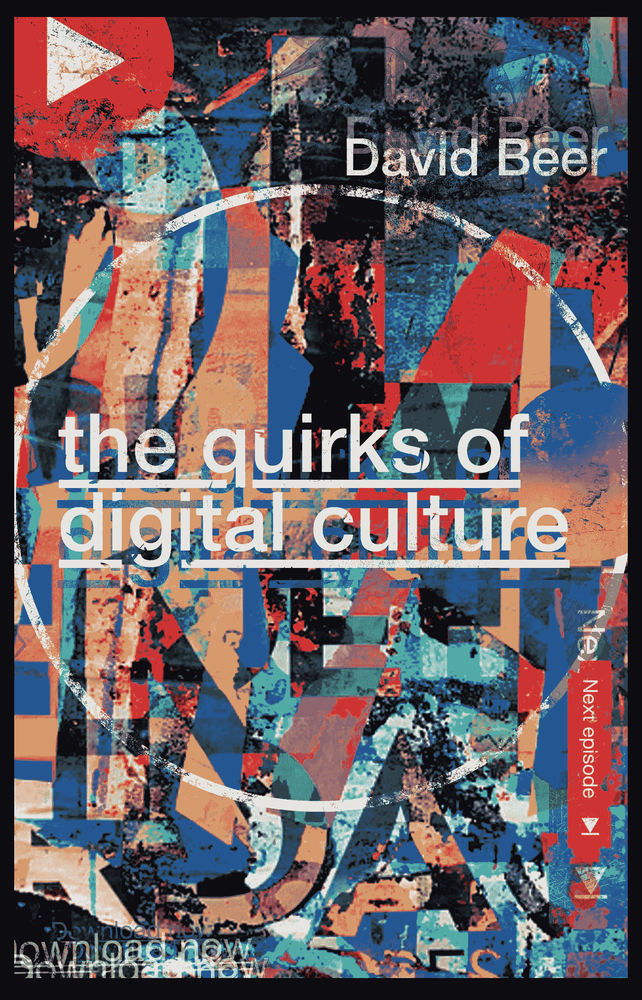

# 平台文化的深度

> 原文：<https://towardsdatascience.com/the-baffling-depths-of-platform-culture-f5648af8bc5b?source=collection_archive---------11----------------------->

我最近参加了一个研讨会，听一名学生对迷因进行解剖。当我困惑地看着时，一层又一层的参考文献被剥掉了。结论是，从像素中删除了大约 15 个对其他先前迷因的引用，可以追溯到几个月或几年前。一系列内幕细节在我眼前展开。我已经知道迷因经常在有趣的参考点和无休止的自我参考引用上工作，但是它的复杂性和数量吸引了我。

被剖析的迷因代表了一些东西。不知何故，它捕捉到了按需或基于平台的文化令人困惑的深度、深不可测的混乱和不断变化的混乱。文化一直是一个复杂和无定形的东西，但随着它进入这些大型技术平台，注入用户内容的能量，以及数据主导的消费和预测方法的强烈冲动，一个新的混乱和混乱水平已经出现。平台文化就更难把握了。

试图理解正在发生的事情是困难的，甚至是不可能的。高深莫测是平台文化的核心属性之一。在这个被剖析的迷因的例子中，它甚至被有意地编码到图像中，以在知情人和不知情人之间建立一条线。这种方法只会增加文化分析的难度。

尽管有这些障碍，我们还是需要总体的想法来找到看到正在发生的事情的方法。面对这样一个不断扭曲的万花筒，很难看出这是如何运作的。过去用来理解文化的许多概念将需要彻底改革，以把握现在，特别是如果它们不想以丢失甚至误导而告终的话。也需要新的概念来看待这个复杂的领域。替代监督的方法是尝试使用显微镜。至少，从近处看，这些东西是可以消化的。然而，专注于文化的一个小方面可能会排除其高度网络化和不断变化的背景的重要性。

或者，焦点的某种组合是尝试获得某种视角的一种方式。为了理解正在发生的事情，我们不仅仅需要机械的细节——超然的远景会错过深度。我们需要的是一些印象主义，关于这些细节如何融入更广阔的场景。这就是受乔治·齐美尔启发的社会学家大卫·弗里斯比所说的“社会学印象主义”。这是一种用笔触暗示细节的方法，同时给人一种背景的印象。

平台文化充满了奇怪和不寻常的东西。这些有时会在小新闻或社交媒体帖子中被顺便评论，但通常会被孤立对待。仅举几个上个月的例子来说明这一点:一本学术书籍是由机器写的；优步寻求超过 900 亿美元的上市价值，却从未公布过利润；在 Whatsapp 中发现了一个弱点，这意味着你的手机摄像头和麦克风可能会被第三方控制；本质上是零售商的亚马逊投资了一款食品配送应用 Deliveroo。我们几乎已经习惯了这样的怪癖，现在我们错过了它们，它们被评论，但它们要么似乎无关紧要，要么只提供了短暂的娱乐或分心。但是如果我们看看这些和其他的例子，它们通常能告诉我们一些更广泛的趋势和力量。如果我们能找到一个怪癖，我们就能描绘出一幅图画。

在我即将出版的新书 [*数字文化的怪癖*](https://www.amazon.co.uk/Quirks-Digital-Culture-David-Beer/dp/1787699161/) 中，我确定了一系列这些不同寻常和揭示性的东西，并试图用它们来创造对支撑和塑造我们文化景观的运动、力量和不断变化的议程的印象。我报道的一些事情，比如电视游戏节目或者音乐回归，看起来都很无聊。其他的，如通过家庭设备或社交媒体操纵的声波监控，显然更加严重。数字文化的各种怪癖可以让我们对文化转移到这些技术平台上会发生什么有一点了解。这不是一个全面或全景的视图，但它可能有助于建立一个印象主义的画面，有助于理解我们面临的沸腾的混乱。我的建议是，我们留意这些稍微奇怪或不寻常的事件，当我们发现它们时，我们可以把它们放在手中，看看它们还能揭示什么。

*数字文化的怪癖现已有平装本和电子书可供预购。*

**