# 基础知识:决策树分类器

> 原文：<https://towardsdatascience.com/the-basics-decision-tree-classifiers-b0d20394eaeb?source=collection_archive---------28----------------------->

## 从头开始的数据科学

## 对决策树如何工作和构建的直觉

决策树在概念上是一种简单明了的模型风格，尽管技术上的实现确实涉及到一些值得理解的计算。尽管如此，决策树背后的直觉应该很容易理解。事实上，决策树在某种程度上非常类似于人们在现实世界中做出选择的方式。

**什么**

当面临选择时，真实的人可能会在一系列级联决策中思考。如果我需要选择早上穿什么，我不会从衣橱里随意挑选一套衣服，我会首先分解我的选择。首先，我可能已经把厚重的冬装和轻薄的夏装分开了。然后，我可能会查看天气，进一步缩小服装的范围——比如说，如果下雨，我可能会穿靴子。最后，我可能会考虑我今天有什么计划，以及我是否因为任何原因需要打扮。你可以把我的决策过程想象成从我衣柜里的所有选项开始，然后逐渐缩小我的选择范围，直到我从一个更小的选项集中挑选。

也许我们可以教计算机以类似的方式做出决定或预测。一个方面是，决策过程是基于规则的，这使得它很容易在计算机上实现，假设我们知道规则是什么。因此，任务是找出规则是什么。

考虑一个简单的分类问题。以下是分散在三个类别中的要点:

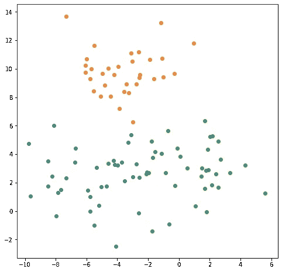

A simple three category classification problem

如果在网格的某个地方出现一个新点，你会如何预测它属于哪一类？你可能会注意到，比如说，网格上部的所有点都是橙色的。所以，让我们从简单地在这个‘橙色领地’的底部画一条水平线开始。如果我们试图预测的新点落在这条线之上，我们会猜测它属于橙色类别:

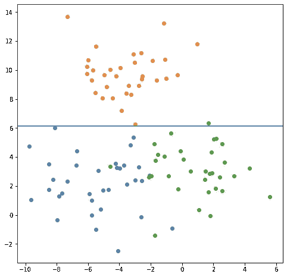

A line now separates the orange territory

如果点低于那条线会发生什么？好了，现在我们注意到蓝点倾向于在右边，绿点倾向于在左边，所以让我们把这个较低的区域分成蓝色和绿色两部分:

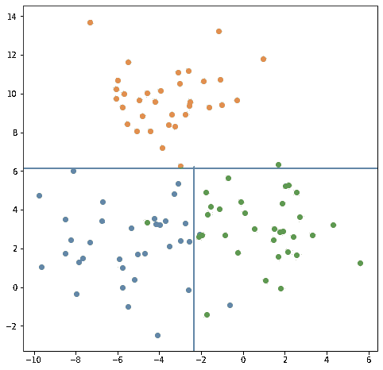

Further segmentation

如果新点在这条线的左边，我们就猜它是蓝色的，如果在右边，我们就猜绿色的。常见的是决策树也被形象化为流程图。该流程图描述了该示例数据集的决策过程:

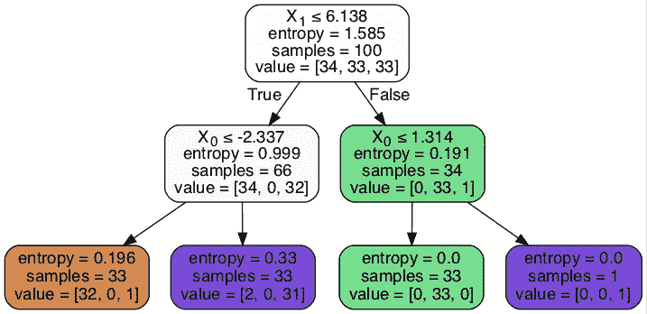

我们首先询问新点的 y 值是大于还是小于 6.138。如果小于，我们向下移动到左边，然后通过询问 x 值是大于还是小于-2.337 来跟进。

请注意，当我们将图表分割成更小的部分时，新的部分比之前的整体图表更加同质。我们从一个正方形图开始，它有相同数量的三个类别。然后，我们将图形一分为二，顶部几乎完全同质(全部为橙色)，底部现在只分为两种颜色，而不是三种。在下一轮中，我们将底部一分为二，得到两个几乎同质的部分。不管我们的数据集有多复杂，有更多的特征或类别，决策树的目标是找到分割数据的方法，使子段尽可能“纯净”。

决策树的优势之一是它能很好地处理非线性。考虑一个稍微复杂一点的例子:

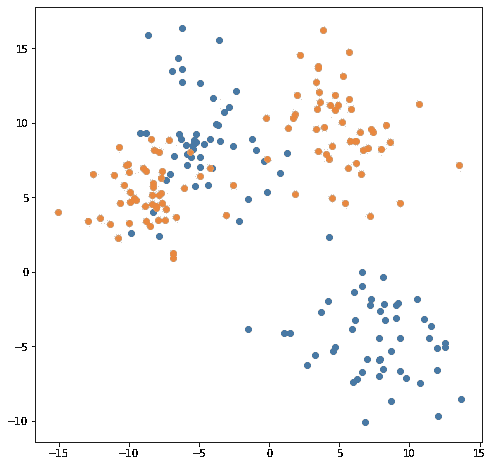

Another classification problem

这张图只有两个类别，但是它们没有被很好的分割。我们不能说“上面的点更可能是橙色的”，因为橙色和蓝色有点混在一起了。我们仍然可以像以前一样采取类似的策略，一点一点地分割数据集，直到我们得到相对同质的子集。决策算法将进行以下拆分。首先:

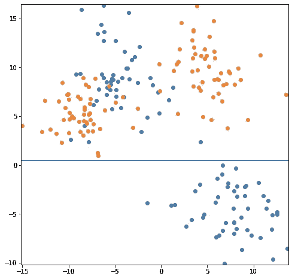

A first split

其次是:

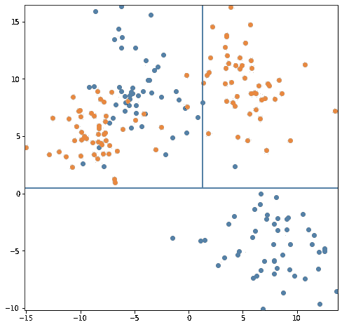

A second split

然后，再经过两步:

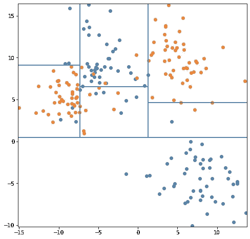

Now we’re getting somewhere

该算法已经成功地识别了这些分组的各个中心。

这里有一个更具体/不那么抽象的设置，决策树算法可以很好地识别这些非线性。数据科学家在培训中常用的一个数据集有泰坦尼克号乘客的信息，包括他们是否在船沉没时死亡。如果你制作一个模型来预测某个乘客是否会死亡，你可能会注意到男性的死亡率比女性高。在逻辑回归模型中，您会注意到变量 is_man 的系数为负。有一个例外，那就是被确认为男性的儿童乘客有更高的存活率。为了捕捉逻辑模型中的非线性，你必须做一些特征工程，以某种方式交互你的性别和年龄变量。然而，通过巧妙地选择使用哪些特征来确定其分裂，决策树算法可以隐式地发现这些类型的关系。

**算法正在做什么**

到目前为止，我只是简单地说决策树算法决定在哪里分割数据集，而没有说如何分割。为了了解算法是如何工作的，为什么它会工作，为什么它不总是给出完美的结果，有必要稍微离题一下，谈谈信息论。

信息论基本上是由克劳德·香农创立的，尤其是在 1948 年发表了他的论文《交流的数学理论》。香农是贝尔实验室的一名研究员，也是他工作的部分动机，信息论的许多早期应用都与贝尔电话公司正在处理的通信问题有关:如何通过频繁嘈杂的电话线发送可解码的信息。其中一个重要的方面是确定什么是信息，以及如何衡量它。香农将对信息的直觉形式化为一个具体的公式，将整个问题从本质上变成了一个应用统计问题。

Claude Shannon, father of information theory

关键的见解是，字符串中包含的信息量，无论是书面英语的字母还是二进制数字，都与字符串的长度、有多少可用字符以及每个字符的使用概率有关。信息量应该与字符串的长度成比例，这可能很直观——毕竟，在一个段落中可以说的比在一个句子中说的更多——但其他两点值得一提。

首先，可用字符的数量应该与每个字符包含的信息量相关。想想写一个单词需要多少个字符。一个英语单词的平均字母数不到 5 个。(这个统计数据和许多其他有趣的英语语言统计数据将在这里讨论。)毕竟，英语字母表只有 26 个字母，并且有许多不同的可能单词，所以自然地，表达任何给定的单词都需要使用不同字母的组合。另一方面，书面汉语有成千上万的可用字符。大多数常用词可以表示为单个字符或两个字符的组合。当你有这么多的字符时，任何给定的字符都可以更具体，代表一个完整的语义单位。反之亦然；用二进制表示一个单词，只有两个可用的字符，0 和 1，比用英语表示需要更多的字符。

但是，并不是每个角色都生来平等。可预测的字符模式并不真正携带新的信息；一本只有一句话被反复重复的书，一旦你过了第一句话，明白了发生了什么，就不会告诉你任何新的东西。可预测的模式会产生信息冗余。

威滕英语似乎充满了冗余。考虑一下将“are”或“you”缩短为单个字母“r”或“u”的文本写作练习。一个经常被引用的例子是在纽约地铁广告秘书工作中发现的一则旧广告，上面写着:“f u cn rd ths，u cn BCM a sec > a GD JB w hi pa”。即使去掉一半以上的字母，大多数人也能正确解析这个句子:‘如果你能读这个……’所以看起来并不是每个字母都像其他字母一样携带那么多信息。事实证明，一个给定的字母到底携带了多少信息，与你在那个位置看到它的可能性有关。

英语中的字母使用频率不同，但更重要的是，它们之间以及它们在单词中的位置也有不同的频率。英语中一个常见的例子是，字母“q”后面几乎总是跟着字母“u”(例外情况往往是来自其他语言的外来词)。另一个可能是“e”是最常见的字母，但不经常作为一个单词的第一个字母出现。字母“I”相对常见，但很少作为单词的最后一个字母出现。某些字母经常出现在每个字母的旁边(“th”、“he”等)。)，其他的不是(有多少单词含有‘KD’或者‘BP’？).因此，存在可预测的模式。

Shannon 举例说明了这一点，他试着一次猜一个单词中的下一个字母是什么。香农会从书架上取下一本书，随机选择一个句子，他的妻子会试着依次猜测每个字母。想象一下自己尝试这样做。我记住了一句话，你认为第一个字母是什么？嗯，什么都有可能！你必须猜测，而且很有可能你会弄错。但是，你不必从所有 26 个字母中随机猜出任何一个，因为有些字母在英语中比其他字母更常见。当然,*可能是“z”、“q”或“j ”,但这些字母实际上并不经常出现，所以你可能不应该猜其中之一。字母“e”很常见，但正如我们已经提到的，它并不经常作为单词的开头，所以还是不要猜为妙。*

知道这是一个句子的第一个字母而不仅仅是一个单词的第一个字母也会有所帮助。视上下文而定，某些词在句首很常见:“the”、“then”、“I”、“a”、“to”、“that”等。你仍然要猜，但是有一个小得多的字母池可以猜。你猜一个你认为最有可能的字母。在这种情况下，假设我确认句子的第一个字母是 t。现在猜第二个字母比第一个容易多了。首先，虽然以前有些字母我们认为不常见，但现在有些字母我们可以完全排除。英语中有以字母“tg”开头的单词吗？还是‘tk’？一旦你发现下一个字母是 h，猜第三个字母就变得更容易了。首先，你几乎可以排除所有其他辅音，这意味着在最坏的情况下，你的猜测将是五分之一，而不是 26 分之一。当你读到第三个字母时，你甚至可以一次猜出剩下的所有字母。有多少单词是以字母“tho”开头的，并且可能是一个句子的开头？可能是‘虽然’，也可能是‘成千上万’，但不可能有十几个可能的选项。

你可以把每个字母携带的信息量想象成与该槽中可能出现的合理选项的数量相关。在这个例子中，单词的第一个字母携带了大量信息——它几乎可以是任何字母——而第二个字母携带的信息稍少，单词中后面的字母几乎不携带任何信息。事实上，发短信的人在匆忙中可以将单词“tho”缩写成“tho ”,而不会失去任何意义，尽管这可能会困扰拼写纯粹主义者。though 这个词的最后三个字母基本上是多余的。

香农将所有这些形式化为一种他称为熵的度量，它本质上描述了任何给定消息可以携带的信息量。一个称为 H 的字符的熵的正式表达式是所有不同可能字符的总和:

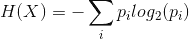

其中 pi 是该字符出现的概率。当这个概率变为零时，和中表达式的值也变为零——如果字母“q”从未真正出现，那么它作为一个选项对你没有多大好处。至关重要的是，当概率变为零时，表达式的值也变为零(1 的对数为零):如果你提前知道下一个字符将会是什么，那么当该字符出现时，你没有学到任何新信息。

因此，最大化总熵的方法是每个可能的字符以相等的概率出现，此时文本中没有模式，字符看起来基本上是随机的。人类的语言看起来不像那样是有实际原因的。特别是，人类语言中的冗余有助于避免错误——即使有拼写错误或遗漏了一些字母，你仍然可以看出一个单词应该是什么——但这种鲁棒性的代价是添加额外的字母，使文本相应地变长。

这是决策树算法使用的公式。它查看数据点的总体集合，并计算该熵的值。在第一个例子中，我们有三个不同的类别，每个类别的数量相等——最大可能熵。

Maximum Entropy

然后，该算法考虑它可以进行的每个分割，并单独计算每个子部分的熵值。然后它搜索寻找它能产生最低可能组合熵的分裂。请记住，在本例中进行的第一次拆分实际上是将图表的橙色上半部分与蓝色和绿色的下半部分分开:

Below Maximum Entropy

在这个新的配置中，顶部的熵接近于零，因为它基本上只包含橙色点。底部的熵也减少了，因为即使它仍然在颜色之间平均分配，也只有两种颜色选项，而不是三种。决策树的实际实现可能使用不同的特定度量——GINI 杂质是一种类似但略有不同的群体同质性度量——但功能目标是相同的。

**如何**

当建立决策树模型时，有许多参数可以调整，特别是为了避免过度拟合。

**每叶最小样本数/每分割最小样本数:**这两个值都是为了避免过度拟合。一个是算法将在树的最终节点之一中接受的最小数据点数，另一个是在算法决定进行另一次分裂之前需要在子组中的点数。如果每片叶子没有最小数量的样本，算法可能会简单地继续进行越来越小的切割，直到组中只有一个样本。这些算法看起来是同质的和低熵的，但是有严重过度拟合的风险。考虑我们之前的一个例子:

Is this a satisfactory final model?

这些地区中的一些仍然不是同质的！如果我们让算法继续下去呢？

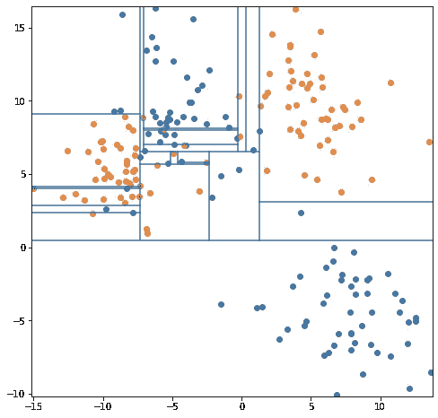

Extreme overfit

现在，奇怪的异常值，也就是大部分橙色区域中的蓝色，被赋予了自己的小雕刻，可能只包含一个或两个点的超薄区域。该模型现在过拟合。

**最大深度**:类似地，你可以通过给树设置一个最大深度来避免过度拟合，允许算法只做这么多的分割。您希望模型的深度可能取决于数据的性质——您有多少个特征，样本有多大，等等。

**优势和劣势**

决策树很容易建立；它们可以用特征工程来改进，但不一定需要。它们也不真正需要缩放或标准化特征。它们很好地处理了非线性，而且不像 KNN 模型，它们是可以解释的。用户可以查看决策树的阈值，找出给定预测是如何得出的。它们还隐式地执行自己的特征选择。本身不是特别有用的特征可能不会被利用，因为算法将发现沿着该特征分割样本不起作用。

不幸的是，决策树也很脆弱。大多数实现用来设计树的算法试图在任何给定点进行尽可能好的分割，这就是所谓的“贪婪算法”，它不一定产生尽可能好的结果，尽管它通常足够好。一个不幸的后果是，对训练数据的微小改变会导致算法找到一个完全不同的树，也许早期的分裂之一将在不同的地方进行，从而改变随后的所有决策。虽然决策树通常是可解释的，但是根据具有许多特征的数据训练的深度树将是复杂的，因此不像线性回归中的系数那样容易解释。

最后要指出的一点是，由树做出的决策的性质意味着某些形状的决策边界对树来说更容易或更难映射。当相似数据点的组彼此充分分离或者组之间的边界与特征对齐时，决策树将能够相当好地跟踪它们。当许多点靠近与特征不对齐的边界时，树会变得更难。考虑下面的例子:

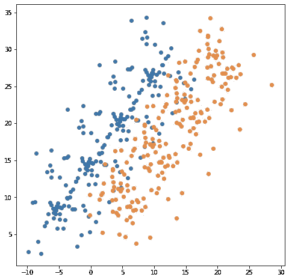

Yet another classification problem

您可以直观地看出这两个区域之间的边界实际上是线性的。如果将 x 和 y 坐标都考虑在内，则只需一次分割就可以准确地分离蓝色和橙色区域，如下所示:

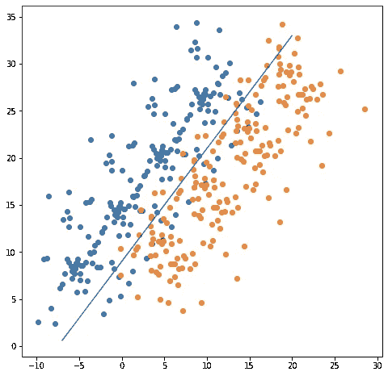

A sensible way of splitting up the territory

然而，决策树算法很难定义与一个特征不一致的决策边界。对于这个例子，你需要让树至少有四到五层深，你会得到一个更加混乱的边界:

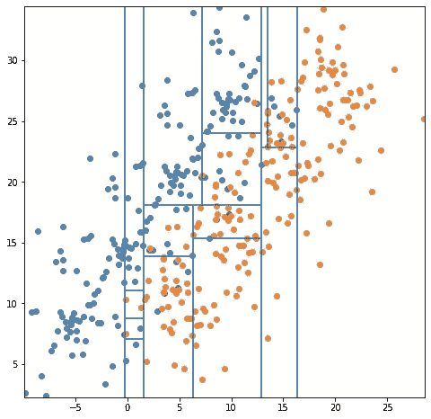

What our decision tree algorithm actually produces

假设您对数据有很好的了解，较小的特征工程将允许您克服这一点，但是这些种类的边界可能用其他工具更好地建模。