# 基础知识:分类和回归的 KNN

> 原文：<https://towardsdatascience.com/the-basics-knn-for-classification-and-regression-c1e8a6c955?source=collection_archive---------5----------------------->

## 从头开始的数据科学

## 对 KNN 模型如何工作建立直觉

数据科学或应用统计课程通常从线性模型开始，但就其方式而言，K 近邻可能是概念上最简单的广泛使用的模型。KNN 模型实际上只是一种普遍直觉的技术实现，即具有相似特征的事物往往是相似的。这算不上深刻的见解，但这些实际的实现可能非常强大，而且，对于接近未知数据集的人来说至关重要的是，可以在没有任何复杂的数据工程或模型设置的情况下处理非线性。

**什么**

作为说明性的例子，让我们考虑使用 KNN 模型作为分类器的最简单的情况。假设您有属于三类之一的数据点。二维示例可能如下所示:

Three categories

您可能会非常清楚地看到不同的类别被分组在一起——图表的左上角似乎属于橙色类别，右边/中间部分属于蓝色类别。如果给你一个新点在图上某处的坐标，并问它可能属于哪一类，大多数情况下答案会非常清楚。图表左上角的任何一点都有可能是橙色的，等等。

然而，在两个类之间，任务变得不那么确定，我们需要确定一个决策边界。考虑下面用红色添加的新点:

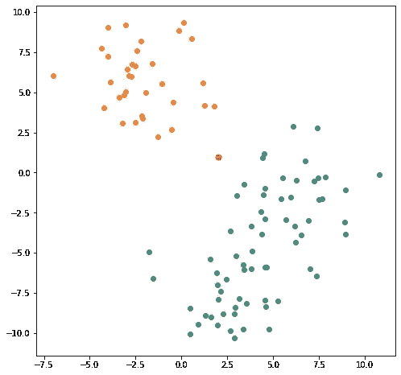

Which of the original categories does the new point belong to?

这个新点应该归为橙色还是蓝色？这一点似乎落在两个集群之间。您的第一直觉可能是选择离新点更近的集群。这将是“最近邻”方法，尽管在概念上很简单，但它经常产生相当合理的预测。哪个先前识别的点是最接近的新点？仅仅目测图表，答案可能并不明显，但计算机很容易浏览这些点，并给我们一个答案:

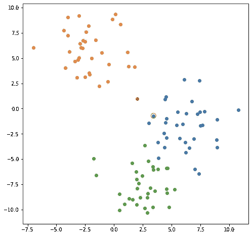

With the nearest point now circled in red

看起来最近的点在蓝色类别中，所以我们的新点可能也是。这就是最近邻法。

此时，您可能想知道 k-nearest-neighbors 中的“k”是什么意思。k 是模型在评估新点时将查看的邻近点的数量。在我们最简单的最近邻例子中，k 的值就是 1——我们查看最近邻，仅此而已。然而，你可以选择看最近的 2 或 3 个点。为什么这很重要，为什么有人会把 k 设得更高？一方面，类之间的边界可能会彼此相邻，使得最近的点给我们正确的分类不太明显。考虑我们例子中的蓝色和绿色区域。事实上，让我们把它们放大:

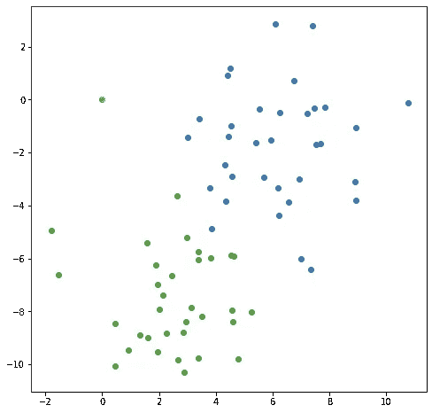

Zooming in on the the boundary between the blue and green regions

请注意，虽然整体区域看起来足够不同，但它们的边界似乎有点相互交织。这是带有一点噪声的数据集的共同特征。在这种情况下，对边界区域的事物进行分类变得更加困难。考虑这个新观点:

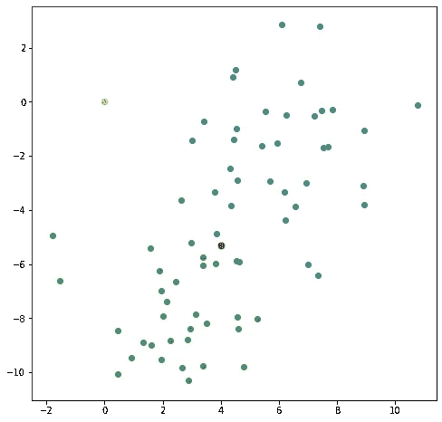

A new point along the border between blue and green regions

一方面，从视觉上看，最接近的先前确定的点肯定是蓝色的，我们的计算机可以很容易地为我们确认这一点:

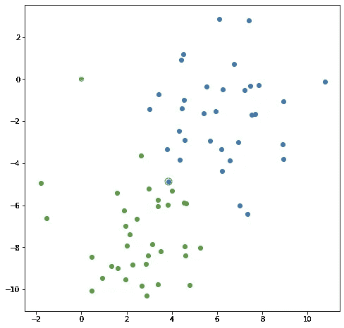

The new point is closes to a blue point

另一方面，最近的蓝点看起来有点像异常值，远离蓝色区域的中心，有点被绿点包围。这个新点甚至在那个蓝点的外面！如果我们观察离新红点最近的三个点会怎么样？

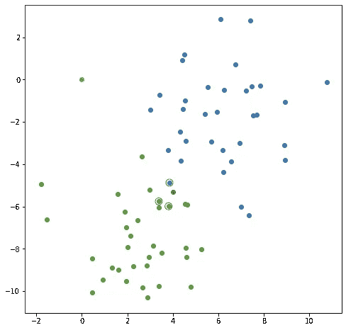

Looking at three nearby points

或者甚至是离新点最近的五个点？

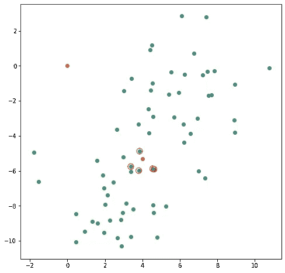

Looking at five

现在看来，我们的新点是在一个绿色的街区！它碰巧有一个附近的蓝点，但优势或附近的点是绿色的。在这种情况下，为 k 设置一个更高的值，查看一些附近的点，并让它们以某种方式对新点的预测进行投票，这可能是有意义的。

正在说明的问题是过度拟合。当 k 设置为 1 时，算法识别为蓝色和绿色的区域之间的边界是凹凸不平的，它随着每个单独的点向前弯曲。红点看起来可能在蓝色区域:

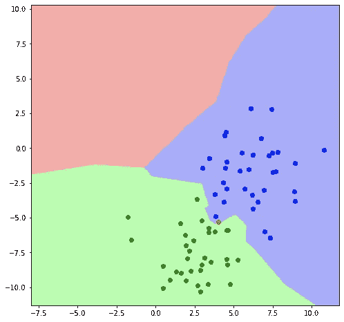

The same graph with the implicit decision boundaries highlighted

然而，当不同的邻近点投票时，将 k 提高到 5 可以平滑决策边界。红点现在似乎牢牢地位于绿色区域:

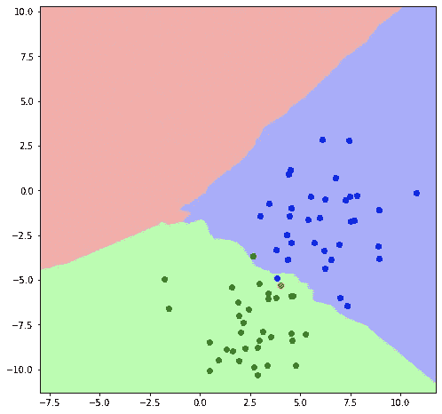

Decisions now made based on 5 neighbors

k 值较高的代价是决策边界中粒度的损失。将 k 设置得很高会使边界变得平滑，但是您试图模拟的真实世界的边界可能并不完全平滑。

实际上，我们可以使用相同类型的最近邻方法进行回归，其中我们需要一个单独的值而不是一个分类。考虑下面的回归:

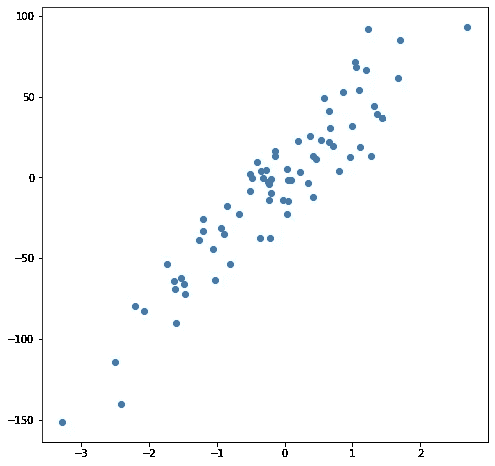

A simple regression example

数据是随机生成的，但生成的数据是线性的，因此线性回归模型自然会很好地拟合该数据。不过，我想指出的是，您可以使用 K-最近邻方法以概念上更简单的方式来近似线性方法的结果。在这种情况下，我们的“回归”不会像 OLS 模型那样是一个单一的公式，而是任何给定输入的最佳预测输出值。考虑 x 轴上的值-.75，我用垂直线标记了它:

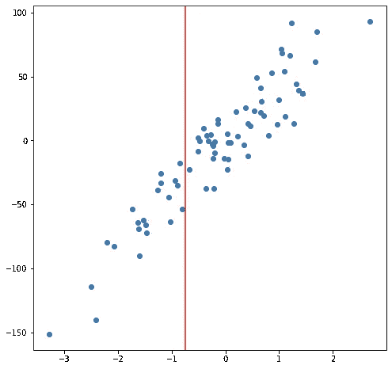

无需求解任何方程，我们只需考虑附近的点，就可以得到输出的合理近似值:

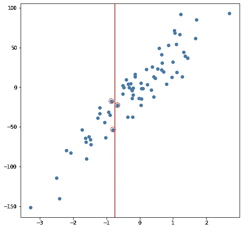

Three points near a chosen x-value

预测值应该在这些点附近，而不是更低或更高，这是有意义的。也许一个好的预测是这些点的平均值:

An average of their outputs

您可以想象对所有可能的输入值都这样做，并到处得出预测:

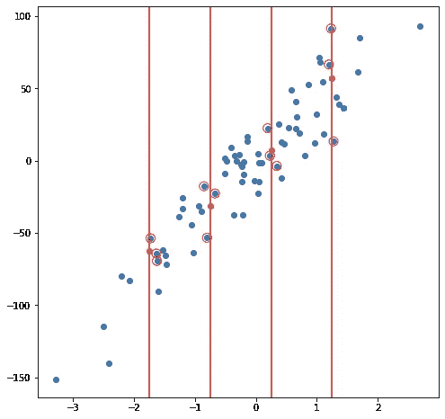

将所有这些预测用一条线连接起来，我们得到了回归结果:

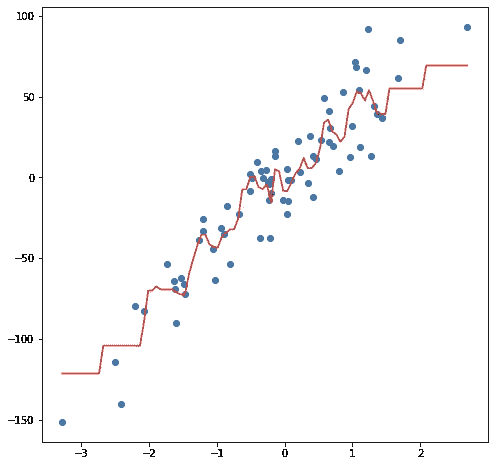

在这种情况下，结果并不是一条清晰的直线，但它们确实很好地描绘了数据的上升趋势。这可能看起来不太令人印象深刻，但这种实现的简单性的一个好处是它可以很好地处理非线性。考虑这个新的点集合:

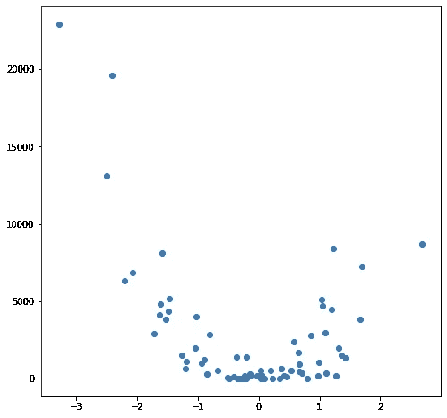

A non-linear example

这些点是通过简单地对上一个示例中的值求平方而生成的，但是假设您在野外遇到了这样的数据集。显然，它在本质上不是线性的，虽然 OLS 风格的模型可以轻松处理这种数据，但它需要使用非线性或交互术语，这意味着数据科学家必须就执行何种数据工程做出一些决定。KNN 方法不需要进一步的决策——我在线性示例中使用的相同代码可以完全重新用于新数据，以产生一组可行的预测:

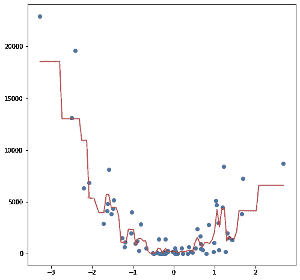

与分类器示例一样，设置较高的 k 值有助于我们避免过度拟合，尽管您可能会开始失去对边缘的预测能力，尤其是在数据集的边缘周围。考虑第一个示例数据集，其预测 k 设置为 1，这是最近邻方法:

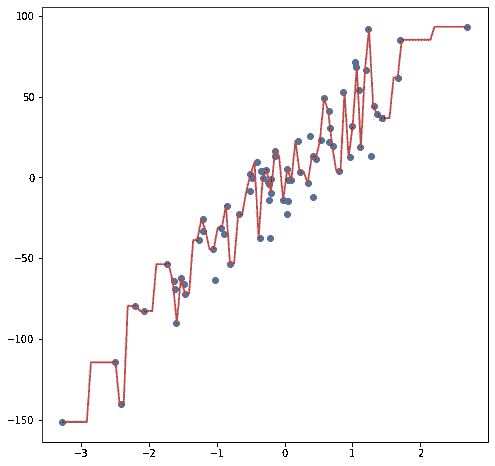

KNN reggressor with K set to 1

当模型从数据集中的一点跳到下一点时，我们的预测会不稳定地跳跃。相比之下，将 k 设置为 10，这样总共 10 个点被平均在一起用于预测会产生更平滑的行驶:

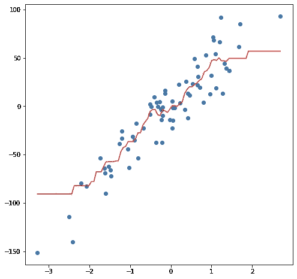

KNN regressor with K set to 10

一般来说，这看起来更好，但是您可以在数据的边缘看到一些问题。因为我们的模型为任何给定的预测考虑了如此多的点，当我们接近样本的一个边缘时，我们的预测开始变得更差。我们可以通过将我们的预测加权到更近的点来解决这个问题，尽管这有其自身的权衡。

**如何**

当建立 KNN 模型时，只有少数参数需要选择/调整以提高性能。

**K:邻居的数量**:如前所述，增加 K 将会平滑决策边界，避免以牺牲某些分辨率为代价的过度拟合。不存在适用于每个数据集的单一 k 值。对于分类模型，特别是如果只有两个类别，通常为 k 选择一个奇数。这是为了使算法永远不会遇到“平局”:例如，它查看最近的四个点，发现其中两个在蓝色类别中，两个在红色类别中。

**距离度量**:事实证明，有不同的方法来衡量两点之间的“接近”程度，并且这些方法之间的差异在更高维度中会变得显著。最常用的是欧几里得距离，这是你在中学可能已经学过的使用勾股定理的标准排序。另一个度量标准是所谓的“曼哈顿距离”，它测量每个主要方向上的距离，而不是沿着对角线的距离(就好像你从曼哈顿的一个十字路口走到另一个十字路口，不得不沿着街道网格走，而不是选择最短的“直线”路线)。更一般地说，这些实际上是所谓的“闵可夫斯基距离”的两种形式，其公式为:

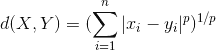

当 p 设置为 1 时，该公式与曼哈顿距离相同，当设置为 2 时，为欧几里德距离。

**权重**:当算法对一个类进行投票时，有一种方法可以解决可能出现的“平局”问题，也有一种方法可以解决我们的回归预测越接近数据集边缘越糟糕的问题，这就是引入权重。对于权重，近点比远点更重要。该算法仍然会查看所有 k 个最近的邻居，但是最近的邻居比较远的邻居拥有更多的投票权。这不是一个完美的解决方案，并带来了再次过度拟合的可能性。考虑我们的回归示例，这次使用权重:

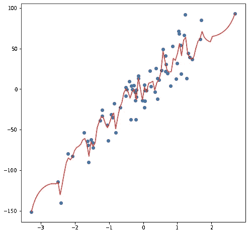

KNN regressor, but not with weighted voting

我们的预测现在直接到了数据集的边缘，但是你可以看到我们的预测现在摆得更靠近单个的点。当您在点之间时，加权方法工作得相当好，但是当您越来越接近任何特定点时，该点的值对算法的预测有越来越大的影响。如果你足够接近一个点，这几乎就像把 k 设为 1，因为那个点有如此大的影响。

**缩放/标准化**:最后一点，也是非常重要的一点是，如果不同的特征变量具有非常不同的缩放比例，KNN 模型可能会被抛弃。假设有一个模型试图根据卧室数量和房屋总面积等特征来预测市场上房屋的销售价格。一所房子的平方英尺数比卧室数的差异更大。通常，房子只有少数几个卧室，即使是最大的豪宅也不会有几十或几百个卧室。另一方面，平方英尺相对较小，所以房子的面积可以从小的接近 1000 平方英尺到大的上万平方英尺不等。

考虑两个卧室的 2000 平方英尺的房子和两个卧室的 2010 平方英尺的房子之间的比较。脚几乎没什么区别。相比之下，一栋 2000 平方英尺、有三间卧室的房子就大不相同了，它代表了一种非常不同的、可能更拥挤的布局。然而，一台天真的计算机没有上下文来理解这一点。它会说三居室离二居室只有“一”个单元，而 2010 平方英尺的房子离 2000 平方英尺的房子是“十”个单元。为避免这种情况，应在实施 KNN 模型之前对要素数据进行缩放。

**优势和劣势**

KNN 模型易于实现，并能很好地处理非线性。拟合模型也往往很快:毕竟，计算机不需要计算任何特定的参数或数值。这里的权衡是，虽然模型建立起来很快，但预测起来较慢，因为为了预测新值的结果，它需要搜索训练集中的所有点，以找到最近的点。因此，对于大型数据集，与其他可能需要更长时间才能拟合的回归方法相比，KNN 可能是一种相对较慢的方法，但随后可以通过相对简单的计算进行预测。

KNN 模型的另一个问题是它缺乏可解释性。OLS 线性回归将有清晰的可解释系数，这些系数本身可以给出给定特征的“效应大小”的一些指示(尽管，在指定因果关系时必须小心)。然而，对于 KNN 模型来说，询问哪些特征影响最大并没有什么意义。部分由于这个原因，KNN 模型也不能真正用于特征选择，就像增加了成本函数项的线性回归(如 ridge 或 lasso)一样，或者决策树隐式选择哪些特征似乎最有价值。