# 基础知识:线性回归

> 原文：<https://towardsdatascience.com/the-basics-linear-regression-2fc9f5124687?source=collection_archive---------8----------------------->

## 从头开始的数据科学

## 对线性模型如何工作建立直觉

线性回归模型是第一批预测模型。虽然在概念上很简单，但它们有一些关键的特性，使它们灵活、强大且易于理解。虽然更新的和概念上更复杂的模型可能优于线性回归，但线性模型继续得到广泛使用，特别是在社会科学和政策领域，在这些领域，数据收集可能很昂贵，而高度可解释的模型有很大的价值。线性回归的扩展，如 Ridge 和 Lasso，可以帮助避免在特征丰富的模型中过度拟合，甚至执行特征选择。逻辑回归使线性框架适合分类问题。首先，让我们看看平面-普通线性回归是如何工作的。

**什么**

线性回归将输出变量建模为输入要素的线性组合。这到底是什么意思？让我们从最简单的情况开始，了解一下模型是如何工作的，然后考虑如何将其扩展到具有更多功能的更复杂的情况。

线性模型试图找到特征变量和输出之间尽可能简单的关系。这通常被称为“拟合直线”。你可能记得在代数课上，任何给定的线都可以表示为某种形式的方程:

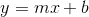

其中 y 是因变量/输出，m 是斜率，x 是输入/自变量。x 每增加一个单位，y 就增加 m 个单位(如果 m 为负，y 就减少)。b 项是一个截距项，它在不改变斜率的情况下向上或向下移动你的直线。线性回归试图找到输入要素和因变量之间的相似关系，并最终创建一个相似的公式:

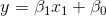

在一个变量中，它看起来就像一条线，除了我们把系数 m 重命名为希腊字母 beta。让我们想象一个简单的例子。以下是一些数据点:

Some points to consider

这就像每个真实世界的数据集一样，有点嘈杂，但显然有一个趋势:随着 x 的增加，y 也增加。也许这种关系用一条线就能很好的估计出来。你如何选择哪一行呢？考虑以下选项:

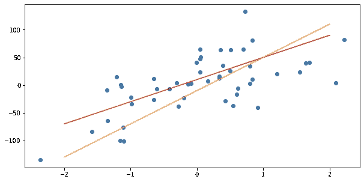

Two possible lines: which describes the points best?

哪条线似乎最能抓住趋势？不一定清楚。橙色的线看起来最接近左边的点，但是一旦你接近分布的中心，就不清楚了。在右手边，也许橙色线超出了标记，太高了。

线性回归模型通过最小化直线和各个点之间的垂直距离来选择直线。只考虑红线，以及点和线之间的垂直距离，现在显示为紫色线段:

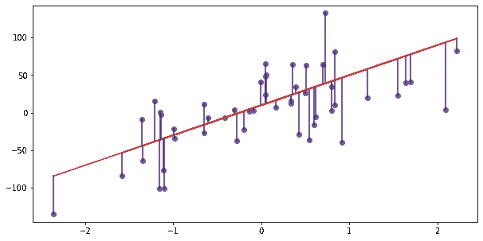

Just the red line, with the vertical distances to the line visualized

您的回归线代表您对任何给定 x 值的预测。这些紫色线代表每个点的预测误差。当然，你画的直线不会完全没有误差，但是尝试最小化这个误差似乎是一个合理的目标。实际上还有一个小问题，那就是线性回归模型通常不会简单地找到最小化预测误差的直线，而是找到最小化预测误差平方值的直线。对于更倾向于数学的人来说，这被称为误差平方和或 SSE，用如下公式表示:

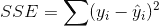

我们最小化平方误差的事实就是这种方法的名字:普通最小二乘法或 OLS。让我们在我们的可视化中包括平方误差的值。红线的系数为 40，截距值为 10:

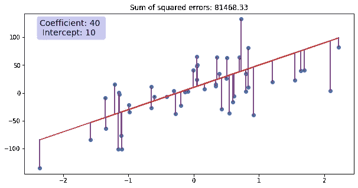

Spelling out the coefficient, intercept and SSE

调整截距可以上下移动线条。如果我们把截距改为 30，线会上移。新线条是更好还是更差的预测器？它变得更靠近一些点，但是离已经在线下的点更远。然而，从误差平方和来看，这条新线总体上是一个更差的预测指标:

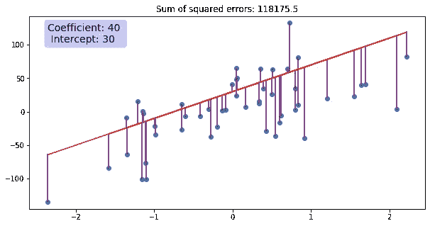

The new intercept increases our SSE

当然，我们也可以调整系数，改变直线的斜率。事实证明，我们的线太陡了，将系数降低到 30 可以改善整体预测:

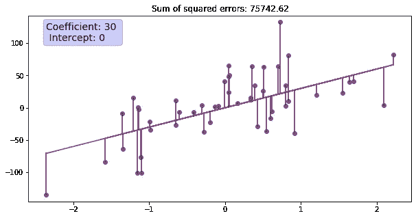

Our best fitting line yet

通过使用一点微积分，我们可以找到最小化 SSE 的系数和截距的值，并给出最佳拟合线(或者更准确地说，您的计算机可以使用微积分并为您找到这些值)。

虽然这些示例都很简单，只有一个输入要素，但这种方法很容易推广到多维。对于任何给定的特征集，多元 OLS 模型将找到相应的系数集。这些多元模型有点难以可视化，但在概念上是相同的。我们将有多个 beta 系数，而不是一个 beta 系数，每个 beta 系数对应一个输入要素:

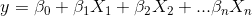

从这些线性模型公式的描述中，你可能已经看到，线性模型的一个好处是很容易解释它们是如何通过系数工作的。如果 X1 的值增加 1，模型对 y 的估计值就会增加β1 的值。很容易看出是什么影响了您的预测值，也很容易知道如果您假设改变其中一个特征，您的预测将会如何变化。

**假设和警告**

线性回归模型隐含地对特征变量以及它们与因变量的关系做出某些假设。线性回归有用的部分原因是，在满足这些假设的情况下，它具有可预测的特性。例如，您可以为任何给定的预测创建准确的误差幅度。如果不满足基本假设，线性回归模型将不会那么准确，尽管它们在提供可用预测的意义上可能仍然有用。这些假设是什么？

1.输出变量是特征变量的线性组合——线性

简单地说，输出变量可以用一组系数乘以相应的特征变量来精确描述。我们将每个输入特征变量乘以其 beta 系数的公式在技术上称为“线性组合”。需要注意的是，虽然这被称为线性，但并不意味着线性回归都是简单的直线，因为输入特征变量*不需要是线性的* ***。*** 考虑这样一个例子:

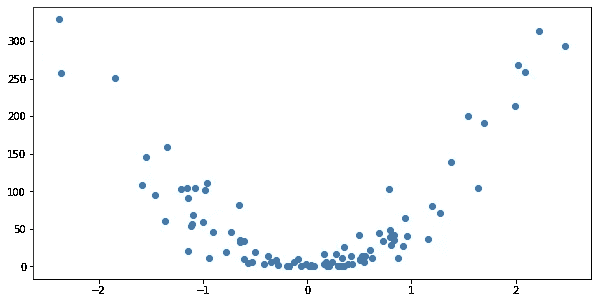

A non-linear example.

这些点显然不是线性的——我可以确认它们是方形的，通过生成一组线性点，然后简单地平方 y 值来创建。当然，没有一条直线能很好地捕捉曲线！然而，线性回归仍然可以处理这样的数据集，因为输入要素可以是二次的。以前，我们的例子显然是线性的，所以我们的公式也是线性的:

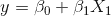

在这种情况下，看起来有一些二次的东西在进行，但我们仍然可以使用一个线性框架和一点点功能工程。让我们添加一个新的特征，这将是我们原来的特征平方。现在我们有了新的公式:

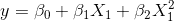

该公式是两个特征 X1 和 X1 的平方的线性组合。它还有线性！我们之前的所有框架基本上是一样的，我们可以用同样的方式建模这些点并可视化这些错误:

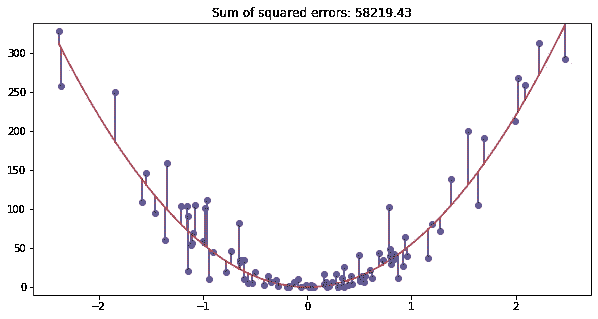

But linear regression can still handle it!

2.恒定方差—同方差

这是一种奇特的说法，即当你移动输入变量时，输出变量的方差保持不变。例如，这组点看起来是同质的，是线性回归的主要候选点:

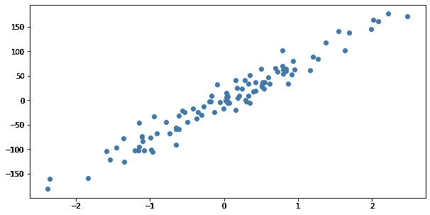

Another regression example

如果我们对此拟合一条线，我们会注意到，虽然这些点可能不总是正好落在这条线上，但预测线和这些点之间的平均距离似乎不会随着您的前进而增长或收缩:

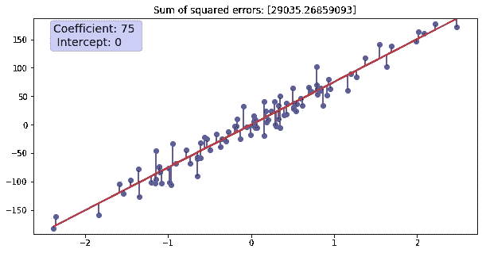

另一方面，这种分布看不到恒定的方差，技术术语是异方差的:

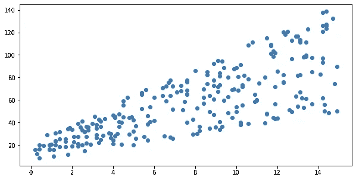

A heteroscedastic example

像这样的分布看起来不太适合线性回归。当然，我们可以用一条线来拟合它，但是这条线提供的预测似乎越来越不准确:

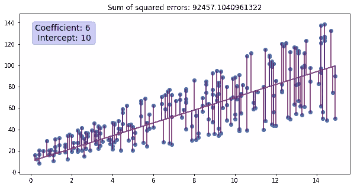

Our linear regression looks less impressive…

注意到异方差会让你对使用线性模型有所犹豫，但这并不意味着 OLS 线性模型完全无效。在真实世界的数据中，异方差通常是一种迹象，表明某些具有解释价值的特征(某些解释变量，尤其是交互项)尚未纳入模型。为了说明我这样说的意思，让我们想象一个真实世界的场景，它可能会给我们提供类似上面例子的数据。

假设你是一名经济研究员，正在进行一项关于收入分配的研究。您希望创建一个基于一些变量来预测收入的模型:收入似乎会根据您的所在地、个人受教育程度等因素而有所不同。要包括的一个变量是这个人已经工作了多长时间。除非经济不景气，否则随着职业生涯的进展，人们往往会挣得更多。你问你的回答者他们工作了多久，然后把结果标在 x 轴上，收入水平标在 y 轴上。你会发现你有一个像上面这样的图表，收入不断扩大。有人告诉你要警惕异方差，这是否意味着你应该放弃这个变量或者尝试不同类型的模型？也许不是。

在我们做任何激烈的事情之前，让我们试着想清楚我们每个变量之间的关系。我们看到收入随着工作年限的增加而增加，但这种情况的发生率似乎并不是对每个人都一样。让我们试着用另一个变量来划分我们的数据。让我们以教育水平为例，根据受访者是否拥有高中学历、大学学历或专业学位(如律师或医生),对他们进行分组。分别考虑这些群体，可能会给我们一个这样的图表，不同的颜色代表不同的教育水平:

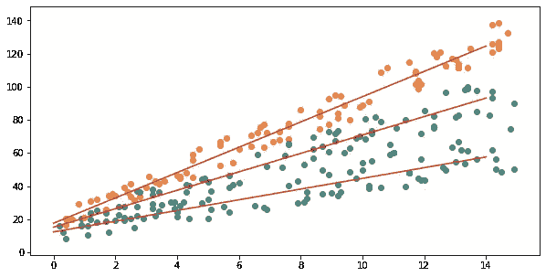

Our heteroscedastic example, color coded

现在数据看起来更像三个同方差分布！每一个教育水平似乎都可以用一条线来很好地估计，但是这些线的斜率都有一点不同，这就是当我们只看工作年限和收入时，总体分布呈现出异方差的原因。实际上，我们可以在一个模型中说明这一点，而不用通过包含一个交互项将数据分成三组:我们将创建的一个新特征，类似于我们的教育水平乘以工作年限。我们的回归公式如下所示:

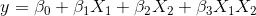

这种情况的挑战在于它需要人工输入——模型无法为您执行特征工程。在您拥有领域知识并能够合理猜测特征变量可能如何交互的领域，您仍然可以使用线性模型，并获得良好拟合和高度可解释的模型。

3.误差的独立性

误差，即数据中的实际值和模型的预测值之间的差异，应该彼此不相关。任何一组随机点的误差项本质上应该看起来像同分布的独立随机变量。如果情况并非如此，这意味着您的模型在某些领域的预测性会低于其他领域。同样，这可能是变量偏差缺失的迹象。

4.缺乏完美的多重共线性

虽然可以通过将其他要素平方或使多个要素相互作用来创建要素，但没有一个要素应该与另一个要素完全相关(例如，一个要素以年为单位测量年龄，另一个要素以月为单位测量年龄)，或者是其他要素的线性组合。首先，这会产生可解释性问题，因为多个系数可以描述同一条线，例如 y = 24*年数= 12 *年数+1 *月数= 2 *月数。这也产生了一个问题，因为统计包通常使用线性代数求解系数，如果存在完美的多重共线性，这种方法就不起作用。(用专业术语来说，代表每个样本变量值的‘设计矩阵’必须是可逆的，多重共线性则不是这种情况。)