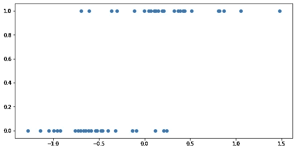
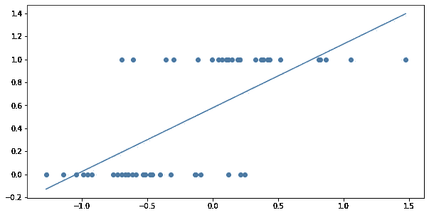
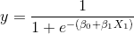
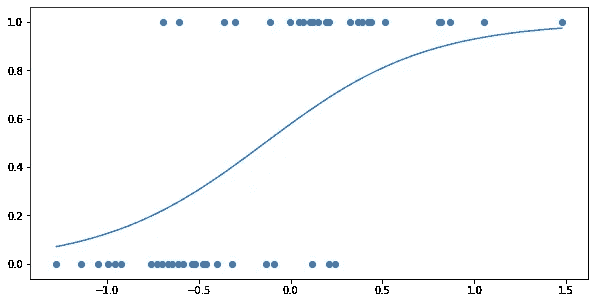
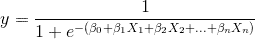
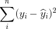
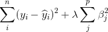

# 基础:逻辑回归和正则化

> 原文：<https://towardsdatascience.com/the-basics-logistic-regression-and-regularization-828b0d2d206c?source=collection_archive---------2----------------------->

## 从头开始的数据科学

## 线性模型的扩展

普通最小二乘线性回归开箱即用，功能强大，用途广泛，但在某些情况下它会失败。首先，它是一个“回归”框架，这使得它很难作为一个分类器来应用。另一方面，与决策树不同，线性回归模型不执行自己的隐式特征选择，这意味着如果包含太多特征，它们容易过度拟合。幸运的是，线性模型有一些扩展，允许我们克服这些问题。逻辑回归将线性回归框架转变为分类器和各种类型的“正则化”，其中脊和套索方法是最常见的，有助于避免在特征丰富的情况下过度拟合。

**逻辑回归**

逻辑回归基本上采用了线性回归公式，使其能够充当分类器。为什么常规的 OLS 线性回归不能单独作为一个分类器？让我们考虑一个例子。下面，是一个简单的一维分类例子。x 变量是连续的，但 y 变量是分类的，可以是零或一:

A simple regression example

有一些重叠，但是我们可以直观地看到，当我们向右移动时，我们的分类选项卡变得更加突出。在右边，更多的点是 1 而不是 0，在某个 x 值之上，我们看到的所有的点的 y 值都是 1。这看起来是一个相当容易建模的关系，但是如果我们试图简单地用线性回归来拟合这个数据，结果就有点奇怪了:

Fitting an OLS line to our classification problem

一方面，这条线在某种程度上成功地捕捉到了两个变量之间的正关联，但是这条线的输出并没有太大的意义。如果我在 x 值为 0.25 时查阅这条线，我们发现这条线预测的值为 0.71。因为我们试图预测一个只取值 0 或 1 的变量，所以预测 0.71 有点奇怪；我们的二元变量实际上不能取那个值，那么这个预测意味着什么呢？

在这种情况下，解释小数值的一种方法是稍微重新组织一下我们的问题。我们可以不要求模型预测自变量的值，而是要求模型给出自变量的值为 1 的概率。随着模型输出的增加，我们可以说变量为 1 的几率也增加了。这个框架中的小数值更有意义。像 0.71 这样的值意味着什么？嗯，这个结果比模型给我们的数字低的可能性更大，比给我们的数字高的可能性更小！

然而，要把我们简单的线性回归变成这种模型，还有一点工作要做。首先，从直觉上看，我们的模型应该输出的概率是非线性的。就目前的情况而言，我们的线性回归有时会给出大于 1 的值或负值，这同样没有意义。在这种情况下，我们的解决方案是让我们的线性模型通过一个 sigmoid 函数。“Sigmoid”在这里的意思是“S 形”,我们可能会用到一些函数，但最常用的是逻辑函数。逻辑函数的一般形式如下:

这可能看起来有点吓人，但是值得稍微思考一下。分数底部的 e 上的指数看起来像我们之前的线性回归方程，除了整个东西都是负的。随着这个“回归方程”的输出变得非常大，指数相应地变负，e 的值的乘方变为零；因此，整个表达式的值更接近 1/(1+0)，即 1。如果这个回归方程的输出非常负，那么 e 被提高到正值，分数的底部变得非常大；整个表达式的值越来越接近 0。

在我们之前的示例中，拟合的逻辑曲线如下所示:

Our simple classification problem with a fitted logistic curve

我们的曲线从来不会低于 0 或高于 1，所以我们可以明智地将其解释为二元变量为 1 的概率。拟合这条曲线的过程基本上与我们拟合正常的线性回归线是一样的。在这里，我们找到了截距和系数β1，使直线和点之间的垂直距离最小化，这里我们同样找到了截距和系数，但现在我们要使到这条曲线的距离最小化。

一旦你得到了最合适的逻辑曲线，将预测的概率转化为预测的结果就相对简单了。因为结果是二元的，所以你的预测也是二元的。最简单的是，如果你向大多数统计软件包询问预测结果，它们可能会做什么，只要你的逻辑回归给你 50%以上的概率，你就可以简单地预测该类。让我们将这些预测包含在我们的可视化中:

当然，由于该模型在任一点上对概率产生更细粒度的估计，因此您可以使用逻辑模型为进一步的模型产生输入，这些模型本身也接受概率。例如，预测选举结果的人可能有一套模型来预测每个州的选举结果，然后在一个模型中使用这些概率来预测整个国家所有州的结果范围。

逻辑回归以与简单线性回归非常相似的方式推广到多个变量，向回归公式添加了更多的特征和相应的系数:

逻辑版本中的系数比普通线性回归中的系数更难解释。理论上，您可以通过将它们与正在建模的结果的对数概率的变化相关联来直接解释它们，但这意味着什么有点不清楚，因为实际上，移动输入要素之一对概率的影响取决于您从哪里开始。然而，你可以简单地解释系数的方向。具有正系数的要素随着其增加而增加建模结果的概率，而具有负系数的要素随着其增加而降低概率。

**规则化(脊和套索)**

山脊和套索正则化也称为“收缩”方法，因为它们会减少或收缩结果回归中的系数。这减少了模型中的方差:当输入变量改变时，模型的预测变化比没有正则化时要小。为什么要减少模型的方差？以避免过度拟合。

过度拟合导致我们的模型无法推广。有时我们可能会发现，我们已经在一些数据集上训练了一个模型，它似乎在这些数据上工作得很好，但当我们在一些新的数据集上测试它时，性能会受到影响。出现这种情况有几个原因。例如，也许我们得出模型的样本在某些方面有偏差。另一个常见的问题是过度拟合，即模型过于符合训练集，因此错过了更具普遍性的趋势。

考虑创建一个模型来估计某个城市市场上新房子的售价。你有以前房屋销售的数据，并着手创建一个线性回归。显然，大房子往往比小房子更贵，所以你可能会自然地包括平方英尺或卧室数量等特征。你可能还会注意到，不同的社区可能会有不同的定价，比如说，一个社区的两居室可能比另一个社区的要贵。所以，你决定在你的模型中包括邻居，但是为什么要止步于此呢？也许在一个街区内也有变化，所以你可以考虑包括次街区大小的单元，也许是单独的街道甚至单独的街区。你可能能够想象为什么如此精细的位置标记实际上会对房子的最终价格产生影响——可能街区的一端过于靠近嘈杂、繁忙的十字路口，不太理想，或者街区的另一部分阳光更好——但当涉及到实际训练你的模型时，你会遇到几个挑战。

首先，在回归中包含的变量越多，就越有可能遇到特征之间的过度协方差(在添加交互或幂项时尤其可能)。另一方面，支持你估计任何给定系数的数据量可能很小。当按街区对房屋销售进行分组时，每个街区可能都有许多数据点，但是如果将数据一直拆分到街区级别，任何给定的街区都可能只有少数几个示例可用于训练模型。如果您要包括每个单个块的要素，任何块的系数都可能很容易被异常值扭曲-例如，如果您的训练数据中的一所房屋碰巧以异常高或异常低的价格出售。您的模型可以很好地代表您的训练数据，但不一定能很好地预测未来。

多少功能才算太多？哪些特性是最重要的？正规化会有所帮助。岭正则化和套索正则化都是通过向用于推导回归公式的成本函数添加一个新项来实现的。回想一下，OLS 回归通过最小化训练数据的预测误差平方来查找系数和截距，如下式所示:

Lasso 正则化将另一项添加到此成本函数中，表示模型中所有系数的大小之和:

在上面的公式中，第一项是我们知道并喜爱的残差平方和，第二项是一个惩罚，其大小取决于所有系数的总大小。该总和前面的项由希腊字母 lambda 表示，是一个调整参数，用于调整惩罚的大小。如果它被设置为 0，你会得到一个普通的 OLS 回归。岭回归遵循相同的模式，但罚项是系数平方之和:

包括额外的惩罚项实质上抑制了包括额外特征。一项新功能可能有助于通过减少残差来最小化成本函数中的第一项，但它会增加惩罚项。这里有一个最终的平衡动作，增加一个系数的值与模型的整体方差的相应增加相权衡。

降低模型的方差可以提高模型对未知数据的准确性。在我们的住房价格预测例子中，你可以想象包括那些逐块的变量，但是看到这些变量的系数非常低。一个离群的房子不再把那个地区的所有预测都抛出这么多。

不言而喻，脊线和套索也作为它们自己的特征选择；不驱动回归预测能力的特征看到它们的系数被下推，而更具预测性的特征看到更高的系数，尽管增加了惩罚。岭回归，因为它平方惩罚项中的系数，倾向于将不太有用的特征的系数降低到接近零，但不完全为零。另一方面，Lasso 将有助于将一些系数一直发送到零。