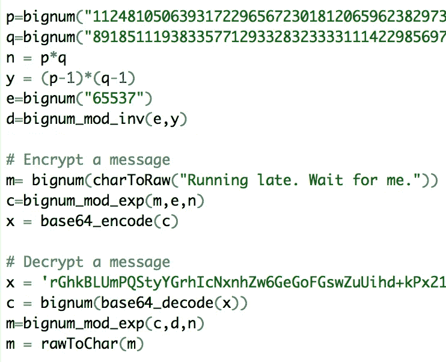
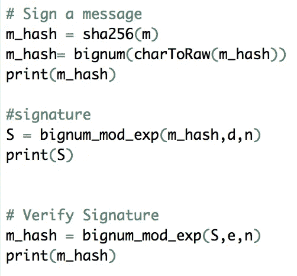

# 密码学基础

> 原文：<https://towardsdatascience.com/the-basics-of-cryptography-80c7906ba2f7?source=collection_archive---------7----------------------->

## R 中的应用程序

Photo by [Markus Spiske](https://unsplash.com/@markusspiske?utm_source=medium&utm_medium=referral) on [Unsplash](https://unsplash.com?utm_source=medium&utm_medium=referral)

你有没有想过公司如何安全地存储你的密码？或者在网上购物时，你的信用卡信息是如何保密的？

答案是密码学。现在，绝大多数互联网网站都使用某种形式的加密技术来确保用户的隐私。就连来自你 Gmail 账户的电子邮件等信息，在谷歌数据中心流动时也会被加密。

# 什么是密码学？

密码学是一门针对潜在的第三方对手安全传输信息的科学。

例如，想想“模仿游戏”对于那些看过这部电影的人来说，你知道这是一个关于艾伦·图灵如何创造第一台计算机来解密德国恩尼格玛机的故事，这是一台对所有德国通信进行编码的机器，以便纳粹可以通过无线电安全地传输信息。虽然这些信息很容易被盟军截获，但这些信息却无法被理解，因为它们都是用每天都在变化的外国密钥进行编码或加密的。

[Cover](https://www.google.com/search?q=the+imitation+game&client=firefox-b-1-ab&source=lnms&tbm=isch&sa=X&ved=0ahUKEwjsp9C_kZHgAhVG-lQKHXUECCoQ_AUIDygC&biw=1287&bih=853#imgrc=_YUEUN1ftWmQ4M:) of “The Imitation Game”

## 加密算法

1.  对称密钥加密—在对称密钥算法中，有一个公共密钥，用于锁定和解锁加密“盒子”发送方和接收方拥有相同的密钥。对称密钥算法非常快，因为密钥不需要很长；然而，首先存在共享公共密钥的问题，因为它可能被截取，然后整个系统受到危害。
2.  非对称密钥加密—在非对称密钥算法中，只有接收方持有密钥。接收者可以公开发出一个锁(或者锁定我们假设的盒子的方法)，只有接收者持有这个锁的密钥。锁叫做**公钥**，钥匙叫做**私钥。注意:每个私钥只有一个公钥。**

## 非对称密钥加密:它是如何工作的？*

首先，接收器通过以下方式生成 2 个公钥 *n* 和 *e* ，以及一个私钥 *d* :

1.  选择 2 个大素数 p & *q* ，使得 n = p*q
2.  选择另一个素数 e，例如 3
3.  Calculating d such that d*e-1 = k(p-1)(q-1).

Next, you’re ready to encrypt:

1.  Next transform the plaintext that you want to send into a number *m* ，使用 ASCII 数字表示或其他方法。
2.  通过找到密文 *c= m^e mod n.* 来加密数字 *m*
3.  将 *n、e* 和 *c* 发送给接收者。

如果这很难理解，请查看我的 [Github，](https://github.com/alysonb/FinTech/blob/master/HW2/HW2_BROWN_ALYSON.r)上的示例代码，它使用 R 中的一个名为“openssl”的包，引导你完成这个过程的每一步。摘录见下文:

R code on [Github](https://github.com/alysonb/FinTech/blob/master/HW2/HW2_BROWN_ALYSON.r) to practice encrypting & decrypting messages

# 签名

加密的另一个重要方面是签署消息的能力。它允许您验证发送者，并避免将敏感信息发送给错误的用户和/或公钥。

## 如何签署消息

创建一个签名 *M* ，这样 *S = M^d mod n，*和你的消息一起发送 *S* 。记住 *d* 是你的私钥。

## 如何验证签名

如果 *M= S^e 模 n.* ，接收者可以快速确定签名有效

R code on [Github](https://github.com/alysonb/FinTech/blob/master/HW2/HW2_BROWN_ALYSON.r) to sign & verify a message

# 散列法

您会注意到，在上面的示例代码中，我使用函数 sha256()作为变量 m_hash。哈希是一种单向加密功能，允许您将信息不可逆地转换为称为哈希的字母和数字字符串。哈希不同于加密，因为哈希意味着不可能被解密，尽管许多人已经尝试过，有些人已经成功了。当您听到密码或其他安全漏洞时，通常指的是加密黑客攻击，黑客能够将哈希与原始文本进行匹配。

## 工作原理:

有各种各样的散列算法( [MD](https://tools.ietf.org/html/rfc1321) 、 [SHA1](https://tools.ietf.org/html/rfc3174) 、 [SHA2](https://www.thesslstore.com/blog/difference-sha-1-sha-2-sha-256-hash-algorithms/) 、&SHA3)，但是我们将集中讨论 SHA256 算法，因为它是当今最常见的算法。

SHA256 算法首先将文本转换为由 0 和 1 组成的 256 位字符串(因此得名)。一个例子是:

1110001010111000101011100010101110001010111000101011100010101110001010111000101011100010101110001010111000101011100010101110001010111000101011100010101110001010111000101011100010101110001010111000101011100010101110001010111000101011100010101110001010000101

由于这些二进制散列非常长，无法显示，因此它们被转换为十六进制格式(值 0–9 & a-f 的 64 个字符的组合)，每个 4 位部分代表一个字符。十六进制表示的一个例子是:

a 235810 CD 87 df 030d 78 e 890d 90 c 187 cc 04 a 09 ad 09 b 289 b 91 BBA e9 d 890 f 987 e

## 密码

哈希的一个主要用途是用于密码验证。对你的银行来说，保存一个密码数据库是非常不安全的，所以它保存了一个散列数据库，与你的实际密码相对应。当您在线登录银行时，系统会对您的密码进行哈希处理，然后根据您的档案中的哈希进行核对。

> 这个系统之所以有效，是因为哈希算法总是为相同的密码生成相同的哈希——哈希不是字符的随机组合。哈希也是拥有复杂且唯一的密码很重要的原因，因为如果我计算“密码 123”的哈希，并将其与对应于您的哈希进行匹配，那么我就知道您的密码是“密码 123”，并且我可以轻松地在网上侵入您的银行帐户。

# 加分内容！

## 彩虹桌

彩虹表是普通密码的散列数据库。

以 ATM 密码为例。使用数字 0-9 的 4 位 ATM pin 码有 10，000 种组合。彩虹表将为 10，000 个代码中的每一个提供散列，黑客可以使用该散列列表将散列映射回您的代码，从而从散列中解码您的 pin 号。

## 晚上怎么睡得着？

放松点。银行和大多数其他组织明白黑客想要获取敏感信息，因此他们通常通过一种叫做“盐”的东西来提供额外的安全层。

> Salts 是添加到密码(或其他信息)中的额外字符串，使其更独特、更长、更难破解。

添加 salt 会将您的 pin 更改为类似于“0000B_of_A_salt”的内容，这将具有完全不同的散列，而不是 pin = "0000 "。组织可以创造性地使用盐来使黑客攻击变得极其困难。为了使用彩虹表来破解这样的算法，您需要为每种可能的盐准备一个彩虹表，这极大地增加了 pin 号码的可能组合的数量。

## 区块链

加密技术使区块链能够通过签名来验证网络中的发送者，并确保过去的交易和记录(称为“块”)不能被更改。

区块链还利用哈希算法为每个区块分配一个唯一的哈希，允许您区分不同的区块。

# 结论

既然你已经知道了散列和加密的所有知识，看看这个简短的视频[关于艾伦·图灵是如何成功“黑掉”德国的 Enigma 机器的，如果你还没有看过的话，就看看这个电影吧！](https://www.youtube.com/watch?v=V4V2bpZlqx8)

*注意:出于本文的目的，我重点介绍了一种称为 RSA (Rivest、Shamir 和 Adleman)加密的非对称加密算法。