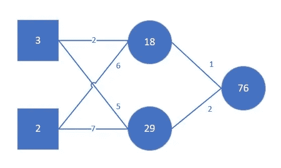
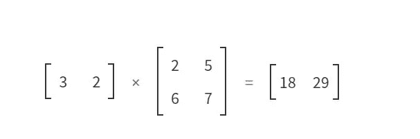
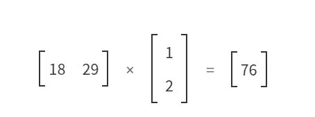
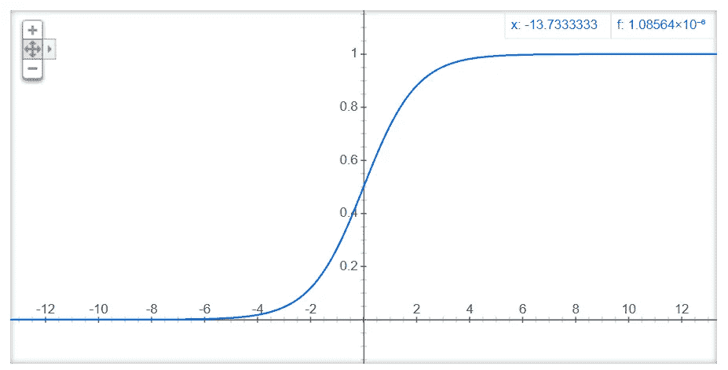
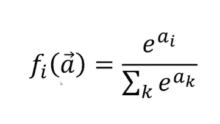

# 深度神经网络的基础

> 原文：<https://towardsdatascience.com/the-basics-of-deep-neural-networks-4dc39bff2c96?source=collection_archive---------12----------------------->

随着 Tensorflow 2.0、PyTorch 和 Fastai 等库的兴起，越来越多的人可以实现深度学习，这有助于理解深度神经网络背后的基础。希望这篇文章能够帮助那些正在学习深度神经网络的人。

当我第一次了解神经网络并实现我的第一个神经网络时，它们总是被表示为单独的人工神经元，本质上是具有单独加权输入、总输出和激活函数的节点。

当第一次回到学习深度神经网络时，这如何等同于矩阵乘法的概念并不明显。此外，与此相关的是为什么图形处理单元(GPU)及其衍生产品对深度学习结果的推动作用如此之大。

# 与矩阵乘法相比，这是一个非常简单的神经网络

让我们来看一个非常简单的网络，它有两个输入，一个隐藏层有两个神经元。每个神经元有两个权重，每个输入有一个单独的权重。每个权重乘以输入到神经元的每个输入，然后求和，并在通过激活函数馈送后形成来自神经元的输出。

A very simple network

这等同于应用两次矩阵乘法，然后是激活函数。

First matrix dot product multiplication. Generated using the excellent [http://matrixmultiplication.xyz](http://matrixmultiplication.xyz)

Second matrix dot product multiplication. Generated using the excellent [http://matrixmultiplication.xyz](http://matrixmultiplication.xyz)

# GPU 带来的进步

我们离开上一个所谓的“人工智能冬天”的原因之一是使用 GPU 取得的计算进步，在这个冬天，人工智能和机器学习的研究和兴趣放缓并变得“冷淡”。

GPU 传统上用于计算机图形和计算机视频游戏领域。计算机图形学需要非常快的矩阵乘法。计算机视频游戏行业对 GPU 计算能力的需求导致了 GPU 设计者和制造商的巨大进步。

值得注意的是，最大的 GPU 公司之一 Nvidia 发布了 CUDA(一种用于在 Nvidia GPUs 上编程的语言/API)和 cuDNN(使用 CUDA 构建的深度神经网络库)。这使得训练神经网络中的计算更容易转移到 GPU，这些被打包为 PyTorch 的一部分，并相对容易地安装在 TensorFlow 中。只要计算可以并行进行，计算时间就会减少几个数量级。

# 矩阵乘法是线性函数

矩阵乘法是线性函数。许多线性函数层层叠加，仍然是一个线性函数，只是参数不同而已。因此，然而许多层叠在一起的矩阵乘法仍然只是线性函数。

线性函数是仿射函数的子集。仿射函数是值相乘并求和的函数。线性函数总是仿射的。

卷积神经网络(CNN)中使用的卷积是一种特殊的仿射函数，适用于自相关数据，通常是图像，但也适用于其他领域，如蛋白质相互作用、药物设计。这些卷积是逐元素的矩阵乘法，而不是点积乘法。逐元素矩阵乘法也是线性的。

# 非线性激活函数

激活函数是非线性函数的一种形式。传统上，在神经网络中，sigmoid 函数被用作非线性激活函数。在现代架构中，整流线性单元(ReLU)被用作激活功能或其变体之一。

一个 ReLU 听起来很复杂，它的维基百科页面试图让它变得复杂:[https://en . m . Wikipedia . org/wiki/Rectifier _(neural _ networks](https://en.m.wikipedia.org/wiki/Rectifier_(neural_networks)))——一个 ReLU 说如果值小于零，就把值向上舍入为零。这是最复杂的了。

有一种称为泄漏 ReLU 的变体，它与 ReLU 相同，只是如果值小于零，它会乘以 0.1，而不是向上舍入到零。之所以这么叫，是因为它允许少量的值泄漏到激活中。

激活函数选择有时并不总是那么重要，只是它是非线性的。如果没有非线性激活函数，那么神经网络就不会被认为是深度的，因为它只是一个线性函数。线性函数永远无法执行复杂的任务，例如对电影评论进行分类或在卫星图像中识别地形类型。

这种任务可以用足够大的矩阵乘法来执行，每个矩阵乘法后面都有一个非线性。随着足够多的这些线性和非线性层夹在一起，网络变得非常深，可以产生任何任意形状或函数，可以近似任何东西。

这些计算的结果或输出被称为激活，通过训练网络来学习这些激活的原因，这些训练值是系数/参数，通常被称为权重和偏差。

# 参数/重量

这些参数的值是随机初始化的，或者从使用迁移学习的预训练模型中复制。

使用反向传播作为梯度计算技术，用随机梯度下降(SGD)或其他更快版本的 SGD 来训练这些参数。SGD 是最小化损失函数的优化。

# 随机梯度下降、损失函数和反向传播

损失函数评估训练期间预测输出与实际输出的差距。这可以是简单的数学计算，也可以是各种因素的复杂组合，根据正在进行的讨论使用不同的函数，如分类或回归。

损失函数用于评估训练期间的网络性能，损失变化的梯度是反向传播的，并用于更新权重以最小化损失。

每个节点的输出值被计算并缓存在通过网络的正向传递中。然后，通过网络的计算图反向计算损失函数相对于每个参数的误差的偏导数。

根据误差的导数，它显示了损失是增加还是减少，以及如何以什么速率增加(有多陡)，然后这被用于少量更新参数以减少损失。学习率乘数用于缩小更新的幅度，以试图确保训练不会在损失空间中采取太大的步骤。这有助于优化权重的更新量。

这个过程就是 SGD。

## 分类

对于用于分类的训练网络，使用的损失函数是交叉熵。交叉熵基于预测正确的类和预测正确的置信度来提供损失。这是通过以下方式实现的:如果训练示例属于某个类(值为 1)，则应用公式；如果训练示例不属于该类(值为 0)，则应用不同的公式。

假设预测值在 0 和 1 之间，则:

*   训练示例实际值为 1，损失计算如下:log(预测值)
*   训练示例实际值为 0，损失计算如下:log(1 -预测值)

## 回归

如果网络用于回归，那么训练损失函数通常是零，通常均方误差(MSE)或均方根误差(RMSE)被用作损失函数中的度量。

# 最后一层激活功能

分类中的最后一个输出层表示类分数，它是任意的实数值，或者是回归类的实值目标。不同的激活功能用于这些任务。

## 二元分类

二元分类问题是将数据分类为属于某一类或不属于该类，例如“有肿瘤”或“没有肿瘤”。sigmoid 函数通常用作最后一层激活函数，因为它能很好地区分两类。

一个 sigmoid 函数的图形:f(x) = 1 / (1 + e^-x)

Graph for a sigmoid function: f(x) = 1 / (1 + e^-x)

sigmoid 函数渐近于 0，渐近于 1，输出 0 和 1 之间的值。高于或低于 0.5 的值表示数据将被分类到两个类别中的哪一个。

对于 sigmoid 函数的输出形状，当激活小于 0.5 时，sigmoid 函数将返回较低的概率值，如果激活大于 0.5，sigmoid 函数将返回较高的概率值。

这里可以使用下面描述的 Softmax 函数来代替 sigmoid 函数。如果有两个输出，每个输出表示两个类别中的一个。这里最好使用 sigmoid 函数，因为它更快。

## 多类单标签分类

在多类单标签分类中，数据可以分为许多类，但只能用这些类中的单个标签进行分类。例如，试图对狗的品种进行分类，代表狗的数据只能有一个品种。

Softmax 函数用于多类别单标签分类。给定类别 *i* 的输出被视为 *e^i* 除以 *e^k* 之和，其中 *k* 是每个类别。

The Softmax function, source: Finn Eggers’s activation function on YouTube.

Softmax 函数非常擅长挑选单个标签。它输出一个概率分布，其中输出总和为 1。每个类的输出范围在 0 到 1 之间。所有类别的概率之和为 1。

预测的类别是具有最高概率输出的类别。

## 多类、多标签分类

在多类别、多标签分类中，数据可以被分类为许多类别，并且数据可以用这些类别中的一个或多个标签来分类。

例如，卫星图像可以被标记为不同的天气和特征类别，例如云、森林、农业、水、湖泊和河流。一个图像可以很容易地属于许多这样的类。

使用 sigmoid 函数是因为对于给定的数据项可能有多个具有高概率的标签。

Softmax 不能有效地使用，因为概率的总和不等于 1，每个类的概率在 0 和 1 之间。即使是有经验的从业者，这也是一个常见的错误。

## 回归

根据问题的不同，回归的输出是一个数字或一组数字。如果有一个以上的输出，这被称为多元回归。

执行回归时的输出值通常是无界的。

通常对于回归，没有最后一层激活函数，尽管有时在一些应用中，sigmoid 函数可能是有益的，例如当使用回归进行协作过滤时。