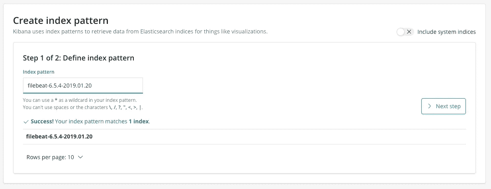
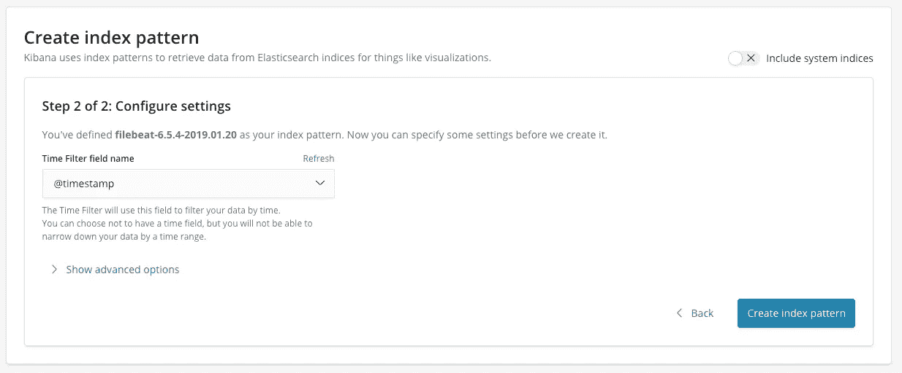
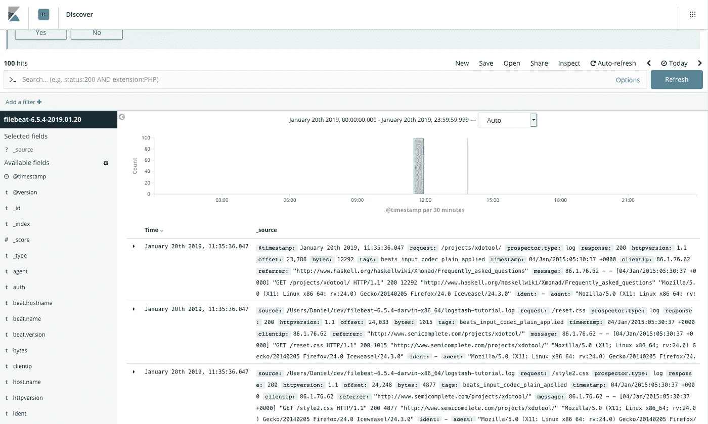
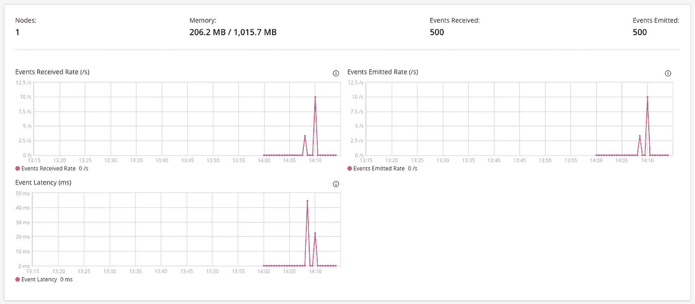
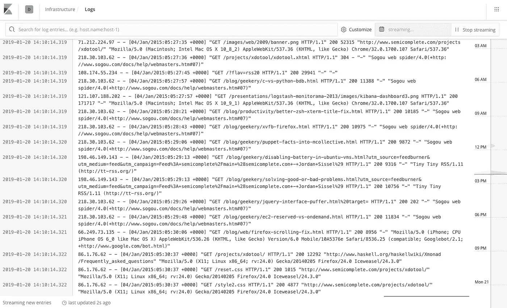

# 将 Logstash 管道部署到 Kubernetes 的基础

> 原文：<https://towardsdatascience.com/the-basics-of-deploying-logstash-pipelines-to-kubernetes-94a470ad34d9?source=collection_archive---------4----------------------->


Photo by [Hin Bong Yeung](https://unsplash.com/photos/jF946mh5QrA?utm_source=unsplash&utm_medium=referral&utm_content=creditCopyText) on [Unsplash](https://unsplash.com/search/photos/subway?utm_source=unsplash&utm_medium=referral&utm_content=creditCopyText)

> 你脑子里有一长串你想学的东西的清单吗？

我有，直到我把这个清单写在一张纸上，并决定为此做些什么。在 2018 年底，我开始总结我一直在学习的东西，并决定为 2019 年的学习建立一些结构。

2018 年是有趣的一年，我已经换了 3 次工作，感觉我的学习无处不在。前一天我在学 Scala，第二天我在学 Hadoop。回想起来，我觉得我没有取得多大进展。

我决定在 2019 年做点什么。我在一张纸的一面写下了一年中的 12 个月，并在另一面写下了我想在那个月学习的内容，我的想法是，这一个月的学习将专注于特定的产品/堆栈/语言/事物。

之前被称为 ELK 的 Elastic stack 之所以排在这个列表的首位，有几个原因。

我以前用过 Elastic stack，更确切地说是 ElasticSearch 和 Kibana，但我觉得我可以从这两个产品中学到很多东西。我还想了解 Logstash，看看它能帮助我解决什么问题。

当我开始学习新的东西时，我会设定一些小的、可实现的目标。我写的其中一个目标是在 Kubernetes 中运行一个功能完整、运行正常的 Logstash 管道，从某个地方接收数据，对其执行一些操作，然后将其发送给 ElasticSearch。

我是 Kubernetes 的超级粉丝。在过去的几年里，容器化应用发生了巨大的转变，我完全接受这种转变。我对运行我在当地修建的这条管道没有兴趣，这是库本内特斯或半身像！

我查了一下谷歌，很难找到任何关于部署、最佳实践等方面的具体内容，因此我写了一篇关于如何在 Kubernetes 上运行基本 Filebeat、Logstash 和 ElasticSearch 管道的基本文章。

那么 Filebeat 是什么？它是一个作为代理运行的发送器，将日志数据转发给 ElasticSearch、Logstash 等。

假设您正在运行 Tomcat，Filebeat 将在同一台服务器上运行，读取 Tomcat 生成的日志，并将它们发送到一个目的地，这个目的地通常是 ElasticSearch 或 Logstash。FileBeat 还可以在 Kubernetes 上的 DaemonSet 中运行，将节点日志传送到 ElasticSearch 中，我认为这非常酷。Fluentd 也这样做，但这是另一天。

想了解更多关于 Filebeat 的信息，请点击[这里](https://www.elastic.co/guide/en/beats/filebeat/master/filebeat-overview.html)。

对，在我们的场景中，我们让 Filebeat 读取某种类型的日志，并将其发送到 Logstash，但 was 是 Logstash 吗？

Logstash 是一个服务器端应用程序，它允许我们构建配置驱动的管道，可以同时从多个来源接收数据，对其进行转换，然后将其发送到您喜欢的目的地。

我们可以编写一个配置文件，其中包含从哪里获取数据、需要对数据执行什么操作(如过滤、grok、格式化)以及数据需要发送到哪里的指令。我们将这种配置与 Logstash 应用程序结合使用，这样我们就有了一个功能完整的管道。Logstash 的美妙之处在于，它可以使用各种资源，包括 RabbitMQ、Redis 和各种数据库，以及其他使用特殊插件的资源。然后我们可以把这些数据藏在 S3、HFDS 和更多地方！这一切都是由一个配置文件和一堆插件驱动的…很神奇吧！

想了解更多关于 Logstash 的信息，请点击[这里](https://www.elastic.co/products/logstash)。

让我们开始一些代码和令人兴奋的东西！

我在弹性网站上跟随 [Logstash 教程](https://www.elastic.co/guide/en/logstash/6.5/advanced-pipeline.html)，发现了我的管道的完美候选……做了一些小的修改。

我按照教程一步一步地操作，FileBeat 正在运行，它正在读取教程中提到的日志文件，一切都很好。我必须配置 FileBeat 配置文件`filebeat.yml` 以指向我所展示的 Kubernetes 节点端口，这将在稍后介绍，我还将提供的 FileBeat 日志移动到 Filebeat 应用程序文件夹中。

```
filebeat.inputs:- type: logenabled: truepaths:- logstash-tutorial.logoutput.logstash:hosts: ["localhost:30102"]
```

现在只需 Logstash 和 Kubernetes 进行配置。让我们看一下管道配置。

每一个配置文件被分成 3 个部分，**输入**，**过滤**和**输出**。它们是大多数 ETL 过程的 3 个阶段。

我们首先指定我们的数据来自哪里，在我们的例子中，我们使用 beats 插件并指定接收 Beats 的端口。

那么这个 Beats 插件是什么？它使 Logstash 能够从 [Elastic Beats 框架](https://www.elastic.co/products/beats)中的应用程序接收事件。当我们运行 FileBeat 时，它在那个框架中，FileBeat 读取的日志行可以被我们的 Logstash 管道接收和读取。

接下来，我们指定过滤器。过滤器部分是可选的，如果你不想的话，你不必应用任何过滤器插件。如果是这种情况，数据将被发送到 Logstash，然后发送到目的地，没有格式化，过滤等。在我们的例子中，我们使用的是 Grok 插件。Grok 插件是比较酷的插件之一。它使您能够将非结构化的日志数据解析成结构化和可查询的数据。

Grok 在它接收的数据中寻找模式，所以我们必须配置它来识别我们感兴趣的模式。Grok 带有一些内置模式。在这种情况下，我们使用的模式是`%{COMBINEDAPACHELOG}`，当 Logstash 从 Apache HTTP 接收日志数据时，可以使用这个模式。

最后，我们指定我们的输出。这是我们的数据过滤后的最终位置。如果您的数据需要发送到多个地方，您可以指定多个输出。在这个例子中，数据被输出到 ElasticSearch，但也打印到控制台，只是为了安全起见。在 ElasticSearch 块中，我们指定 ElasticSearch 集群 URL 和索引名称，索引名称是由元数据组成的模式组成的字符串。

现在，我们已经完成了管道的配置，我们可以转到 Kubernetes 了。

我们首先要做的是创建一个配置图。ConfigMap 允许我们存储可由 pod 访问的配置数据的键值对。因此，我们可以有一个配置映射，它可以存储一个目录，其中包含所有配置文件，也可以存储单个配置文件。

首先，我们创建一个配置图。我们将其命名为 **apache-log-pipeline** ，并引用前面的管道配置文件。

```
> kubectl create configmap apache-log-pipeline --from-file apache-log-es.conf
```

我们可以通过用 describe 运行 kubectl 来检查我们已经创建的 ConfigMap。

```
> kubectl describe cm/apache-log-pipeline
```

如果命令已经正确运行，您应该会看到`apache-log-pipeline`的键和之前配置文件的值。如果是这样的话，你做得很好！

```
Name:         apache-log-pipeline
Namespace:    default
Labels:       <none>
Annotations:  <none>Data
====
apache-log-es.conf:
----
input {
    beats {
        port => "5044"
    }
}
filter {
    grok {
        match => { "message" => "%{COMBINEDAPACHELOG}"}
    }
}
output {
    elasticsearch {
        hosts => ["[http://elasticsearch:9200](http://elasticsearch:9200)"]
        index => "%{[[@metadata](http://twitter.com/metadata)][beat]}-%{[[@metadata](http://twitter.com/metadata)][version]}-%{+YYYY.MM.dd}"
    }
    stdout {
        codec => rubydebug
      }
}Events:  <none>
```

现在我们有了 ConfigMap，我们需要为我们的 Logstash 服务组装一个部署，并将`apache-log-pipeline`引用为一个挂载的卷。

让我们看一下部署的一些部分。我们为容器指定了两个端口，5044 和 9600。端口号 5044 用于从 [Elastic beats 框架接收 Beats，在我们的例子中是](https://www.elastic.co/products/beats)，端口号 9600 允许我们检索关于 Logstash 的运行时指标。更多关于那个[的信息在这里](https://www.elastic.co/guide/en/logstash/current/monitoring.html)。

我们还指定我们想要挂载`config`卷，以及我们想要将它挂载到哪个路径`/usr/share/logstash/pipeline`。我们将卷挂载到这个特定的目录中，因为默认情况下，Logstash 从这个目录中读取配置。这允许我们只运行命令`logstash`,而不是指定配置文件所在位置的标志。

然后，我们有我们的卷，称为`apache-log-pipeline-config`，它是一种类型的`configMap`。有关卷的更多信息，请查看这里的。我们指定希望使用的配置图，`apache-log-pipeline`是我们之前创建的配置图。因为我们的 ConfigMap 是由键值对组成的，所以我们添加了包含我们的管道配置的键，`apache-log-es.conf`。

然后我们继续服务。这里唯一真正的讨论点是我们正在使用一个`NodePort`。这有两个原因，FileBeat 需要与运行在 Kubernetes 中的 Logstash 对话，因此我们需要一个端口来完成这项工作，我已经将它指定为`30102`，因为`filebeat.yml`需要配置这个端口号，以便将 beats 发送到 Logstash。第二个原因，我想检查使用端口`9600`的 Logstash 监控 API，如前所述。

因此，随着我们的部署和服务准备就绪，我们可以部署它。

```
> kubectl create -f apache-log-pipeline.yaml
```

如果 Pod 创建正确，您应该能够获得 Pod 并看到它运行。

```
> kubectl get pods================================================NAME                                   READY   STATUS    RESTARTS   AGE
apache-log-pipeline-5cbbc5b879-kbkmb   1/1     Running   0          56s
================================================
```

Pod 已正确创建，但它实际上已经启动并运行了吗？最快的方法是通过跟踪吊舱的日志。

```
> k logs -f pod/apache-log-pipeline-5cbbc5b879-kbkmb
```

如果管道运行正常，您应该看到的最后一行日志显示 Logstash API 已经成功创建。

```
[2019-01-20T11:12:03,409][INFO ][logstash.agent] Successfully started Logstash API endpoint {:port=>9600}
```

当我最初构建这个管道时，我遇到了两个错误。第一种情况是，由于格式原因，配置文件的格式不可读，在跟踪 Pod 日志时，错误被打印出来并可见。第二种情况是当 ConfigMap 没有正确安装时，管道将运行、停止然后重新启动，这再次被打印出来，并通过跟踪日志可见。

因此，我们在 Kubernetes 有一个功能齐全的 Logstash 管道。

但它实际上什么也没做。我们现在需要做的是运行 Filebeat。为了确保正确运行，我打开了两个终端窗口，一个跟踪 Pod 的日志，另一个跟踪我将要运行的 FileBeat 命令。

```
sudo ./filebeat -e -c filebeat.yml -d "publish" -strict.perms=false
```

当运行该命令时，Filebeat 将开始运行并读取在`filebeat.yml`配置文件中指定的日志文件。本文开头提到的教程中讨论了其他标志。

在管道配置文件中，我们包含了`stdout`插件，因此接收到的消息被打印到控制台。记住这一点，我们应该在终端窗口中看到输出的消息，跟踪 Pods 日志，并且您应该在运行 Filebeat 命令的窗口中看到类似的内容。

```
{
     "[@timestamp](http://twitter.com/timestamp)" => 2019-01-20T11:35:36.042Z,
        "request" => "/style2.css",
     "prospector" => {
        "type" => "log"
    },
       "response" => "200",
    "httpversion" => "1.1",
         "offset" => 18005,
          "bytes" => "4877",
           "tags" => [
        [0] "beats_input_codec_plain_applied"
    ],
      "timestamp" => "04/Jan/2015:05:24:57 +0000",
       "clientip" => "81.220.24.207",
       "referrer" => "\"[http://www.semicomplete.com/blog/geekery/ssl-latency.html\](http://www.semicomplete.com/blog/geekery/ssl-latency.html\)"",
        "message" => "81.220.24.207 - - [04/Jan/2015:05:24:57 +0000] \"GET /style2.css HTTP/1.1\" 200 4877 \"[http://www.semicomplete.com/blog/geekery/ssl-latency.html\](http://www.semicomplete.com/blog/geekery/ssl-latency.html\)" \"Mozilla/5.0 (Macintosh; Intel Mac OS X 10_9_1) AppleWebKit/537.73.11 (KHTML, like Gecko) Version/7.0.1 Safari/537.73.11\"",
          "ident" => "-",
          "agent" => "\"Mozilla/5.0 (Macintosh; Intel Mac OS X 10_9_1) AppleWebKit/537.73.11 (KHTML, like Gecko) Version/7.0.1 Safari/537.73.11\"",
           "beat" => {
         "version" => "6.5.4",
            "name" => "local",
        "hostname" => "local"
    },
           "auth" => "-",
       "[@version](http://twitter.com/version)" => "1",
           "host" => {
        "name" => "local"
    },
           "verb" => "GET",
          "input" => {
        "type" => "log"
    },
         "source" => "/filebeat-6.5.4-darwin-x86_64/logstash-tutorial.log"
}
```

如果我们看到了控制台中打印的消息，我们几乎可以保证消息已经被发送到 ElasticSearch 中。有两种方法可以检查这一点，用一些参数调用 ElasticSearch API 或者使用 Kibana。

我是基巴纳的超级粉丝，所以这是我们要走的路线。

启动基巴纳，前往[探索区](https://www.elastic.co/guide/en/kibana/current/discover.html)。


在我们的管道配置中，更具体地说是 ElasticSearch 输出，我们指定要创建的索引是一个由元数据组成的模式，其中包括 Filebeat 版本和日期。我们使用这个索引模式从 ElasticSearch 中检索数据。

在这个例子中，我定义的索引名为**filebeat-6 . 5 . 4–2019 . 01 . 20**，因为这是由 Logstash 创建的索引。



接下来，我们配置时间过滤器字段。当我们希望按时间过滤数据时，会用到该字段。有些日志会有多个时间字段，所以我们必须指定它。



一旦执行了这些步骤，我们应该能够查看日志。如果我们回到 Discover 部分，一旦我们定义了索引，日志应该是可见的。



如果可以看到日志，就拍拍自己的背吧！做得好，很努力！如果你想的话，可以轻拍一下庆祝一下:)

所以在我结束之前，我想说一些很酷的与基巴纳相关的事情。

我们可以从 Kibana 的监控部分监控我们的 Logstash 管道。我们可以深入了解事件发生率，例如发出和收到的事件。我们还可以获得节点信息，比如 CPU 利用率和 JVM 指标。



最后但同样重要的是 Kibana 的日志部分。我想这是我目前最喜欢的基巴纳区。它允许您近乎实时地查看流日志，并回顾历史日志。



要查看运行中的日志部分，进入 Filebeat 目录并运行`sudo rm data/registry`，这将为我们的日志重置注册表。一旦完成了这些，我们可以再次开始 Filebeat up。

```
sudo ./filebeat -e -c filebeat.yml -d "publish" -strict.perms=false
```

如果你把运行 Filebeat 的终端放在装有 Kibana 的浏览器旁边，你会看到日志以近乎实时的方式流动，很酷吧？

如题，这是一篇基础文章。它指导你如何快速启动和工作，因此一定会有改进/改变，在所有方面都做得更好。

非常感谢一如既往地阅读我的文章，真的很感激。任何想法、评论或问题都可以给我发推特。

干杯👍🏻

手

[https://twitter.com/danieljameskay](https://twitter.com/danieljameskay)