# EDA 基础(带糖果)

> 原文：<https://towardsdatascience.com/the-basics-of-eda-with-candy-83b2e8ad9e63?source=collection_archive---------6----------------------->

image: Adobe Stock/biotin

## 探索性数据分析——什么是探索性数据分析，我该如何做？

目标是将数据转化为信息，将信息转化为洞察力

*   **卡莉·菲奥莉娜**，惠普公司前首席执行官

作为一名数据科学家，据说我们会把 80%左右的时间花在 EDA 上。因此，尽管看起来很乏味，但在开始有趣的事情之前掌握这个过程是个好主意。该过程包括清理、分类和检查特征相关性，以剔除噪声，并有希望获得一些关于哪些片段最有用的见解。

这个例子的数据集是来自科学创意季刊网站的 2017 年糖果等级。如果你想跟进，你可以在这里找到并下载 csv [。我在 Jupyter 笔记本里用的是 Python 3.7。](https://www.scq.ubc.ca/so-much-candy-data-seriously/)

我在这里分享的一些步骤是个人喜好，你可以随意修改，但是，这些前几个步骤总是非常重要的。

**导入:**

*   pandas——数据分析库，几乎所有数据操作都需要它
*   numpy——对于线性代数函数来说，即使您并不期望需要它，也应该拥有它。
*   Matplotlib —用于绘图和图形的可视化库
*   Seaborn —实现更加可定制的数据可视化

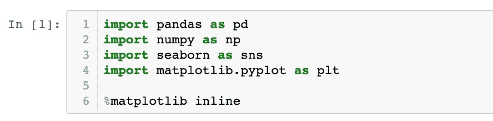

**读入您的数据:**

使用 pandas pd.read_csv 函数，以字符串形式输入您的数据源，并将其保存为变量，该变量将成为您的数据帧的名称。很多人用 ***df*** ，我喜欢用一些更具描述性的东西，所以这次我会用 ***candy*** 。

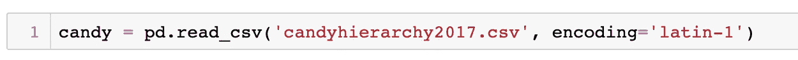

接下来，您需要检查数据的前几行，以获得您将处理的数据的峰值。

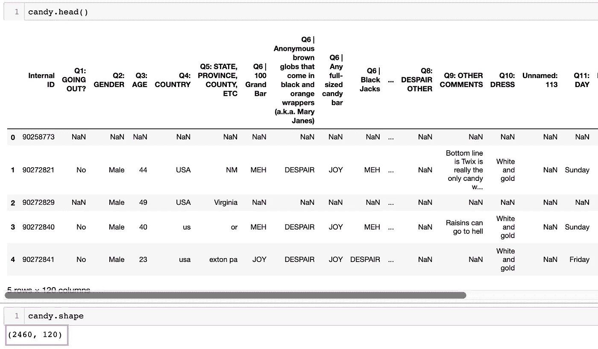

*candy.head( )* 是一个返回前 5 行数据的方法。如果你想要更多或更少，只需输入括号中的数字。例如，头(10)。

candy.shape 是一个属性，告诉你数据帧中的行数和列数。从上面可以看到， *candy* 有 2460 行 120 列。

在检查了数据字典后，我发现每一行都是被调查的个人。数据字典提供了关于数据集中提供什么信息的更多细节。如果可能的话，复习一下总是个好主意。

**检查缺失值:**

用 *candy.isnull( )* 。这种方法有很多种。添加*。sum()* 到最后会给出每列的总 NaNs 和*。mean( )* 将告诉您每一列中缺失值的百分比。我喜欢补充。*sort _ values(ascending = False)*此外，按照从缺失最多到最少的顺序显示列。

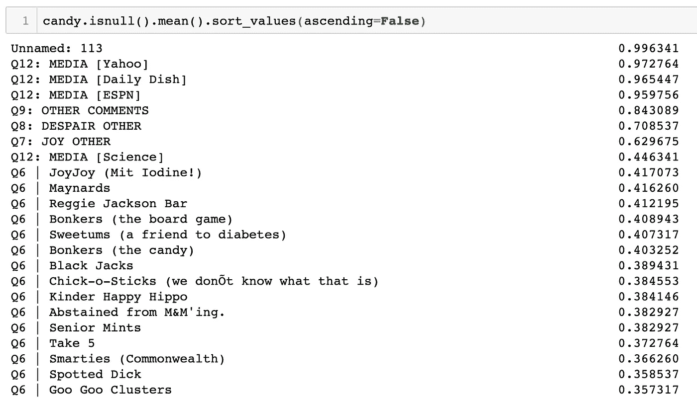

此时，您需要检查数据字典，确定丢失的数据是否意味着什么？还是只是未知？决定是否可以用*删除丢失的单元格。dropna( )* 或者是否应该用*来代替它们。菲尔娜()*。

**下降列**:

对于这个例子，我们可以看到['Unnamed: 113']和['Click Coordinates (x，y)']列没有信息，也没有用，所以我们可以使用。*drop(columns =[' insert column names ']，inplace=True* )。在此之前，我使用了*。value_counts(dropna=False)* 查看包括 nan 在内的那些列中包含的值，并确认其中没有重要的内容。

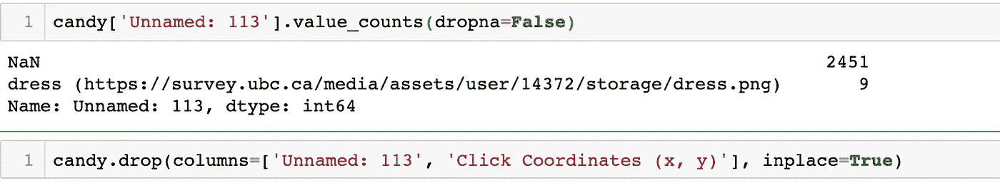

数据字典没有说明调查者可以跳过任何让他们不舒服的问题，所以我们可以假设一些缺失的数据就是因为这个原因。大多数问题都是要求糖果评级，从快乐到中性到绝望。如果你从来没有吃过糖果，就没有盒子可以选择。因此，我们可以做出的另一个假设是，这些列中的 nan 属于这一类。在这种情况下，它们可以用“未知”或您选择的字符串来填充。这真的没关系，因为为了让评级对衡量或预测某件事更有用，我们最终需要将它们转换成数字。

**检查数据类型:**

在填 NaNs 之前，我通常使用*。属性来查看每一列的数据类型，并寻找任何奇怪的东西。*

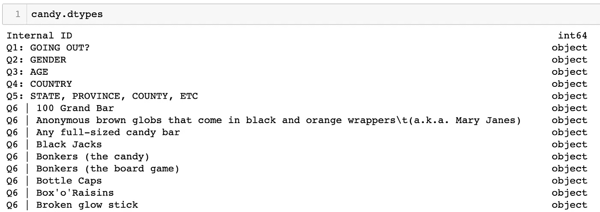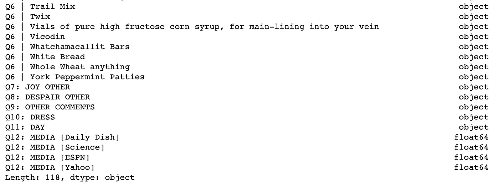

正如所料，大多数列都是对象类型，这意味着字符串。

Q3 是年龄，应为整数。

Q12 是唯一的浮点类型。它有四个答案，并被自动分成虚拟列，其中 1.0 是“是”，NaN 是“否”。因此我们知道可以用 0.0 填充这些答案。

**填写 NaNs:**

一旦我弄清楚了所有的类型，我喜欢创建一个 for 循环，它将同时处理我所有丢失的值。我用 0 填充任何整数或浮点数列，用字符串' unknown '填充任何对象列。然后检查是否还有空值。

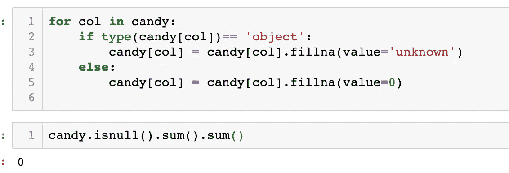

**重命名列:**

接下来，我想将列名修改为小写，并且不包含特殊字符。这通常使它们更容易阅读和理解。可以使用*。columns* 属性来检查列的当前名称。然后我用*进行列表理解。lower( )* 和 *.str.replace( )* 进行我想要的修改。这些名字需要更多的工作，但这只是让你知道如何开始。

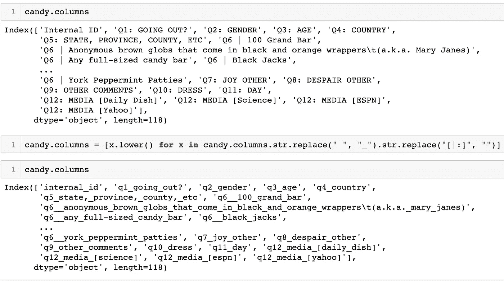

如果有更少的列，并且您想完全重写名称，您可以使用 dictionary 方法。

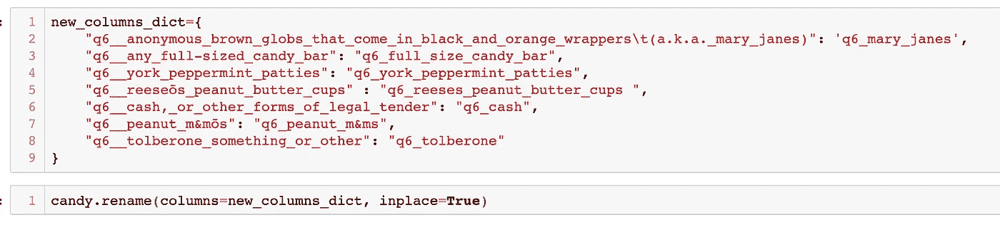

最后，我开始使用*。value_counts( )* 来更深入地挖掘和探索它们的用处。在这一部分，我可能会将评级改为数值，并将性别和外出等特征二进制化，如果这些特征对我的问题陈述似乎很重要的话。

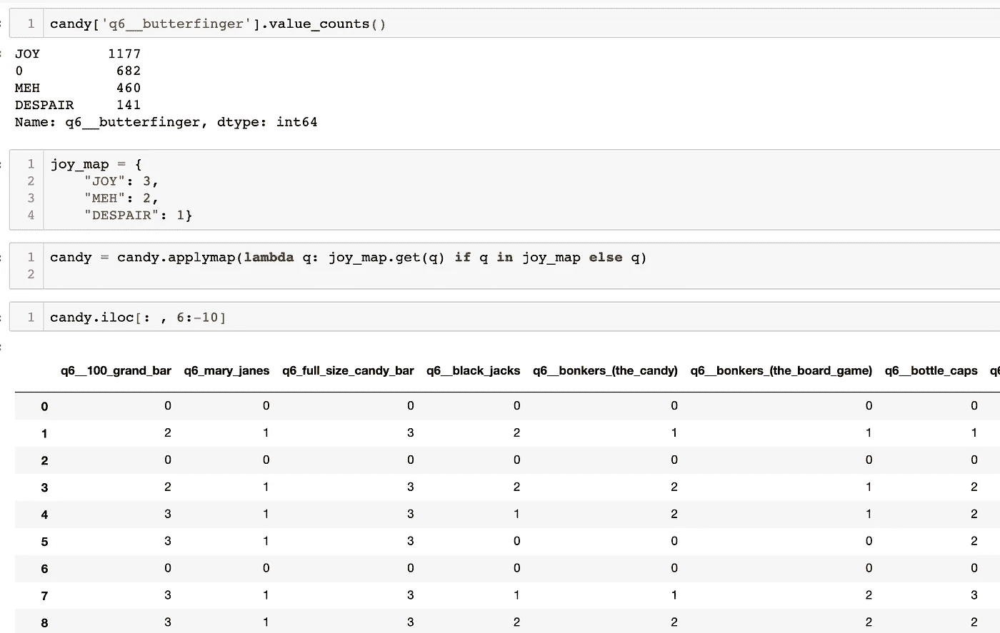

在上面的剪辑中，我创建了一个地图，其中所有欢乐的细胞将变为 3，所有 MEH 细胞将变为 2，绝望变为 1。然后我用了*。对 lambda 函数执行 applymap( )* 操作，该函数基本上循环遍历数据帧的单元格，如果它找到了映射中列出的值，它将使用指定的替换值替换它，否则如果它不在映射中，它将保持不变。

如果我只想看看 Q6，关于人们的糖果评级，可以设置这些行等于一个新的变量，如 *candy_only* 。

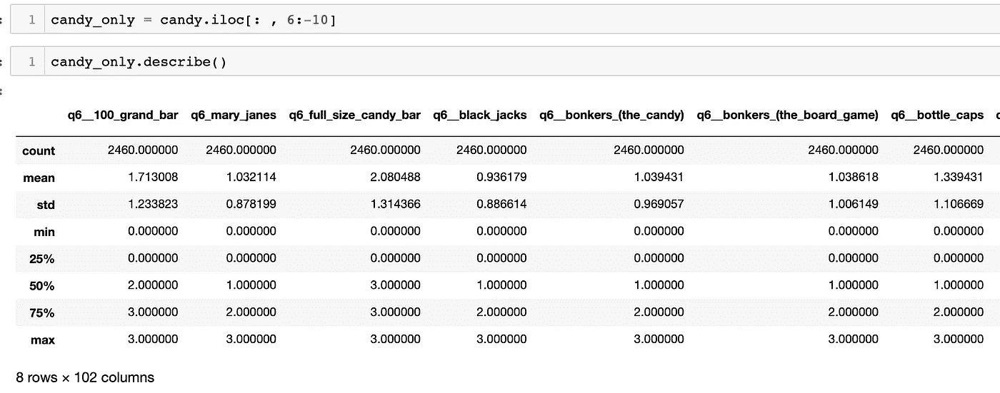

*candy.describe( )* 将向我们显示描述性统计数据，如平均值、标准差和最小/最大值。

由于我们没有目标变量，也就是我们试图预测的东西，我将使用这些数据来计算出最受欢迎的 10 种糖果。

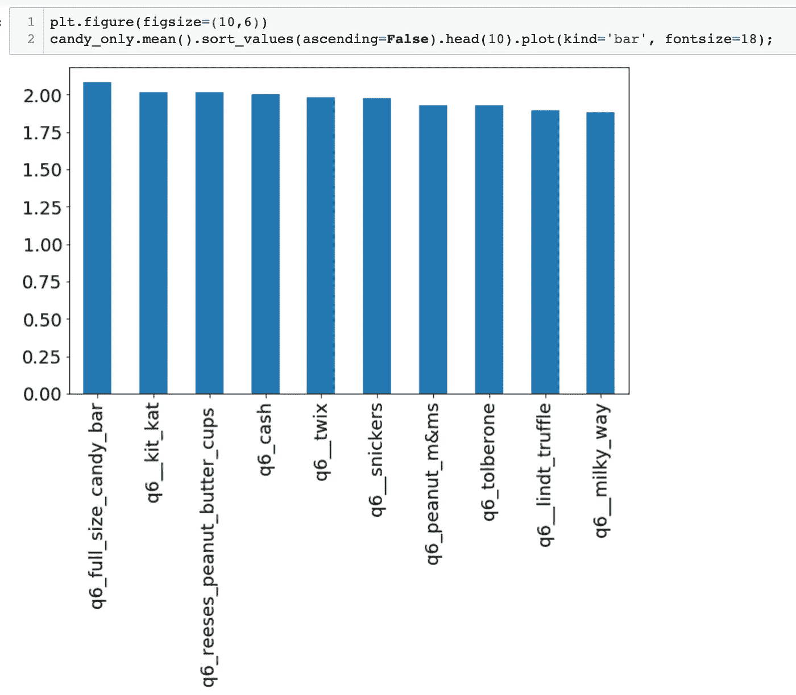

首先，我用*找到了每一列的平均值。mean( )* ，然后我把值从大到小排序，只显示前 10 名。最后我用*。plot(kind= "bar")* 绘制条形图。此外，任何排在第一位的全尺寸糖果，人们最喜欢 Kit Kats，Reeses 和 cash！

photo: amazon