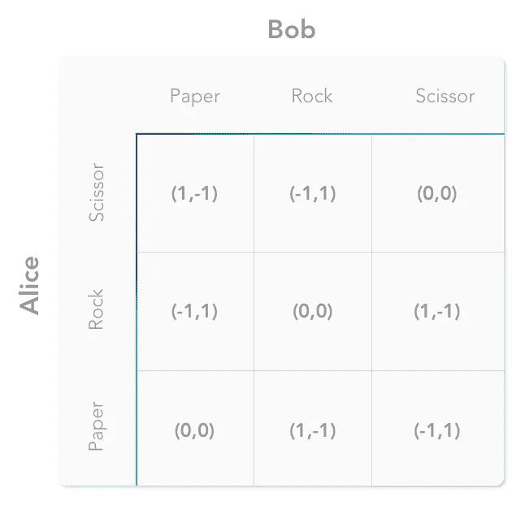

# 博弈论的基础

> 原文：<https://towardsdatascience.com/the-basics-of-game-theory-db1964520cbe?source=collection_archive---------9----------------------->

## 常用术语和视觉布局介绍

Originally Published On [https://www.setzeus.com/](https://www.setzeus.com/)

**现代博弈论**，[诺依曼&纳什](/game-theory-history-overview-5475e527cb82)建立的应用数学分支，是研究智能、理性、决策者之间冲突&合作的数学模型。一个广泛应用于从经济学、政治学到计算机科学的工业&领域的工具——博弈论的基础对普通高中生来说惊人地成立。这些概念并不 ***太过*** 高级，但是潜在的知识绝对会有回报。理解博弈论的基本原理对于任何处于群体决策地位的人(提示:每个人)来说都是值得努力的。

上一次我们讨论了早期的现代化，这一次我们将回顾常用的术语，游戏图解的基础。

# **常用术语**

大多数数学分支，尤其是应用数学分支，都需要它们的词汇——博弈论在这里也不例外。要理解示例，熟悉适当的语言至关重要。下面我们会找到基本词汇；这些术语不是按照字母顺序排列的，而是按照与整个主题的相关性递减的主观顺序排列的:

**游戏—** 两个或更多玩家之间的任何互动，其中每个玩家的收益都受到他们的决策&其他人做出的决策的影响。

**玩家—** 游戏中相互依赖的主体，可能包括个人、政府、公司等

**动作—** 玩家必须选择的严格定义的行为，玩家*能做什么？*输入投标？结束罢工？赌掷硬币？

**回报** **—** 在一个价值体系中，映射到玩家行为的“价值”的具体、精确、增加或减少。

**价值体系—** 抽象&上下文相关，这是*所有*可能值的范围；从坐牢，到市场份额，到土地占用，什么都有。

**零和——**一个玩家的收益等于另一个玩家的损失的情况；整个游戏的财富或收益的净变化为零。

**非零和—** 基于博弈**的结果，系统存在净 ***收益或损失*** 的情况；**所有玩家的赢款&损失*和*加起来不为零。

**同时——**玩家做决定&采取行动*几乎同时*；他们在做选择的时候不知道其他玩家的选择，比如石头剪子布。

**顺序—** 玩家做决定时&轮流采取行动，如大富翁或国际象棋。

**非合作** —更常见的游戏类型，这是一种个体玩家之间严格竞争的游戏。

**纳什均衡—** 博弈的最优结果，其中没有玩家有动机偏离所选策略；假设其他参与者的策略保持不变，改变行动不会带来增量收益。

**优势策略** — 不管其他玩家做什么，在所有策略中最有利的策略。

**合作** —一种玩家可以结成联盟的游戏&合作应对外部可信威胁。

**Shapely Value —** 玩家的价值在所有可能的联盟中的平均边际贡献；用于合作/联盟游戏，它是每个玩家的平均预期边际贡献。

**完整信息—** 一种游戏，其中所有参与者都可以获得关于其他玩家的知识；玩家的收益函数、策略&“类型”是常识。

**不完全信息—** 一个游戏，玩家可能知道也可能不知道游戏类型、玩家行动、玩家类型、策略、收益的信息..

**不完全信息—** 玩家不知道其他玩家选择的*动作*的游戏；然而，其他的一切，玩家类型，策略，收益等等…都是常识。

菲尼托。上面的术语列表涵盖了我们可能会遇到的任何博弈论问题的基本要点。正如你将在下面学到的，除了这些文字描述，分析一款游戏的最好方法是通过*可视化地描绘出来。*

# 视觉布局

在博弈论中有两种主要的可视化游戏的方法:**矩阵&树**。总的来说，这两种模型都是合适的&应该会产生一些洞察力；然而，哪种模型最适合任何给定的场景取决于游戏类型及其规则(同时与连续，完全与不完全，等等)。

## **矩阵**

博弈论最基本的工具是**收益矩阵**。通常，矩阵被用来描述**双人同时进行的**游戏。在下面的模板中可以看到，两个玩家的选择在我们矩阵的外部边界上相互垂直排列——一个横跨顶部(从左到右)，&一个横跨左侧(从上到下)。里面是假设每个玩家采取了那个行动的预期收益。例如，对于一些非常简单的游戏，让我们假设有两个玩家(Alice & Bob)存在，每个玩家只能选择两个动作中的一个(因此总共有四个场景)。矩阵中的每个“场景”或方框包含两个数字，即特定场景的收益:

Originally Published On [https://www.setzeus.com/](https://www.setzeus.com/)

上面的例子是没有上下文的，但是仍然服务于演示博弈论矩阵的基本布局的目的。从粗体的外部标题可以明显看出，这个游戏是在爱丽丝和鲍勃之间进行的；此外，很明显他们每个人只有两个选择:“行动 1”或“行动 2”最后，矩阵中的有序对表示给定特定场景下两个玩家的收益(Alice 的收益是左/x 数字，Bob 的收益是右/Y 数字)。

让我们考虑一个更相关的游戏:[石头剪刀布](https://en.wikipedia.org/wiki/Rock%E2%80%93paper%E2%80%93scissors)。一款全球知名的普通游戏，严格来说是一款双人*同时非合作*游戏。众所周知，玩家只有三种策略中的一种。此外，我们还从这三种策略中了解了收益&价值体系。我们可以用一个 3x3 的矩阵对这个游戏进行数学映射:

Originally Published On [https://www.setzeus.com/](https://www.setzeus.com/)

上面的例子应该更直观。沿着一行(Alice 的选择)和一列(Bob 的选择)走下去，两个人的收益就很清楚了。不过请注意，通过用矩阵表示游戏，我们只能*用*表示玩家同时行动的情况——没有时间的概念。

## 树

博弈树是一个带有节点&边的[有向图](https://en.wikipedia.org/wiki/Directed_graph)。节点代表玩家的位置或从游戏中退出/收益。通常情况下，玩家被分配到决策节点；一组*决策节点*，当在同一水平 x 轴上时，代表单个玩家在单个时间点的阵列选择 ***。另一方面，*** 边代表移动或动作， ***由玩家/节点采取*** 。一个游戏的**完整游戏树**是从初始位置&开始的游戏树，包含从每个位置 ***所有*** 可能的移动。

有了树，我们基本上给表增加了一个时间维度，允许随时间的顺序游戏的最佳表示。游戏树的拓扑在两种可能的设置中有所不同，这取决于游戏是同时进行的还是顺序进行的。为了从有意义的比较中获得洞察力，我们将通过继续我们先前的石头剪子布的例子来回顾树:

Originally Published On [https://www.setzeus.com/](https://www.setzeus.com/)

请注意，Alice 是随机选择的顶部节点/原点，但是，如果我们简单地交换她和 Bob 的位置，整个图将保持不变。和上面的矩阵例子一样，这个图提供了相同的收益选项。

对于每一棵博弈树，只有一种方法用矩阵来表示；但是对于每个矩阵，有多种方法可以用博弈树来表示。考虑到时间因素，除非一个游戏真的很简单，博弈树通常是分析的首选工具。

# 结论

我们走吧！随着通用语言和视觉映射现在在我们的腰带之下，[除了它的历史](/game-theory-history-overview-5475e527cb82)，我们自学的游戏理论知识正在稳步增长。我们已经发展了对游戏的看法，这很令人兴奋，因为它让我们能够以完全不同的视角看待日常场景。

虽然这一次我们专注于构建我们的游戏，但下一次，我们将最终进入实质——学习博弈论的真正回报:**分析&得出优势策略。**

***最初发表于:***

[https://www.setzeus.com/](https://www.setzeus.com/)