# 基础知识:支持向量机

> 原文：<https://towardsdatascience.com/the-basics-support-vector-machines-219585f1a107?source=collection_archive---------27----------------------->

## 从头开始的数据科学

## 将线性方法应用于非线性边界

支持向量机是一种用于分类的机器学习模型，自 20 世纪 90 年代广泛引入以来，已被证明非常受欢迎。有些令人困惑的是,“支持向量机”和“支持向量分类器”这两个名称经常互换使用，指的是一些不同实现的算法，但在本质上，这些方法都在做同一种事情，即找到根据类别将数据分成离散区域的方法。事实证明它们非常强大。支持向量机模型的技术实现可能相当复杂，但是一些直觉应该是清楚的，不要在技术细节上陷入太多。

**最简单的版本:最大间隔分类器**

考虑一个二维的简单分类问题:

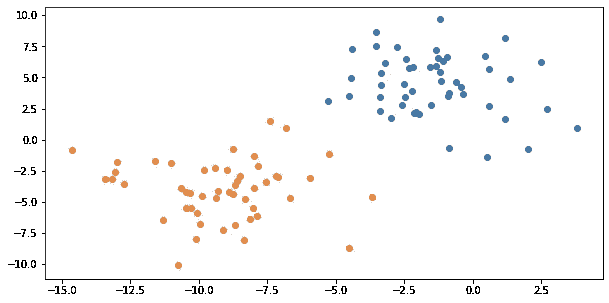

A simple classification question with two classes

我们可以直观地看到，橙色和蓝色这两个类别似乎占据了图形中不同的区域，橙色在左下方，蓝色在右上方。明智的首要任务是使我们对橙色和蓝色阶级各自的“区域”的理解正式化。一旦我们在它们之间有了一个清晰的边界，我们就可以根据一个新点的位置来快速预测它将属于哪一类。让我们从最简单的边界开始，一条直线。同样，从视觉上看，我们可以用两个类之间的一条线来分割图形，但是我们应该选择哪条线呢？考虑两种可能的选择:

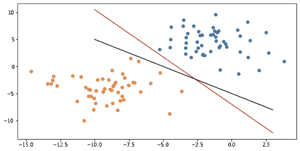

Two possible boundary lines

上面的红线和黑线都将两个点群分开，但它们代表不同的决策边界。如果每条线代表不同的模型，则位于线之间的一些点将根据所使用的模型进行不同的分类。

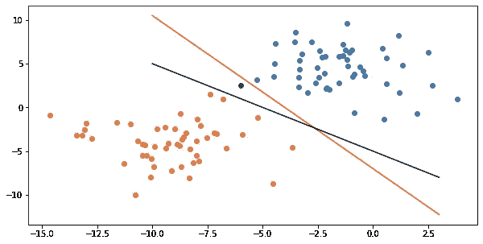

The green point will be classified differently by each of the models represented here

我们应该使用哪个决策边界？一种策略可能是寻找尽可能远离训练数据点的决策边界。这里的概念是，如果决策边界线非常接近训练点，则新的边际案例更有可能越过决策边界，并在错误的一侧结束。所以我们要寻找一条线，给训练点尽可能宽的泊位。一种测量方法是查看“最小余量”，即直线和所有训练点中最近的点之间的距离。这是我们的数据，其中一条线和最近的点/边缘突出显示:

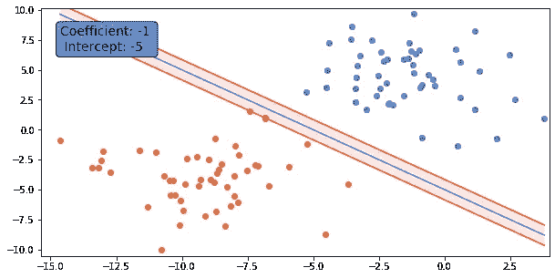

One possible line and its margin

线条周围突出显示部分的宽度代表我们的最小边距。理想情况下，我们希望这条线尽可能的粗，以找到一条给我们的点簇最大可能的泊位的线。有一个清晰的代数任务(找到具有最大可能最小边距的线)和一个我们可以遵循的漂亮的视觉解释。例如，这是新的一行:

Another option

这一次似乎给了我们更大的利润空间。我们可以同时绘制它们，以便更清楚地看到这一点:

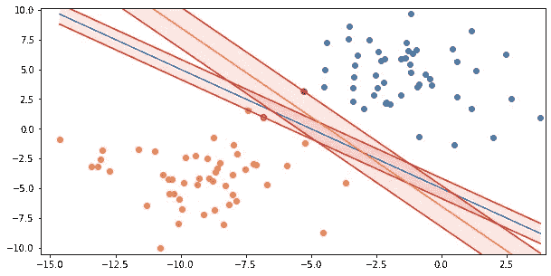

Both lines together

这些例子是二维的，以使它们易于可视化，但同样的策略可以在任何数量的维度上使用。例如，如果有三个维度，你会寻找一个平面来分隔空间，在点和平面之间有尽可能多的空间。在更多的维度中，你会寻找一个分离的“超平面”，我们可能无法想象，但概念上不会更复杂。

显而易见，尽管在某些情况下可能是有用的，但这种性质的“最大最小间隔”分类器具有严重的缺点。首先，如果我们的集群没有像这个可能有点做作的例子中那样清晰地分开，会怎么样呢？在现实世界中，数据通常是嘈杂的，即使聚类看起来很明显，它们也可能在边缘重叠。我们如何处理像这样的数据:

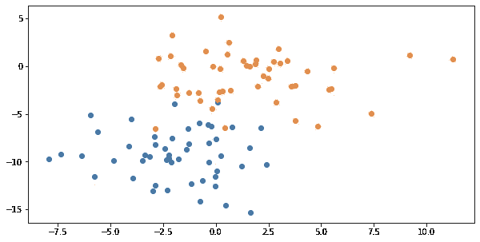

Slightly overlapping clusters

**下一步:支持向量分类器**

允许我们继续使用易于描述的线性决策边界的一个简单修复方法是，使边界有点模糊，引入一种算法，允许一些点在确定的边界内，甚至在分界线的另一侧。因为在这种实现中，边缘不再严格，所以支持向量分类器有时被称为“软边缘”分类器。允许模型对训练数据中的点进行错误分类的程度由调整参数控制。回到我们的第一个例子，将这个调整参数的各种级别应用到一个软边界分类器说明了正在发生的事情。当不考虑错误分类点时，得到的模型看起来与我们的最大最小利润模型非常相似:

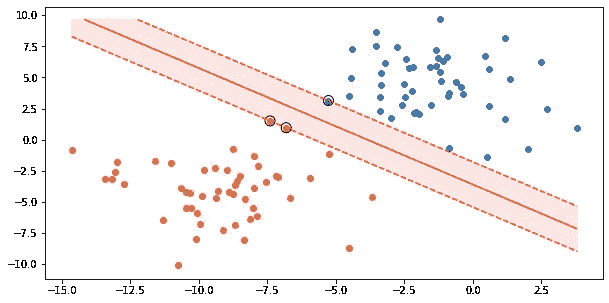

The first example with a SVC

决策边界毕竟还是一条线。本例中的关键区别在于，模型识别了三个最近点，而不是一个。这三个点是定义边缘和边界的“支持向量”。它们被称为“support ”,因为改变其中一个必然会改变模型找到的边距和边界。如果您让模型对落在边界内的点更加宽容，那么它所识别的边界将会增长，并且必然会包含更多的支持向量:

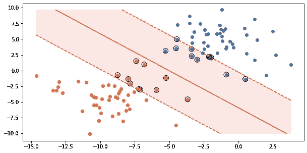

A soft margin classifier with an even softer margin

这种软边际模型允许我们处理不干净和有一点重叠的数据簇。例如，在我们之前的稍微重叠的示例中，这是两个组之间的合理线性边界:

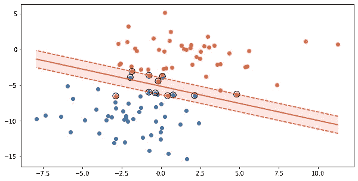

Slightly overlapping datasets handled!

这极大地扩展了我们的边缘分类器的效用，尽管仍有失败的例子。特别是，一些决策边界可能不是线性的，我们的模型是否会对这些边界做出合理的反应还不清楚。例如，考虑以下几点:

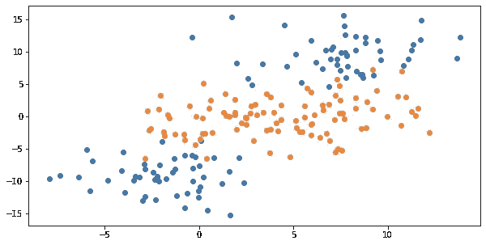

Uh oh, non-linear bondaries

您可能很快就能看出这个示例中发生了什么，但是我们的软边界分类器很混乱，因为边界不是线性的，并且会产生一些无用的东西，如果不是完全无意义的话:

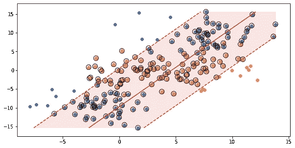

This soft margin classifier is useless!

不知何故，我们需要发挥非线性边界的作用。

**解决方案:支持向量机**

支持向量机通过引入“核函数”将我们到目前为止一直在处理的软间隔分类器向前推进了一步。在这种情况下，核函数将某组输入变量映射到更高维度的空间。有时你可能会看到这种被称为“核技巧”的函数的使用——技巧是有时不能被线性边界分开的点可以通过核函数映射到更高维度，其中变换的点*可以*被线性边界分开！

例如，不是简单地考虑 x-y 平面上的点，我们可以将它们映射到三维空间中，添加一个 z 轴，并将任何给定点的 z 坐标定义为 x 的平方加上 y 的平方。你可能会注意到这种变换与圆的代数公式之间的相似之处——事实上，这种变换可以让我们轻松地将距离原点较近或聚集在原点周围的点与距离较远的点分开，一旦这些点从二维空间映射到三维空间，就会有一个单一的线性平面穿过这些点。在实践中，支持向量机做的事情稍微复杂一点，因为它对特征向量的所有组合(即所有点)执行这种转换，但概念是相同的。

有几种常见的内核可以应用。例如，*径向基函数* 内核采用刚才描述的类似方法，处理特征向量之间的平方欧几里德距离。使用此内核，我们可以创建决策边界，将彼此靠近的点组合在一起，即使一个类的点聚集在另一个类的点内，如我们前面的示例所示:

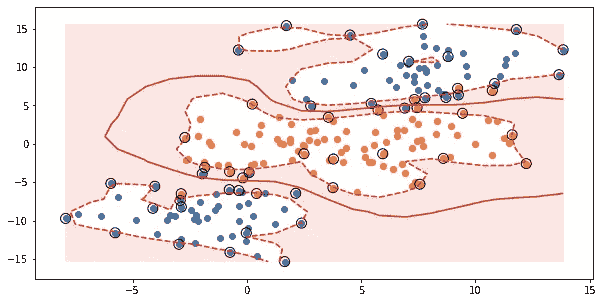

The rbf kernel saves the day

*多项式内核*将输入向量及其组合的特征进行比较，以达到给定的程度，允许我们创建决策边界，更好地拥抱点簇之间的曲线。考虑我们的第一个完全线性的软边界解决方案，解决点簇重叠的情况:

A boring, straight decision boundary

对于这个解决方案，使用 3 次多项式核的支持向量机:

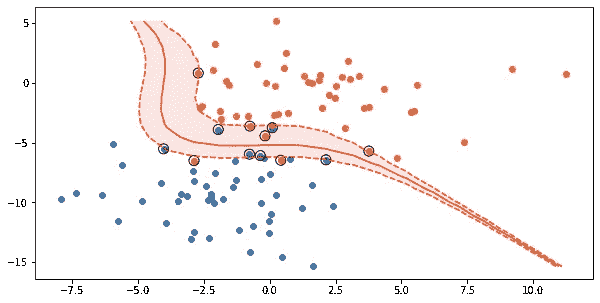

An attractive, curved boundary

使用这些核技巧，支持向量机模型可以非常有效地分类复杂的非线性边界。